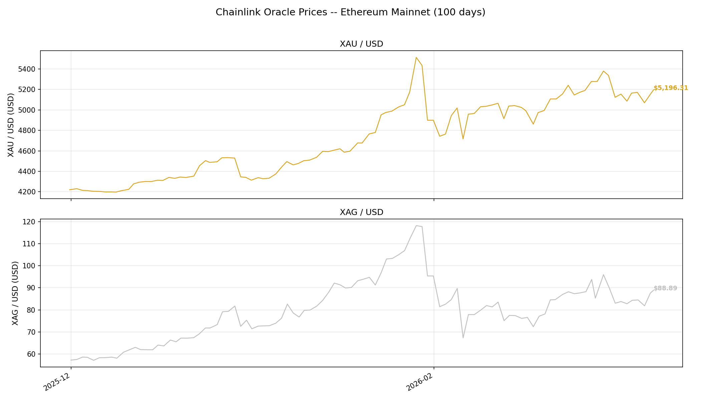

#+title: Alberta Buck -- Ethereum Smart Contracts
#+OPTIONS: ^:nil toc:nil

* Overview

Ethereum implementation of the [[https://perry.kundert.ca/range/finance/alberta-buck/][Alberta Buck]] -- citizen-issued, wealth-backed
liquidity for Alberta.  Three interacting smart contracts:

- *BuckCredit* (ERC-721) :: An NFT representing an insurer's offer of parametric insurance on a
  real-world asset.  Supports deterministic depreciation (none, linear, declining balance) and
  piecemeal client activation.

- *Buck* (ERC-20) :: A fungible token minted against aggregated BuckCredit values.  Enforces
  per-account credit limits (credit value * BUCK_K) and collects quadratically-scaled default
  insurance premiums.

- *BuckKController* :: An on-chain PID controller that computes a dynamic credit-limit multiplier
  from commodity-basket oracle prices vs. BUCK market price, maintaining purchasing-power parity.

Design document: [[https://perry.kundert.ca/range/finance/alberta-buck-ethereum/][The Alberta Buck -- Ethereum Implementation]]

* Getting Started

** Prerequisites

- [[https://nixos.org/download.html][Nix]] (with flakes enabled) -- provides Foundry, Solidity compiler, Python, Node.js
- An Ethereum RPC endpoint for forked-network testing (Alchemy free tier, Infura, or a local node)

** Setup

#+BEGIN_SRC bash
  git clone git@github.com:pjkundert/alberta-buck.git
  cd alberta-buck
  make nix-install          # Install Solidity dependencies (OpenZeppelin, Chainlink, Uniswap)
#+END_SRC

** Build and Test

The =nix-%= Makefile target runs any target inside the Nix flake shell, providing Foundry (forge,
anvil, cast), Solidity compiler, Python and Node.js -- no manual =nix develop= required:

#+BEGIN_SRC bash
  make nix-build                           # Compile contracts
  make nix-test                            # All tests, verbose
  make nix-snapshot                        # Gas usage report
  make nix-fmt                             # Format Solidity source
#+END_SRC

Or enter the shell interactively for ad-hoc commands:

#+BEGIN_SRC bash
  nix develop                              # Enter dev shell
  forge test --match-test test_activate    # Specific test
  forge test --match-contract BuckCredit   # All tests in a contract
#+END_SRC

** SNARK Circuits and Trusted Setup

The BUCK Notes mint/spend circuits (=circuits/*.circom=) compile to per-N Groth16
verifiers (=src/MintBatchN*Groth16Verifier.sol=, dispatched on-chain by
=cms.length=).  A Groth16 setup has two phases, and they differ enormously in
cost:

1. *Powers of Tau* (=build/snark/ptau/pot*.ptau=) -- the /universal/,
   circuit-*independent* structured reference string.  This is the slow part
   (the =pot15..pot20= set is multi-GB and takes ~hours to generate).  It
   depends only on the FFT domain size, so a circuit edit that does not cross a
   power-of-two boundary *reuses* it untouched.
2. *Per-circuit zkey + Solidity verifier* -- embeds the R1CS / verification key.
   Regenerated on every circuit change, in ~minutes, reusing the ptau.

So after editing a circuit you normally only regenerate phase 2:

#+BEGIN_SRC bash
  make snark            # phase-2 verifiers + test fixtures (usual circuit-change path)
  make snark-setup      # phase-2 only: per-N zkeys + src/MintBatchN*Verifier.sol
  make snark-fixtures   # regenerate build/snark/.../fixtures/*.json the forge tests load
  make snark-ptau       # phase-1: rebuild the dev Powers of Tau from scratch (~hours)
  make snark-clean      # drop per-N build dirs (forces a clean phase-2 rebuild)

  make nix-test         # confirm on-chain parity (MintVerifier.t.sol et al.)
#+END_SRC

Each pinned batch size gets its own circuit + verifier; override the set with
=make snark SNARK_PINS="1 2 4 8 16"=.  =make snark-ptau= auto-bootstraps a larger
ptau if a new pin crosses into a higher power of two (=N=64= needs =pot21=,
=N=128= needs =pot22=, ...).

*** Dev setup vs. production assets

All of the above use *fixed dev-only entropy* (=scripts/snark/setup.sh=
contributes =alberta-buck-dev-*=).  The result is a *reproducible dev setup* --
deterministic and green in tests, but *NOT secure*: the toxic waste \( \tau \) is
public, so anyone can forge proofs.  *Never deploy the committed dev verifiers to
a real network.*

Generating *production* assets requires a real multi-party ceremony, where the
setup is sound as long as /at least one/ participant destroyed their secret:

1. *Phase 1 (Powers of Tau).*  Either reuse a trustworthy existing universal
   ceremony -- the Hermez "Perpetual Powers of Tau" finals
   (=powersOfTau28_hez_final_NN.ptau=) are the standard for BN254/Groth16 --
   choosing the size whose domain \( \ge \) your largest circuit (=pot20= for
   =N=32=) and verifying it:
   #+BEGIN_SRC bash
     snarkjs powersoftau verify powersOfTau28_hez_final_20.ptau
   #+END_SRC
   or coordinate a fresh phase-1 MPC: =powersoftau new= \(\to\) many independent
   =powersoftau contribute= (distinct parties, real hardware entropy) \(\to\)
   =powersoftau beacon= (a public randomness beacon) \(\to\) =powersoftau
   prepare phase2=.  Install the verified file as
   =build/snark/ptau/potNN_final.ptau=.
2. *Phase 2 (per circuit).*  For each =circuit.r1cs=: =groth16 setup= against the
   production ptau, then collect *multiple independent* =zkey contribute= from
   distinct parties (real entropy, not the piped dev strings), apply a
   =zkey beacon=, =zkey verify=, and export the verification key +
   =solidityverifier=.  =scripts/snark/setup.sh= shows the exact command shapes
   (replace the dev-entropy contributions).
3. *Deploy + rotate.*  Deploy the production =MintBatchN*Groth16Verifier= and
   register them via =MintVerifierAdapter.registerVerifier= /
   =Notes.setMintVerifier= behind governance, cutting over from the dev
   verifiers.  Publish the ceremony transcript and each contributor's attestation
   so the 1-of-\( n \) honest assumption is auditable.

See the Makefile =SNARK circuits + trusted setup= section and
=alberta-buck-notes-decryptability.org= ("The Required Mint SNARK Signal") for
the circuit-level details.

** RPC Configuration

Two environment variables control how tools connect to Ethereum:

- =MAINNET_RPC_URL= :: The remote archive RPC endpoint (Alchemy, Infura, or a local Reth/Geth node).
  Used by Foundry (=forge --fork-url=) and Anvil (=--fork-url=) to access Ethereum mainnet state.
  Also used by the Python tests when connecting directly without Anvil.

- =ETH_RPC_URL= :: Where the Python tests send their queries.  Override this to
  =http://localhost:8545= when running against a local Anvil fork.  If unset, the Python code falls
  back to =MAINNET_RPC_URL=.

When running via Anvil, both variables are in play simultaneously: Anvil reads from the remote
(=MAINNET_RPC_URL=) and the Python tests read from Anvil (=ETH_RPC_URL=http://localhost:8545=).

Copy =.env.example= to =.env= and fill in your API key:

#+BEGIN_SRC bash
  cp .env.example .env
  # Edit .env: set MAINNET_RPC_URL to your Alchemy/Infura endpoint
#+END_SRC

The Makefile loads =.env= automatically.  The =MAINNET_RPC_URL= can also be composed from
=ALCHEMY_API_TOKEN= if you prefer to keep just the key in your environment.

** Forked Network Testing (Solidity)

#+BEGIN_SRC bash
  make nix-fork-sepolia         # Start Anvil forking Sepolia (runs in foreground)
  make nix-test-fork-sepolia    # Run Solidity tests against forked Sepolia
  make nix-fork-mainnet         # Fork mainnet (for DeFi integration testing)
#+END_SRC

Pin a specific block for deterministic tests:

#+BEGIN_SRC bash
  FORK_BLOCK=12345678 make nix-fork-sepolia
#+END_SRC

** Python: Oracle History and Visualization

The =alberta_buck= Python module queries Chainlink price feed oracles on Ethereum mainnet to
retrieve historical commodity prices.  This validates the on-chain data sources used by the
BuckKController PID loop and provides visualization for analysis.

*** Chainlink feeds

The test reads Chainlink's [[https://docs.chain.link/data-feeds/price-feeds/addresses][AggregatorV3Interface]] price feeds for Gold (XAU/USD) and Silver
(XAG/USD) -- the same oracle contracts used by the Solidity =BuckKControllerForkTest=:

| Feed    | Mainnet Address                              |
|---------+----------------------------------------------|
| XAU/USD | =0x214eD9Da11D2fbe465a6fc601a91E62EbEc1a0D6= |
| XAG/USD | =0x379589227b15F1a12195D3f2d90bBc9F31f95235= |

*** Running directly against a remote RPC

Python queries Alchemy (or Infura) directly -- no Anvil needed:

#+BEGIN_SRC bash
  make nix-test-python                         # uses MAINNET_RPC_URL from .env
#+END_SRC

Uses =get_daily_prices=: calls =latestRoundData()= at 366 estimated block numbers (one per day, ~732
total calls across both feeds).  Takes roughly 10-15 minutes.

*** Running via Anvil (cached)

Anvil forks mainnet and caches Ethereum storage reads in memory.  Two terminals:

#+BEGIN_SRC bash
  # Terminal 1 -- Anvil connects to remote RPC via MAINNET_RPC_URL from .env
  make nix-fork-mainnet

  # Terminal 2 -- Python connects to Anvil on localhost
  ETH_RPC_URL=http://localhost:8545 make nix-test-python
#+END_SRC

Uses =get_round_history=: calls =getRoundData(roundId)= walking backwards through every Chainlink
round at the fork block.  Subsequent runs within the same Anvil session serve entirely from cache.

*** Query strategies

Both functions retrieve the same daily price history.  The test auto-detects Anvil and selects the
appropriate one.

=get_daily_prices= (block-based) calls =latestRoundData()= at 366 different block heights.  Fewer
API calls, but Anvil must cache storage separately for each block, so there is little reuse across
runs.

=get_round_history= (round-based) calls =getRoundData(roundId)= at the single fork block, walking
backwards through every Chainlink round (~8,000-9,000 per feed for a year of hourly updates).  More
total calls, but all against one block height -- Anvil caches the storage slots once and serves
repeated runs from memory.

|                         | =get_daily_prices= | =get_round_history= |
|-------------------------+--------------------+---------------------|
| Calls per feed (1 year) | ~366               | ~8,000-9,000        |
| Block heights touched   | 366 different      | 1 (fork block)      |
| Anvil cache reuse       | Low                | High                |
| Best for                | Direct RPC         | Anvil fork          |

*** Output

On completion the test writes =alberta_buck/test/gold_silver_history.png=:

#+ATTR_ORG: :width 800

*** Future commodity oracles

The =alberta_buck.oracle= module is designed to support additional feeds.  The BUCK commodity basket
will expand to include oil, natural gas, copper, beef, lumber, electricity, and labour.  For
commodities without existing Chainlink mainnet feeds, custom oracle contracts will be deployed and
populated with historical trend data sourced from public commodity price datasets.

** Deploy (Local)

#+BEGIN_SRC bash
  make nix-anvil &              # Start local Anvil node
  make nix-deploy-local         # Deploy all three contracts
#+END_SRC

* Project Structure

| Path                         | Contents                                        |
|------------------------------+-------------------------------------------------|
| =src/BuckCredit.sol=         | ERC-721 insured asset NFT                       |
| =src/Buck.sol=               | ERC-20 token with credit-limit minting          |
| =src/BuckKController.sol=    | PID value stabilization controller              |
| =test/BuckCredit.t.sol=      | Forge tests (depreciation, activation, updates) |
| =test/BuckKController.t.sol= | PID controller unit + mainnet fork tests        |
| =script/Deploy.s.sol=        | Deployment script                               |
| =alberta_buck/oracle.py=     | Chainlink oracle historical price reader        |
| =alberta_buck/test/=         | Python tests (oracle history, visualization)    |
| =pyproject.toml=             | Python project configuration                    |
| =flake.nix=                  | Nix dev environment                             |
| =foundry.toml=               | Forge configuration and remappings              |

* License

GPL-3.0-or-later
