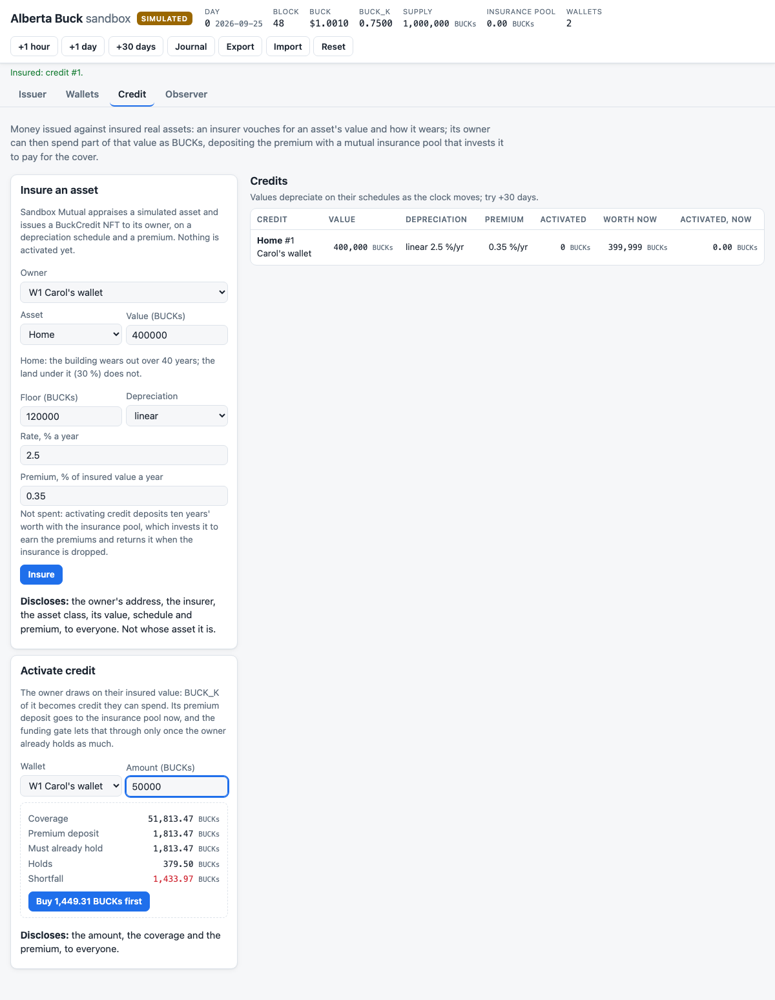

# Copyright (c) 2026 Perry Kundert.  All rights reserved.
#
# This document is NOT covered by the source-code licences in
# LICENSING.md.  The code is free software; the design writing is not
# (yet) placed under an open licence -- see LICENSING.md, "Design
# documents".  "Alberta Buck" is a mark: see TRADEMARKS.md.
#
# SPDX-License-Identifier: LicenseRef-AllRightsReserved
#+title: Alberta Buck
#+OPTIONS: ^:nil toc:nil num:nil

*Money issued against insured real assets, held steady against a basket of base commodities --
private by default, accountable by law.*

The Alberta Buck (BUCK) is a digital currency its citizens issue themselves.  An insurer vouches for
the value of a real asset -- a home, a farm, a fleet, a vault of gold -- and how it wears; its owner
can then spend part of that insured value as BUCKs.  Ten years' premium goes to the insurance pool
as a deposit, not a cost: the pool invests it to earn the premiums, and returns it when the
insurance is dropped.  How much credit each unit of insured value supports (=BUCK_K=) is set by an
on-chain controller that holds the BUCK's value to a basket of base commodities, so the currency is
anchored to things rather than to policy.  Held BUCKs pay a small demurrage (2 % a year) into a
Jubilee fund, so money keeps moving and old obligations melt.

Every account belongs to a person or institution an identity issuer has certified -- but the chain
never learns who.  Identities travel encrypted; each party to a payment can later prove whom it
dealt with, and no one else can.  Bearer /Notes/ let value move privately, with receipts that stand
up without revealing the parties.

This repository holds the whole system: the Ethereum contracts, the zero-knowledge circuits, the
cryptographic kernels in Rust, JavaScript and Python, the simulations, and the papers that explain
it all.

* Try it

A private, simulated Alberta Buck world runs in your browser tab: certify people, give them
wallets, insure their homes, activate credit, pay one another, trade BUCKs for dollars -- then look
at the chain the way a stranger would.  Open [[https://sandbox.albertabuck.ca/]]; nothing leaves the
tab.  Or run it yourself, with [[https://nixos.org/download][Nix]] (flakes enabled):

#+BEGIN_SRC sh
git clone https://github.com/alberta-buck/alberta-buck
cd alberta-buck
make nix-sandbox          # then open http://localhost:8000/
#+END_SRC

The tour and the details: [[file:doc/SANDBOX.org][doc/SANDBOX.org]].

* What is here

| Path                 | What it is                                                               |
|----------------------+--------------------------------------------------------------------------|
| =src/=               | the Solidity contracts: =Buck= (the ERC-20), =BuckCredit= (insured       |
|                      | assets, ERC-721), the =BUCK_K= controllers, =IdentityRegistry=, =Notes=, |
|                      | the =BuckBasket=, adapters and the Groth16 verifiers                     |
| =circuits/=          | the Circom circuits behind Notes: mint, spend, deposit folds,            |
|                      | identity membership                                                      |
| =core/=              | the kernels -- Rust (=core/rust=), WebAssembly and JavaScript            |
|                      | (=core/js=), Python (=core/python=) -- and the published contract        |
|                      | bundle (=core/contracts=)                                                |
| =core/js/sandbox/=   | the browser sandbox; =core/js/demo/= holds the earlier demos             |
| =alberta_buck/=      | the Python reference: wallet, identity, registry, receipts, and the      |
|                      | simulations (=alberta_buck/sim=)                                         |
| =test/=              | the Foundry tests and shared test vectors                                |
| =scripts/=           | deployment scripts, the SNARK setups, release packaging                  |
| =doc/=               | guides and design reviews                                                |
| =alberta-buck-*.org= | the papers (below)                                                       |

The kernels and contracts are published at 0.2.0:

| Registry  | Packages                                                     |
|-----------+--------------------------------------------------------------|
| npm       | =alberta-buck-core=, =-kernel=, =-contracts=                 |
| PyPI      | =alberta-buck=, =alberta-buck-core=, =-kernel=, =-contracts= |
| crates.io | =alberta-buck-math=, =-identity=, =-registry=, =-wallet=     |

Installing and using them: [[file:doc/INSTALL.org][doc/INSTALL.org]].
Building and testing everything here: [[file:doc/DEVELOP.org][doc/DEVELOP.org]].

* Read

Each paper is an Org document in this repository, rendered to PDF in =images/=.

*Start here*
- [[file:alberta-buck-privacy.org][Privacy]]
  ([[file:images/alberta-buck-privacy.pdf][pdf]]) -- Bob pays Carol while Mallory watches: what each
  party learns, told as a story and executed against the real contracts.
- [[file:alberta-buck-paper.org][Accountable Anonymity for Public Money]]
  ([[file:images/alberta-buck-paper.pdf][pdf]]) -- the case for bearer Notes that are private and
  yet leave evidence.
- [[file:alberta-buck-demo.org][A Farmer's Demonstration]]
  ([[file:images/alberta-buck-demo.pdf][pdf]]) -- one farm through the whole Alberta Buck lifespan.

*The system*
- [[file:alberta-buck-ethereum.org][Ethereum Implementation]]
  ([[file:images/alberta-buck-ethereum.pdf][pdf]]) -- the contracts and how they fit together.
- [[file:alberta-buck-demurrage.org][Demurrage and the Jubilee Fund]]
  ([[file:images/alberta-buck-demurrage.pdf][pdf]]) -- why held money pays, and where it goes.
- [[file:alberta-buck-ethereum-basket.org][The BuckBasket]]
  ([[file:images/alberta-buck-ethereum-basket.pdf][pdf]]) -- the commodity anchor, and why it must
  be heavy.
- [[file:alberta-buck-operations.org][Basket Operations]]
  ([[file:images/alberta-buck-operations.pdf][pdf]]) -- how the basket reads its pools and moves
  value from rich constituents to poor.
- [[file:alberta-buck-rebalance.org][Rebalancing the BuckBasket]]
  ([[file:images/alberta-buck-rebalance.pdf][pdf]]) -- using timing, the one thing the basket's free
  balancing leaves unused.
- [[file:alberta-buck-ethereum-direct.org][The Direct Embodiment]]
  ([[file:images/alberta-buck-ethereum-direct.pdf][pdf]]) -- measuring BUCKs against its basket
  directly, not in dollars.

*Identity, receipts and Notes*
- [[file:alberta-buck-identity.org][Identity and Receipts]]
  ([[file:images/alberta-buck-identity.pdf][pdf]]) -- certified identities that travel encrypted.
- [[file:alberta-buck-identity-example.org][Identity: a Cryptography Example]]
  ([[file:images/alberta-buck-identity-example.pdf][pdf]]) -- where each piece of identity data
  lives at each step, worked through.
- [[file:alberta-buck-notes.org][Notes]]
  ([[file:images/alberta-buck-notes.pdf][pdf]]) -- bearer value with receipts.
- [[file:alberta-buck-notes-flow.org][Notes Flow]]
  ([[file:images/alberta-buck-notes-flow.pdf][pdf]]) -- one mint split into six Notes, executed end
  to end.
- [[file:alberta-buck-notes-serialized.org][Single vs. Serialized Sub-Notes]]
  ([[file:images/alberta-buck-notes-serialized.pdf][pdf]]) -- a design memo on amortizing a mint
  within a single Note.
- [[file:alberta-buck-receipt.org][The Printable Receipt]]
  ([[file:images/alberta-buck-receipt.pdf][pdf]]) -- an 80 mm thermal-printer slip that names both
  parties to a payment.
- [[file:alberta-buck-proofs.org][Formal Correctness Proofs]]
  ([[file:images/alberta-buck-proofs.pdf][pdf]]) -- why the identity transformations are sound.

*Engineering*
- [[file:alberta-buck-platform.org][Platform Architecture]]
  ([[file:images/alberta-buck-platform.pdf][pdf]]) -- the shared core behind the simulations and
  demos.
- [[file:alberta-buck-ethereum-routing.org][The Routing Simulation]]
  ([[file:images/alberta-buck-ethereum-routing.pdf][pdf]]) -- the real contracts and Uniswap on
  anvil, driven by a Python economy.
- [[file:alberta-buck-deployment.org][Publication and Deployment]]
  ([[file:images/alberta-buck-deployment.pdf][pdf]]) -- publishing the packages and deploying the
  contracts: the release book.

* Status

A prototype, unaudited, and not for anything of real value.  The Groth16 verifiers behind Notes
come from a /development/ trusted setup whose secret is public -- anyone can forge their proofs --
and stay so until v1.0.0; that is deliberate, since it lets the simulations model attacks a
production setup would forbid.  The papers are drafts, revised as the code is.

* Licences and contributing

Two licences, applied by layer ([[file:LICENSING.md][LICENSING.md]] is the map and the decision of
record): =core/= (the kernels) is *CAL-1.0*, the Cryptographic Autonomy License, which requires that
anyone given this software's functionality can have their own data and is not locked out of it by
keys; the contracts (=src/=) and =alberta_buck/= are *GPL-3.0-or-later*. Full texts in =LICENSE= and
=core/LICENSE=; third-party components in =NOTICE=. The papers, this one included, are not under an
open licence.

Contributions are welcome under a CLA ([[file:CONTRIBUTING.md][CONTRIBUTING.md]] explains why not a
DCO).

*The name is not covered by those licences.*  You may say your work is derived from, based on or
compatible with Alberta Buck; you may not name a fork, deployment, service or token "Alberta Buck",
or imply endorsement.  [[file:TRADEMARKS.md][TRADEMARKS.md]] says more, including why this is a weak
mark.
