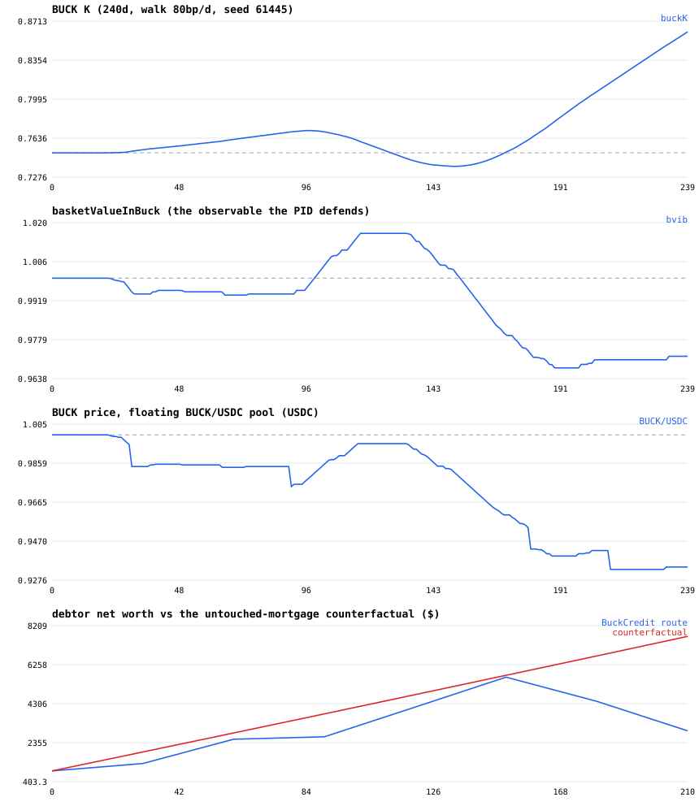

# Copyright (c) 2026 Perry Kundert.  All rights reserved.
#
# This document is NOT covered by the source-code licences in
# LICENSING.md.  The code is free software; the design writing is not
# (yet) placed under an open licence -- see LICENSING.md, "Design
# documents".  "Alberta Buck" is a mark: see TRADEMARKS.md.
#
# SPDX-License-Identifier: LicenseRef-AllRightsReserved
#+title: The Alberta Buck - A Farmer's Demonstration
#+author: Perry Kundert
#+date: 2026-07-04 12:00:00
#+category: Alberta Buck
#+series[]: Alberta-Buck
#+series_order: 23
#+weight: 24
#+draft: true
#+description: Walk a working grain farm through the whole BUCK lifespan on a live, in-browser simulation: establish an account and a cryptographic identity, pledge insured farmland into BuckCredit, retire an amortizing land loan without borrowing, invest the freed payments into the commodity basket, and watch the farm's net worth pull away from the loan-servicing counterfactual -- every step executed by the real Alberta Buck contracts.
#+EXPORT_FILE_NAME: ./images/alberta-buck-demo
#+STARTUP: org-startup-with-inline-images inlineimages
#+OPTIONS: ^:nil
#+OPTIONS: toc:nil

#+BEGIN_ABSTRACT
Dale runs 2,400 acres of wheat and canola east of Vulcan, Alberta.  Like
most working farms, the land is good, the equity is real -- and the cash
flow belongs to somebody else: a $650,000 land loan at 6.2%, $4,300 every
month, most of it interest in the early years.

This document walks Dale's farm through the whole Alberta Buck lifespan
on a LIVE simulation -- real contracts, real cryptographic identities,
real AMM pools, running entirely inside a browser tab
(=core/js/demo/eqworld.html=).  Five steps: establish an account and an
identity; pledge the insured farm into BUCK_CREDIT; retire the land loan
without borrowing; invest the freed payments into the commodity basket;
and watch the return on the whole arrangement improve, month over month,
against the loan-servicing counterfactual.

Nothing in the walkthrough is a mock-up.  Every balance is read from the
deployed contracts; every identity proof is generated and verified
on-chain in the tab; every trade routes through a real Uniswap V3 pool
via the real Universal Router.  Only the world around the contracts --
commodity prices, the fiat rail, the insurance office -- is simulated.
#+END_ABSTRACT

* The stage, before the story

The simulator deploys the complete Alberta Buck system onto an Ethereum
virtual machine that lives and dies inside your browser tab: the
=IdentityRegistry=, =BuckCredit= (the insured-asset NFT), the =Buck=
token with its demurrage and credit-limit machinery, the
=BuckKControllerDirect= PID that steers the system's loan-to-value lever
K, the =BuckBasketProRata= commodity basket, three Uniswap V3 pools
(TOKEN/USDC, TOKEN/BUCK, and the floating BUCK/USDC pool), and the
Universal Router that every trade routes through.

Three background actors keep the market honest while you interact:

- a *whale* pins the TOKEN/USDC pool to a reference commodity price walk
  (in the full research simulations these are real historical feeds --
  construction, labour, energy: the inputs a farm actually buys);
- a *parity arbitrageur* ties the TOKEN/BUCK basket pool to the price
  implied by the other two pools, the way real arbitrage capital would;
- a *keeper* advances the PID controller each day -- =compute()= is
  permissionless, so in production anyone can do this.

The page is tabbed like an instrument panel: *Overview*, *Pools*,
*BUCK K & PID*, *Basket*, *Savers*, *Debtors*, *Journal*.  The Journal
tab deserves a first look: every operation the demo performs is recorded
with its declared expectation and its outcome -- including refusals.
When the protocol says no, the demo shows you the no.

* Step 1: an account, and an identity that answers to no one else

Dale's first stop is a registrar -- in Alberta's case, sensibly, a
credit union or ATB branch that already knows him.  The registrar
attests to the same fields any account opening collects (name, ID
document, jurisdiction), and signs them into a *Pointcheval-Sanders
credential*.  What goes ON CHAIN is not Dale's name: it is a
re-randomized credential, an ElGamal encryption of his identity point
under his own key, and a zero-knowledge proof that the encryption hides
a properly-signed identity -- verified by the =IdentityRegistry=
contract itself, on the BN254 pairing curve, before the account exists.

In the demo, press *Add saver* (Savers tab): the whole ceremony --
canonical serialization, credential re-randomization, encryption, proof
generation -- runs in your tab's WebAssembly in a few hundred
milliseconds, and the registration transaction lands in the Journal.

Two properties matter to a farmer more than the cryptography:

- *Nobody can see who you are from the chain.*  Balances and transfers
  are visible; the identities behind them are encrypted to their owners.
- *Every payment is still fully identified -- bilaterally.*  Before BUCK
  moves between two private parties, each re-encrypts their registered
  identity to the other and proves (Chaum-Pedersen) it is the same
  identity the registrar signed.  Dale always knows exactly whom he paid
  and who paid him -- he holds receipts that prove it -- and no third
  party learns either.  Public entities (the basket, the pools, the
  router, a government account) are declared public and exempt.

* Step 2: pledging the farm -- BUCK_CREDIT is not a loan

Next, Dale insures a quarter-section into the system.  An appraiser and
an insurer (off-chain businesses, exactly as today) write coverage on
the parcel; the insurer mints a *BuckCredit NFT*: face value, asset
class, a deterministic depreciation schedule (land: none), and the
premium rate.  Activating it through =Buck.mint= creates *credit
headroom* -- not tokens.  Dale's spendable capacity is

: creditLimit = insured face value x K

where K is the system-wide loan-to-value lever the PID controller
steers (the demo boots at K = 0.75).  When Dale spends beyond his
positive balance, his signed balance goes negative: that negative
number is not a debt to a lender -- it is an *outstanding claim on his
own pledged assets*.  It accrues no interest.  It accrues no demurrage
(demurrage applies to positive, idle BUCK).  It costs exactly one
thing: the insurance premium on the coverage -- the same premium the
farm already pays to insure what it owns.

In the demo, press *Add debtor* (Debtors tab) with the mortgage and
payment of your choice: the pledge, the NFT, and the activation land in
the Journal, and the new position appears with its credit limit.

* Step 3: retiring the land loan

Here is the heart of the demonstration.  Dale's simulated twin holds
the $650,000 loan at 6.2% and keeps making the $4,300 payments.  Dale
himself now runs a simple, patient policy each month:

- *When BUCK trades above the basket* (deflation side -- the market
  values BUCK richly), he draws against his headroom and sells BUCK
  high for dollars, retiring loan PRINCIPAL early -- swapping
  interest-bearing bank debt for his interest-free claim on his own
  land.  The draws are tranche-capped (a year of payments at a time),
  so one farmer never moves the market.
- As the loan shrinks, the payments it no longer consumes *bank up*.
- *When BUCK trades below the basket* (inflation side -- BUCK is
  cheap), he spends the banked dollars buying discounted BUCK,
  retiring the drawn claim toward zero.

Sell high, buy low -- not as speculation, but as the natural rhythm of
someone retiring one kind of obligation with another.  And note what
this behaviour does systemically: it is *counter-cyclical demand* that
pulls BUCK back toward the basket from both sides.  The farmer's
self-interest and the currency's stability are the same motion.  (The
controller helps from the other side: sustained deviation moves K
slowly, tightening or relaxing every credit limit in the system.  The
demo keeps this honest -- if K tightens past Dale's draw, he is FORCED
to buy BUCK at whatever the market asks, and the cost is booked to his
ledger like everything else.)

* Step 4: investing the savings

Once the loan is gone, the $4,300 keeps arriving -- it is Dale's cash
flow now.  The BUCK system gives it two productive homes:

- *Hold BUCK* -- knowing that idle balances pay demurrage: the system
  is built for money that moves.
- *Invest in the basket.*  =BuckBasketProRata= accepts the commodity
  TOKENs themselves -- and these are not abstractions: construction
  materials, labour, energy are precisely the farm's own input bill.
  A deposit mints BUCK against the tokens and places both into the
  basket's pool; the depositor holds a *receipt NFT* -- a pro-rata
  claim on the basket, redeemable any time.  In effect, Dale pre-buys
  his input basket with this year's grain cheque, holds a claim that
  tracks those real prices, and collects the pool's trading fees
  while he waits.

In the demo the saver does this automatically: give it a budget and a
term on the Savers tab, and it acquires the TOKEN via whichever route
quotes better (directly, or through BUCK when that is cheaper -- a
real routing decision through the real router), deposits, marks the
receipt to market daily, and redeems at the horizon.  Select the saver
in the dropdown to watch its position value against its cost basis.

* Step 5: watching the ROI improve

The Debtors tab draws the picture that matters
(=images/alberta-buck-demo-farm.svg= is a 240-day run with exactly the
numbers above):

#+CAPTION: 240 simulated days: BUCK K, basket value in BUCK, the floating BUCK price, and the farm's net worth vs the loan-servicing counterfactual.

- *BUCK K* moves deliberately (0.75 -> 0.86 over this run): the
  controller answers persistent deflation with more credit capacity.
  It is a structural lever, not a market-maker; the fast
  stabilization is the savers' and debtors' own buying and selling.
- *basketValueInBuck* rides near 1.0 -- one basket costs about one
  BUCK: the peg, defended by everyone's self-interest.
- *The floating BUCK price* is never pinned; it wanders with supply
  and demand, and the arbitrage keeps the three pools consistent.
- *Net worth*: the BuckCredit route's line (land + banked dollars -
  loan - drawn claim) starts out ON TOP of the counterfactual --
  swapping bank debt for a claim on your own land conserves net worth
  by construction -- and then separates, because the carrying costs
  differ by an order of magnitude: the untouched loan bleeds $3,358 a
  month in interest on day one, while the claim costs $271 a month in
  insurance premium.  In this 240-day run Dale has already moved
  $201,672 of principal out of the bank's column ($440,657 owing vs
  the twin's $642,329); the avoided interest on that retired
  principal is what compounds the gap from here.  The improvement is
  not magic; it is the removal of a standing outflow.

* Drive it yourself

: make nix-core-demo-eqworld
: python3 -m http.server -d core/js/demo 8000
: open http://localhost:8000/eqworld.html

The page boots the world and an opening cast, then it is yours:

1. *step / play* advances simulated days; the background market churns.
2. *Savers tab -> Add saver* runs Step 1's full identity ceremony and
   Step 4's investment cycle; the dropdown shows each saver's detail.
3. *Debtors tab -> Add debtor* runs Steps 2-3; the detail panel carries
   the net-worth-vs-counterfactual chart per debtor.
4. *Pools / BUCK K & PID / Basket* tabs are the instrument panel: pool
   reserves and divergences, the controller's K and funding factor,
   the basket's backing and receipts.
5. *Journal* shows every operation with its declared expectation --
   including the protocol's refusals, which are part of the story.

The same engine runs headless with charts to a file:

: cd core/js && node bin/eqsim.mjs --days 240 --house 650000 \
:     --rate 620 --payment 4300 --budget 40000 --hold 120 \
:     --plot farm.svg

* What is real, and what is simulated

/Real/: every contract (the same Solidity deployed by the research
simulations and the test suite), every identity proof (generated by the
production Rust kernel compiled to WebAssembly, verified on-chain),
every pool (Uniswap V3), every trade (through the real Universal
Router), every balance and every refusal.

/Simulated/: the commodity price walk (the research harness uses real
historical feeds); the fiat rail (dollar income arrives as a mint on a
mock USDC); the insurance office (premiums are booked to the ledger
rather than invoiced); and the demo world carries one basket
constituent where the research basket carries the full recomposed set.
The population is deliberately tiny -- one whale, one arb, and whoever
you add -- where the research simulations run heterogeneous crowds.

The numbers a reader should NOT take away are the exact returns: a
240-day walk with a seeded random feed is a demonstration, not a
forecast.  The numbers a reader SHOULD take away are structural: an
amortizing loan replaced by a premium-only claim on the farm's own
assets, counter-cyclical trading that stabilizes the currency while it
serves the trader, and savings parked in a claim on the very
commodities the farm consumes.
