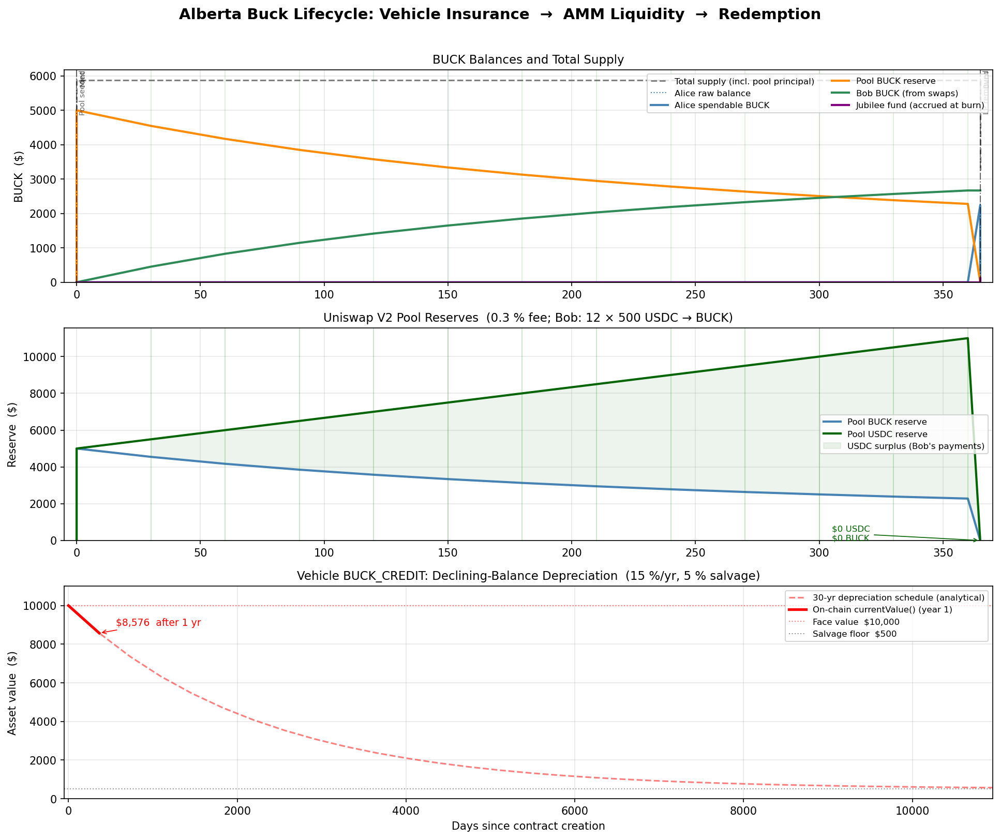

#+title: Alberta Buck -- Worked Examples
#+author: Perry Kundert
#+date: 2026-05-10
#+category: Alberta Buck
#+series[]: Alberta-Buck
#+series_order: 10
#+draft: false
#+bucky: true
#+description: Concrete worked examples for the Alberta Buck Ethereum implementation: vehicle insurance lifecycle, AMM liquidity provision, demurrage visualisation, and PID-driven inflation/deflation arbitrage.

#+EXPORT_FILE_NAME: ./images/alberta-buck-ethereum-example
#+STARTUP: org-startup-with-inline-images inlineimages
#+OPTIONS: ^:nil toc:nil

#+LATEX_HEADER: \usepackage[margin=1.0in]{geometry}

* Vehicle Insurance Lifecycle
  :PROPERTIES:
  :CUSTOM_ID: vehicle-lifecycle
  :END:

This example traces a single year in the life of a vehicle-insurance BUCK_CREDIT: from
collateral creation through AMM liquidity provision and swap-fee collection to final burn.
Every figure in this section is generated from an actual Foundry test run --
see =test/BuckLifecycle.t.sol= for the on-chain numbers and
=alberta_buck/test/test_lifecycle_plot.py= for the visualisation.

** Generating the data

#+BEGIN_SRC shell :results output :exports both :eval no-export
forge test --match-test test_lifecycle -vv
#+END_SRC

This writes =test/vectors/lifecycle.json=.  Run once; re-run whenever the
contracts change.  To regenerate the plot:

#+BEGIN_SRC shell :results output :exports both :eval no-export
python -m pytest alberta_buck/test/test_lifecycle_plot.py -v -s
#+END_SRC

** Scenario

Alice owns a $10,000 vehicle.  Her insurer issues a =BUCK_CREDIT= NFT with a
15 %/yr declining-balance depreciation schedule and a $500 salvage floor (5 %).
Alice activates the full face value and mints 5,000 BUCK against it.

| Parameter             | Value                    |
|-----------------------+--------------------------|
| Face value            | $10,000                  |
| Depreciation type     | DECLINING_BALANCE        |
| Annual rate           | 15 % (1500 bp)           |
| Salvage floor         | $500  (5 %)              |
| Annual premium rate   | 1.5 % (150 bp)           |
| BUCK minted           | 5,000 BUCK               |
| Pool seed             | 5,000 BUCK + 5,000 USDC  |
| Bob's monthly swaps   | 12 × 500 USDC → BUCK    |
| Pool fee              | 0.3 % (Uniswap V2)       |

The mint draws cheapest-first coverage.  At a 1.5 % premium and 10× pool-ROI
inverse, the per-BUCK denom is

#+BEGIN_SRC text
denom = 10000 - 150 × 10 = 8500
#+END_SRC

so ~=take = ⌈5000 × 10000 / 8500⌉ = 5882 BUCK= of coverage is drawn and
~=poolPrincipal = 882 BUCK=~ is minted to =insurancePool=.  Total supply after
mint: $5882.

Alice deposits all 5,000 BUCK plus 5,000 USDC into a Uniswap V2 pair (1:1
ratio).  Bob then buys 500 USDC of BUCK each month for a year.

** Key outcomes after one year

| Event                | BUCK balance | USDC balance | Notes                            |
|----------------------+--------------+--------------+----------------------------------|
| Mint                 | 5,000        | 10,000       | 882 BUCK principal to pool       |
| Pool seed            | 0            | 5,000        | All BUCK deposited               |
| After swap 12        | 0            | 5,000        | 5000 USDC→BUCK paid in by Bob    |
| Liquidity removed    | 2,232        | 16,000       | Pool rebalanced; USDC up $6K     |
| After burn           | 0            | 16,000       | Coverage unwound; jubilee $117   |

Alice exits with $16,000 USDC -- a $6,000 gain from Bob's swap fees -- having
paid zero demurrage herself (her BUCK sat in a Carrying pool the whole time,
pre-accruing Jubilee instead).  The vehicle credit shows $8,576 current value
after one year of 15 % declining-balance depreciation.

** Lifecycle chart

#+ATTR_LATEX: :width 14cm

The chart has three panels:

- *BUCK balances (top)*: Alice's raw and spendable BUCK track identically until
  liquidity removal, when the pool's carried =buckSeconds= arrive with the
  returned tokens (raw > spendable by the ≈ $46 carried fee).  Bob's BUCK
  accumulates linearly as he buys each month.  The total supply stays flat at
  $5,882 until Alice burns, whereupon it drops to $3,256 (the pool principal
  stays because =insurancePool= was only partially wound back against Alice's
  partial burn).  The Jubilee spike at burn day reflects the 2 %/yr accrual on
  the full supply over the year.

- *Pool reserves (middle)*: Uniswap V2's constant-product invariant
  (~K = 5000 × 5000 = 25M~) keeps the pool balanced.  Each 500 USDC swap shifts
  roughly 453 BUCK out of the pool.  By month 12 the pool holds ~$2,278 BUCK
  and ~$11,000 USDC.  Alice's LP share captures all of this: she added $5,000
  of each, exits with $2,232 BUCK and $11,000 USDC.

- *Credit depreciation (bottom)*: The on-chain =currentValue()= trace (thick
  red) follows the year-1 segment of the full 30-year schedule (dashed).  The
  discrete whole-year compounding formula produces a linear interpolation within
  each year, converging to $8,576 at day 365.  After 30 years the credit would
  reach its $500 salvage floor.

** Demurrage and Jubilee mechanics

During the year Alice holds no BUCK directly -- it lives in the Uniswap V2
pair, which is bound as a Carrying account.  Carrying accounts do not lose
visible balance to demurrage; instead =_accrueJubilee= credits the Jubilee fund
at the full =totalSupply= rate on every mint/burn.

When Alice removes liquidity, the pair executes a =_carryingTransfer= to her.
The proportional buckSeconds for the BUCK she receives:

#+BEGIN_SRC text
carried = liveBs × value / raw
#+END_SRC

arrive alongside the raw BUCK, so her spendable is $2,232 while her raw balance
is $2,278 (the $46 difference is the carried fee that locks into her slot).

The Jubilee accrues visibly only at the final =burn= call:
~$5,882 × 2 % × 1 yr ≈ $117~.  Governance can direct this accumulation to
default-coverage, ground-rent disbursement, or a periodic balance reset -- all
on-chain paths land on the Jubilee slot.

* BUCK Inflation/Deflation Arbitrage
  :PROPERTIES:
  :CUSTOM_ID: pid-arbitrage
  :END:

This second example traces a market-making strategy around the BUCK_K
controller.  Alice provides deep BUCK/USDT liquidity AND keeps a
BUCK + USDT reserve at home.  As random Bobs mint, swap, and burn BUCK
over a quarter, the BUCK/USDT pool spot drifts away from commodity-
basket parity.  The PID controller (reading a 600-second TWAP of the
pool) eventually adjusts =BUCK_K= to push the system back to
equilibrium -- but the integration is slow by design and reads only
the lagged TWAP.  Alice trades against short-term excursions because
she knows where parity lives and roughly when the PID will catch up.

** Scenario

| Parameter                     | Value                                                  |
|-------------------------------+--------------------------------------------------------|
| Alice's LP position           | 100,000 BUCK / 100,000 USDT (V3 0.3% fee tier)         |
| Alice's wallet reserve        | 50,000 BUCK + 50,000 USDT (off-pool)                   |
| Basket composition            | XAUT/USDT, PAXG/USDC, cbBTC/USDC, WBTC/USDT (25% each) |
| Basket cost (parity target)   | $1.00                                                  |
| =BUCK_K= initial / bounds     | 1.000 / [0.50, 1.50]                                   |
| =dT= / =dTMax= / TWAP window  | 60 s / 3,600 s / 600 s                                 |
| Time horizon                  | 90 days, ~50 Bobs                                      |

Alice's edge:

- *On-chain visibility*: she watches =BuckKController.buckK()=,
  =lastBasketCost=, and her pool's =slot0= every block.  She can
  forward-project where =buckK= will be one TWAP-window from now
  before the next =compute()= even runs.
- *Capital on both sides*: 50,000 BUCK and 50,000 USDT in reserve let
  her take either side of any drift without unwinding her LP first.
- *Patience*: her LP earns 0.3% on every Bob swap regardless of
  direction.  Arbitrage is alpha on top of base swap-fee yield.

Risks she accepts:

- *Demurrage on her BUCK reserves*: her wallet is non-Carrying, so her
  off-pool BUCK accrues ~2%/yr in =feeOwing=.  Her in-LP BUCK does not
  -- the V3 pool is bound Carrying, so demurrage drips into the
  Jubilee at the =totalSupply= rate.  Holding BUCK off-pool is a 2%/yr
  cost.
- *PID overshoot*: =buckK= can clamp to a rail and basket re-weights
  shift the equilibrium.  Positions can stay underwater for weeks.
- *Front-running*: every other arb sees the same on-chain signals.
  Alice's edge is her commitment of capital before the PID-driven
  response fully materialises.

** A typical round-trip

Trace one drift-and-arbitrage cycle:

1. *Day 12, 14:03*.  Bob_17 calls =Buck.mint(8000e6)= and immediately
   swaps 8,000 BUCK for USDT in Alice's pool.  Pool moves to 108K BUCK
   / 92.6K USDT; spot = 92.6 / 108 = *$0.857*.  Alice collects ~24
   USDT in 0.3% swap fees on her LP share.

2. *Day 12, 14:04*.  =Buck.mint()= called =buckK.compute()=; =dT= had
   elapsed so the PID ran one cycle.  But the PID reads the
   *600-second TWAP*: only ~2 s of post-swap history are in the
   window so far.  TWAP = $0.998, =buckK= barely moves: 1.0000 →
   1.0000.

3. *Day 12, 14:30*.  Several more Bobs cash out.  Pool is now ~109K /
   91K, spot $0.835, TWAP caught up to ~$0.842.  PID now sees a real
   ~16% error: =buckK= ratchets 1.0000 → 1.005 → 1.012 → ... → 1.024
   over the next hour.

4. *Day 12, 14:35*.  Alice judges the dislocation will revert (basket
   is stable, the PID is actively driving =buckK= up).  She swaps
   *20,000 USDT into BUCK* in her own pool, picking up ~24,500 BUCK at
   an effective rate of $0.816 (V3 slippage included).  Pool now 84.5K
   BUCK / 111K USDT.  Her own swap snaps spot up to $1.31, but the
   TWAP still averages near $0.85 because most of the 600-second
   window predates her trade.

5. *Day 12, 15:00 - Day 14, 09:00*.  PID continues raising =buckK=
   (peaks ~1.040).  Other arbitrageurs notice and buy BUCK with USDT.
   The expanded credit limit lets new minters draw extra BUCK against
   their NFTs, which they spend into commodities -- a non-pool channel
   that doesn't directly push BUCK/USDT but does pull commodity prices
   closer to BUCK's.  Cumulative pressure pulls the pool toward
   parity.

6. *Day 14, 09:00*.  Pool sits at 100K BUCK / 100.4K USDT, spot
   $1.004, TWAP $1.001.  PID sees the error reverted.  Over the next
   day =buckK= retreats from 1.040 toward 1.000 (the integral term has
   accumulated; recovery is gradual).

7. *Day 14, 09:30*.  Alice swaps her 24,500 BUCK back for ~24,470 USDT
   at recovered parity, plus ~73 USDT of LP fees from other swaps
   during the 47-hour holding period.  Round-trip net:
   *+~4,540 USDT* on a 20,000 USDT exposure.

The mirror-image trade applies in the over-valued direction: when a
wave of Bob burns drains BUCK from the pool and pushes spot above
basket, Alice sells BUCK from her reserve into the pool at a premium
and buys back at recovered parity.

** What the PID guarantees Alice

Alice's strategy works because the PID is, by design, slow:

- *TWAP smoothing*: a 10-minute TWAP attenuates a single-block
  manipulation by ~600x.  It also lags real drift -- TWAP doesn't
  reach 95% of a sustained spot move until ~3x window (30 minutes).
- *=dT= pacing*: even after =compute()= runs, only one PID cycle per
  60 seconds.  Across the 47-hour position above, ~2,800 cycles fired.
- *Anti-windup + bounds*: =buckK= saturates at [0.50, 1.50].  At
  peak drift it reached 1.040 -- well within the rails.
- *=dTMax= clamp*: even if =compute()= goes silent for a day, the next
  call treats the gap as a single 1-hour step.  Alice's strategy
  doesn't depend on continuous PID firing -- =buckK= ratchets
  monotonically (in expectation) toward equilibrium regardless of
  cycle cadence.
- *=dS= compensation*: a basket-side shift (gold spike, governance
  re-weight) is subtracted out of the derivative term.  Alice's
  position isn't whipsawed by oracle noise on the basket side.

The mechanism is *self-correcting in expectation*: when BUCK is
undervalued, arbs like Alice buy BUCK with USDT, lifting spot.  When
BUCK is overvalued, arbs sell BUCK, depressing spot.  In both
directions arb action accelerates the PID's intended convergence.

Without arbitrageurs, =buckK= could swing without translating to
spot-price recovery.  With arbitrageurs, every basis point of =buckK=
drift becomes capital flowing toward the under-priced side.

** When the PID can't help her

Two scenarios break Alice's mean-reversion assumption:

- *Permanent basket re-weight*: governance changes the basket via
  =addBasketPool= or its inverse.  =buckK= tracks the new basket cost;
  the old equilibrium evaporates.  Alice should monitor governance
  events and unwind before any expected re-weighting.
- *Persistent oracle lag*: if the BUCK/USDT TWAP is much wider than
  the basket-pool TWAPs, the PID can persistently misread.  The
  shipped configuration uses 600 s on every pool, so they're symmetric;
  asymmetric configurations create exploitable lag for the *operator*
  of whichever pool runs deeper.

** Reproducing this example

A scripted Foundry test exercising this scenario lives at
=test/BuckKArbitrageScenario.t.sol= (planned, see the Status section
of =alberta-buck-ethereum.org=).  It will deploy a V3 factory, all four
basket pools at the reference prices, the BUCK/USDT pool with Alice's
LP, populate the TWAP window, then run a scripted sequence of Bob
mints + swaps + Alice arb trades over a simulated 90 days, emitting
per-event state snapshots to =test/vectors/arb-scenario.json=.  The
Python visualisation (=alberta_buck/test/test_arb_plot.py=) turns that
JSON into a four-panel chart: spot vs TWAP vs basket cost; =buckK=
trajectory; Alice's PnL; aggregate Bob mint/burn flow.

* Reproducing the Examples
  :PROPERTIES:
  :CUSTOM_ID: reproducing
  :END:

#+BEGIN_SRC shell :exports code :eval no-export
# From the repo root inside nix develop:
forge test --match-test test_lifecycle          # generates test/vectors/lifecycle.json
python -m pytest alberta_buck/test/test_lifecycle_plot.py -v -s  # regenerates images/lifecycle.png
#+END_SRC

The lifecycle JSON is committed alongside the test so the plot can be regenerated
without re-running the Forge suite.  CI regenerates it and checks for drift with
=git diff --exit-code=, the same discipline used for the SNARK test vectors.

The arbitrage scenario above is not yet wired into the test suite; when it
lands, the same regenerate-then-diff discipline will apply.
