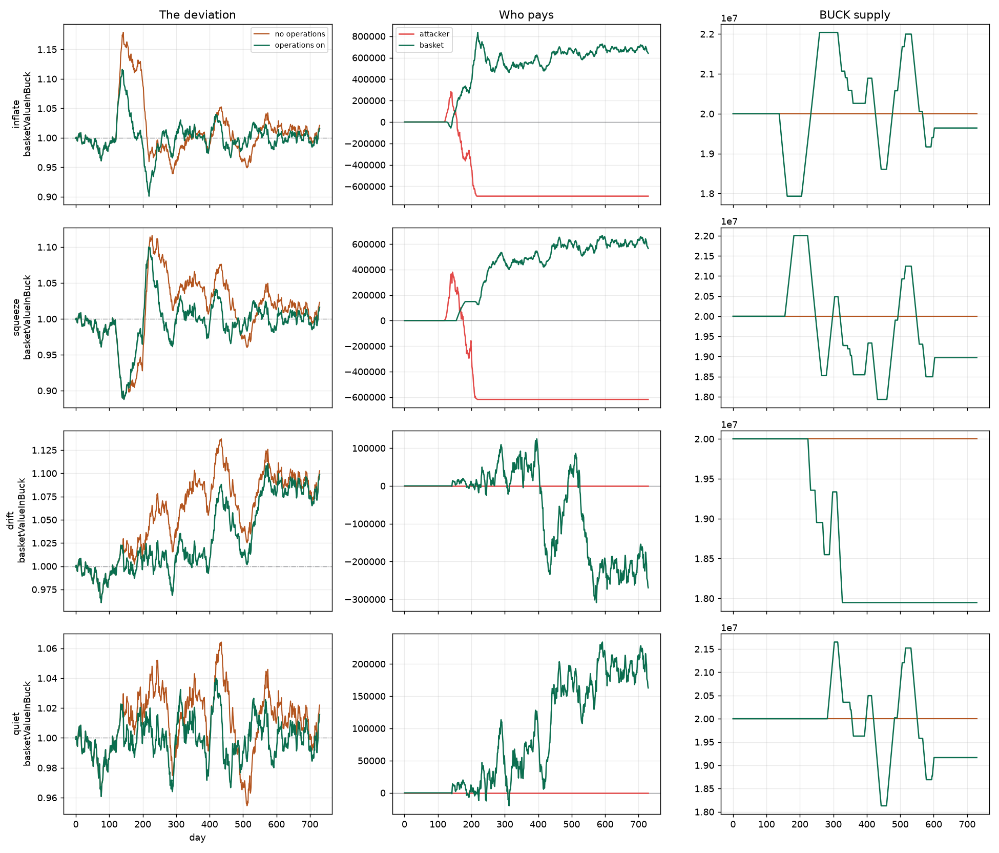

# Copyright (c) 2026 Perry Kundert.  All rights reserved.
# This document is NOT covered by the source-code licences in
# LICENSING.md.  The code is free software; the design writing is not
# (yet) placed under an open licence -- see LICENSING.md, "Design
# documents".  "Alberta Buck" is a mark: see TRADEMARKS.md.
# SPDX-License-Identifier: LicenseRef-AllRightsReserved
#+title: The Alberta Buck -- The BasketWheel (prototype)
#+SUBTITLE: How the BuckBasket Earns and Defends: Its Credit, Its Own Arbitrage, Its Timing, Its Desk, and the Wheel That Turns Them
#+author: Perry Kundert
#+date: 2026-09-30
#+category: Alberta Buck
#+series_order: 26
#+weight: 27
#+draft: false
#+bucky: true
#+description: The machinery behind the BuckBasket.  A basket of pools is a rebalancer that trades at stale prices, and whoever re-pins it keeps the rebalancing premium.  The equity basket takes that premium back with capital-free consistency cycles, times the slow swings a pool cannot harvest with a director that waits for each excursion to turn, runs a monetary desk that trades BUCK against the basket from an account of its own, and turns all of it on a work wheel that anyone can advance and that pays for its own turning.  The theory, the mechanism, what the simulations say, and what is still open.

#+EXPORT_FILE_NAME: ./images/alberta-buck-ethereum-wheel
#+STARTUP: org-startup-with-inline-images inlineimages
#+STARTUP: org-latex-tables-centered nil
#+OPTIONS: ^:nil toc:nil

#+LATEX_HEADER: \usepackage[margin=1.0in]{geometry}

#+begin_abstract
[[file:alberta-buck-ethereum-basket.org][The BuckBasket]] says the basket earns from tolls, from
correcting its own prices and from timing slow swings, and that a desk beside it steadies BUCK.
This paper is the machinery and the arithmetic behind those claims.

A pool of liquidity is a rebalancer that trades at stale prices.  In a market that reverts, the
arbitrageur who re-pins it keeps nearly all of the rebalancing premium, and the pool keeps only its
fees.  The equity basket takes that premium back with /consistency cycles/: three swaps round a
commodity's three prices, needing no capital and unable to lose.  One filter bank over the pools
then serves two mandates.  Its /differential/ mode -- which commodity is rich against which --
drives a /director/ that leans against each excursion once it has turned.  Its /common/ mode --
BUCK against the whole basket -- drives a /monetary desk/ that absorbs and supplies BUCK in days,
where the K controller needs months; the desk trades from an account of its own, never the
depositors'.  All of it runs on /work wheels/: bounded state machines that anyone may advance and
that pay their callers from what they capture.

*This is a prototype.*  The contracts exist and run in a simulated economy and in a public sandbox.
None of it is deployed or audited, and the numbers below are a simulation's or a model's.
([[https://perry.kundert.ca/images/alberta-buck-ethereum-wheel.pdf][PDF]], [[https://perry.kundert.ca/images/alberta-buck-ethereum-wheel.txt][Text]])
#+end_abstract

#+TOC: headlines 1

* Status
:PROPERTIES:
:CUSTOM_ID: status
:END:

| Piece                                | State (2026-09-30)                           |
|--------------------------------------+----------------------------------------------|
| The equity basket (=src/basket/=)    | built and Foundry-tested                     |
| The monetary desk (=EquityDesk=)     | built beside it; its separation fuzz-tested  |
| The work wheel (=src/wheel/=)        | built; one instance per machine              |
| The consistency cycles (=ArbKind=)   | built; 16 tests on real Uniswap V3 pools     |
| The simulated economy                | running, and live in the savings sandbox     |
| The two-year experiments             | rerunning on this basket                     |
| Deployment, audit                    | none                                         |

Read every figure below as "in a simulated economy", not as a forecast.  The contract surface is in
[[file:alberta-buck-ethereum.org::#buck-basket-equity][the Ethereum implementation]]; the design
record, with every ruling and measurement, is in =doc/= (=BASKET-EQUITY.org=, =BASKET-WHEEL.org=,
=BASKET-REBALANCE.md=).

* The machine
:PROPERTIES:
:CUSTOM_ID: machine
:END:

The basket is shares of equity, one lien, and a wallet.

#+BEGIN_EXAMPLE
    gross(mark)   =  sum over pools ( 2 L_i sqrt(P_i)  +  idle TOKEN_i x P_i )
    equity(mark)  =  gross(mark)  +  signedBalance(basket)  +  reliefAccrued(basket)
    share price   =  equity / shares
#+END_EXAMPLE

=2 L sqrt(P)= is a full-range position's fair value at a price.  It is computed from the pool's
liquidity and a price, never from token balances, so tokens sent to a pool cannot inflate it.
There are three marks: the TWAP, HIGH (each pool at the higher of spot and TWAP) and LOW (the
lower).  A deposit is valued at LOW against a basket at HIGH; an exit at LOW.  Each side pays a
charge the size of the swap the wheel will make for it: =(1 - K)/2= of the pool fee for TOKEN in,
=(1 + K)/2= of the dearest pool's fee for BUCK in or out.  Nobody can enter or leave at a price
that moves value between the holders.

*The credit.*  The basket is an ordinary BUCK account holding one self-issued /marked/ credit, marked
before anything that spends at =equity(LOW)= -- the depositors' equity, and nothing else.  Buck
therefore enforces

#+BEGIN_EXAMPLE
    lien(basket)  <=  K x equity(LOW)
#+END_EXAMPLE

on every draw.  The basket never mints or burns: it spends past its held BUCK, which draws on the
credit, and BUCK it receives repays the lien.  The lien earns Jubilee relief like any other.  A cut
in =K= changes no lien; an under-water account simply cannot draw.  There are no margin calls:
the excess is repaid only by the wheel's paced Trim.

*Exits.*  The treasury takes 25% of a receipt's gain over its cost basis, as shares, and nothing of
a loss.  The rest is paid in BUCK when Buck lets the basket spend it.  Otherwise it is paid in
kind: the exit's fraction =f= of every position and of the idle TOKEN, by transfer, its share of
the lien repaid from the BUCK its positions return.  No swap is forced on anyone.

The wallet absorbs the flows.  Its target liquidity is the larger of 1% of the gross and a
flow-sized amount -- enough that half of it covers two standard deviations of the daily net flow
times =1 + K= -- capped at 20% of the gross.  Deposits and exits net against each other inside it,
and an ordinary exit touches no pool.

* Where a pool's harvest goes
:PROPERTIES:
:CUSTOM_ID: leak
:END:

A constant-mix portfolio earns more than the weighted average of its parts: stochastic portfolio
theory calls the difference the /excess growth rate/ (Fernholz, 2002),

#+BEGIN_EXAMPLE
    gamma*  =  1/2 ( sum_i w_i sigma_i^2  -  sigma_p^2 )
#+END_EXAMPLE

-- half the gap between the parts' average variance and the portfolio's own.  It is the rebalancing
premium, and for a pool half TOKEN and half BUCK it is =sigma^2 / 8= of the position per unit time.

*A full-range position is a constant-mix rebalancer that trades at stale prices.*  It sells TOKEN
as the price rises and buys as it falls, but at its own price, which trails the market.  Whoever
moves it to the market price keeps the difference: the /loss-versus-rebalancing/ of Milionis,
Moallemi, Roughgarden and Zhang (2022),

#+BEGIN_EXAMPLE
    LVR  ~  V x sigma^2 / 8     per unit time, before fees
#+END_EXAMPLE

-- the same number.  So the harvest goes to the arbitrageur, and the pool keeps the fees on the
arbitrageur's volume.  For one pool reverting with a 20-day half-life at 1.5% a day, the premium is
1.0% a year of the position:

| outside arbitrage | pool fee | the pool keeps | the basket's own arbitrage keeps |
|-------------------+----------+----------------+----------------------------------|
| once a day        | 0.3%     | 0.22%          | 0.90%                            |
| once a day        | 1%       | 0.49%          | 0.90%                            |
| every hour        | 0.3%     | 0.52%          | 0.75%                            |
| every hour        | 1%       | 0.79%          | 0.83%                            |

The finer the trading against the fee, the more the fee recovers by itself; the coarser, the more
only the basket's own arbitrage can.

*A pool cannot harvest slow swings at all.*  A constant-mix rebalancer earns the variance of
short-horizon moves -- the quadratic variation.  A smooth cycle has almost none, however large its
amplitude.  A swing is harvested only by trades timed across pools: selling one leg near its top,
buying another near its bottom.

So a basket's excess return over holding its commodities has three sources, each with its own
harvester:

| mispricing                  | harvester             | its risk             |
|-----------------------------+-----------------------+----------------------|
| a stale TOKEN/BUCK pool     | the consistency cycle | none, per cycle      |
| a leg rich against its past | the director's lean   | whipsaw in a trend   |
| BUCK off its basket         | the monetary desk     | persistent inventory |

Beneath all three are the tolls: the fees on the basket's own pools, which the Sync step collects.

* The consistency cycle
:PROPERTIES:
:CUSTOM_ID: cycle
:END:

Three pools quote each constituent:

#+BEGIN_EXAMPLE
                 TOKEN_i
                /       \
      TOKEN/USDC         TOKEN/BUCK    (the basket's own pool)
              /           \
          USDC ----------- BUCK
                BUCK/USDC
#+END_EXAMPLE

If the three prices agree, going round the triangle returns what went in, less the fees.  If they
disagree, one direction returns more.  Going round that way, by the right amount, closes the gap
and keeps the difference.

** The algebra
:PROPERTIES:
:CUSTOM_ID: algebra
:END:

A constant-product leg with reserves /(X, Y)/ and fee factor /g/ (one minus the fee) pays, for an
input /x/,

#+BEGIN_EXAMPLE
    out(x)  =  g Y x / (X + g x)  =  r x / (1 + k x),     r = g Y / X,   k = g / X
#+END_EXAMPLE

a Moebius map through the origin: /r/ is the leg's marginal rate at zero size, /k/ its curvature
(the inverse of its depth).  Such maps compose into maps of the same form, so a whole cycle is two
numbers:

#+BEGIN_EXAMPLE
    r  =  r1 r2 r3
    k  =  k1 + k2 r1 + k3 r1 r2
    cycle(x)  =  r x / (1 + k x)

    x*  =  (sqrt(r) - 1) / k          profit*  =  (sqrt(r) - 1)^2 / k
#+END_EXAMPLE

The cycle pays exactly when /r/ > 1, and the optimum closes the gap down to the fees, no further.  A
full-range V3 position is constant product on its virtual reserves, so the closed form is exact for
the basket's own pools and a good approximation elsewhere.  =CycleMath= in =src/wheel/ArbKind.sol=
is this section in Solidity.

** Why it cannot hurt
:PROPERTIES:
:CUSTOM_ID: safe
:END:

- *No capital.*  A V3 pool pays a swap's output before it collects the input, in a callback.  The
  first leg pays out; the other two run inside its callback; what they return pays the first.  No
  inventory, no flash loan, no flash mint.  USDC exists only between two swaps inside one
  transaction.
- *No change in supply.*  No BUCK is issued or destroyed; value moves from the venues to the
  basket.  A cycle never trades BUCK against the basket's value -- that is the desk's business.
- *It cannot lose.*  The cycle checks its realized output against its input and reverts below a
  minimum edge.  Someone who pushes a pool first only pays the basket to push it back.
- *It keeps the gauge true.*  The controller steers on the basket's value in BUCK, read from these
  pools.  Closing their gaps makes that reading follow the commodities instead of lagging them by
  an arbitrageur's threshold.

The same three swaps, in the same rotation, earn the same whichever token the cycle starts from;
the start decides only what the profit is made of.  Started from the TOKEN, the profit lands in the
basket's wallet, and every share is worth more.  Started from BUCK, it funds the wheel's callers'
reserve (below) up to a cap, and the rest goes to the basket's account.

** Who can take which gap
:PROPERTIES:
:CUSTOM_ID: band
:END:

A searcher going round the triangle pays three pool fees.  It is tempting to think the basket pays
only two -- it is nearly the only liquidity in its own pool, so the fee it pays there comes back --
and so can take a band of small gaps nobody else can.  It cannot.  On its own share of a pool the
basket is trading with itself: at the outside price, a "capture" inside the outsiders' band gains
only the outside liquidity's share of the gap, and pays the outside cost on all of it.  That is a
rebalancing bet, not an arbitrage, and measured it gains nothing (within 0.02-0.16% a year, either
sign).

What the basket /can/ do is take the outsider's trade first.  The gaps worth taking are the ones
wider than all three fees, and on today's Uniswap V3 the basket must race searchers for them.
Winning that race by construction needs control of the order of swaps: a Uniswap v4 hook that runs
the cycle before the first swap of each block, or an auction for the right to go first (the
auction-managed AMM of Adams, Moallemi, Reynolds and Robinson, 2024).  That is the upgrade path.

* One filter bank, two modes
:PROPERTIES:
:CUSTOM_ID: modes
:END:

A Uniswap tick is a log price, so the basket's pools hand it log prices for free.  Write =c_i= for
constituent /i/'s log price in BUCK, and split the vector the way a three-phase machine splits its
line voltages -- into a common mode, which carries no torque, and differential modes, which carry
all of it:

#+BEGIN_EXAMPLE
    differential:  c_i - mean(c)        which commodity is rich against which
    common:        log(basket in BUCK)  what the whole basket costs, against par
#+END_EXAMPLE

The differential mode is numeraire-free: anything common to every leg, including BUCK's own
wobble against the dollar, cancels exactly.  It is the director's signal.  The common mode is the
K controller's process variable, and it is the desk's signal.  Both are kept as ladders of
exponential moving averages over geometrically spaced windows; the difference of two adjacent EMAs
is a band-pass filter, so a ladder is an octave filter bank, each rung seeing swings of its own
size.

* The director: timing the tides
:PROPERTIES:
:CUSTOM_ID: director
:END:

*Why there are tides.*  New money does not reach all prices at once (Cantillon, 1755).  Correlating
each constituent's year-over-year growth with the M2 money supply, lags swept from 0 to 36 months:

| constituent       | peak lag (months) | peak correlation |
|-------------------+-------------------+------------------|
| bitcoin (cbBTC)   | 0                 | 0.08             |
| gold (PAXG)       | censored at 36    | 0.10             |
| construction      | 9-10              | 0.48-0.52        |
| energy            | 13                | 0.33-0.39        |
| labour            | 15-16             | 0.32-0.38        |
| food              | 23                | 0.21-0.26        |

Monetary assets move first, energy and construction next, labour and food last.  When M2 surges
the fast legs overshoot their share and stay overweight until the slow ones catch up -- roughly a
year.  Those excursions are the director's harvest.

*Wait for the turn.*  A rebalancer that reacts to the instantaneous deviation sells a riser all the
way up, paying fees and bleeding against the trend.  One that waits until the excursion levels off
makes fewer, larger trades at the greatest mispricing.  Measured on a portfolio of held tokens over
twenty synthetic years (30 bp a leg), gated policies collected 75-90% of continuous rebalancing's
premium on 30-55% of its turnover, trading at twice the mispricing depth; through the 2020-25
history, where bitcoin ran nine-fold and never reverted, they bled 90-130 bp a year less than
continuous rebalancing.  Across a filter bank, with each rung voting, a gated policy beat continuous
rebalancing's gross premium outright (+496 against +430 bp a year): multiple scales recover the
mid-size swings a single window concedes.

#+CAPTION: The gate on bitcoin's share of a basket, 2020-25.  While an excursion builds (the raw deviation pulling away from its moving average) nothing trades; sells (red) cluster where overweight excursions level off and turn, buys (green) where underweight ones do.  Shaded bands mark the gate open.
#+ATTR_LATEX: :width \textwidth
#+ATTR_HTML: :width 100%
[[./images/rebalance-mechanism.png]]

*The equity director.*  =EquityTurnDirector= (optional) samples each pool's TWAP tick once a day,
takes it against the basket's mean, and keeps for each leg a ladder of EMAs of that deviation:

- *The lean.*  Each declared weight is scaled by =exp(-tilt x excursion)= and the weights
  renormalized, the excursion being the leg's deviation against a long /anchor/ EMA (1280 days).  A
  leg rich against its own past is leaned down.  =tilt= defaults to 1.
- *The turn.*  Six shorter EMAs, 5 to 160 days, each vote when moving back toward the anchor.  A
  quorum (default 4 of 6) is a turn.  No rung can fire alone, which is what makes the fast ones
  safe to include.  A leg not turned is still running, and a run is let run: the director never
  trims a leg still rising or buys one still falling.
- *The leash.*  A leg more than 30% off its /declared/ weight trades regardless of the gate.  The
  lean times the mandate; the leash enforces it.

The Fund step buys the director's pick and the Trim step sells it.  Proceeds wait in the wallet
between a sale and the buy that is due, so the director never has to catch a falling knife to stay
invested.  Its outputs are hints, not authority: it holds no funds, and every step it steers marks
the credit first and trades at most 1% of a pool's depth.  A stale or adversarial director can
mis-time trades within those bounds; it cannot move value out of the basket.

*On pools, the value is in the lean.*  The gated-portfolio numbers above are for held tokens.  In
the basket the pools already do the continuous part, so on synthetic worlds (below) the gate alone
adds little -- a pool's weight moves only half its price move, and the pool already sells into every
run.  The lean adds the most, and the gate becomes the regime knob:

| over the arbitrage alone, a year (tilt 1 / 2) | slow cycles | fast reversion | random walk |
|-----------------------------------------------+-------------+----------------+-------------|
| ungated                                       | -0.1 / +0.3 | +2.7 / +4.5    | 0.0 / -0.3  |
| quorum 4 of 6                                 | +1.9 / +3.7 | +0.2 / +0.5    | -0.1 / -0.4 |

In momentum cycles the gate is what makes the lean pay; in memoryless reversion it costs, by
trading late; in a walk every setting is noise.  The longer the anchor, the better the lean (320
days: +1.1%; 1280 days: +1.6%; all but fixed: +1.9%, at tilt 1 in the cycle world).  An anchor's
risk is a permanent repricing, which the leash bounds.  Timing beats volume: every setting that
bought more gross harvest with more turnover lost it again in a trend.

* The desk: monetary operations
:PROPERTIES:
:CUSTOM_ID: desk
:END:

=BUCK_K= is sound and slow.  It reaches the economy only through credit limits, and a credit book
turns over in months; an attacker with real money can push BUCK off parity in days.  The desk is
the fast actuator: =K= sets the standing policy, the desk runs the operations -- the division a
central bank makes between its policy rate and its open-market desk.

** The four quadrants
:PROPERTIES:
:CUSTOM_ID: quadrants
:END:

Two questions decide an operation: is BUCK cheap or dear, and has the excursion turned or is it
persisting?

#+BEGIN_EXAMPLE
                   BUCK CHEAP                    BUCK DEAR
                   (basket costs more BUCK)      (basket costs less BUCK)

  REVERTING     Q1 ABSORB: buy BUCK, hold     Q3 SUPPLY: sell held BUCK
                   supply unchanged              supply unchanged

  PERSISTENT    Q2 RETIRE: buy BUCK back      Q4 ISSUE: draw BUCK and
  (past the        against its own issue         sell it for TOKEN
  leash N days)    supply falls                  supply rises
#+END_EXAMPLE

Q1 and Q3 are repo: what Q1 absorbs, Q3 releases when the deviation turns.  Q2 and Q4 are outright
and change the size of the balance sheet; they are reached only when the deviation has stayed past
the leash for =N= consecutive days.  Persistence is a duration, not a velocity -- a short-window
velocity changes sign on noise, and an early model built on it never once reported "persisting",
leaving the outright quadrants inert while everything looked healthy.

The signal is the common mode: a ladder of EMAs of the basket's value in BUCK against par, with a
deadband, a leash and the persistence counter, from which a director publishes a signed effort.
(It was first the legs' mean tick, which drifts from the basket as the commodities diverge; a desk
on that signal sat one-sided at its cap for two years.)

*Issue and retire on its own credit.*  The desk issues by spending its own credit, so Buck caps its
lien at =K= times its own value.  It retires by buying: circulating supply is the sum of positive
balances, so BUCK bought while the desk's balance is drawn repays its lien and leaves circulation,
and BUCK bought beyond the draw is merely held.  The desk can retire only as much as it has issued.

** Measure fast enough, or become the destabilizer
:PROPERTIES:
:CUSTOM_ID: lag
:END:

The desk trades on a value read from the pools it trades in, so the obvious guard is a slow signal
that one bounded operation cannot move.  It is exactly wrong.  In the model (below), measuring on a
160-day EMA attenuated a 1645 bp excursion to 712 bp; that attenuation is phase lag.  Operations
arrived after the spot had turned, landed pro-cyclically, and grew the peak to 2116 bp -- while
making money.

#+BEGIN_QUOTE
Profitability and stabilization are not the same objective.  "The corrective trade is the
profitable trade" holds only when the signal is timely; with lag they come apart, and a lagged
operator is a profitable destabilizer.
#+END_QUOTE

Measured across the ladder on an inflation attack, the peak grows with the measuring window (10
days: 1004 bp; 20: 1074; 40: 1185; 80: 1344), and past about 80 days the outright operations
/invert/: the lagged reading still says "dear" after the market has gone cheap, and answers an
inflation attack by issuing.  That is a correctness bound, not a preference.  The desk measures on
the 20-day rung, and its per-operation bound keeps it too small to dominate a 20-day average.

** Three bounds, three runaways
:PROPERTIES:
:CUSTOM_ID: runaways
:END:

The test that matters is a /genuine/ revaluation -- commodities really are worth 8% more BUCK, and
stay there -- because a desk that profits in every scenario is not being tested.  It exposed three
unbounded behaviours, each invisible until the one before it was fixed:

1. *The operator suppresses its own alarm.*  Absorbing holds the measured deviation down -- that is
   what absorbing /is/ -- so a persistence test on that deviation is silenced by the act it
   polices.  The desk bought until it held half the pool, never escalated, and showed a profit the
   whole way on a mark of a position it could not have unwound.  The fix: bound the /inventory/,
   the one signal the operator's action cannot suppress, because it is the operator's action.  At
   its ceiling the desk stops absorbing, the real move shows through to the persistence test, and
   the escalation retires the inventory first.
2. *The fix relocated the runaway.*  With the inventory bounded the position held, and the desk burned
   93% of all supply chasing a gap 8% would have closed.  The fix: a cumulative bound on outright
   operations.  A central bank announces a programme's size; it does not run the desk until the
   number comes right.
3. *Only then did the failure test pass honestly*: the revaluation lost money in 7 seeds of 9, and
   moved supply by the right amount in the right direction.

A bounded operator needs bounds on the /flow/ (=maxLegBp=, each operation a fraction of the pool's
BUCK depth, so the desk cannot drag a pool's spot far from the TWAP the basket marks against), on
the /position/ (=maxPositionBp=, inventory against the basket's equity), and on the /cumulative
balance sheet/ (=maxOutrightBp=).  They are three
different constraints, not three settings of one.  They are also where the desk's mandate meets
=K='s: bounds that stop the desk substituting a fast fix for the slow withdrawal of credit that
=K= performs.

*Extracting and stabilizing are the same budget spent twice.*  Q1 and Q3 extract: buy the dump,
sell the recovery, keep the spread.  Q2 forgoes that recovery to buy a permanent supply reduction,
whose gain accrues to every holder rather than the desk.  In the chain simulation a desk that
escalated to Q2 lost 0.5-2.0M on its own book and retired slightly /more/ float than it spent (1.03
and 1.22 BUCK per BUCK), buying at a discount and destroying it.  A desk tuned to extract holds and
sells; one tuned to stabilize burns; the persistence test lets it do the first by default and the
second only when the move proves real.

*The desk's position is a bet that K forces the issue.*  It buys what the market dumps and holds
while =K= tightens credit behind it, so interim mark-to-market is the wrong scorecard.  What would
break the bet is the desk damping the excursion so well that =K='s error vanishes and the forcing
never arrives -- the first runaway again, one loop further out.  The desk publishes what its
inventory has taken out of the deviation =K= sees (=monetaryDeviationOffset=), for the controller
to act on once it is measured.

*A desk defends only with reserves it already holds* -- the lesson of the 1992 ERM crisis.  Q1 is a
TOKEN-funded bid, and in a reverting world BUCK is rarely dear, so a desk never accumulates by
itself; uncapitalized, it wanted to act on 57 days of 90 and had nothing to act with.  So it is
founded with a grant of TOKEN, its own collateral.

** A separate machine
:PROPERTIES:
:CUSTOM_ID: separate
:END:

Beside the equity basket the desk is =EquityDesk=: a separate contract with its own account at Buck,
its own marked credit (marked at its own net value: its TOKEN at the low marks, plus its account
and the relief accrued on it), its own founding grant, and its own work wheel.  From the basket it
reads two things: its equity, which sizes the desk's bounds, and its constituents, so the desk
trades in the same pools through the same venue facet.

- D1: the desk spends only after a mark at its own net value, so Buck holds its lien within =K x=
  that value.
- D2: nothing the desk holds or owes enters the basket's books, mark or limit.
- D3: the relief on the desk's lien is the desk's, and melts its outstanding issuance.

The rule behind it: Buck keys everything by address -- one balance, one lien, one limit per account
-- so bookkeeping sub-accounts inside one contract are invisible to it.  The desk was first built as
one, and in the savings sandbox its founding grant quietly raised the depositors' limit: a lien of
6.3M on 5.8M of equity at =K = 0.75=.  Two machines now means two contracts, two accounts, two
credits and two wheels.  A fuzzing suite (=test/basket/EquityDeskInvariant.t.sol=) checks the wall
after every call; inflating the basket's mark by 2% makes it fail.

* The work wheel
:PROPERTIES:
:CUSTOM_ID: wheel
:END:

Someone has to notice the work and send the transaction.  The basket does not wait for a keeper
paid by the hour: its work runs on a /work wheel/, a bounded state machine any caller advances with
=tick(maxWork, maxScan)=, which does each block's work once however many callers there are.

- *Slots over task kinds.*  Each kind of work owns a range of slots, and a cursor walks them round
  robin.  The equity basket's components are 2N + 3 slots: Daily (the flow estimate, the relief,
  the director's sample), Sync and Deploy for each of N pools, Fund and Trim.  The consistency
  cycles are one slot per triangle.  The controller's =compute=, the director's refresh and the
  desk's operation are kinds too.  Kinds are Solidity mixins over a common chassis, so a wheel is
  assembled from the kinds it wants, and a kind with no target has no slots.  One engine,
  =BasketWheel=, is instantiated per machine: the basket's wheel carries the basket's kinds, the
  desk's carries only the desk's.
- *Each step is small.*  Every component step marks the credit first, and trades at most 1% of a
  pool's depth, so the outside arbitrage re-pins between steps and no step moves a price far.
- *Amortizing the scan.*  Deciding whether an arbitrage slot is due costs three cold pool reads,
  about 14,000 gas.  A call examines at most =maxScan= slots, the cursor moves past every slot
  examined, and the block is marked idle only once consecutive calls have found every slot not due.
  After that a further call is a storage read and a return.  Any trade that touches the basket
  re-arms it.
- *A clock per chain.*  The wheel keys its work to the chain's own block number; where that is not
  the chain's own (Arbitrum reports the L1's), a small adapter supplies the right one.

Folded into a transaction a caller sends anyway, a tick whose block is done costs a few thousand
gas.  A working tick costs what its work costs: about 365,000 gas for a cycle.

*Time without a scheduler.*  Moving averages advance with time, and the EVM has no clock that runs
unasked.  The answer is the pattern behind Compound's =accrueInterest= and Maker's =drip=: advance
state on first touch, as a closed function of elapsed time.  Under sample-and-hold, /n/ missed
epochs of an EMA with decay /q/ collapse exactly,

#+BEGIN_EXAMPLE
    m'  =  x + (m - x) q^n
#+END_EXAMPLE

in O(log n) by binary exponentiation (with a matching closed form for its velocity), so a poke after
a quiet month costs the same as one after a busy hour and lands where /n/ diligent pokes would have.
Work is conserved: triggering more often trades per-call gas against staleness, never total cost.
Both directors do this.

** Paying the caller
:PROPERTIES:
:CUSTOM_ID: pay
:END:

The goal: the calling pays for itself on every chain, without the basket knowing the gas price or
the price of ETH.

- *No cure, no pay.*  A tick pays only for work done.  Callers simulate first and send only when
  there is work; an idle call is the caller's loss, never the basket's.
- *A share of the value.*  A kind that captures value pays its caller a share /s/ of it.  A caller
  calls when /s/ x value exceeds its gas, so the action margin sets itself per chain: on an L1 the
  wheel acts on large gaps, on a rollup on small ones.
- *A reserve for the work that captures nothing.*  Upkeep earns nothing by itself.  A slice of the
  yield flows into a reserve, and each working tick pays its caller /kappa/ of the reserve's
  balance.  The reserve builds when the wheel is under-called and pays less when it is over-called;
  at equilibrium a working tick pays the funding rate over the calling rate, and callers call until
  that equals their gas.  The calling rate sets itself, with no oracle.  A cap sends the excess to
  the basket: the reserve is a gas budget, not a second yield.
- *Competition is harmless.*  Callers racing for a tick bid their priority fees up to the pay less
  their gas; that transfer is the block builder's, out of the pay.  The basket's cost is fixed at
  /s/ and /kappa/.

* What the simulations say
:PROPERTIES:
:CUSTOM_ID: evidence
:END:

*Synthetic worlds* (=alberta_buck/sim/basket_harvest.py=): independent TOKENs at about 1.5% a day in
three regimes -- fast reversion (a 10-day half-life), slow damped cycles with momentum, and a
random walk as the control -- with an outside arbitrageur re-pinning every pool each step.  Eight
seeds over four years; a year's return over simply holding the starting commodities ("pools
alone" is the basket with no arbitrage of its own):

| regime         | pools alone | + the basket's arbitrage | + the lean, turn-gated |
|----------------+-------------+--------------------------+------------------------|
| fast reversion | +0.66%      | +1.63%                   | +1.88%                 |
| slow cycles    | +1.09%      | +1.52%                   | +3.24%                 |
| random walk    | -1.19%      | +0.55%                   | +0.35%                 |

The basket's arbitrage recaptures what the outsiders took, to the basis point.  Costless, perfect
rebalancing at the market price would have earned 2.6% in the fast world: pools alone keep about a
quarter of it, and the arbitrage lifts that to about two thirds.  With realistic flows -- two
arrivals a day, sixty-day holds -- a long-term holder earned about 3% a year, because deposits and
exits net inside the wallet and an exit touches no pool.

*The desk, modelled* (=alberta_buck/sim/monetary_ops.py=): the pools abstracted to one price with
constant-product impact, reverting on a 120-day timescale; an attacker sells 6M BUCK over 20 days,
holds 60, then buys back to retire the credit that funded it; 30 bp a leg; nine seeds.

| scenario                   | peak deviation off -> on | desk P&L  | desk profitable |
|----------------------------+--------------------------+-----------+-----------------|
| inflation attack           | 1538 -> 1099 bp          | +603,772  | 9 of 9          |
| squeeze                    | 1366 -> 1274 bp          | +491,509  | 9 of 9          |
| genuine 8% revaluation     | 1141 -> 870 bp           | -96,234   | 2 of 9          |
| quiet                      | 760 -> 509 bp            | +147,392  | 9 of 9          |

#+CAPTION: The desk model, operations off and on.  Left: the deviation the market experiences.  Middle: who pays -- the attacker's mark against the desk's.  Right: BUCK supply, which only the outright quadrants move.  Rows: inflation attack, squeeze, genuine revaluation ("drift", which the desk loses), quiet.
#+ATTR_LATEX: :width \textwidth
#+ATTR_HTML: :width 100%

The excursion is damped every time; the desk is paid for absorbing it where the move is not real,
and loses where it is.  Each attacker was worse off in nine seeds of nine.  That the same machinery
/loses/ to a real move is the property that makes the rest trustworthy.

*A simulated economy* (=alberta_buck/sim/=): the real contracts on an in-process EVM, six commodity
TOKENs on their 2020-2025 price histories, the controller, depositors, savers, debtors and a cast of
arbitrageurs.  These runs predate the equity basket: the cycles and the desk ran on the pro-rata
basket it replaced.

- The cycles captured 2-3% of the basket's value a year in the first calm months, and about 1.3% a
  year over two years; their calls paid for themselves even at 5-gwei L1 gas.  About half came
  from gaps the outside arbitrageurs would have closed.
- The gauge became truer: the basket's value in BUCK, against its value at the commodities'
  reference prices, erred a third less at the median and 43% less at the 90th percentile.
- Through two years of shocks -- demand and supply at one and four times a whale's budget, slow
  grinds, cohorts of debtors, a book-loading attack, a liquidity exit -- nothing broke, the gauge was
  truer on every run, and the wheel transmitted shocks without amplifying them: BUCK's dollar price
  swung less, while the basket's pools, which now followed the market, took part of each
  dislocation and were paid for it.
- The contract desk cut the peak deviation in both seeds tried (1143 -> 768 bp, 1083 -> 914 bp) and
  the mean in both.  An earlier desk run from outside the basket, as an ordinary agent, had cut the
  peak by a third on one seed -- and made it worse on the next two.  What replicated was narrower:
  the mean deviation fell every time.  A peak-damping figure from one seed is noise.

Two cautions.  The simulated arbitrageurs demand a 60-basis-point edge over the fees, so they leave
wider gaps than competitive searchers would; against a real market the wheel's take will be
smaller.  And the two-year experiments are being rerun on the equity basket and the corrected
Jubilee accounting now.

* Open questions
:PROPERTIES:
:CUSTOM_ID: open
:END:

1. *A competitive market.*  How much remains when real searchers compete the large gaps down to
   gas, whether thinning their participation widens the gaps beyond the wheel's reach, and which of
   a v4 hook or an auction for the right to go first should take the gaps v3 must race for.
2. *Leverage through a K cut.*  Drawing the full =K= on each deposit keeps the basket more levered
   through a cut (a lien of 0.92 of equity at the stress peak, against 0.80), with returns within
   noise.  The paced Trim is the only repayment, by design; whether its pace is right is open.
3. *Depositors as shock absorbers.*  Pools that follow the market carry BUCK's moves into the
   depositors' positions.  They were paid for transient shocks; under a persistent increase in
   supply their realized profit on the calm runs fell to nothing.  Whether the wheel or the cast
   did that is not yet separated.
4. *A residual oscillation.*  With the agents' decisions randomized, BUCK's dollar price is white
   noise day to day, but the basket's value and =K= still reverse direction more often than noise
   would (about 75% of days against 67%).  Some loop still overshoots; it predates the equity
   basket.
5. *The desk and K.*  Whether a successful desk starves =K= of the error it needs, and whether the
   controller should then read the undamped error or feed the desk's achieved action back to its
   integrator as anti-windup.  The bounds and the founding grant are not converged; they are the
   sweep that answers it.  A patient attacker, bleeding in over months, is untested; so is the
   desk and the director competing for the same pool depth.
6. *The desk's reach.*  It retires only what it has issued.  Opening with a standing book -- part of
   its line drawn and sold, which funds Q1 and gives Q2 something to retire -- is the remedy an
   earlier desk used.  =doc/DESK-LP-RESERVE.org= sketches a reserve held as basket shares, pledged.
7. *The director's bands.*  The 30% leash is hand-set.  Two refinements with firm theory: under
   proportional costs the optimal policy is a no-trade region, trading only to its /boundary/
   (Davis and Norman, 1990); and for a reverting spread the optimal thresholds are known in closed
   form from its reversion rate and volatility (Bertram, 2010).
8. *The wheel's parameters*: the share /s/, /kappa/, where the callers' reserve is funded from, and
   capping every leg of a cycle (v1 caps only the first).
9. *Depth.*  A thin BUCK/USDC pool caps every cycle.  The basket owns no BUCK/USDC position, and
   should not; who provides that depth is a question for any deployment.

* Risks
:PROPERTIES:
:CUSTOM_ID: risks
:END:

- *The callbacks and the credits.*  The swap callback must accept only the pool it expects, only
  inside its own cycle; the cycle entry only from the wheel itself; the basket's credit entry
  points only from its wheel.  The contracts do all three and test them, unaudited.
- *A farmable reserve.*  The share /s/ cannot be farmed: pushing a pool costs more than closing the
  gap returns.  /kappa/ per working tick is not tied to the work's size, so a large reserve might
  reward many small, cheaply opened gaps.  The minimum edge, the reserve's cap and a pay bounded by
  the work's value are the defences to test.
- *Displacing the arbitrageurs.*  If external arbitrageurs thin out, the gaps beyond the wheel's
  reach may close more slowly.
- *Gas on an L1.*  A working tick is expensive; on an L1 only large gaps pay, and those are the ones
  searchers race for.  The case is strongest on rollups.
- *Liveness.*  No calls, no harvest, and new deposits wait in the wallet.  Nothing already placed is
  at risk, and exits are paid from the wallet or in kind.
- *A desk that looks healthy.*  Every runaway above showed a profit while it ran.  Watch the desk's
  inventory beside its P&L, always: a desk that damps a deviation by holding a position it could
  never unwind has moved the loss, not removed it.
- *A trending market.*  None of this changes the basket's exposure.  In a secular trend a
  constant-mix basket still trails a buy-and-hold of the runaway; the director's leash and the
  admission rule are the only defences
  ([[file:alberta-buck-ethereum-basket.org::#the-asset-that-never-reverts][the asset that never comes back]]).

* Conclusion
:PROPERTIES:
:CUSTOM_ID: conclusion
:END:

The first BuckBasket assumed that the world's arbitrageurs keep it honest and pay it to be kept.
The first half is true.  The second is only partly true, because the price of keeping a pool honest
is paid by the pool.  The equity basket brings that work home: it closes its own gaps with cycles
that need no capital and cannot lose, waits for the tides its pools cannot feel to turn, and lets a
desk with its own books steady BUCK in days while =K= does the slow work of months.  Anyone who finds
it worth their gas turns the wheels.  If the early readings survive a competitive market and an
audit, the savings basket earns a little more -- and its valuation tells the controller the truth a
little sooner.

* References
:PROPERTIES:
:CUSTOM_ID: references
:END:

- J. Milionis, C. C. Moallemi, T. Roughgarden, A. L. Zhang, /Automated Market Making and
  Loss-Versus-Rebalancing/, 2022.
- A. Adams, C. C. Moallemi, S. Reynolds, D. Robinson, /am-AMM: An Auction-Managed Automated Market
  Maker/, 2024.
- E. R. Fernholz, /Stochastic Portfolio Theory/, Springer, 2002.
- M. H. A. Davis, A. R. Norman, /Portfolio Selection with Transaction Costs/, Mathematics of
  Operations Research, 1990.
- W. K. Bertram, /Analytic Solutions for Optimal Statistical Arbitrage Trading/, Physica A, 2010.
- R. Cantillon, /Essai sur la Nature du Commerce en General/, 1755.
- Uniswap Labs, /Uniswap v3 Core/ (2021): the pay-first swap callback; and Uniswap v4's hooks.
- The design record: =doc/BASKET-EQUITY.org= (the equity basket's rulings and the harvest study),
  =doc/BASKET-WHEEL.org= (the wheel and its measurements), =doc/BASKET-REBALANCE.md= (the gated
  policies and the M2 lags), =doc/CONVERGENCE.org= (the experiments), =src/basket/=, =src/wheel/=
  and =alberta_buck/sim/= (including =monetary_ops.py=, the desk's model).
