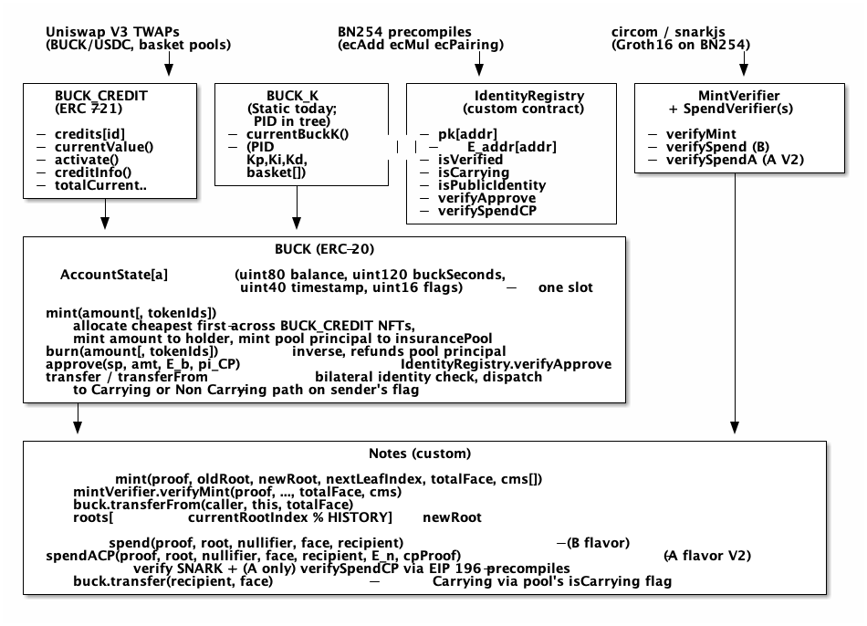

#+title: The Alberta Buck - Ethereum Implementation (DRAFT v0.91)
#+author: Perry Kundert
#+date: 2026-05-06 12:00:00
#+category: Alberta Buck
#+series[]: Alberta-Buck
#+series_order: 9
#+weight: 10
#+draft: false
#+bucky: true
#+math: true
#+description: Ethereum implementation of the Alberta Buck: ERC-721 BUCK_CREDIT for insured-asset NFTs with deterministic depreciation, an identity-bound ERC-20 BUCK with packed-slot per-account state and continuous demurrage, a privacy-preserving IdentityRegistry with PS-credential + ElGamal registration, a Notes commitment pool with Groth16 mint and spend over a Tornado-style incremental Poseidon Merkle tree, and a BUCK_K controller (static today, PID + commodity-basket oracle planned).

#+EXPORT_FILE_NAME: ./images/alberta-buck-ethereum
#+STARTUP: org-startup-with-inline-images inlineimages
#+OPTIONS: ^:nil
#+OPTIONS: toc:nil

#+LATEX_HEADER: \usepackage[margin=1.0in]{geometry}

#+ATTR_LATEX: :width 10cm
[[https://perry.kundert.ca/images/dominion-logo.png]]

#+BEGIN_ABSTRACT
A concrete Ethereum implementation of the [[https://perry.kundert.ca/range/finance/alberta-buck-architecture/][Alberta Buck Architecture]], in five
contracts:

1. *BUCK_CREDIT* (ERC-721) -- one NFT per insured asset, with deterministic depreciation and
   piecemeal client activation.
2. *IdentityRegistry* -- per-address Pointcheval-Sanders credentials and ElGamal-encrypted identity
   points, verified on-chain via the BN254 precompiles.  Trust anchor for every BUCK transfer.
3. *BUCK* (ERC-20) -- identity-bound, single-slot per-account state, continuous demurrage,
   mutual-insurance-pool minting that draws coverage from BUCK_CREDIT NFTs cheapest-first.
4. *Notes* -- privacy-preserving denomination on top of BUCK.  Mint and spend via Groth16 SNARKs over
   a Tornado-style incremental Poseidon Merkle tree.
5. *BUCK_K* -- the value-stabilization factor for credit-limit computation.  A governance-set static
   variant ships today; a PID + commodity-basket-oracle variant is in tree pending live-pool wiring.

This is the first implementation, prioritizing clarity over breadth of standards.  Subsequent
documents will examine ERC-1155, ERC-3643, and ERC-4626 alternatives for individual layers.
#+END_ABSTRACT

#+LATEX: \clearpage
#+TOC: headlines 3

#+LATEX: \clearpage
* Contract Architecture

The five contracts compose into a single transfer pipeline gated on identity.  =IdentityRegistry= is
the trust anchor: =mint=, =approve= and =transfer= all consult it before mutating state.  Every
account /and/ contract that touches BUCK carries an identity binding -- EOAs via =register=,
contracts via =bindContract= -- so bilateral identity-checked transfers always have a verifiable
counterparty on both sides.

#+BEGIN_SRC ditaa :file ./images/buck-eth-layers.png :exports results
     Uniswap V3 TWAPs                BN254 precompiles             circom / snarkjs
     (BUCK/USDC, basket pools)       (ecAdd ecMul ecPairing)       (Groth16 on BN254)
                  |                                 |                            |
                  v                                 v                            v
  +------------------+ +------------------+ +----------------------+ +----------------------+
  |   BUCK_CREDIT    | |     BUCK_K       | |   IdentityRegistry   | |     MintVerifier     |
  |   (ERC-721)      | | (Static today;   | |  (custom contract)   | | + SpendVerifier(s)   |
  |                  | |  PID in tree)    | |                      | |                      |
  | - credits[id]    | | - currentBuckK() | | - pk[addr]           | | - verifyMint         |
  | - currentValue() | | - (PID:           | | - E_addr[addr]      | | - verifySpend (B)    |
  | - activate()     | |   Kp,Ki,Kd,      | | - isVerified         | | - verifySpendA (A V2)|
  | - creditInfo()   | |   basket[])      | | - isCarrying         | +----------+-----------+
  | - totalCurrent.. | +--------+---------+ | - isPublicIdentity   |            |
  +--------+---------+          |           | - verifyApprove      |            |
           |                    |           | - verifySpendCP      |            |
           v                    v           +-----+----------------+            |
  +-----------------------------------------------------------------+           |
  |                          BUCK (ERC-20)                          |           |
  |                                                                 |           |
  |  AccountState[a]: (uint80 balance, uint120 buckSeconds,         |           |
  |                    uint40 timestamp, uint16 flags) -- one slot  |           |
  |                                                                 |           |
  |  mint(amount[, tokenIds]):                                      |           |
  |     allocate cheapest-first across BUCK_CREDIT NFTs,            |           |
  |     mint amount to holder, mint pool principal to insurancePool |           |
  |  burn(amount[, tokenIds]):  inverse, refunds pool principal     |           |
  |  approve(sp, amt, E_b, pi_CP):   IdentityRegistry.verifyApprove |           |
  |  transfer / transferFrom: bilateral identity check, dispatch    |           |
  |     to Carrying or Non-Carrying path on sender's flag           |           |
  +-----+-----------------------------------------------------------+           |
        |                                                                       |
        v                                                                       v
  +---------------------------------------------------------------------------------------+
  |                                    Notes (custom)                                     |
  |                                                                                       |
  |  mint(proof, oldRoot, newRoot, nextLeafIndex, totalFace, cms[]):                      |
  |     mintVerifier.verifyMint(proof, ..., totalFace, cms)                               |
  |     buck.transferFrom(caller, this, totalFace)                                        |
  |     roots[++currentRootIndex % HISTORY] = newRoot                                     |
  |                                                                                       |
  |  spend(proof, root, nullifier, face, recipient):       (B-flavor)                     |
  |  spendACP(proof, root, nullifier, face, recipient, E_n, cpProof):  (A-flavor V2)      |
  |     verify SNARK + (A-only) verifySpendCP via EIP-196 precompiles                     |
  |     buck.transfer(recipient, face)  -- Carrying via pool's isCarrying flag            |
  +---------------------------------------------------------------------------------------+
#+END_SRC

#+RESULTS:

The flow is:

1. An *insurer* mints a =BUCK_CREDIT= NFT for a client's asset, setting face value, depreciation
   schedule, and =premiumRate= (annual basis points of activated coverage).
2. The *client* activates some or all of the credit via =BuckCredit.activate=, exposing the
   activated portion as collateral for =BUCK.mint=.
3. Before touching BUCK, the client =register=s with =IdentityRegistry=, posting a rerandomized PS
   credential and ElGamal-encrypted identity point.  The registry verifies both via BN254
   pairings (~235K gas, paid once per address).
4. =BUCK.mint(amount[, tokenIds])= draws coverage cheapest-first across the client's NFTs,
   delivers exactly =amount= to the client, and mints a /mutual-insurance pool principal/
   (sized at 10x the annual premium on the activated coverage) to =insurancePool=.
5. To send BUCK, the sender =approves= with a Chaum-Pedersen receipt that re-encrypts the
   sender's identity under the spender's public key.  =transfer= / =transferFrom= then bilateral-
   identity-check both sides and emit =BuckTransferReceipt= carrying only ciphertext hashes.
6. To denominate as private notes, the client calls =Notes.mint= with a Groth16 proof binding the
   deposited =totalFace= to a batch of Poseidon commitments.  Holders later call =Notes.spend= or
   =Notes.spendACP= with a fresh nullifier and a SNARK proving inclusion under a recent root.
7. =BUCK_K= ships in a governance-set static form today; the live PID + AMM-pool-oracle variant is
   in tree, pending the BUCK/USDC pool that gives it a process variable to read.

* ERC Standard Choice for BUCK_CREDIT

ERC-721 was the obvious starting point and the choice that ships.  Each credit is genuinely unique
(specific asset, depreciation curve, insured value, premium schedule); =ERC721Enumerable= gives
=BUCK.mint= the =tokenOfOwnerByIndex= it needs to walk a holder's NFTs.  ERC-3643 (T-REX) is a
plausible future move if regulatory KYC becomes a hard requirement; ERC-1155 helps only if
standardized credit /classes/ emerge with shared depreciation parameters; ERC-4626 fits the
=InsurancePool= but not individual credits.  None of those are revisited below -- the rest of the
document specifies the shipped ERC-721 path.

* BUCK_CREDIT: ERC-721 Insured Asset NFT
  :PROPERTIES:
  :CUSTOM_ID: buck-credit
  :END:

Each =BUCK_CREDIT= is an =ERC721Enumerable= token whose per-token =CreditParams= holds the insurer's
current offer and the client's activation state.  Three roles touch it: the *insurer* mints and
updates, the *client* activates, =BUCK= reads the depreciated activated value to size mint
allocations.  All monetary fields are in 6-decimal BUCK-equivalent units (USDC-compatible).

** Data Model

Fields group by mutability:

- *Immutable at mint*: =insurer= (the address allowed to update this token), =assetClass=,
  =createdAt=.
- *Insurer-mutable* via =updateCredit=: =faceValue=, =depreciationFloor=, =depType=, =depRate=,
  =depStartAt=, =premiumRate=, =lastUpdated=.
- *Client-mutable* via =activate=: =activatedValue= (capped at =faceValue=), =lastActivatedAt=.

=DepreciationType= is one of =NONE= (land, gold), =LINEAR= (constant annual reduction), or
=DECLINING_BALANCE= (continuous-compounded percentage).  Three events --
=CreditCreated=, =CreditUpdated=, =CreditActivated= -- record every state change.

** Depreciation Models

=currentValue(tokenId)= is a pure view that branches on =depType=:

- =NONE=: returns the activated face value, unchanged.
- =LINEAR=: loss accrues at =depRate= bp/year on the depreciable portion (=faceValue - floor=),
  clamped at =depreciationFloor=.
- =DECLINING_BALANCE=: discrete whole-year compounding -- the factor =(BP - depRate)/BP= is
  applied once per complete year via a loop capped at 100 years, then a linear interpolation
  bridges the trailing partial year.  No transcendental approximations.

In every case the activated portion depreciates proportionally:
~currentValue = depreciatedFace * activatedValue / faceValue~.

| Asset         | Type              | Rate   | Floor | 30yr value (of $100K) |
|---------------+-------------------+--------+-------+-----------------------|
| Land          | NONE              | --     |    -- | $100,000              |
| House (bldg)  | LINEAR            | 200bp  |   20% | $52,000               |
| Vehicle       | DECLINING_BALANCE | 1500bp |    5% | $5,725                |
| Farm equip    | DECLINING_BALANCE | 1000bp |   10% | $13,815               |
| Gold in vault | NONE              | --     |    -- | $100,000              |

A residential property would typically have two BUCK_CREDITs: one for the land (NONE) and one for
the structure (LINEAR or DECLINING_BALANCE with a salvage floor).

** Activation

The client activates piecemeal via =activate(tokenId, amount)= -- gated on
~ownerOf(tokenId) == msg.sender~ and capped at =faceValue=.  Activation just updates
=activatedValue= and =lastActivatedAt=; the premium for newly activated coverage is collected by
=BUCK.mint= when the client actually draws against it.  The activation step exists so the client
can /reserve/ insurance against the asset without yet minting against it.

=totalCurrentValue(account)= walks =tokenOfOwnerByIndex= and sums =currentValue(tokenId)=.  This is
the single call =BUCK.mint= makes to size the credit limit.  =creditInfo(tokenId)= returns
=(faceValue, activatedValue, premiumRate)= in one tuple for the per-NFT walk inside =BUCK.mint='s
allocator.

** Insurer Updates

=updateCredit(tokenId, newFaceValue, newDepreciationFloor, newDepType, newDepRate,
newDepStartAt, newPremiumRate)= is gated on ~msg.sender == credits[tokenId].insurer~.  If the new
face value is below the current activated amount the contract caps =activatedValue= downward in
the same call.  =assetClass= and =insurer= never change.  Reductions can push a client's
outstanding BUCK above their credit limit; default insurance (held in =insurancePool=) covers the
gap.

* IdentityRegistry: On-Chain Trust Anchor
  :PROPERTIES:
  :CUSTOM_ID: identity-registry
  :END:

The =IdentityRegistry= is the binding between Ethereum addresses and the privacy-preserving
identity machinery described in the companion documents [[https://perry.kundert.ca/range/finance/alberta-buck-identity/][Identity with Anonymity]],
[[https://perry.kundert.ca/range/finance/alberta-buck-identity-example/][Identity Example -- Data Flow]], and [[https://perry.kundert.ca/range/finance/alberta-buck-proofs][Cryptographic Proofs]].
Every BUCK =mint=, =approve= and =transfer= consults this registry; an unregistered address cannot
hold or move BUCKs.

The registry stores per address: =pk[a]= (G_1 identity public key), =E_addr[a]= (ElGamal ciphertext
of the identity point M), =isVerified= (true after PS+NIZK pass on-chain or after =bindContract=),
=isCarrying= (controls Buck's transfer dispatch), and =isPublicIdentity= (true only for contracts
bound with the public-disclosure flag).  Trusted-issuer PS public keys live in
=trustedIssuers[issuerAddr]=, populated by governance.  EOAs always self-register; contracts always
=bindContract=.

** Cryptographic Surface

Three on-chain verifications, all reducible to BN254 precompile calls:

1. *PS signature at registration*: ~e(sigma'_1, X + m * Y) = e(sigma'_2, g_2)~, with =m=
   reconstructed linearly via the binding NIZK in step 2.  ~147K gas.
2. *Schnorr-family NIZK* binding the rerandomized PS signature to the ElGamal ciphertext.  Three
   response scalars, Fiat-Shamir bound to =(sigma', E_new, pk_new, registrant_address)=.
   ~30K gas on top of step 1.  Total registration ~235K, paid once per address.
3. *Chaum-Pedersen NIZK at =approve=*: proves the recipient's identity ciphertext re-encrypts the
   same M registered in =E_alice=.  Fiat-Shamir binds =msg.sender=, =spender=, and =chainid=.
   ~29K gas per counterparty pair.
4. *Chaum-Pedersen DLEQ at A-flavor spend* (=verifySpendCP=): proves the spender holds a single
   =sk_dep= that opens both the note's =E_n= and the registered =E_reg=.  ~36K gas via EIP-196.

** Solidity Surface

=src/IdentityRegistry.sol= uses the =BN254= helper for all curve math:

#+BEGIN_SRC solidity
struct G1Point  { uint256 X; uint256 Y; }
struct G2Point  { uint256[2] X; uint256[2] Y; }

struct ElGamalCT { G1Point R; G1Point C; }      // (R, C) = (r*G, r*pk + M)
struct PSSig     { G1Point sigma_1; G1Point sigma_2; }
struct PSPubKey  { G2Point X; G2Point Y; }

struct RegistrationProof { uint256 e, s_m, s_r; G1Point A_ps, T_C, T_R; }
struct CPProof           { uint256 e, s1, s2;   G1Point T1, T2, T3;     }
struct SpendCPProof      { uint256 e, s;        G1Point T1, T2;         }

function register(address issuer, G1Point pk, ElGamalCT E,
                  PSSig sigma, RegistrationProof proof);
function bindContract(address target, G1Point pk, ElGamalCT E,
                      bool isPublicIdentity_, bool isCarrying);
function trustIssuer(address issuer, PSPubKey ipk);                 // governance
function verifyApprove(address sender, address spender,
                       ElGamalCT E_bob, CPProof pi) view returns (bool);
function verifySpendCP(address spender, address recipient,
                       ElGamalCT E_n, SpendCPProof cpProof) view returns (bool);
function markApproved(address spender);                              // Buck-only
function setBuck(address buck);                                      // governance, one-shot
#+END_SRC

A few non-obvious points:

- =verifyApprove= reads =E_alice= from registry storage so the caller cannot substitute a fake
  credential.
- =bindContract= is permissioned by deployment pattern, not governance: any caller may bind any
  yet-unbound deployed contract.  The intended discipline is operator OPSEC -- either the operator
  is the deployer and uses =BuckAwareDeployer.deployAndBind= for atomic deploy+bind, or the
  operator races to bind a pre-existing contract before anyone else.  Once bound, immutable.
- =markApproved= (called by Buck inside =approve=) freezes the spender's =isCarrying= flag the
  first time anyone successfully approves them, so the carrying flavor a sender consents to cannot
  be retroactively flipped.
- Revocation does not un-register existing accounts; they were verified once and are never
  re-verified.

** Public-Identity Contracts

DeFi infrastructure -- AMM pools, vaults, oracles, the Notes pool -- can't generate Chaum-Pedersen
proofs at =approve= time because the contract has no private key.  Such contracts bind via
~bindContract(target, pk, E, isPublicIdentity_=true, isCarrying=true)~.  Counterparties of a
Public-Identity contract still call the identity-bound =approve= (the always-CP rule applies
regardless of spender flavor), but the receipt-fragment check on the contract side is satisfied by
the deterministic =_identityHash= rather than a per-counterparty CP receipt.  Public-Identity
contracts forfeit content privacy: their identity M is openable on subpoena via the operator's
off-chain attestation.  Encrypted-Identity contract binding (=isPublicIdentity_=false=) is
supported by the surface but not yet used in production.

** Issuer Trust

=trustedIssuers= is the only governance-controlled trust anchor.  Adding an issuer admits a new
origin of registrable identities; removing one stops new registrations under that issuer.  Existing
registrations are unaffected -- they were verified at registration and never re-verified.
Epoch-based credential renewal, key revocation, and issuer rotation are described in
[[https://perry.kundert.ca/range/finance/alberta-buck-identity/#epoch-based-renewal][Identity: Epoch-Based Credential Renewal]].

* BUCK: ERC-20 Token
  :PROPERTIES:
  :CUSTOM_ID: buck-erc20
  :END:

BUCK is an identity-bound ERC-20 with mutual-insurance-pool minting and continuous demurrage.  All
transfer-path state for an account fits in one storage slot, so a transfer is one SSTORE per side.
=mint(N)= delivers exactly =N= BUCK to the holder and simultaneously mints a /pool principal/ to
=insurancePool= sized so that, at the insurer's assumed annual ROI, the principal's investment
yield exactly covers the annual premium on the activated coverage.  =burn(N)= is the inverse.
Every transfer routes through the =IdentityRegistry= and emits =BuckTransferReceipt(from, to,
amount, fromHash, toHash)= -- ciphertext hashes, no plaintext identity on chain.

** Storage Layout

The transfer-path state for an account is one slot:

#+BEGIN_SRC solidity
struct AccountState {
    BuckQty     balance;       // uint80 underlying; ~1.21e24 cap (1.21e18 BUCK at 6 decimals)
    BuckSeconds buckSeconds;   // uint120 underlying; demurrage IOU integral
    uint40      timestamp;     // last crystallisation (safe past year 36800)
    uint16      flags;         // reserved for future per-account flags
}
mapping(address => AccountState) internal _state;
#+END_SRC

Everything outside the hot path (allowances, mint-side limits, per-NFT outstanding allocations,
approve-time receipt fragments) lives in separate maps because they're touched per-mint, not per
transfer.  =BUCK= implements =IERC20= and =IERC20Metadata= directly -- no OpenZeppelin ERC20
inheritance, so the slot layout is explicit and the transfer paths are linear (no =_update=
override re-entry).  Decimals are 6, matching USDC.

** mint(N) and burn(N)

=mint(uint256 amount)= and =mint(uint256 amount, uint256[] calldata tokenIds)= are the two
overloads.  The no-arg form runs an internal cheapest-first selector (insertion sort over the
caller's NFT list -- typically a handful) to minimise premium cost; the second form takes a
caller-supplied order an off-chain optimizer pre-computes against effective rate, depreciation, or
coverage midpoint.

=burn(uint256 amount)= mirrors the overload pair, but the default selector walks the holder's NFTs
*most-expensive-first* -- the dearest insurance is released first, returning the largest pool
principal per BUCK burned and freeing expensive coverage capacity for re-use.  The asymmetry is
not arbitrageable: per-NFT inversion is symmetric (same =denom= on both sides), so a mint-burn
round-trip on the same NFT restores its =mintsBacked= exactly.

The /mutual-insurance pool model/: each NFT carries an annual =premiumRate= in basis points.
Drawing =take= units of coverage from one NFT generates an annual premium of
~take * premiumRate / BP~.  The pool deposit sized to cover that premium at a 10% assumed ROI is
~take * premiumRate * POOL_ROI_INV / BP~ where ~POOL_ROI_INV = 10~.  The insurer keeps any return
above 10% as profit.  Per-NFT inversion -- given a target net delivery =delivery= and rate =r=:

#+BEGIN_SRC text
denom     = BP - r * POOL_ROI_INV               (must be > 0; max effective rate ~1000bp)
take      = ceil(delivery * BP / denom)
principal = take - delivery
#+END_SRC

The allocator walks the NFT list in order, computes per-NFT ~netCap = avail * denom / BP~, and
either fully consumes the NFT (delivery contribution = =netCap=, principal = =take - netCap=) or
partially consumes it via the closed-form inversion to land exactly on =remaining=.

Per-NFT bookkeeping: =mintsBacked[tokenId]= tracks the cumulative outstanding allocation against
each NFT, capped at =activatedValue=.  Burn decrements; mint increments.  A mint-burn round-trip
on the same NFT order is rate-neutral and not arbitrageable -- both sides hit the same =denom=.

The shipped =mint= sequence:

1. =isVerified(msg.sender)= guard.
2. Read =buckCredit.totalCurrentValue(sender) * buckK.currentBuckK() / 1e18=, ratchet
   =storedLimit[sender]= upward only.
3. Early gate: ~_state[sender].balance (raw) + amount <= storedLimit~ -- uses raw balance so that
   accrued demurrage fees do not silently inflate the apparent headroom; =amount= is a lower bound
   on total coverage drawn (since pool principal is non-negative).
4. =_allocateMint(amount, tokenIds)= walks the NFTs cheapest-first (or in caller order), writes
   =mintsBacked=, returns =(totalCoverage, poolPrincipal)=.
5. Tight gate: ~_state[sender].balance (raw) + totalCoverage <= storedLimit~.
6. =_accrueJubilee()=, crystallise the holder, credit =amount= to the holder; if =poolPrincipal >
   0=, crystallise =insurancePool= and credit =poolPrincipal= to it.  =_totalSupply += amount +
   poolPrincipal=.
7. Emit =Transfer(0, sender, amount)=, =Transfer(0, insurancePool, poolPrincipal)=,
   =Minted(sender, totalCoverage, poolPrincipal, creditValue, buckKValue, limit)=.

=burn(amount[, tokenIds])= mirrors the math but with the most-expensive-first default selector:
unwind dearest NFT first, decrement =mintsBacked=, burn =amount= from the holder and
=poolRefund= from =insurancePool=, drop =totalSupply= by =amount + poolRefund=.  =quoteMint= and
=quoteBurn= are read-only views that return =(totalCoverage, poolPrincipal)= or
=(totalUnwind, poolRefund)= for the same allocator math, so an off-chain optimizer can size
required limits and refunds before submitting.

** Identity-Bound approve()

=approve(spender, amount, E_bob, pi_CP)= is mandatory -- the parameterless ERC-20
=approve(address, uint256)= reverts with =BUCK: use identity-bound approve=.  Both =sender= and
=spender= must be =isVerified=.  The CP proof is required regardless of the spender's identity
flavor (Public-Identity or Encrypted): the always-CP rule produces a uniform per-pair audit
record openable on subpoena, and engages the spender's BN254 identity key for forward security
under future identity rotation.  Full rationale in
[[https://perry.kundert.ca/range/finance/alberta-buck-identity/#always-cp-rationale][/Why approve Is Always CP-Bound/]].

On success, ~_receiptFragments[sender][spender] = keccak256(E_bob)~, the standard ERC-20
allowance is written, and =markApproved(spender)= freezes the spender's =isCarrying= flag in the
registry (so the carrying flavor consented to cannot retroactively flip).  Per-pair cost is ~97K
gas (29K CP verify + 46K allowance + 22K receipt SSTORE), paid once.  Subsequent transfers
between the same pair add only the bilateral check and the receipt event (~5K above an
ERC-20-baseline transfer).

** transfer() and transferFrom()

Both route through =_identityCheckedTransfer=, which:

- Requires =isVerified(from)= and =isVerified(to)=.
- For the =to= side: tries =_receiptFragments[from][to]=; if zero, falls back to =_identityHash(to)=
  /only/ if =isPublicIdentity(from) || isPublicIdentity(to)= -- otherwise reverts with
  =BUCK: missing identity receipt=.  EOA-to-EOA Encrypted transfers require a prior CP receipt;
  Public-Identity counterparties may use the deterministic fallback.
- For the =from= side: tries =_receiptFragments[to][from]= (a reciprocal approve); falls back
  unconditionally to =_identityHash(from)= otherwise.  Auditors reading the event know which side
  was CP-bound vs registry-derived.

After identity checks, transfer dispatch is automatic on the sender's =isCarrying= flag: Carrying
senders (AMM pools, the Notes pool, the Jubilee fund) take the =_carryingTransfer= path that
crystallises both sides through now and apportions the sender's live =buckSeconds= proportionally
to the value transferred; Non-Carrying senders take =_nonCarryingTransfer= which just shifts raw
balance after a spendable check on =balanceOf(from)= = ~balance - feeOwing~.  =BuckTransferReceipt(from, to, amount,
fromHash, toHash)= is emitted; ~_identityHash(a) = keccak256(abi.encode(pk, E_addr))~ is
deterministic per account.

** Demurrage and Jubilee
   :PROPERTIES:
   :CUSTOM_ID: demurrage
   :END:

BUCK accrues continuous demurrage to fund a perpetual Jubilee.  Each account's =buckSeconds=
field is the cumulative integral of (raw balance × dt) crystallised at =timestamp=; the live fee
owed is

#+BEGIN_SRC text
feeOwing(a) = (buckSeconds + balance * (now - timestamp)) * BASE_RATE_PER_SEC / SCALE
#+END_SRC

with ~BASE_RATE_PER_YEAR = 0.02~ (2%/year) and ~SCALE = 1e27~.  Visible balance:

- *Non-Carrying* (default for EOAs): ~balanceOf(a) = max(0, balance - feeOwing(a))~.  The locked
  fee stays inside the account's own slot; spendable shrinks over idle periods.
- *Carrying* (AMM pools, Notes, Jubilee, etc.): ~balanceOf(a) = balance~.  The account never
  loses visible balance to demurrage; instead, on every outflow the value-weighted age is folded
  into the recipient's =buckSeconds= so the locked debt rides with the BUCKs.

=_crystallize(a)= folds the time rectangle into =buckSeconds= and bumps =timestamp=; it never
changes balance.  Carrying transfer crystallises both sides through now, apportions
~liveBs * value / raw~ of the sender's live integral to the recipient (where
~liveBs = buckSeconds + raw * (now - timestamp)~), and settles each side in one SSTORE.

The Jubilee is a normal account at =address(this)=, treated as Carrying.  On every mint or burn,
=_accrueJubilee= writes

#+BEGIN_SRC text
_state[address(this)].balance += totalSupply * BASE_RATE_PER_SEC * elapsed / SCALE
#+END_SRC

directly into Jubilee's slot.  =totalSupply= is *not* mutated -- demurrage is internal
redistribution, not minting.  The exact invariant:

#+BEGIN_SRC text
sum_a rawBalanceOf(a) == totalSupply + jubileeActual()
#+END_SRC

Jubilee is the system-wide fee escrow.  Every BUCK has exactly one fee owner: non-Carrying accounts
lock it silently inside their raw balance (=balanceOf = raw - feeOwing=); Carrying accounts (Notes
pool, AMM pools, Jubilee itself) show =balanceOf = raw=, so their fee portion sits in Jubilee
instead.  The =_accrueJubilee= call credits Jubilee at the full =totalSupply= rate, covering
Carrying holdings too.  When Carrying BUCKs flow to a non-Carrying account via =_carryingTransfer=, the recipient absorbs
~liveBs * value / raw~ as extra =buckSeconds=, where =liveBs= is the sender's full live integral
(crystallised history plus the current elapsed rectangle).  Jubilee pre-accrued the full fee at
the =totalSupply= rate; it now debits in exact proportion to the BUCKs transferred, with both
sides settled through the current block.  =JubileeAccrued(delta, newBalance)= surfaces every
accrual.

The Jubilee is the sink that funds default coverage, perpetual-ground-rent disbursement, or a
periodic balance reset -- all governance-driven on-chain disbursement paths land on top of this
single accumulating slot.

* BUCK_K: Value Stabilization Controller
  :PROPERTIES:
  :CUSTOM_ID: buck-k-pid
  :END:

=BUCK_K= supplies the credit-limit multiplier =BUCK.mint= reads to size against
=totalCurrentValue=.  The interface is one function -- =currentBuckK() external view returns
(uint256)= -- so =BUCK= is invariant to which implementation is wired in.  Two implementations
exist in tree: =BuckKControllerStatic= (governance-set constant, currently used in deployments
because BUCK has no AMM-quoted price yet) and =BuckKController= (full PID + commodity-basket-oracle
implementation, used in unit tests with mocked feeds; live-pool wiring is the remaining work).

** Static Variant

=BuckKControllerStatic= holds one =uint256 buckK= (18 decimals, =1e18= = neutral).  Functions:
=currentBuckK()=, =compute()= (no-op), =setBuckK(uint256)= (governance-only),
=transferGovernance(address)=.  This is what =script/Deploy.s.sol= wires into =BUCK= today, so the
identity, demurrage, and Notes layers can be exercised while BUCK_K is held constant.

** PID Variant

=BuckKController= ports the JavaScript PID controller from
[[https://github.com/pjkundert/ownercredit][ownercredit]] to 18-decimal Solidity fixed-point.

| PID Term         | Source                             | Meaning                                          |
|------------------+------------------------------------+--------------------------------------------------|
| Process Variable | BUCK/USDC Uniswap V3 TWAP          | What a BUCK actually trades for                  |
| Setpoint         | Commodity-basket oracle sum        | What a BUCK should be worth                      |
| Error            | Setpoint - Process                 | Positive: BUCK undervalued; negative: overvalued |
| Output (BUCK_K)  | =1e18 + (P*Kp + I*Ki + D*Kd)/1e18= | Credit-limit multiplier (1.0 = neutral)          |

When BUCK trades below basket, BUCK_K rises, expanding credit limits across the system; cheap BUCK
floods out, arbitrageurs buy underpriced commodities, and BUCK price recovers.  The converse
clamps credit when BUCK is overvalued.

The shipped contract holds =int256 Kp, Ki, Kd=, =uint256 dT= (minimum update interval,
~1 hour suggested), =uint256 buckKMin, buckKMax= (output clamps), the BUCK/USDC pool address, the
TWAP interval, and a =basket[]= array of =BasketComponent { feed, weight, feedDecimals }=.
=compute()= short-circuits if =now - lastUpdate < dT=; otherwise it reads basket cost and
BUCK price, runs one PID cycle with anti-windup on the integral term, clamps to =[buckKMin,
buckKMax]=, writes state, and emits =BuckKUpdated=.  =setGains=, =setDT=, =addBasketComponent= are
governance-only.

The =_getBasketCost= and =_getBuckPrice= helpers use Uniswap V3's
=OracleLibrary.consult(pool, twapInterval)= to convert tickCumulative deltas into 18-decimal
prices, with per-pool decimal normalisation.  The targeted *interim* basket is AMM-pool-quoted
(PAXG/USDC for gold, tokenised wheat/USDC, REIT/USDC, and a USD anchor weight) rather than
Chainlink-fed -- AMM pools are self-sovereign and don't add an external trust dependency before
BUCK has its own price-discovery surface.  Switching to Chainlink later is a per-component
configuration change, not a contract change.

** Tuning

| Gain | Effect of increasing                  | Risk                           |
|------+---------------------------------------+--------------------------------|
| Kp   | Faster response to deviations         | Oscillation, over-correction   |
| Ki   | Eliminates steady-state error         | Integral windup, slow recovery |
| Kd   | Damps oscillation, anticipates trends | Noise amplification            |

Initial gains should be conservative (high Kd relative to Kp, low Ki).  =dT= acts as a coarse
damper: at 1 hour, BUCK_K updates at most once per hour regardless of mint frequency.  TWAP
interval (suggested 30 minutes) is the manipulation-resistance knob -- an attacker would need to
sustain a price manipulation for the full TWAP window to meaningfully move BUCK_K, which is
prohibitively expensive on a deep pool.

A future enhancement is on-chain gain scheduling: maintain a rolling variance of the error signal
and rotate between conservative and responsive gain sets at regime boundaries.  This maps directly
to the =PIDController.reset()= hot-swap pattern in the JavaScript reference.

* Notes: Privacy-Preserving Denomination
  :PROPERTIES:
  :CUSTOM_ID: notes
  :END:

BUCK transfers carry a public =(from, to, amount)= quartet.  Notes lift values, flavours, and
identity bindings off the public ledger by escrowing BUCK in a commitment pool: holders post
Poseidon-hash commitments via a Groth16 mint, then redeem any commitment later via a second
Groth16 spend with a fresh nullifier.  The contract's public state is just a list of opaque 32-byte
commitments, a 30-slot recent-roots ring buffer, a nullifier set, and a running face-value total.
Full design in [[https://perry.kundert.ca/range/finance/alberta-buck-notes/][Notes]] and [[https://perry.kundert.ca/range/finance/alberta-buck-proofs/][Proofs]]; this section documents the Ethereum surface only.

** Mint Circuit (Batch, In-Circuit Merkle Insertion)

=circuits/mint_batch.circom= is a parameterised batch-mint circuit.  Each pinned size N
(specialised at N \in {1, 2, 4, 8, 16, 32}, with the smaller sizes useful for unit tests and small
wallet flows) produces its own =MintBatchN*Groth16Verifier.sol=.  The shipped =Notes= contract holds a single
=mintVerifier= adapter; per-N dispatch lives inside the adapter (a single =IMintVerifier= chooses
the right pinned verifier by =cms.length=).  Public-signals arity is 5 regardless of N:

| Signal          | Description                                                             |
|-----------------+-------------------------------------------------------------------------|
| =oldRoot=       | Live note Merkle root the prover read from chain                        |
| =newRoot=       | Root after folding =cm[0..N-1]= starting at =nextLeafIndex=             |
| =nextLeafIndex= | Live tree size the prover read from chain                               |
| =totalFace=     | Sum of note values, range-bounded to 128 bits                           |
| =cmBatchHash=   | =keccak256(abi.encodePacked(cm[0..N-1]))= -- ties calldata to the SNARK |

Per leaf, the circuit enforces a Poseidon-5 commitment opening
~cm_i === Poseidon(flavor_i, v_i, rho_i, idHash_i, predicate_i)~, =Num2Bits(128)= range bounds on
=v[i]= and =totalFace= (closing field-overflow attacks), one sum check ~totalFace === sum v[i]~,
and an N x TREE_DEPTH Poseidon-2 dual Merkle walk: =priorWalk= consumes =ZERO_VALUE= at the
insertion slot to attest =oldRoot=, =postWalk= consumes =cm[i]= to advance =rollingRoot= to
=newRoot=.  Both walks share prover-supplied siblings.  A keccak hash check binds =cmBatchHash=
to the per-leaf commitments.  ~6K R1CS per leaf (~1.7K opening + ~4.3K insertion).

Verifier bytecode sizes: 14.5 KB at N=16, 20.8 KB at N=32 -- both under the EIP-170 24 KB ceiling.
Per-mint gas: 461K at N=1 (constant ~216K Groth16 verifier dominates), 624K at N=16
(~39K/leaf -- the shipped sweet-spot), 1.12M at N=32.  Asymptotic per-leaf cost is ~31K.
Promotion to N >= 64 needs one of the three escape hatches in
[[https://perry.kundert.ca/images/alberta-buck-notes-rollup-mint.pdf][alberta-buck-notes-rollup-mint.org]] (calldata-IC hash-pinned, sharded SSTORE2, plain SLOAD), with
calldata-IC the natural fit for the Holochain wallet.

The trusted setup in =scripts/snark/setup.sh= uses a fixed dev-only entropy string.  Production
would run a multi-party ceremony per pinned N; the script is the scaffolding.

** Spend Circuits (B-flavor, A-flavor V2)

=circuits/spend.circom= proves redemption of a single B-shape note under an on-chain Merkle root.
Public inputs =[noteRoot, nullifier, face, recipient, chainId]=; private witness
=(flavor, v, rho, idHash, predicate, pathElements[20], pathIndices[20])=.  Constraint groups:
=Num2Bits(128)= on =face= and =v=, ~cm === Poseidon-5(flavor, v, rho, idHash, predicate)~,
Tornado-style depth-20 Merkle inclusion under =noteRoot=, B-tag nullifier
~Poseidon-3(rho, idHash, 4242)~, and value conservation ~face * 1 === v * 1~ with a quadratic
anchor.  ~12,000 R1CS.  =SpendGroth16Verifier= takes the 5-element public-signals tuple;
=SpendVerifierAdapter= presents the narrow =ISpendVerifier=.

=circuits/spend_a.circom= V2 is the A-flavor (identity-bound) sibling.  Public inputs grow to
=[noteRoot, nullifier, face, recipient, chainId, E_n.R.x, E_n.R.y, E_n.C.x, E_n.C.y]= (9 total).
Adds the A-tag nullifier ~Poseidon-3(rho, idHash, 4243)~, a flavor-in-{1,2} gate, and an
in-circuit Poseidon-8 binding gate ~Poseidon-8(E_n, issuerData) === idHash~ (~265 R1CS) that pins
the publicly-revealed =E_n= to the leaf at mint time.  Total ~13,300 R1CS.

The cryptographic identity gate -- proving the spender holds a single =sk_dep= that opens both
=E_n= and the registered =E_reg= -- lives in =IdentityRegistry.verifySpendCP= rather than the
circuit.  In-circuit BN254 G1 arithmetic over the BN254 scalar field would have cost +250K R1CS
per group operation; off-chain CP-DLEQ verified via EIP-196 precompiles costs ~36K gas instead.
=Notes.spendACP= calls the Groth16 verifier and =verifySpendCP= atomically; both must succeed.
The DLEQ is a 4-element Sigma proof:

#+begin_quote
Prover picks =t in Fr=, computes ~T1 = t*G~, ~T2 = t*(R_reg - R_n)~.
Challenge: ~e = H(R_n, R_reg, C_n, C_reg, pk_dep, T1, T2, recipient, chainid)~.
Response:  ~s = t + e*sk_dep~.
Proof:     =(e, s, T1, T2)= -- 4 field elements, ~36K gas to verify on-chain.
#+end_quote

The invariant the two layers together enforce: A-note loss-recovery via identity re-issuance is
impossible by design.  =sk_rec= must be backed up like a hardware-wallet seed; loss is terminal.
Companion documents [[https://perry.kundert.ca/range/finance/alberta-buck-notes/][Notes]] and
[[https://perry.kundert.ca/range/finance/alberta-buck-notes-flow/][Notes Flow]] document the wallet-side implications.

** Verifier Interfaces

=Notes= is decoupled from the SNARK toolchain via narrow interfaces:

#+BEGIN_SRC solidity
interface IMintVerifier {
    function verifyMint(bytes proof, uint256 oldRoot, uint256 newRoot,
                        uint256 nextLeafIndex, uint256 totalFace,
                        uint256[] calldata cms) external view returns (bool);
}
interface ISpendVerifier {
    function verifySpend(bytes proof, uint256 root, uint256 nullifier,
                         uint256 face, address recipient, uint256 chainId)
        external view returns (bool);
}
interface ISpendAVerifier {
    function verifySpendA(bytes proof, uint256 root, uint256 nullifier,
                          uint256 face, address recipient, uint256 chainId,
                          uint256 enRx, uint256 enRy, uint256 enCx, uint256 enCy)
        external view returns (bool);
}
#+END_SRC

Stub implementations (=StubMintVerifier= / =StubSpendVerifier=) ship for unit tests that exercise
state transitions unrelated to the SNARK.  The production =Adapter= contracts decode the proof as
=(uint256[2], uint256[2][2], uint256[2])=, build the public-signals tuple, and forward to the
snarkjs-generated Groth16 verifier.  =mintVerifier= is a singleton =IMintVerifier= adapter that internally dispatches by =cms.length= to
the correct pinned =MintBatchN*Groth16Verifier=; spend verifiers are likewise singletons.  Swapping
any of them is a single governance call.

** Notes Contract

=src/Notes.sol= is constructed with =(buck, mintVerifier, spendVerifier, governance)=.  The
A-flavor spend verifier and the identity registry are wired post-construction via governance
setters (=setSpendAVerifier=, =setIdentityRegistry=); until both are set, =spendACP= reverts with
=Notes: A-spend disabled= or =Notes: identity registry not set=.  Its state is intentionally lean
-- per-leaf insertion math now lives in the SNARK:

- *Verifier handles*: singleton =mintVerifier= (the adapter that dispatches by batch size),
  singletons =spendVerifier= for B-spend and =spendAVerifier= for A-spend, plus the
  =identityRegistry= used by =spendACP= for =verifySpendCP=.  All swappable by governance.
- *Audit / double-spend state*: =mapping(uint256 => bool) nullifiers=, =uint256 noteFaceSum=.
- *Tree state*: =uint32 nextLeafIndex= and =uint256[ROOT_HISTORY_SIZE=30] roots= with
  =uint8 currentRootIndex=.  =filledSubtrees=, =zeros[]=, and per-cm uniqueness checks are gone --
  duplicate openings are economically self-punishing via the deterministic nullifier
  (one spend nullifies every copy of the same opening; the duplicator forfeits their mint).

=mint(proof, oldRoot, newRoot, nextLeafIndex, totalFace, cms)= asserts =cms.length > 0=, checks
~oldRoot == roots[currentRootIndex]~ and ~nextLeafIndex == self.nextLeafIndex~ (stale-state
guards), field-bounds each =cms[i]= against =FIELD_R=, dispatches to =mintVerifier= (which forwards
to the per-N pinned Groth16 verifier internally), pulls =totalFace=
BUCK via =transferFrom(caller, this, totalFace)=, writes =newRoot= into the ring buffer at
=(currentRootIndex + 1) % ROOT_HISTORY_SIZE=, advances =nextLeafIndex= by =cms.length=, bumps
=noteFaceSum= by =totalFace=, and emits =Minted(issuer, totalFace, startIndex, count, newRoot)=.
Per-leaf =Appended= events are gone; the commitments live in calldata for off-chain replayers.

=spend(proof, root, nullifier, face, recipient)= (B-flavor) requires ~recipient != 0~,
~face > 0~, =isAcceptedRoot(root)= (root in the recent-roots window), and ~!nullifiers[nullifier]~.
Forwards to =spendVerifier=, marks the nullifier burned, decrements =noteFaceSum=, and calls
=buck.transfer(recipient, face)=.  Because the Notes pool is bound under the Carrying flag,
=buck.transfer= dispatches to the carrying path automatically -- the recipient absorbs the pool's
average demurrage age via =buckSeconds=, preserving the SNARK's ~face === v~ invariant at the
ERC-20 boundary.  =Spent(nullifier, face, recipient)= closes the spend.

=spendACP(proof, root, nullifier, face, recipient, E_n, cpProof)= (A-flavor) is identical except
it also calls =identityRegistry.verifySpendCP(msg.sender, recipient, E_n, cpProof)= atomically;
both verifications must succeed.

* End-to-End Walkthrough
  :PROPERTIES:
  :CUSTOM_ID: walkthrough
  :END:

Alice owns a $500K Calgary home (land $200K, structure $300K).  Two insurers (LandCo, HomeCo) have
issued =BUCK_CREDIT= NFTs; HomeCo's structure credit depreciates LINEAR at 200bp/yr.  After 3
years and partial activation, Alice's collateral and effective coverage:

| Token | Insurer | Face Value | Depreciation          | Activated | Current Value | Premium Rate |
|-------+---------+------------+-----------------------+-----------+---------------+--------------|
| #42   | LandCo  | 200,000    | NONE                  | 200,000   | 200,000       | 50bp         |
| #43   | HomeCo  | 300,000    | LINEAR, 200bp, 20% fl | 150,000   | 141,000       | 200bp        |
|-------+---------+------------+-----------------------+-----------+---------------+--------------|
| Total |         |            |                       |           | 341,000       |              |

** Step 0: Identity Registration (One-Time)

Alice obtains a PS-signed credential off-chain from a trusted issuer (the Alberta government, ATB
Financial, etc.), rerandomizes it, generates a fresh ElGamal key pair, encrypts her identity point
~M = m·G~ under her public key, and produces the Schnorr-family NIZK binding the rerandomized
sigma to the ciphertext.  =IdentityRegistry.register(issuer, pk, E, sigma', proof)= verifies both
via BN254 precompiles in about 235K gas.  After this call ~isVerified[alice] = true~ and Alice can
touch BUCK.  She repeats steps 2-3 for every Ethereum account she controls; the issuer never sees
those accounts.

** Step 1: Mint

Alice calls =BUCK.mint(50_000e6)= -- the no-arg form, so the built-in selector sorts her NFTs by
=premiumRate= ascending: LandCo (50bp) first, then HomeCo (200bp).  At ~BUCK_K = 1e18~:

1. ~totalCurrentValue = 341,000e6~, ~maxLimit = 341,000e6~.  Alice's existing balance is
   280,000e6, so the early gate (~280k + 50k <= 341k~) passes.
2. The allocator walks NFT #42: ~denom = 10000 - 50*10 = 9500~, ~avail = 200,000e6 - mintsBacked[#42]~.
   Suppose this is Alice's first mint; ~avail = 200,000e6~, ~netCap = 190,000e6~.  ~netCap >= 50,000e6~,
   so the partial-fill closed form fires: ~take = ceil(50_000e6 * 10000 / 9500) = 52,631,579~,
   ~principal = take - 50_000e6 = 2,631,579~.  =mintsBacked[#42] += 52,631,579=.
3. Tight gate: ~280,000e6 + 52,631,579 <= 341,000e6~ -- passes.
4. Alice receives exactly 50,000e6.  =insurancePool= receives 2,631,579 (the 10x principal whose
   10% ROI funds the 0.50% annual premium on the activated coverage).
5. =Minted(alice, 52,631,579, 2,631,579, 341,000e6, 1e18, 341,000e6)=, plus standard =Transfer=
   events.

** Step 2: Approve Bob (Identity Handshake)

Alice's wallet reads Bob's =pk_bob= from =IdentityRegistry=, decrypts =E_alice= (it knows
=sk_alice=) to recover M, and re-encrypts under =pk_bob= with fresh randomness as
~E_bob = (r_b·G, r_b·pk_bob + M)~.  It produces a Chaum-Pedersen NIZK
~pi_CP = (e, s_1, s_2)~ proving =E_bob= encrypts the same M registered in =E_alice=, with
Fiat-Shamir bound to ~msg.sender = alice~, ~spender = bob~, =chainid=.

=BUCK.approve(bob, 10_000e6, E_bob, pi_CP)= verifies both parties are =isVerified=, runs
=IdentityRegistry.verifyApprove= (~29K gas), stores ~_receiptFragments[alice][bob] =
keccak256(E_bob)~, calls =markApproved(bob)= to freeze his =isCarrying= flag, and writes the
ERC-20 allowance.

Off-chain (e.g. via Holochain), Alice delivers the matching =identity_data= and =E_bob=
ciphertext to Bob's wallet.  Bob decrypts to recover M' and asserts ~H(identity_data) * G ===
M'~ -- the two-channel binding from the Identity document.

** Step 3: Bob Pulls the Transfer

=BUCK.transferFrom(alice, bob, 10_000e6)= debits the allowance, runs =_identityCheckedTransfer=
(both parties verified, =_receiptFragments[alice][bob] != 0=), and dispatches to the
Non-Carrying path (Alice is not Carrying).  Tokens move; =BuckTransferReceipt(alice, bob,
10_000e6, fromHash, toHash)= is emitted.  An auditor with subpoena power over either Alice or
Bob can recover the underlying identities; an outside observer learns only that addresses Alice
and Bob exchanged 10,000e6.

** Step 4: Alice Denominates as Notes

Alice picks flavour A2 and values =[100e6, 25e6]= (totalFace 125e6).  Her wallet pads the live
pair with 14 dummies (=v=0=) so the batch lands on the smallest pinned circuit (N=16),
snapshots =(oldRoot, nextLeafIndex)= from chain, derives the depth-20 sibling paths in
submission order, and runs =snarkjs groth16 fullProve= against
=build/snark/mint_batch_n16/mint.wasm= and =mint_final.zkey=.  The proof triple is abi-encoded
into =proofBytes=.

On-chain:

1. =BUCK.approve(notes, 125e6, E_notes, pi_CP_notes)= -- the always-CP rule applies even though
   Notes is bound under a Public Identity.  The receipt fragment is openable on subpoena.
2. =Notes.mint(proofBytes, oldRoot, newRoot, nextLeafIndex, 125e6, [cm[0]..cm[15]])= -- the
   adapter dispatches internally by =cms.length=16= to its pinned =MintBatch16= Groth16 verifier.
   On success, 125e6 BUCK moves
   from Alice to Notes, =roots[]= advances to the SNARK-attested =newRoot=, =nextLeafIndex=
   advances by 16, =noteFaceSum += 125e6=.  Alice keeps the live openings privately; the dummies
   are discarded.

** Step 5: Spend a Note

Later, the holder of one of Alice's notes (Alice herself, or a bearer she off-chain handed the
opening to) redeems =cm[0]= for 100 BUCK to =recipient=:

1. The wallet reconstructs =(pathElements[20], pathIndices[20])= for =cm[0]= by replaying the
   =Minted= event log and pulling =cms[]= from each batch's calldata.
2. =snarkjs groth16 fullProve= against =spend.wasm= / =spend_final.zkey= produces a proof
   binding =[currentRoot, Poseidon-3(rho, idHash, 4242), 100e6, recipient, 1]= to the witness.
3. =Notes.spend(proofBytes, currentRoot, nullifier, 100e6, recipient)= -- the contract checks
   the root window, rejects a previously-seen nullifier, runs the adapter (~360K gas total),
   marks the nullifier burned, decrements =noteFaceSum=, and calls =buck.transfer(recipient,
   100e6)=.  Notes is bound Carrying, so the transfer dispatches to the carrying path
   automatically: the recipient receives the full 100e6 and absorbs an amount-weighted share of
   the pool's average demurrage age via =buckSeconds=.

If HomeCo later reappraises the structure at $280K, Alice's effective collateral drops
correspondingly.  If her outstanding BUCK exceeds the new limit, the InsurancePool covers the gap
on documented default events; the Jubilee accumulator is the long-horizon backstop.

* Gas Cost Snapshot

Approximate gas costs from the current Foundry suite (Solidity 0.8.31, optimizer on).  PID and
oracle figures are estimates against unwritten oracle wiring.

| Operation                                      | Gas (approx) | At 30 gwei | Notes                                    |
|------------------------------------------------+--------------+------------+------------------------------------------|
| BUCK_CREDIT.activate()                         | ~50K         | ~$4        | Single SSTORE + event                    |
| BUCK_CREDIT.updateCredit()                     | ~80K         | ~$6        | Multiple SSTOREs (insurer pays)          |
| IdentityRegistry.register()                    | ~235K        | ~$19       | PS pairing + NIZK (one-time)             |
| IdentityRegistry.verifyApprove                 | ~29K         | ~$2        | CP proof, per counterparty pair          |
| IdentityRegistry.verifySpendCP                 | ~36K         | ~$3        | CP-DLEQ via EIP-196 (A-flavor spend)     |
| BUCK.approve() (identity)                      | ~97K         | ~$8        | 29K CP + 46K allowance + 22K SSTORE      |
| BUCK.transfer / transferFrom                   | ~80K         | ~$6        | Identity check + receipt + 1 SSTORE/side |
| BUCK.mint() (static BUCK_K, 1 NFT)             | ~150K        | ~$12       | NFT walk + allocator + Jubilee accrual   |
| BUCK.mint() (static BUCK_K, 2-NFT spillover)   | ~210K        | ~$17       | + second NFT crystallise                 |
| BUCK.burn() (1 NFT)                            | ~120K        | ~$10       | Mirror of mint, no limit ratchet         |
| BUCK.mint() (with PID update)                  | ~350K        | ~$28       | + oracle reads + PID computation         |
| Notes.mint (mint_batch, N=1)                   | ~461K        | ~$37       | Groth16 verify (~216K) + insert          |
| Notes.mint (mint_batch, N=16)                  | ~624K        | ~$50       | ~39K/leaf -- shipped sweet-spot          |
| Notes.mint (mint_batch, N=32)                  | ~1.12M       | ~$90       | ~35K/leaf (verifier ~422K)               |
| Notes.spend (Groth16, B-shape)                 | ~360K        | ~$29       | Groth16 verify + Carrying transfer       |
| Notes.spendACP (Groth16 + CP-DLEQ, A-shape)    | ~410K        | ~$33       | + verifySpendCP (~36K) via EIP-196       |
| BUCK_CREDIT.currentValue / BUCK_K.currentBuckK | 0            | Free       | View                                     |

The PID update cost is amortised across all mints within a =dT= window (1-hour suggested) -- only
the first mint after each window pays for the oracle reads and computation.  The same contracts
deploy on EVM L2s (Arbitrum, Optimism, Base) where gas is 10-100x cheaper.

* Security Considerations

** Oracle Manipulation

BUCK/USDC and basket prices use Uniswap V3 TWAPs (30+ minutes), so manipulation requires
sustained capital commitment proportional to pool depth.  When/if Chainlink basket feeds are
adopted later, =_getBasketCost= must verify =updatedAt= is within an acceptable window (~1 hour)
and revert if stale.

** Credit Enumeration DoS

A malicious user could mint many tiny BUCK_CREDITs to make =totalCurrentValue= and the
cheapest-first allocator gas-prohibitive.  Mitigations: minimum face value at credit creation, a
cap on credits per account (e.g. 20), or off-chain aggregation with Merkle proof.  None are wired
in yet -- the relevant test suites cap NFT counts at small N.

** Insurer Trust

The insurer can reduce =faceValue= at any time, potentially pushing accounts into default.  This
is by design -- it reflects real-world reappraisal risk.  The InsurancePool covers default events;
governance can blacklist abusive insurers; multi-insurer market discipline is the natural check.
Time-locks on insurer updates (e.g. 7-day delay for reductions > 20%) are a future enhancement.

** Reentrancy

All state changes occur before external calls in =BUCK.mint=, =BUCK.burn=, and =Notes.mint /
spend / spendACP=.  Identity verification is the first guard in every transfer; =mintsBacked= is
written before the user-facing =_mint=.  =BuckCredit.activate= is a leaf operation.  No
=ReentrancyGuard= is currently wired -- the design relies on checks-effects-interactions
discipline; adding a guard before mainnet is a one-line change if review insists.

** Pool Solvency

=insurancePool= holds the cumulative pool principal for every outstanding mint.  Burn requires
the pool's spendable balance to cover the proportional refund; if the pool is drained out-of-band
the burn reverts.  Today no path drains the pool: it is not a verified identity (so no
identity-checked transfer can move BUCK out of it) and holds no NFTs (so it cannot self-burn via
the allocator).  Adding governance-controlled disbursement requires explicit accounting of how
the pool's invariant (~poolBalance >= sum of all outstanding mint principals~) is preserved.

* Future Directions
  :PROPERTIES:
  :CUSTOM_ID: future
  :END:

This implementation prioritises clarity and correctness; alternatives the architecture document
flags for later study:

- *ERC-1155 batch credits* if standardised credit /classes/ emerge (e.g. "Calgary residential,
  HomeCo, LINEAR 200bp"), enabling =safeBatchTransferFrom= for portfolio management and reduced
  gas for accounts holding many same-class credits.  Per-token depreciation start dates partially
  negate the fungibility benefit, so applicability depends on the secondary market.
- *ERC-3643 (T-REX)* if regulatory KYC compliance becomes a deployment requirement.  Native
  ONCHAINID, programmable transfer restrictions, agent-role granularity, and lost-key recovery via
  identity verification.  This is the likely production standard if Alberta deploys BUCK under
  provincial regulation.
- *ERC-4626 InsurancePool* -- a vault-shaped wrapping of the existing =insurancePool= address, so
  pool deposits become standardised mutual-insurance shares with =deposit= / =shares= / yield
  composability.  Mechanical layer on top of the current single-address pool.
- *L2 deployment*.  The contracts are EVM-compatible and deploy on Arbitrum, Optimism, Base, or
  Polygon with no changes.  Cross-chain BUCK via canonical bridges or LayerZero/Axelar would
  enable multi-chain liquidity while keeping a single BUCK_K oracle on the settlement layer.
- *Coverage-ratio premium*.  The current per-NFT =premiumRate= is flat.  A loss-layer-style
  effective-rate derivation -- ~rate(V, A, D) = lambda * coverage * (1 - D/V)^2 / 2~ under uniform
  loss -- would price closer-to-full-coverage activations more aggressively, which matches
  actuarial intuition for parametric insurance with deductibles.  The allocator's sort key would
  move from raw =premiumRate= to a midpoint-evaluated effective rate; everything else carries
  through.
- *Recursive SNARKs above N=512*.  Mint batches above N=64 hit the EIP-170 24 KB bytecode ceiling
  on stock Groth16 verifiers.  Calldata-IC delivery (hash-pinned) buys headroom to N=128 or 256;
  Nova / Halo2 / Plonky3 recursion is the natural fix above N=512.

* Status

Current Foundry suite: 247 unit tests pass across 13 suites; one =BuckKControllerForkTest=
requires a live mainnet RPC and is skipped offline.  The shipped surface covers all five
contracts in tree (=BuckCredit=, =IdentityRegistry=, =Buck=, =BuckKControllerStatic= +
=BuckKController=, =Notes=) plus the SNARK toolchain (=mint_batch.circom= at pinned
N \in {1, 2, 4, 8, 16, 32}, =spend.circom=, =spend_a.circom= V2) and a Python reference wallet
(=alberta_buck.wallet=) that emits canonical test vectors the Solidity tests load via
=vm.readFile=.

Outstanding work tracked in companion memos:

- *Live BUCK_K oracles* -- =BuckKController= is in tree with PID structure and mocked-feed unit
  tests; wiring AMM-pool oracles for the basket components and the BUCK/USDC pool (the process
  variable) is the remaining work.  Depends on a BUCK/USDC pool existing, which is a chicken-and-
  egg with treasury minting.
- *Serialised B1 sub-notes* (=spend_serialized.circom= + per-parent bitmap) -- design validated
  end-to-end by =scripts/snark/serialized_notes_poc.py= at N_fam in {256, 1024, 4096}; circuit
  port and contract bitmap support are the implementation gap.  See
  [[https://perry.kundert.ca/images/alberta-buck-notes-serialized.pdf][alberta-buck-notes-serialized.org]].
- *Production trusted-setup ceremony* -- replace dev entropy in =scripts/snark/setup.sh= with a
  multi-party ceremony per pinned circuit before mainnet.

The cryptographic surface is described by an executable Python reference; CI regenerates the
canonical JSON test vectors and =git diff --exit-code='s them against committed copies, so any
drift between the spec, the wallet, and the Solidity tells us immediately which of the three is
wrong.  No =vm.ffi= shells out to Python at test time -- the wallet emits vectors once, the
Solidity reads them many times.
