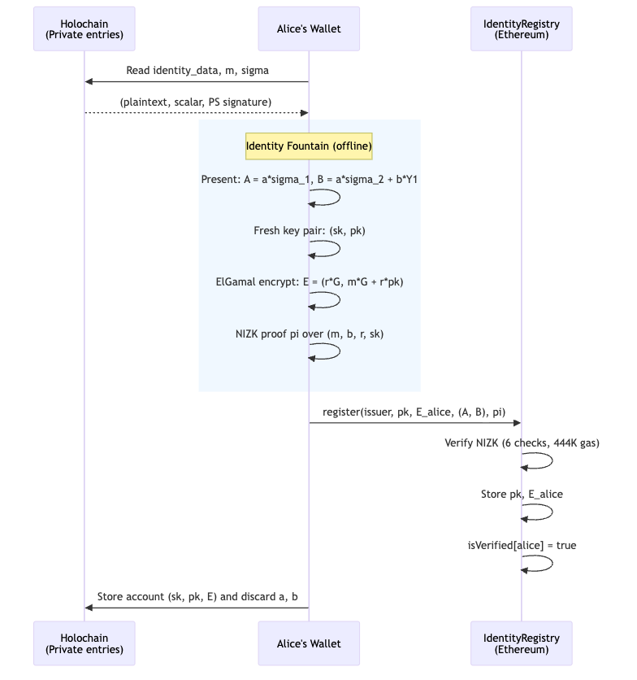
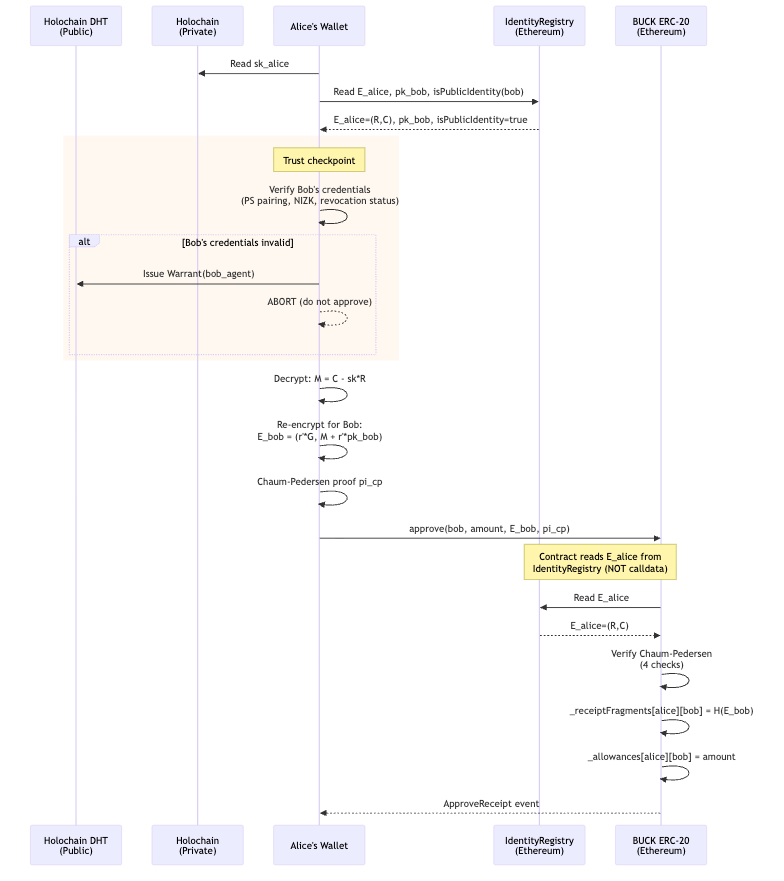
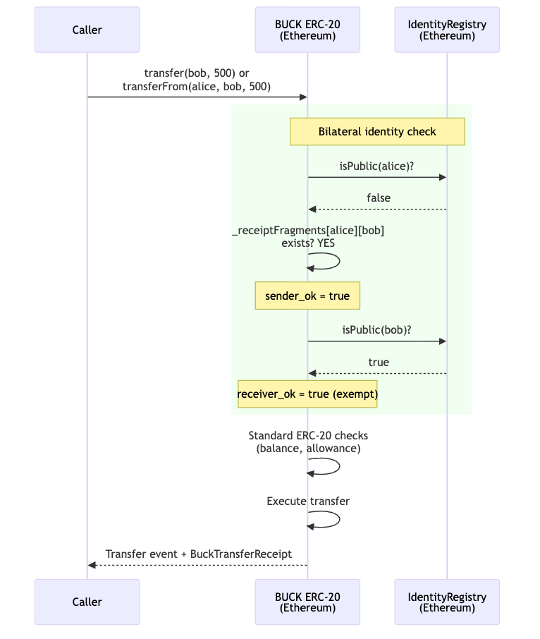
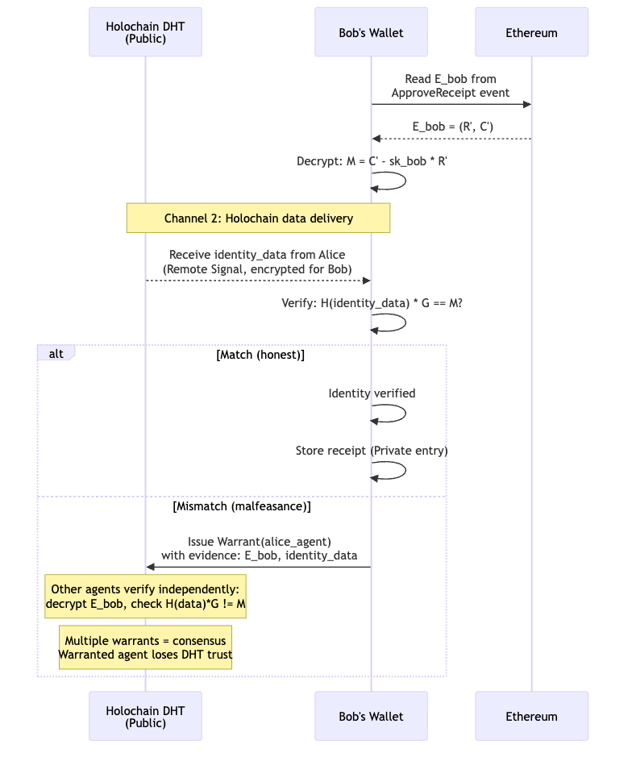
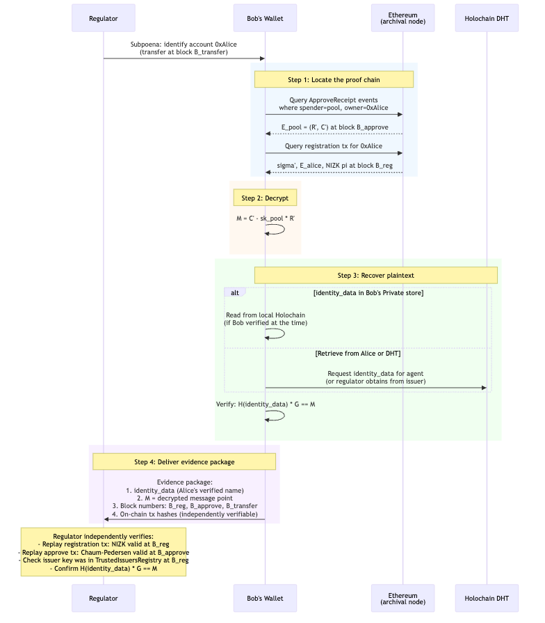

# Copyright (c) 2026 Perry Kundert.  All rights reserved.
#
# This document is NOT covered by the source-code licences in
# LICENSING.md.  The code is free software; the design writing is not
# (yet) placed under an open licence -- see LICENSING.md, "Design
# documents".  "Alberta Buck" is a mark: see TRADEMARKS.md.
#
# SPDX-License-Identifier: LicenseRef-AllRightsReserved
#+TITLE: The Alberta Buck - Identity - Cryptography Example (v1.0)
#+author: Perry Kundert
#+date: 2026-04-10
#+category: Alberta Buck
#+series[]: Alberta-Buck
#+series_order: 14
#+weight: 15
#+draft: false
#+bucky: true
#+math: true
#+description: Cryptography examples and data flow analysis of the Alberta Buck identity system on BN254: PS signatures, ElGamal encryption, NIZK registration proofs, Chaum-Pedersen re-encryption, two-channel verification, and the AMM pool regulatory compliance model -- with counter-examples demonstrating each failure mode, and mermaid diagrams showing where data resides across Ethereum, Holochain, and the local wallet at each step.

#+LATEX_HEADER: \usepackage[margin=1.0in]{geometry}

#+EXPORT_FILE_NAME: ./images/alberta-buck-identity-example
#+STARTUP: org-startup-with-inline-images inlineimages
#+STARTUP: org-latex-tables-centered nil
#+OPTIONS: ^:nil # Disable sub/superscripting with bare _; _{...} still works
#+OPTIONS: toc:nil

#+PROPERTY: header-args:mermaid :exports results :results output
#+PROPERTY: header-args:python :session abid :exports both :results output table

#+ATTR_LATEX: :width 10cm
[[https://perry.kundert.ca/images/dominion-logo.png]]

#+BEGIN_ABSTRACT
This document has two parts.  First, a data flow analysis shows where each
piece of identity data resides -- Ethereum contract storage, Holochain DHT, or
local wallet -- at each step of the protocol, using mermaid sequence diagrams
to trace registration, approval, transfer, and regulatory compliance flows.
Second, a complete worked cryptographic example implements every step in Python
on the alt_bn128 (BN254) curve -- executing on the compiled =buck-identity=
production kernel (=buck_core.buck_identity=, arkworks-backed) through the
=alberta_buck.wallet= primitives, with the pure-Python =py_ecc= path retained
as the executable specification -- with counter-examples
demonstrating what each verification check looks like when it fails.

The scenario is a transfer from Private Alice to Public Bob (an AMM pool).
Alice obtains a Pointcheval-Sanders signed identity from an issuer, derives a
hiding presentation of it via the Identity Fountain, registers it on-chain
(443,892 gas measured for the NIZK verification), and re-encrypts her identity
for Bob with a Chaum-Pedersen proof of correct re-encryption.  Bob verifies
Alice's identity using the two-channel design: the on-chain ElGamal ciphertext
provides cryptographic binding, while Holochain delivers the plaintext
=identity_data=.  The AMM pool scenario demonstrates how this proof chain
protects Bob under subpoena -- even 18 months and 500,000 transactions
later -- and why Alice cannot hide
from regulatory recovery despite the presentation's hiding of her identity
from everyone but her counterparties.  The presentation is the A' design
implemented on branch =feature/a-prime=; its security argument awaits
independent review. ([[https://perry.kundert.ca/images/alberta-buck-identity-example.pdf][PDF]], [[https://perry.kundert.ca/images/alberta-buck-identity-example.txt][Text]])
#+END_ABSTRACT

#+LATEX: \clearpage
#+TOC: headlines 2

#+LATEX: \clearpage
* Data Flow: Where Everything Lives

  The Alberta Buck identity system spans two networks (Ethereum and
  Holochain) and a local device (the wallet).  The tables and mermaid
  sequence diagrams below map every piece of identity data to its
  storage location, visibility, and the protocol step that consumes it
  -- tracing flows through registration, approval, transfer, and
  two-channel verification, including the trust checkpoint where
  wallets detect malfeasance, and the AMM pool scenario where a public
  pool operator responds to a regulatory subpoena months after a swap.
  The key result: all cryptographic proofs are permanently on-chain, so
  regulatory compliance requires only Bob's secret key and an archival
  Ethereum node -- not Alice's cooperation.

** Data Residency

   #+LATEX: {\scriptsize
   | Data                         | Location                 | Visibility        | When Used                            |
   |------------------------------+--------------------------+-------------------+--------------------------------------|
   | identity_data = plaintext    | Holochain Private entry  | Owner only        | Approve (sent to counterparty)       |
   | =m = H(identity_data)=       | Holochain Private entry  | Owner only        | Registration, Approve                |
   | PS signature =sigma=         | Holochain Private entry  | Owner only        | Registration (rerandomized)          |
   | Secret key =sk=              | Holochain Private entry  | Owner only        | Approve (decrypt + re-encrypt)       |
   | Rerandomized =sigma'=        | IdentityRegistry         | Public (on-chain) | Registration verification            |
   | Public key =pk=              | IdentityRegistry         | Public (on-chain) | Approve, Transfer                    |
   | ElGamal ciphertext =E_alice= | IdentityRegistry         | Public (on-chain) | Approve (read by contract)           |
   | NIZK proof =pi=              | IdentityRegistry (tx)    | Public (on-chain) | Registration verification            |
   | Re-encrypted =E_bob=         | BUCK ERC-20 (approve)    | Public (on-chain) | Two-channel verification             |
   | Chaum-Pedersen proof         | BUCK ERC-20 (approve tx) | Public (on-chain) | Approve verification                 |
   | =_receiptFragments[a][b]=    | BUCK ERC-20 storage      | Public (on-chain) | Transfer (bilateral check)           |
   | =isPublicIdentity= flag      | IdentityRegistry         | Public (on-chain) | Transfer (receipt-fragment fallback) |
   | Public =identity_data=       | IdentityRegistry or DHT  | Public            | Anyone (no approve needed)           |
   | Holochain Warrants           | Holochain DHT            | Public            | Malfeasance detection                |
   | Canonical receipt            | Holochain Private entry  | Each party only   | Dispute resolution                   |
   #+TBLFM: $1=identity_data= (plaintext)
#+LATEX: }

** Registration: Credential Goes On-Chain

   Alice's wallet reads her Private entries, derives a /presentation/ of
   her credential entirely offline, then submits it to the
   IdentityRegistry.  The contract verifies the NIZK proof (443,892 gas
   measured on the A' branch with an in-process EVM) and stores the
   public artifacts.  The secret key, the raw PS signature and the
   plaintext identity /never/ touch Ethereum; the presentation
   \( (A, B) \) that does is a uniform pair of points that no holder of
   the identity -- the issuer included -- can test.

   #+BEGIN_SRC mermaid :file ./images/registration-flow.png
   sequenceDiagram
       participant P as Holochain (Private entries)
       participant W as Alice's Wallet
       participant IR as IdentityRegistry (Ethereum)

       W->>P: Read identity_data, m, sigma
       P-->>W: (plaintext, scalar, PS signature)

       rect rgb(240, 248, 255)
       Note over W: Identity Fountain (offline)
       W->>W: Present: A = a*sigma_1, B = a*sigma_2 + b*Y1
       W->>W: Fresh key pair: (sk, pk)
       W->>W: ElGamal encrypt: E = (r*G, m*G + r*pk)
       W->>W: NIZK proof pi over (m, b, r, sk)
       end

       W->>IR: register(issuer, pk, E_alice, (A, B), pi)
       IR->>IR: Verify NIZK (6 checks, 444K gas)
       IR->>IR: Store pk, E_alice
       IR->>IR: isVerified[alice] = true

       W->>P: Store account (sk, pk, E) and discard a, b
   #+END_SRC

   #+RESULTS:
   

** Approve: Re-Encryption with Trust Verification

   When Alice wants to transact with Bob, her wallet first /verifies
   Bob's credentials/ before re-encrypting.  This is the critical trust
   checkpoint: Alice's wallet reads Bob's on-chain data, checks his PS
   signature (via the pairing equation) and public key, and only then
   produces the re-encrypted ciphertext.

   If anything is wrong -- invalid PS signature, mismatched NIZK proof,
   revoked credential -- Alice simply /does not call approve/.  No
   transaction, no risk.  If Alice's wallet detects provable malfeasance
   (e.g., a forged PS signature from a revoked issuer), it can issue a
   Holochain *Warrant* against Bob's agent.  Multiple independent
   wallets detecting the same fraud produce consensus: the warranted
   agent becomes untrusted on the DHT.

   #+BEGIN_SRC mermaid :file ./images/approve-flow.png
   sequenceDiagram
       participant D as Holochain DHT (Public)
       participant P as Holochain (Private)
       participant W as Alice's Wallet
       participant IR as IdentityRegistry (Ethereum)
       participant B as BUCK ERC-20 (Ethereum)

       W->>P: Read sk_alice
       W->>IR: Read E_alice, pk_bob, isPublicIdentity(bob)
       IR-->>W: E_alice=(R,C), pk_bob, isPublicIdentity=true

       rect rgb(255, 248, 240)
       Note over W: Trust checkpoint
       W->>W: Verify Bob's credentials (PS pairing, NIZK, revocation status)
       alt Bob's credentials invalid
           W->>D: Issue Warrant(bob_agent)
           W-->>W: ABORT (do not approve)
       end
       end

       W->>W: Decrypt: M = C - sk*R
       W->>W: Re-encrypt for Bob: E_bob = (r'*G, M + r'*pk_bob)
       W->>W: Chaum-Pedersen proof pi_cp

       W->>B: approve(bob, amount, E_bob, pi_cp)

       Note over B,IR: Contract reads E_alice from IdentityRegistry (NOT calldata)
       B->>IR: Read E_alice
       IR-->>B: E_alice=(R,C)

       B->>B: Verify Chaum-Pedersen (4 checks)
       B->>B: _receiptFragments[alice][bob] = H(E_bob)
       B->>B: _allowances[alice][bob] = amount
       B-->>W: ApproveReceipt event
   #+END_SRC

   #+RESULTS:
   

** Transfer: Everything On-Chain

   By the time =transfer= or =transferFrom= is called, all proofs have
   already been verified.  The EVM code only checks boolean flags and
   stored receipt fragments -- no cryptography runs during the transfer
   itself.  Public-Identity contracts (those bound via
   ~bindContract(target, pk, E, isPublicIdentity_=true)~) need not have a
   per-pair receipt fragment: the receipt falls back to the bound
   =_identityHash= for that side.

   #+BEGIN_SRC mermaid :file ./images/transfer-flow.png
   sequenceDiagram
       participant C as Caller
       participant B as BUCK ERC-20 (Ethereum)
       participant IR as IdentityRegistry (Ethereum)

       C->>B: transfer(bob, 500) or transferFrom(alice, bob, 500)

       rect rgb(240, 255, 240)
       Note over B,IR: Bilateral identity check
       B->>IR: isVerified(alice) && isVerified(bob)?
       IR-->>B: true, true
       B->>B: _receiptFragments[alice][bob] exists? YES
       Note over B: aliceFrag = stored ciphertext-hash

       B->>B: _receiptFragments[bob][alice] exists? NO
       B->>IR: isPublicIdentity(bob)?
       IR-->>B: true
       B->>IR: _identityHash(bob)
       IR-->>B: H(pk_bob, E_bob)
       Note over B: bobFrag = _identityHash(bob)
       end

       B->>B: Standard ERC-20 checks (balance, allowance)
       B->>B: Execute transfer

       B-->>C: Transfer event + BuckTransferReceipt
   #+END_SRC

   #+RESULTS:
   

** Two-Channel Verification and Malfeasance Detection

   After the transfer, Bob verifies Alice's identity using two
   independent channels.  Channel 1 (Ethereum) provides the binding
   proof; Channel 2 (Holochain) provides the content.  Neither channel
   alone is sufficient -- this is what makes the design tamper-evident.

   If Bob detects that the off-chain =identity_data= doesn't match
   the on-chain point \( M \), this is /provable/ malfeasance: Bob
   holds the ciphertext (on-chain, timestamped) and the mismatched
   data (signed by Alice's Holochain agent).  Bob issues a Warrant;
   other agents independently verify the evidence.  Since Holochain
   agents sign their source chain entries, Alice cannot deny having
   sent the bad data.

   #+BEGIN_SRC mermaid :file ./images/verification-flow.png
   sequenceDiagram
       participant D as Holochain DHT (Public)
       participant BW as Bob's Wallet
       participant ETH as Ethereum

       BW->>ETH: Read E_bob from ApproveReceipt event
       ETH-->>BW: E_bob = (R', C')
       BW->>BW: Decrypt: M = C' - sk_bob * R'

       Note over BW,D: Channel 2: Holochain data delivery
       D-->>BW: Receive identity_data from Alice (Remote Signal, encrypted for Bob)

       BW->>BW: Verify: H(identity_data) * G == M?

       alt Match (honest)
           BW->>BW: Identity verified
           BW->>BW: Store receipt (Private entry)
       else Mismatch (malfeasance)
           BW->>D: Issue Warrant(alice_agent) with evidence: E_bob, identity_data
           Note over D: Other agents verify independently: decrypt E_bob, check H(data)*G != M
           Note over D: Multiple warrants = consensus Warranted agent loses DHT trust
       end
   #+END_SRC

   #+RESULTS:
   

** The Four Transfer Modes

   The amount of pre-work depends on the visibility of each party:

   | Sender  | Receiver | Who Calls =approve=         | Holochain Work        | On-Chain Gas        |
   |---------+----------+-----------------------------+-----------------------+---------------------|
   | Private | Private  | Both (Alice→Bob, Bob→Alice) | Both exchange via DHT | 2 x ~29K            |
   | Private | Public   | Alice only                  | Alice sends via DHT   | 1 x ~29K            |
   | Public  | Private  | Bob only                    | Bob sends via DHT     | 1 x ~29K            |
   | Public  | Public   | Neither                     | None                  | 0 (standard ERC-20) |

   In every case, the =transfer= / =transferFrom= call itself does /no/
   cryptography -- it only reads the boolean results of prior =approve= calls
   and the =isPublicIdentity= flag bound at =bindContract= time.  All proof
   verification happens during =approve=.

** The AMM Pool Scenario: Retroactive Identity Recovery

   Consider Bob's AMM liquidity pool -- a public BUCK account that
   processes swaps automatically.  Over its lifetime, a million private
   accounts call =approve(pool, amount, E_pool, proof)= and then swap
   via =transferFrom=.  Bob's pool contract never examines any
   counterparty's identity at the time of the swap.  It doesn't need to:
   the EVM already verified every proof.

   Eighteen months later, a regulator subpoenas Bob for Alice's identity
   -- account #500,000 -- in connection with a fraud investigation.  How
   does Bob comply, and how does the on-chain record prove his pool
   wasn't complicit?

*** What the Chain Already Guarantees

    Every =approve= that succeeded is an /immutable proof receipt/.  The
    EVM verified the Chaum-Pedersen proof at that block height; the
    IdentityRegistry verified Alice's NIZK at registration time.  These
    facts are encoded in the transaction receipts themselves -- the
    transactions /could not have succeeded/ without valid proofs.

    The chain of cryptographic commitments is:

    1. *Issuance:* A trusted issuer (trusted by the IdentityRegistry) signed
       Alice's identity scalar \( m \) with a PS signature \( \sigma \).
       The issuer's public key was on-chain and valid at that epoch.

    2. *Registration:* The IdentityRegistry verified Alice's NIZK proof --
       binding \( \sigma' \) (rerandomized PS signature) to \( E_{\text{alice}} \)
       (ElGamal ciphertext).  The NIZK proves the /same/ \( m \) appears in
       both.  The transaction succeeded at block \( B_{\text{reg}} \); the
       NIZK was valid at that block.

    3. *Approve:* The BUCK contract verified Alice's Chaum-Pedersen proof --
       proving \( E_{\text{pool}} \) encrypts the /same/ message point \( M \)
       as her registered \( E_{\text{alice}} \).  The contract read
       \( E_{\text{alice}} \) from the IdentityRegistry (not from calldata),
       so Alice couldn't substitute a different ciphertext.  The transaction
       succeeded at block \( B_{\text{approve}} \).

    4. *Transfer:* The bilateral identity check passed.  The pool was bound
       under a Public Identity (~isPublicIdentity(pool) = true~ via
       =IdentityRegistry.bindContract=), and Alice had a valid
       =_receiptFragments[alice][pool]= from her =approve=.  The pool side
       fell back to the bound =_identityHash(pool)=.  The swap executed at
       block \( B_{\text{transfer}} \).

    None of these steps required Bob to be online, to run a Holochain
    node, or to examine Alice's identity.  The EVM did it for him.

*** Bob Responds to the Subpoena

    #+BEGIN_SRC mermaid :file ./images/subpoena-flow.png
    sequenceDiagram
        participant R as Regulator
        participant BW as Bob's Wallet
        participant ETH as Ethereum (archival node)
        participant HC as Holochain DHT

        R->>BW: Subpoena: identify account 0xAlice (transfer at block B_transfer)

        rect rgb(240, 248, 255)
        Note over BW,ETH: Step 1: Locate the proof chain
        BW->>ETH: Query ApproveReceipt events where spender=pool, owner=0xAlice
        ETH-->>BW: E_pool = (R', C') at block B_approve
        BW->>ETH: Query registration tx for 0xAlice
        ETH-->>BW: sigma', E_alice, NIZK pi at block B_reg
        end

        rect rgb(255, 248, 240)
        Note over BW: Step 2: Decrypt
        BW->>BW: M = C' - sk_pool * R'
        end

        rect rgb(240, 255, 240)
        Note over BW,HC: Step 3: Recover plaintext
        alt identity_data in Bob's Private store
            BW->>BW: Read from local Holochain (if Bob verified at the time)
        else Retrieve from Alice or DHT
            BW->>HC: Request identity_data for agent (or regulator obtains from issuer)
        end
        BW->>BW: Verify: H(identity_data) * G == M
        end

        rect rgb(248, 240, 255)
        Note over BW,R: Step 4: Deliver evidence package
        BW->>R: Evidence package: 1. identity_data (Alice's verified name) 2. M = decrypted message point 3. Block numbers: B_reg, B_approve, B_transfer 4. On-chain tx hashes (independently verifiable)
        end

        Note over R: Regulator independently verifies: - Replay registration tx: NIZK valid at B_reg - Replay approve tx: Chaum-Pedersen valid at B_approve - Check issuer key was in TrustedIssuersRegistry at B_reg - Confirm H(identity_data) * G == M
    #+END_SRC

    #+RESULTS:
    

*** Why Bob Is Protected

    Bob's defense is the proof chain itself.  He doesn't need to argue
    that he checked Alice's identity -- the /contract/ checked it, and the
    Ethereum transaction log is the evidence:

    - *Registration tx succeeded* \( \Rightarrow \) NIZK was valid
      \( \Rightarrow \) a trusted issuer certified \( m \) at that epoch.
    - *Approve tx succeeded* \( \Rightarrow \) Chaum-Pedersen was valid
      \( \Rightarrow \) \( E_{\text{pool}} \) encrypts the same \( M \) as
      \( E_{\text{alice}} \).
    - *Bob decrypts* \( E_{\text{pool}} \) to \( M \); \( M = H(\text{identity\_data}) \cdot G \).

    The regulator can independently replay these transactions against an
    archival node.  No trust in Bob is required -- the math is
    self-certifying.

    Even in adversarial scenarios, Bob is covered:

    | Scenario                             | Why Bob is protected                                         |
    |--------------------------------------+--------------------------------------------------------------|
    | Alice used a stolen identity         | The /issuer/ certified it; Bob's contract verified           |
    |                                      | the issuer's PS signature was valid at that epoch.           |
    |                                      | Liability falls on the issuer's KYC process.                 |
    | Alice's issuer key was later revoked | The registration tx is timestamped.  The issuer key          |
    |                                      | was trusted by the IdentityRegistry at block \( B_{\text{reg}} \). |
    | Alice's identity epoch expired       | Epoch expiry is enforced at registration time.               |
    |                                      | If the epoch was valid then, the proof stands.               |
    | Alice's Holochain agent is offline   | Bob needs only \( E_{\text{pool}} \) (on-chain) and          |
    |                                      | =sk_pool= (his own key).  The plaintext can be               |
    |                                      | obtained from the issuer if Alice is uncooperative.          |
    | Alice denies the transaction         | The approve tx is signed by Alice's Ethereum account.        |
    |                                      | Non-repudiation is inherent in the blockchain.               |

*** Data Availability Over Time

    The critical question: will Bob still have what he needs 18 months
    later?

    | Data                          | Availability                          | Notes                          |
    |-------------------------------+---------------------------------------+--------------------------------|
    | \( E_{\text{pool}} \) (R',C') | Permanent (Ethereum event log)        | ApproveReceipt event         |
    | \( E_{\text{alice}} \)        | Permanent (IdentityRegistry storage)  | Until account is closed        |
    | \( \sigma' \), NIZK \( \pi \) | Permanent (registration tx calldata)  | Archival node required         |
    | Chaum-Pedersen proof          | Permanent (approve tx calldata)       | Archival node required         |
    | =sk_pool= (Bob's secret key)  | Bob's custody                         | Standard key management        |
    | =identity_data= (plaintext)   | Holochain DHT (if agent is online)    | May require issuer             |
    |                               | or Bob's Private store (if he cached) | cooperation as fallback        |
    | Issuer public key history     | IdentityRegistry trusted-issuer table | Includes revocation timestamps |

    Everything except the plaintext =identity_data= is permanently on-chain.
    The plaintext is the one piece that lives off-chain -- but Bob only needs
    it to produce a /human-readable name/ for the regulator.  The
    cryptographic proof chain stands without it: \( M \) is recoverable from
    \( E_{\text{pool}} \) alone, and \( M \) is what the issuer certified.

    If Alice's Holochain agent is long gone, the regulator can obtain
    =identity_data= from the issuer (who has it from the original KYC
    ceremony) and verify \( H(\text{identity\_data}) \cdot G = M \)
    independently.  The issuer doesn't need Bob's cooperation; the
    regulator doesn't need Alice's.

*** Why \( M \) Is the Same Across All Accounts -- And Why That's Correct

    A natural concern: if Alice derives ten accounts from the Identity
    Fountain, and each counterparty who decrypts their re-encrypted
    ciphertext recovers the same \( M = m \cdot G \), doesn't that break
    unlinkability?

    No.  The Identity Fountain's guarantee is about /on-chain
    unlinkability/ -- what a passive observer (Eve) can learn from the
    public blockchain data alone, without any secret keys.  That
    guarantee is airtight:

    - \( \sigma'_1 \) and \( \sigma'_2 \) are /statistically/ unlinkable
      (information-theoretic, not merely computational)
    - \( E_1 \) and \( E_2 \) are IND-CPA secure under independent keys
    - \( pk_1 \) and \( pk_2 \) are independent random points

    No algorithm, no amount of computation, can correlate Alice's
    accounts from on-chain data.

    The identity scalar \( m = H(\text{identity\_data}) \) is
    /intentionally invariant/ because it /is/ Alice's identity.  If each
    account used a different \( m \), the two-channel verification would
    break: Bob couldn't verify that the =identity_data= he received
    matches what the issuer certified.  The Identity Fountain protects
    the /credential wrapping/ (\( \sigma' \), \( pk \), \( E \)), not the
    identity itself.

    Think of it as giving Alice a new disguise for each account --
    different keys, different signature, different ciphertext.  The
    disguises fool passive surveillance (Eve).  They don't fool someone
    Alice voluntarily shows her face to (Bob, during =approve=).

    | Observer                | Can link accounts? | Why?                                               |
    |-------------------------+--------------------+----------------------------------------------------|
    | Eve (passive, on-chain) | NO                 | All public artifacts are independent random values |
    | Bob (authorized)        | Learns one account | By design -- the point of =approve=                |
    | Bob + Carol (colluding) | Yes, via \( M \)   | But both already know Alice's name                 |
    | Issuer (on-chain only)  | NO                 | Can't extract \( M \) without a secret key         |
    | Issuer (given \( M \))  | YES                | By design -- regulatory compliance path            |

    The privacy boundary is clear: /before/ =approve=, Alice's accounts
    are unlinkable to everyone.  /After/ =approve=, the specific
    counterparty learns Alice's identity for that account -- and only
    that counterparty (plus anyone with whom they share \( M \), but they
    already shared Alice's name via the =identity_data= exchange).

**** Alice Tries to Hide by Not Publishing =identity_data=

     Alice might try to game the system: complete the on-chain =approve=
     (re-encryption + Chaum-Pedersen proof), satisfying the ERC-20's
     bilateral identity check, but never publish her =identity_data= to
     the Holochain DHT.  She hopes that if a subpoena arrives, Bob won't
     be able to produce a human-readable name.

     This doesn't work.  Bob still holds the cryptographic thread:

     1. Bob decrypts \( E_{\text{pool}} \) to recover \( M = m \cdot G \).
        This requires only Bob's secret key and the on-chain ciphertext --
        Alice's cooperation is unnecessary.

     2. The regulator takes \( M \) to the issuer.  The issuer computes
        \( m_i \cdot G \) for each identity they have issued and finds the
        match.  The issuer has Alice's =identity_data= from the original
        KYC ceremony.

     3. The issuer confirms: this \( M \) belongs to Alice Johnson.

     Alice's attempt to hide by not publishing is futile: the on-chain
     \( E_{\text{pool}} \) and the issuer's records are sufficient.
     Alice cannot retroactively alter either.

**** Bob's Wallet Detects Non-Publication

     Bob's wallet (Holochain hApp) can proactively monitor for
     counterparties who complete the on-chain =approve= but fail to
     publish the required DHT entries.  The expected protocol is:

     1. Alice calls =approve(pool, amount, E_pool, proof)= on Ethereum.
     2. Alice's wallet publishes a DHT entry containing her
        =identity_data=, encrypted for Bob's Holochain agent, and
        keyed by the =ApproveReceipt= event hash.
     3. Bob's wallet watches for the =ApproveReceipt= event and
        looks up the corresponding DHT entry within a grace period.

     If step 2 never happens -- the on-chain =approve= succeeded but no
     DHT entry appears -- Bob's wallet can:

     - Flag the account as non-compliant (Alice approved on-chain but
       didn't complete the Holochain identity exchange).
     - Issue a Holochain *Warrant* against Alice's agent, citing the
       on-chain tx hash as evidence of protocol violation.
     - Report the account to pool operators or compliance systems.
     - Optionally, Bob's contract could revoke the approval (reset
       =_receiptFragments[alice][pool]=), blocking future swaps until
       Alice completes the full protocol.

     The warrant is independently verifiable: any Holochain agent can
     check that the =ApproveReceipt= event exists on Ethereum but the
     corresponding DHT entry does not.  Multiple independent warrants
     produce DHT-level consensus that Alice's agent is non-compliant.

     Even if Alice never publishes, Bob's regulatory position is
     unchanged.  He can still decrypt \( M \) from the on-chain
     ciphertext and hand it to the regulator, who obtains =identity_data=
     from the issuer.  Alice's non-publication delays the human-readable
     identification by one step (issuer lookup) but cannot prevent it.

* Setup: The alt_bn128 Curve and Helpers

  All operations use BN254, the curve behind Ethereum's =ecAdd=
  (0x06), =ecMul= (0x07), and =ecPairing= (0x08) precompiles.  The
  =alberta_buck.wallet.bn254= primitives provide exactly these
  operations, executing on the compiled =buck-identity= kernel
  (=buck_core.buck_identity=, arkworks BN254) -- the first block asserts
  it, so this worked example demonstrates the production cryptography.
  The pure-Python =py_ecc= path remains the executable specification the
  kernel is proven bit-identical against
  (=core/vectors/identity-kernel-vectors.json=).  Helper functions for
  seeded random scalar generation (one deterministic transcript, so the
  printed =RESULTS= reproduce byte for byte), =keccak256= hashing, and
  point formatting are defined here; all subsequent code blocks share a
  single =:session abid= so that variables persist across steps.

  #+LATEX: {\scriptsize
  #+BEGIN_SRC python :session abid :results output
    import random
    from web3 import Web3
    from alberta_buck.wallet import backend
    from alberta_buck.wallet.bn254 import (
        G1,       # Generator of G_1
        G2,       # Generator of G_2
        Z1,       # Point at infinity (G_1 identity)
        ORDER,    # Curve group order (prime)
        mul,      # Scalar multiplication in G_1 or G_2
        add,      # Point addition
        neg,      # Point negation
        eq,       # Point equality
        pairing,  # Optimal Ate pairing: G_2 x G_1 -> G_T
        is_inf,   # Point-at-infinity test
        FQ12_one, # G_T identity (pairing-product checks)
    )

    assert backend() == "kernel", "worked example must run the production kernel"

    _seed = random.Random(0xAB1DE7A1)   # ONE deterministic transcript

    def rand():
        """Random non-zero scalar mod ORDER (seeded; the transcript reproduces)."""
        while True:
            v = _seed.getrandbits(256) % ORDER
            if v:
                return v

    def keccak(*args):
        """keccak256 over concatenated big-endian 32-byte words, reduced mod ORDER."""
        data = b''.join(v.to_bytes(32, 'big') if isinstance(v, int)
                        else str(v).encode() for v in args)
        h = Web3.solidity_keccak(['bytes'], [data])
        return int.from_bytes(h, 'big') % ORDER

    def pt(P, label=""):
        """Format a G_1 point for display."""
        if is_inf(P):
            return f"{label}O (infinity)"
        return f"{label}({int(P[0]) % 10**6:>6d}..., {int(P[1]) % 10**6:>6d}...)"

    print(f"wallet crypto backend: {backend()} (buck_core.buck_identity)")
    print(f"BN254 curve order: {ORDER}")
    print(f"G_1 generator:     {pt(G1)}")
    print(f"G_2 generator:     (pair of FQ2 elements)")
  #+END_SRC

  #+RESULTS:
  : wallet crypto backend: kernel (buck_core.buck_identity)
  : BN254 curve order: 21888242871839275222246405745257275088548364400416034343698204186575808495617
  : G_1 generator:     (     1...,      2...)
  : G_2 generator:     (pair of FQ2 elements)

  #+LATEX: }

* Issuer Key Generation

  The identity issuer (e.g., ATB Financial acting as Alberta's KYC
  authority) generates a Pointcheval-Sanders key pair: secret key
  \( (x, y) \) (two scalars), public key \( (X, Y, Y_1) \) (two points in
  \( G_2 \) plus the \( G_1 \) image \( Y_1 = y \cdot G \) that holders
  blind with, stored on-chain by =IdentityRegistry.trustIssuer=, which
  checks \( e(Y_1, g_2) = e(G, Y) \) once).  This
  key pair is the root of trust for all identities the issuer certifies;
  every credential in the system traces back to a PS signature under
  this key.

  #+LATEX: {\scriptsize
  #+BEGIN_SRC python :session abid :results output
    # Issuer's PS secret key
    isk_x = rand()
    isk_y = rand()

    # Issuer's PS public key: (X, Y) in G_2 plus Y1 = y*G in G_1, the base
    # holders blind with.  IdentityRegistry.trustIssuer stores all three and
    # checks e(Y1, g_2) == e(G, Y) once.
    IPK_X  = mul(G2, isk_x)
    IPK_Y  = mul(G2, isk_y)
    IPK_Y1 = mul(G1, isk_y)
    assert pairing(G2, IPK_Y1) == pairing(IPK_Y, G1)

    print("Issuer PS key pair generated.")
    print(f"  sk = (x, y)             -- two secret scalars")
    print(f"  PK = (X, Y, Y1)         -- X, Y in G_2; Y1 = y*G in G_1 (trustIssuer checks it against Y)")
  #+END_SRC

  #+RESULTS:
  : Issuer PS key pair generated.
  :   sk = (x, y)             -- two secret scalars
  :   PK = (X, Y, Y1)         -- X, Y in G_2; Y1 = y*G in G_1 (trustIssuer checks it against Y)

  #+LATEX: }

** Same Operation via the Wallet API

   The reference implementation in =alberta_buck.wallet.issuer= packages
   the same key generation behind a typed =Issuer= class.  Wrapping the
   scalars produced above into an =Issuer= lets every later step in this
   document call the wallet API while keeping the keys identical to the
   raw-crypto example.

   #+LATEX: {\scriptsize
   #+BEGIN_SRC python :session abid :results output
     from alberta_buck.wallet import Issuer, PSKeyPair

     ATB_ADDR = 0xa7b00000000000000000000000000000000a7b00
     issuer_obj = Issuer(
         issuer_id="atb-financial-ca",
         issuer_addr=ATB_ADDR,
         keypair=PSKeyPair(sk_x=isk_x, sk_y=isk_y, pk_X=IPK_X, pk_Y=IPK_Y, pk_Y1=IPK_Y1),
     )
     from alberta_buck.wallet import ps_key_consistent
     assert ps_key_consistent(issuer_obj.pk_X, issuer_obj.pk_Y, issuer_obj.pk_Y1)
     print(f"Wallet API: {issuer_obj.issuer_id!r} @ 0x{issuer_obj.issuer_addr:040x}")
     print(f"  pk_X, pk_Y, pk_Y1 match the raw points above; ps_key_consistent: True")
   #+END_SRC

   #+RESULTS:
   : Wallet API: 'atb-financial-ca' @ 0xa7b00000000000000000000000000000000a7b00
   :   pk_X, pk_Y, pk_Y1 match the raw points above; ps_key_consistent: True

   #+LATEX: }

* KYC Ceremony -- Issuer Signs Alice's Identity

  Alice presents her identity documents to the issuer, who verifies
  them, constructs a canonical =identity_data= JSON structure (sorted
  keys, compact separators, raw UTF-8 -- the one canonical JSON dialect,
  shared with the receipt envelope), and computes the identity scalar
  \( m = \text{keccak256}(\text{identity\_data}) \mod \text{ORDER} \).
  The issuer then produces a PS signature
  \( \sigma = (h, (x + m \cdot y) \cdot h) \) binding \( m \) to the
  issuer's secret key.  The bilinear pairing equation verifies the
  signature, and a counter-example confirms that any change to
  =identity_data= (producing a different \( m \)) causes verification
  to fail.

** Alice's Plaintext Identity

   #+LATEX: {\scriptsize
   #+BEGIN_SRC python :session abid :results output
     import json

     # Alice's verified identity (canonical encoding -- field order matters)
     alice_identity_data = json.dumps({
         "given_name":    "Alice",
         "family_name":   "Johnson",
         "jurisdiction":  "Alberta, Canada",
         "id_type":       "Alberta Identity Card",
         "id_number":     "AIC-2026-4839201",
         "date_of_birth": "1992-03-15",
         "issuer_id":     "atb-financial-ca",
         "issued_at":     "2026-01-20T14:30:00Z",
         "epoch":         42
     }, sort_keys=True, separators=(',', ':'))

     print("Alice's identity_data (canonical JSON):")
     print(f"  {alice_identity_data[:72]}...")
   #+END_SRC

   #+RESULTS:
   : Alice's identity_data (canonical JSON):
   :   {"date_of_birth":"1992-03-15","epoch":42,"family_name":"Johnson","given_...

   #+LATEX: }

** Compute Identity Scalar and PS Signature

   The PS signature is \( \sigma = (h, (x + m \cdot y) \cdot h) \) where
   \( h \) is a random point in \( G_1 \).

   #+LATEX: {\scriptsize
   #+BEGIN_SRC python :session abid :results output
     # Identity scalar: m = keccak256(identity_data) mod ORDER
     m_alice = keccak(alice_identity_data)

     # PS signature: pick random h, compute sigma = (h, (x + m*y) * h)
     t_h     = rand()
     h       = mul(G1, t_h)                     # random G_1 point
     sigma_2 = mul(h, (isk_x + m_alice * isk_y) % ORDER)
     sigma   = (h, sigma_2)

     print(f"Identity scalar m = H(identity_data):")
     print(f"  m = {m_alice}")
     print(f"PS signature sigma:")
     print(f"  sigma_1 = {pt(sigma[0])}")
     print(f"  sigma_2 = {pt(sigma[1])}")
   #+END_SRC

   #+RESULTS:
   : Identity scalar m = H(identity_data):
   :   m = 6446313962173165014188361468977035479170665192834402473818305319846425860127
   : PS signature sigma:
   :   sigma_1 = (194876..., 629808...)
   :   sigma_2 = (359670..., 936863...)

   #+LATEX: }

** Verify the PS Signature (Issuer Self-Check)

   The PS verification equation uses a bilinear pairing:

   \[ e(\sigma_1, X + m \cdot Y) = e(\sigma_2, g_2) \]

   *What this proves:* The issuer's signature is mathematically valid --
   it binds the identity scalar \( m \) to the issuer's secret key.  If
   the signature passes, Alice can be sure the issuer actually certified
   her identity (no one else knows \( (x, y) \)).

   #+LATEX: {\scriptsize
   #+BEGIN_SRC python :session abid :results output
     # Verify: e(sigma_1, X + m*Y) == e(sigma_2, g_2)
     lhs = pairing(add(IPK_X, mul(IPK_Y, m_alice)), sigma[0])
     rhs = pairing(G2, sigma[1])
     assert lhs == rhs, "PS signature verification FAILED"
     print("PS signature verified: e(sigma_1, X + m*Y) == e(sigma_2, g_2)")

     # The issuer gives Alice: (m, sigma, identity_data)
     # Alice stores all three in her Holochain Private entry
     print(f"\nIssuer gives Alice:")
     print(f"  m              = {m_alice}")
     print(f"  sigma          = (sigma_1, sigma_2)  -- PS signature")
     print(f"  identity_data  = '{alice_identity_data[:40]}...'")
   #+END_SRC

   #+RESULTS:
   : PS signature verified: e(sigma_1, X + m*Y) == e(sigma_2, g_2)
   : 
   : Issuer gives Alice:
   :   m              = 6446313962173165014188361468977035479170665192834402473818305319846425860127
   :   sigma          = (sigma_1, sigma_2)  -- PS signature
   :   identity_data  = '{"date_of_birth":"1992-03-15","epoch":42...'

   #+LATEX: }

   *How to read the output:* "PS signature verified" means both sides of
   the pairing equation produce the same element in \( G_T \).  If \( m \)
   were wrong (e.g., tampered identity data), the two pairings would
   produce /different/ \( G_T \) elements and the assertion would fail.
   A counter-example follows.

*** Counter-example: Wrong Identity Scalar

    If Eve tries to forge a signature using a different \( m \), the pairing
    equation fails.  This is what a rejected verification looks like:

    #+LATEX: {\scriptsize
    #+BEGIN_SRC python :session abid :results output
      # Tampered m -- what if someone changes one field in identity_data?
      m_fake = keccak("tampered_identity_data")
      lhs_bad = pairing(add(IPK_X, mul(IPK_Y, m_fake)), sigma[0])
      rhs_good = pairing(G2, sigma[1])
      ok = (lhs_bad == rhs_good)
      print(f"PS verify with wrong m: {ok}")
      print(f"  (The two G_T elements differ -- the pairing detects the mismatch.)")
      print(f"  Any change to identity_data produces a different m, which")
      print(f"  makes the pairing equation fail.  The signature is unforgeable.")
    #+END_SRC

    #+RESULTS:
    : PS verify with wrong m: False
    :   (The two G_T elements differ -- the pairing detects the mismatch.)
    :   Any change to identity_data produces a different m, which
    :   makes the pairing equation fail.  The signature is unforgeable.

    #+LATEX: }

** Same Operation via the Wallet API

   =Issuer.issue(...)= bundles the canonicalization, =m= computation, and
   PS signing into one call.  =ps_verify(...)= performs the same pairing
   equation as the raw block above; the counter-example uses the same
   primitive against a tampered =m=.

   #+LATEX: {\scriptsize
   #+BEGIN_SRC python :session abid :results output
     from alberta_buck.wallet import ps_verify, identity_scalar
     ALICE_ADDR = 0xa11ce00000000000000000000000000000a11ce

     alice_fields = {
         "given_name":    "Alice",
         "family_name":   "Johnson",
         "jurisdiction":  "Alberta, Canada",
         "id_type":       "Alberta Identity Card",
         "id_number":     "AIC-2026-4839201",
         "date_of_birth": "1992-03-15",
         "issuer_id":     "atb-financial-ca",
         "issued_at":     "2026-01-20T14:30:00Z",
         "epoch":         42,
     }
     cred = issuer_obj.issue(alice_fields, ALICE_ADDR)
     # Wallet computes m the same way: m = keccak256(canonical) mod ORDER
     assert cred.m == identity_scalar(cred.canonical) == m_alice
     # PS verification, same pairing equation as the raw block:
     ok      = ps_verify(issuer_obj.pk_X, issuer_obj.pk_Y, cred.sigma, cred.m)
     ok_bad  = ps_verify(issuer_obj.pk_X, issuer_obj.pk_Y, cred.sigma, m_fake)
     print(f"Wallet API: cred.m == m_alice : {cred.m == m_alice}")
     print(f"  ps_verify(sigma, m_alice)   : {ok}")
     print(f"  ps_verify(sigma, m_fake)    : {ok_bad}")
   #+END_SRC

   #+RESULTS:
   : Wallet API: cred.m == m_alice : True
   :   ps_verify(sigma, m_alice)   : True
   :   ps_verify(sigma, m_fake)    : False

   #+LATEX: }

* The Identity Fountain -- Alice Derives a Fresh Account

  Alice wants to create a new Ethereum account.  Her Holochain wallet
  runs the Identity Fountain entirely offline, producing four artifacts:
  a /presentation/ \( (A, B) \) of her PS credential that hides which
  credential -- and which identity -- it presents, a fresh key pair
  \( (sk, pk) \), an ElGamal encryption of \( m \) under \( pk \), and a
  NIZK proof binding the presentation to the ciphertext and to the key.
  Each step is demonstrated below.  The first block shows why the wallet
  publishes a presentation and not a rerandomized signature: a
  rerandomized signature is still a signature on \( m \), so anyone
  holding \( m \) -- the issuer, or any past counterparty -- can test
  it; the presentation fails that test.

** Present the Credential: \( (A, B) \) Hides \( m \)

   Rerandomization, \( \sigma' = (t \sigma_1, t \sigma_2) \), yields a
   fresh valid signature on the same \( m \).  It is the wallet's
   internal re-issuance step and nothing more: the pairing test
   \( e(\sigma'_1, X + m Y) = e(\sigma'_2, g_2) \) identifies it to
   anyone who knows \( m \).  What the wallet publishes is the
   presentation

   \[
   A = a \cdot \sigma_1, \qquad
   B = a \cdot \sigma_2 + b \cdot Y_1 = (x + m y) \cdot A + b \cdot Y_1,
   \]

   for fresh nonzero \( a, b \), where \( Y_1 = y \cdot G \) is the
   issuer's published \( G_1 \) key component.  \( (A, B) \) satisfies
   the /masked/ equation \( e(B, g_2) = e(A, X) \cdot e(mA + bG, Y) \)
   and no other: without \( b \) it is a uniform pair of points, the
   same distribution for every credential on every identity.

   *What this proves:* the raw test succeeds on the rerandomized pair
   and fails on the presentation, for the true \( m \); the masked
   equation, which needs \( b \), holds for the presentation.

   #+LATEX: {\scriptsize
   #+BEGIN_SRC python :session abid :results output
     from alberta_buck.wallet import ps_present

     # The raw test any holder of m can run on a published pair
     def raw_test(S1, S2, m):
         return pairing(add(IPK_X, mul(IPK_Y, m)), S1) == pairing(G2, S2)

     # Rerandomize (wallet-internal): still a signature on m_alice
     t_rerand = rand()
     sigma_p  = (mul(sigma[0], t_rerand), mul(sigma[1], t_rerand))
     print(f"Rerandomized pair: raw PS test with m_alice -> {raw_test(sigma_p[0], sigma_p[1], m_alice)}")
     print( "  (a candidate test for anyone holding m: never published)")

     # Present (published): (A, B) = (a*sigma_1, a*sigma_2 + b*Y1), fresh a, b
     pres_alice, a_alice, b_alice = ps_present(cred.sigma, issuer_obj.pk_Y1, rng=rand)
     A_alice, B_alice = pres_alice.A, pres_alice.B
     print(f"Presentation A = {pt(A_alice)}  B = {pt(B_alice)}")
     print(f"Presentation:      raw PS test with m_alice -> {raw_test(A_alice, B_alice, m_alice)}")

     # The masked equation holds -- but only with the blinding b
     P_alice = add(mul(A_alice, m_alice), mul(G1, b_alice))
     masked  = pairing(G2, B_alice) == pairing(IPK_X, A_alice) * pairing(IPK_Y, P_alice)
     print(f"Presentation:      masked equation with (m_alice, b) -> {masked}")
   #+END_SRC

   #+RESULTS:
   : Rerandomized pair: raw PS test with m_alice -> True
   :   (a candidate test for anyone holding m: never published)
   : Presentation A = (  5399..., 353694...)  B = (581716..., 863944...)
   : Presentation:      raw PS test with m_alice -> False
   : Presentation:      masked equation with (m_alice, b) -> True

   #+LATEX: }

   *How to read the output:* Three lines to check.  The rerandomized
   pair passes the raw test with Alice's \( m \): whoever holds \( m \)
   can identify it, which is why it stays in the wallet.  The
   presentation fails the same test.  The masked equation passes, but
   it needs \( b \), which only Alice's wallet holds for the instant of
   registration; the registration NIZK proves it without revealing it.

** Generate Fresh Identity Key Pair and ElGamal Encryption

   Alice generates a new key pair on alt_bn128 and encrypts her identity
   scalar \( m \) under her own public key using ElGamal:

   \[ E_{\text{alice}} = (r \cdot G, \; m \cdot G + r \cdot pk_{\text{alice}}) \]

   *What this proves:* Alice can encrypt her identity under her own public
   key and recover it.  ElGamal decryption yields the /point/ \( M = m \cdot G \),
   not the scalar \( m \) (solving the discrete log is infeasible).

   #+LATEX: {\scriptsize
   #+BEGIN_SRC python :session abid :results output
     # Fresh identity key pair for this account
     sk_alice = rand()
     pk_alice = mul(G1, sk_alice)

     # ElGamal encryption of m under pk_alice
     r_enc   = rand()
     R_alice = mul(G1, r_enc)                           # R = r * G
     M_alice = mul(G1, m_alice)                          # M = m * G  (message point)
     C_alice = add(M_alice, mul(pk_alice, r_enc))        # C = m*G + r*pk
     E_alice = (R_alice, C_alice)

     print(f"Fresh key pair for this Ethereum account:")
     print(f"  sk_alice = {sk_alice}")
     print(f"  pk_alice = {pt(pk_alice)}")
     print(f"\nElGamal ciphertext E_alice = (R, C):")
     print(f"  R = r*G    = {pt(R_alice)}")
     print(f"  C = m*G+r*pk = {pt(C_alice)}")
     print(f"\nMessage point M = m*G:")
     print(f"  M = {pt(M_alice)}")

     # Verify Alice can decrypt her own ciphertext
     M_check = add(C_alice, neg(mul(R_alice, sk_alice)))  # C - sk*R = M
     assert eq(M_check, M_alice), "ElGamal self-decryption FAILED"
     print(f"\nAlice decrypts: C - sk*R = {pt(M_check)}  (matches M)")
   #+END_SRC

   #+RESULTS:
   #+begin_example
   Fresh key pair for this Ethereum account:
     sk_alice = 12822009711081121475345321978661263287716385035043727567092049511098910585297
     pk_alice = (105663..., 552667...)

   ElGamal ciphertext E_alice = (R, C):
     R = r*G    = (528456..., 822195...)
     C = m*G+r*pk = (542009...,  22907...)

   Message point M = m*G:
     M = (739132..., 937433...)

   Alice decrypts: C - sk*R = (739132..., 937433...)  (matches M)
   #+end_example

   #+LATEX: }

   *How to read the output:* The last two lines show the decrypted point
   \( C - sk \cdot R \) and the original \( M \).  Their coordinate
   fragments must match -- this confirms the ciphertext is well-formed.
   If Alice used the wrong secret key, the decrypted point would be a
   random, unrelated point (shown in the counter-example below).

*** Counter-example: Wrong Secret Key

    An attacker who doesn't know =sk_alice= cannot decrypt to the
    correct \( M \).  The result is an unrelated random point:

    #+LATEX: {\scriptsize
    #+BEGIN_SRC python :session abid :results output
      sk_eve = rand()  # Eve's key, not Alice's
      M_wrong = add(C_alice, neg(mul(R_alice, sk_eve)))
      print(f"Eve decrypts with wrong key:")
      print(f"  M_wrong = {pt(M_wrong)}")
      print(f"  M_real  = {pt(M_alice)}")
      print(f"  Match: {eq(M_wrong, M_alice)}")
      print(f"  (Completely different point -- no information about m is leaked.)")
    #+END_SRC

    #+RESULTS:
    : Eve decrypts with wrong key:
    :   M_wrong = (107944..., 207684...)
    :   M_real  = (739132..., 937433...)
    :   Match: False
    :   (Completely different point -- no information about m is leaked.)

    #+LATEX: }

** NIZK Proof: Binding the Presentation to the ElGamal Ciphertext

   Alice must prove, without revealing \( m \), \( b \), \( r \) or
   \( sk \), that:

   - (a') \( (A, B) \) presents a valid PS credential on \( m \):
     \( e(B, g_2) = e(A, X) \cdot e(mA + bG, Y) \)
   - (b) \( E_{\text{alice}} \) encrypts the same \( m \)
   - (k) she holds \( sk \) for \( pk \)

   This is a Schnorr-family sigma protocol with four nonces
   \( (\tilde m, \tilde b, \tilde r, \tilde{sk}) \) and four commitments:
   \( C_1 = \tilde m A + \tilde b G \) (one commitment for both credential
   exponents, so no proof field ever carries \( \tilde m A \) alone),
   \( T_C = \tilde m G + \tilde r\,pk \), \( T_R = \tilde r G \) and
   \( T_{key} = \tilde{sk}\,G \); the shared \( \tilde m \) is what joins
   the credential to the ciphertext.  The Fiat-Shamir challenge binds the
   registrant address, the chain id, the registry address and the domain
   =AlbertaBuck/FiatShamir/IdentityRegistry/Register/v3=, so a proof
   cannot be replayed to another account, chain, registry or protocol
   version.  The wallet's =registration_prove= is the executable
   specification -- the Solidity, Rust and JavaScript verifiers are
   checked against its vectors -- and it is the single registration path
   in this document.

   #+LATEX: {\scriptsize
   #+BEGIN_SRC python :session abid :results output
     from alberta_buck.wallet import ElGamalCiphertext, registration_prove

     E_alice_w = ElGamalCiphertext(R=R_alice, C=C_alice)
     proof_w = registration_prove(
         pres_alice, b_alice, cred.m, r_enc, pk_alice, E_alice_w,
         ALICE_ADDR, sk_alice, rng=rand,
     )
     print("Registration proof pi = (e, s_m, s_b, s_r, s_sk, C1, T_C, T_R, T_key)")
     print(f"  e   = {proof_w.e}")
     print(f"  s_m = {proof_w.s_m}")
     print(f"  s_b = {proof_w.s_b}")
     print(f"  C1  = {pt(proof_w.C1)}   (m~*A + b~*G -- never m~*A on its own)")
   #+END_SRC

   #+RESULTS:
   : Registration proof pi = (e, s_m, s_b, s_r, s_sk, C1, T_C, T_R, T_key)
   :   e   = 8392993156875490341827894963691970818959972981163743472346798659884976038089
   :   s_m = 911862633325020095910105680775245642528088662979583177621132188906243056195
   :   s_b = 18556345997981989815062243002908872820497682000928921341402449019890060626160
   :   C1  = (791940..., 667571...)   (m~*A + b~*G -- never m~*A on its own)

   #+LATEX: }

* Registration -- On-Chain Verification

  Alice submits \( (\text{issuer}, pk, E_{\text{alice}}, (A, B), \pi) \)
  to the IdentityRegistry contract.  The contract runs six checks using
  the =ecPairing=, =ecMul= and =ecAdd= precompiles (443,892 gas measured
  on the A' branch with an in-process EVM, against 472,630 for the
  pre-A' verifier): a guard on the points and scalars, a Fiat-Shamir
  reconstruction, two ElGamal consistency checks, the account-key check,
  and one three-pair pairing product.  All six must pass for
  =isVerified[alice]= to be set.  The full verification runs below,
  followed by two counter-examples: a ciphertext containing a different
  \( m \) than the presented credential, and a replay of the proof to
  another address.

** Verify the NIZK Proof (What the Contract Computes)

   *What this proves:* the same \( m \) is presented in \( (A, B) \) and
   encrypted in \( E_{\text{alice}} \), and the registrant holds
   \( sk \) -- without revealing \( m \), \( b \), \( r \) or \( sk \).
   Six checks run:

   - *(g)* Guards: \( A \neq O \), \( B \neq O \), \( pk \neq O \),
     \( R \neq O \); all points on the curve; scalars canonical.
     \( A \neq O \) is security critical: at \( A = O \) the pairing
     product below holds for every \( m \).
   - *(fs)* Fiat-Shamir: the challenge was honestly derived over
     \( (A, B, R, C, pk, C_1, T_C, T_R, T_{key}) \), the registrant, the
     chain id, the registry and the domain
   - *(b)* ElGamal C consistency: the committed \( m \) is inside \( C \)
   - *(c)* ElGamal R consistency: the committed \( r \) is inside \( R \)
   - *(k)* Account key: the committed \( sk \) is the logarithm of \( pk \)
   - *(a')* Pairing product:
     \( e(s_m A + s_b G - C_1, Y) \cdot e(eA, X) \cdot e(-eB, g_2) = 1 \)

   #+LATEX: {\scriptsize
   #+BEGIN_SRC python :session abid :results output
     from alberta_buck.wallet.bn254 import point_to_words
     from alberta_buck.wallet.nizk import REGISTER_DOMAIN
     from alberta_buck.wallet.transcript import keccak_scalar

     # === VERIFIER (IdentityRegistry contract, on-chain) ===
     e_v, s_m_v, s_b_v, s_r_v, s_sk_v = (proof_w.e, proof_w.s_m, proof_w.s_b,
                                         proof_w.s_r, proof_w.s_sk)
     C1_v, T_C_v, T_R_v, T_key_v = proof_w.C1, proof_w.T_C, proof_w.T_R, proof_w.T_key
     CHAINID, REGISTRY = 1, 0     # the wallet's defaults; the contract uses its own

     # --- (g) guards ---
     assert not any(is_inf(P) for P in (A_alice, B_alice, pk_alice, R_alice))
     assert all(0 <= s_ < ORDER for s_ in (e_v, s_m_v, s_b_v, s_r_v, s_sk_v))
     print("(g)  guards passed: A, B, pk, R != O; scalars canonical")

     # --- (fs) Fiat-Shamir over the same words the contract hashes ---
     words = []
     for P in (A_alice, B_alice, R_alice, C_alice, pk_alice, C1_v, T_C_v, T_R_v, T_key_v):
         words += list(point_to_words(P))
     e_recomputed = keccak_scalar(*words, ALICE_ADDR, CHAINID, REGISTRY, REGISTER_DOMAIN)
     assert e_recomputed == e_v, "Fiat-Shamir challenge mismatch"
     print("(fs) Fiat-Shamir challenge verified (A, B, E, pk, commitments, registrant, chain, registry, domain)")

     # --- (b) ElGamal C consistency: s_m*G + s_r*pk == e*C + T_C ---
     assert eq(add(mul(G1, s_m_v), mul(pk_alice, s_r_v)), add(mul(C_alice, e_v), T_C_v))
     print("(b)  ElGamal C check passed: s_m*G + s_r*pk == e*C + T_C")

     # --- (c) ElGamal R consistency: s_r*G == e*R + T_R ---
     assert eq(mul(G1, s_r_v), add(mul(R_alice, e_v), T_R_v))
     print("(c)  ElGamal R check passed: s_r*G == e*R + T_R")

     # --- (k) account key: s_sk*G == T_key + e*pk ---
     assert eq(mul(G1, s_sk_v), add(T_key_v, mul(pk_alice, e_v)))
     print("(k)  account-key check passed: s_sk*G == T_key + e*pk")

     # --- (a') pairing product (what ecPairing computes: three pairs) ---
     lhs = add(add(mul(A_alice, s_m_v), mul(G1, s_b_v)), neg(C1_v))   # = e*(m*A + b*G)
     check = (
         pairing(IPK_Y, lhs)                       # e(s_m*A + s_b*G - C1, Y)
       * pairing(IPK_X, mul(A_alice, e_v))         # e(e*A, X)
       * pairing(G2,    neg(mul(B_alice, e_v)))    # e(-e*B, g_2)
     )
     assert check == FQ12_one(), "presentation pairing check FAILED"
     print("(a') pairing product passed:")
     print("     e(s_m*A + s_b*G - C1, Y) * e(e*A, X) * e(-e*B, g_2) == 1")

     # The only credential-side point anyone can derive from the proof:
     P_derived = mul(lhs, pow(e_v, -1, ORDER))
     assert eq(P_derived, P_alice)
     print("     derivable point P = m*A + b*G: uniform, and the same for every candidate m")
     print("\n==> Registration PASSED. isVerified(alice) = true")
   #+END_SRC

   #+RESULTS:
   #+begin_example
   (g)  guards passed: A, B, pk, R != O; scalars canonical
   (fs) Fiat-Shamir challenge verified (A, B, E, pk, commitments, registrant, chain, registry, domain)
   (b)  ElGamal C check passed: s_m*G + s_r*pk == e*C + T_C
   (c)  ElGamal R check passed: s_r*G == e*R + T_R
   (k)  account-key check passed: s_sk*G == T_key + e*pk
   (a') pairing product passed:
	e(s_m*A + s_b*G - C1, Y) * e(e*A, X) * e(-e*B, g_2) == 1
	derivable point P = m*A + b*G: uniform, and the same for every candidate m

   ==> Registration PASSED. isVerified(alice) = true
   #+end_example

   #+LATEX: }

   *How to read the output:* All six checks must print "passed".  If
   any assertion fires, the proof is invalid.  The last line before the
   verdict names the one credential-side value an observer can compute
   from the proof: \( P = mA + bG \), which every candidate \( m_i \)
   explains equally well (as \( m_i A + (P - m_i A) \)), so the proof
   fields support no test on the identity.  The pre-A' proof published
   \( \tilde m A \) as a separate commitment, from which \( mA \)
   followed by one subtraction.

*** Counter-example: ElGamal Encrypts a Different \( m \)

    If Alice (or an attacker) encrypts one \( m \) in ElGamal but
    presents a credential on a /different/ \( m \), the shared nonce
    \( \tilde m \) forces the two relations apart and the ElGamal
    consistency check fails.  The wallet's =registration_verify= runs
    the same six checks as the contract (on the compiled kernel), and
    also rejects a replay of the honest proof to another registrant.

    #+LATEX: {\scriptsize
    #+BEGIN_SRC python :session abid :results output
      from alberta_buck.wallet import registration_verify

      # Forge: encrypt a fake m in ElGamal, but present the real credential
      r_fake  = rand()
      E_fake  = ElGamalCiphertext(R=mul(G1, r_fake),
                                  C=add(mul(G1, m_fake), mul(pk_alice, r_fake)))
      proof_f = registration_prove(pres_alice, b_alice, cred.m, r_fake, pk_alice,
                                   E_fake, ALICE_ADDR, sk_alice, rng=rand)
      ok_honest = registration_verify(pres_alice, E_alice_w, pk_alice,
                                      issuer_obj.pk_X, issuer_obj.pk_Y, proof_w, ALICE_ADDR)
      ok_forged = registration_verify(pres_alice, E_fake, pk_alice,
                                      issuer_obj.pk_X, issuer_obj.pk_Y, proof_f, ALICE_ADDR)
      # Replay of the honest proof to a different registrant address
      ok_replay = registration_verify(pres_alice, E_alice_w, pk_alice,
                                      issuer_obj.pk_X, issuer_obj.pk_Y, proof_w, ALICE_ADDR ^ 1)
      print(f"registration_verify(honest E_alice)             : {ok_honest}")
      print(f"registration_verify(E_fake encrypts m_fake)     : {ok_forged}")
      print(f"registration_verify(replayed to another address): {ok_replay}")
    #+END_SRC

    #+RESULTS:
    : registration_verify(honest E_alice)             : True
    : registration_verify(E_fake encrypts m_fake)     : False
    : registration_verify(replayed to another address): False

    #+LATEX: }

* Bob Binds His Pool as a Public-Identity Contract

  Bob operates a Uniswap-style AMM liquidity pool.  Bob himself is a
  registered EOA, but the /pool contract/ is the entity that holds and
  moves BUCK on his behalf.  The governance-approved adapter for the
  particular Uniswap factory checks that Bob is its registered
  =feeToSetter= (V2) or =owner= (V3), creates or locates the canonical
  pool, and calls ~IdentityRegistry.bindContractFromAdapter~ atomically,
  publishing Bob's =(pk, E)= against the pool's address and marking the
  pool ~isPublicIdentity = true~.  Bob's =identity_data= remains
  world-readable in the IdentityRegistry under his own EOA.

  Counterparties of the pool need not wait for the pool to call =approve=
  back: when no per-pair receipt fragment exists for the pool side,
  =transfer= falls back to the bound =_identityHash(pool)= for the
  receipt event.  The bilateral identity check still requires both
  parties to be =isVerified=; the public-side fallback only relaxes the
  receipt-fragment requirement, not the verification requirement.

  #+LATEX: {\scriptsize
  #+BEGIN_SRC python :session abid :results output
    # Bob's identity (public pool operator)
    bob_identity_data = json.dumps({
        "given_name":    "Bob",
        "family_name":   "Smith",
        "jurisdiction":  "Alberta, Canada",
        "id_type":       "Corporate Registration",
        "id_number":     "AB-CORP-2026-00182",
        "date_of_birth": "1985-07-22",
        "issuer_id":     "atb-financial-ca",
        "issued_at":     "2026-02-01T09:00:00Z",
        "epoch":         42
    }, sort_keys=True, separators=(',', ':'))

    m_bob = keccak(bob_identity_data)

    # Bob also gets a PS signature (same issuance ceremony)
    t_h_bob    = rand()
    h_bob      = mul(G1, t_h_bob)
    sigma_bob  = (h_bob, mul(h_bob, (isk_x + m_bob * isk_y) % ORDER))

    # Bob generates key pair and ElGamal encryption
    sk_bob = rand()
    pk_bob = mul(G1, sk_bob)
    r_bob  = rand()
    R_bob  = mul(G1, r_bob)
    M_bob  = mul(G1, m_bob)
    C_bob  = add(M_bob, mul(pk_bob, r_bob))
    E_bob_reg = (R_bob, C_bob)

    # Bob registers as an EOA (same PS+NIZK verification as Alice -- omitted for brevity)
    # His pool is then bound under a Public Identity through the audited
    # adapter for its canonical Uniswap factory.
    POOL_ADDR = 0xa11ce0fa11ce0fa11ce0fa11ce0fa11ce0fa1100  # illustrative
    print("Bob registered (EOA), pool bound as PUBLIC-IDENTITY contract:")
    print(f"  pk_bob = {pt(pk_bob)}")
    print(f"  E_bob  = (R, C) -- ElGamal ciphertext on-chain")
    print(f"  identity_data = '{bob_identity_data[:50]}...'")
    print(f"  isVerified(bob)             = true")
    print(f"  isVerified(pool)            = true   (set by bindContract)")
    print(f"  isPublicIdentity(pool)      = true   (set by bindContract)")
    print(f"\nThe pool's identity hash falls back into receipts when no per-pair")
    print(f"fragment exists.  Bob himself never needs to approve his own pool.")
  #+END_SRC

  #+RESULTS:
  #+begin_example
  Bob registered (EOA), pool bound as PUBLIC-IDENTITY contract:
    pk_bob = (138916..., 862073...)
    E_bob  = (R, C) -- ElGamal ciphertext on-chain
    identity_data = '{"date_of_birth":"1985-07-22","epoch":42,"family_n...'
    isVerified(bob)             = true
    isVerified(pool)            = true   (set by bindContract)
    isPublicIdentity(pool)      = true   (set by bindContract)

  The pool's identity hash falls back into receipts when no per-pair
  fragment exists.  Bob himself never needs to approve his own pool.
  #+end_example

  #+LATEX: }

** Same Operation via the Wallet API

   Bob's KYC is the identical ceremony as Alice's, just with corporate
   fields and a different applicant address.  =Issuer.issue(...)=
   produces a fresh sigma each call (random =h= per the PS spec) but
   verifies under the same issuer key.

   #+LATEX: {\scriptsize
   #+BEGIN_SRC python :session abid :results output
     BOB_ADDR = 0x0b0b000000000000000000000000000000000b0b

     bob_fields = {
         "given_name":    "Bob",
         "family_name":   "Smith",
         "jurisdiction":  "Alberta, Canada",
         "id_type":       "Corporate Registration",
         "id_number":     "AB-CORP-2026-00182",
         "date_of_birth": "1985-07-22",
         "issuer_id":     "atb-financial-ca",
         "issued_at":     "2026-02-01T09:00:00Z",
         "epoch":         42,
     }
     cred_bob = issuer_obj.issue(bob_fields, BOB_ADDR)
     assert cred_bob.m == m_bob
     assert ps_verify(issuer_obj.pk_X, issuer_obj.pk_Y, cred_bob.sigma, cred_bob.m)
     print(f"Wallet API: cred_bob.m == m_bob    : {cred_bob.m == m_bob}")
     print(f"  ps_verify(cred_bob.sigma, m_bob) : True")
     print(f"  Issuer log now has 2 entries: {len(issuer_obj.issuance_log())}")
   #+END_SRC

   #+RESULTS:
   : Wallet API: cred_bob.m == m_bob    : True
   :   ps_verify(cred_bob.sigma, m_bob) : True
   :   Issuer log now has 2 entries: 2

   #+LATEX: }

* Alice Approves Bob -- Re-Encryption + Chaum-Pedersen Proof

  Alice wants to swap BUCK for USDT on Bob's pool.  She calls
  =approve(pool, amount, E_pool, proof)= to re-encrypt her identity
  under the pool's bound public key (Bob's =pk_bob=) and prove the
  re-encryption is correct via a Chaum-Pedersen proof.
  Approve always requires CP, even though the pool is a Public-Identity
  contract -- this captures Alice's per-pair consent, not just the
  registry-derivable identity hash; see [[https://perry.kundert.ca/range/finance/alberta-buck-identity/#always-cp-rationale][/Why approve Is Always
  CP-Bound/]] for the full rationale.  The pool itself need not
  reciprocate with its own =approve=; the bilateral identity check in
  =transfer= passes both guards because ~isPublicIdentity(pool) == true~
  satisfies the public-side fallback, and the receipt carries Alice's
  per-pair CP fragment alongside the deterministic identity hashes.
  Below: the re-encryption, the four-check Chaum-Pedersen
  verification, a counter-example showing that re-encrypting a
  /different/ message point causes Check 3 to fail, and the
  false-identity forgery that only the key-binding Check 1 stops.

** Re-Encrypt Alice's Identity for Bob

   Alice decrypts her own ciphertext to recover \( M = m \cdot G \), then
   re-encrypts under Bob's public key with fresh randomness.

   *What this proves:* Re-encryption preserves the message point \( M \).
   Bob can decrypt the new ciphertext with his own secret key and recover
   the same \( M \) that was in Alice's original ciphertext.

   #+LATEX: {\scriptsize
   #+BEGIN_SRC python :session abid :results output
     # Alice decrypts her own credential
     M_decrypted = add(C_alice, neg(mul(R_alice, sk_alice)))  # C - sk*R = M
     assert eq(M_decrypted, M_alice), "Self-decryption failed"

     # Re-encrypt M under Bob's public key with fresh randomness r'
     r_prime   = rand()
     R_for_bob = mul(G1, r_prime)                         # R' = r' * G
     C_for_bob = add(M_alice, mul(pk_bob, r_prime))       # C' = M + r' * pk_bob
     E_for_bob = (R_for_bob, C_for_bob)

     print("Alice re-encrypts her identity for Bob:")
     print(f"  E_bob = (R', C') where:")
     print(f"    R' = r'*G     = {pt(R_for_bob)}")
     print(f"    C' = M+r'*pk  = {pt(C_for_bob)}")

     # Verify Bob can decrypt
     M_bob_decrypts = add(C_for_bob, neg(mul(R_for_bob, sk_bob)))
     assert eq(M_bob_decrypts, M_alice), "Bob cannot decrypt E_bob"
     print(f"\nBob decrypts: C' - sk_bob*R' = {pt(M_bob_decrypts)}")
     print(f"Matches Alice's M:             {pt(M_alice)}")
   #+END_SRC

   #+RESULTS:
   : Alice re-encrypts her identity for Bob:
   :   E_bob = (R', C') where:
   :     R' = r'*G     = (854291..., 786684...)
   :     C' = M+r'*pk  = (438071..., 854097...)
   : 
   : Bob decrypts: C' - sk_bob*R' = (739132..., 937433...)
   : Matches Alice's M:             (739132..., 937433...)

   #+LATEX: }

   *How to read the output:* The last two lines show Bob's decrypted
   point and Alice's original \( M \).  The coordinate fragments must
   be identical -- same point, different ciphertext wrapping it.

** Chaum-Pedersen Proof of Correct Re-Encryption

   Alice proves that \( E_{\text{bob}} \) encrypts the same message point
   \( M \) as her registered \( E_{\text{alice}} \) -- without revealing
   \( m \), \( sk_{\text{alice}} \) or the re-encryption randomness
   \( r' \).  The statement has three relations, and all three are
   load-bearing:

   \[
   pk_{\text{alice}} = sk \cdot G, \qquad
   R_{\text{bob}} = r' \cdot G, \qquad
   C_{\text{alice}} - C_{\text{bob}} = sk \cdot R_{\text{alice}} - r' \cdot pk_{\text{bob}} .
   \]

   The first binds the witness to Alice's /registered/ key.  Without it
   (the two-relation form an earlier version of this document showed)
   a sender who knows her own \( sk \) and \( r \) can choose a fake
   \( sk^\ast \) that makes \( C_{\text{alice}} - sk^\ast R_{\text{alice}} \)
   equal a /third party's/ identity point, and hand Bob a ciphertext of
   that identity with an accepting proof (review finding 3).  The
   wallet's =chaum_pedersen_prove= is the executable specification; its
   transcript binds =(sender, spender, chainid, registry)=.

   #+LATEX: {\scriptsize
   #+BEGIN_SRC python :session abid :results output
     from alberta_buck.wallet import chaum_pedersen_prove, chaum_pedersen_verify

     E_for_bob_w = ElGamalCiphertext(R=R_for_bob, C=C_for_bob)
     proof_cp = chaum_pedersen_prove(
         E_alice_w, E_for_bob_w, pk_alice, pk_bob,
         sk_alice, r_prime, ALICE_ADDR, BOB_ADDR, 1, rng=rand,
     )
     print("Chaum-Pedersen proof (e, s1, s2, T1, T2, T3):")
     print(f"  e  = {proof_cp.e}")
     print(f"  s1 = {proof_cp.s1}   (= a + e*sk)")
     print(f"  s2 = {proof_cp.s2}   (= b + e*r')")
   #+END_SRC

   #+RESULTS:
   : Chaum-Pedersen proof (e, s1, s2, T1, T2, T3):
   :   e  = 17224680600702443908574282155876742056503254424082008452516639976913266490525
   :   s1 = 2944998468493378803096232468816871211750047877686385989577815802010325647476   (= a + e*sk)
   :   s2 = 18165578206393698338053347320665206975173607308331065157835506570937531229492   (= b + e*r')

   #+LATEX: }

** Verify Chaum-Pedersen Proof (What the Contract Computes)

   The BUCK contract reads \( E_{\text{alice}} \) and \( pk_{\text{alice}} \)
   from the IdentityRegistry (never from calldata), then verifies the
   proof.  (Its gas is not re-measured on this branch; the identity
   paper's figure of roughly 29K predates the three-relation repair.)

   *What this proves:* \( E_{\text{alice}} \) and \( E_{\text{bob}} \)
   encrypt the same \( M \), and the prover holds the key registered as
   \( pk_{\text{alice}} \).  Four checks:

   - *Check 1:* \( s_1 G = T_1 + e\,pk_{\text{alice}} \) -- the witness is Alice's registered key
   - *Check 2:* \( s_2 G = T_3 + e\,R_{\text{bob}} \) -- \( r' \) is consistent with \( R_{\text{bob}} \)
   - *Check 3:* \( s_1 R_{\text{alice}} - s_2 pk_{\text{bob}} = T_2 + e (C_{\text{alice}} - C_{\text{bob}}) \) -- same \( M \)
   - *Check 4:* the Fiat-Shamir challenge was honestly derived

   #+LATEX: {\scriptsize
   #+BEGIN_SRC python :session abid :results output
     # === VERIFIER (BUCK contract, on-chain) ===
     e_v, s1_v, s2_v = proof_cp.e, proof_cp.s1, proof_cp.s2
     T1, T2, T3 = proof_cp.T1, proof_cp.T2, proof_cp.T3

     assert eq(mul(G1, s1_v), add(T1, mul(pk_alice, e_v))), "check 1 FAILED"
     print("Check 1 passed: s1*G == T1 + e*pk_alice          (witness is the registered key)")
     assert eq(mul(G1, s2_v), add(T3, mul(R_for_bob, e_v))), "check 2 FAILED"
     print("Check 2 passed: s2*G == T3 + e*R_bob              (r' consistent with R_bob)")
     lhs = add(mul(R_alice, s1_v), neg(mul(pk_bob, s2_v)))
     rhs = add(T2, mul(add(C_alice, neg(C_for_bob)), e_v))
     assert eq(lhs, rhs), "check 3 FAILED"
     print("Check 3 passed: s1*R_a - s2*pk_b == T2 + e*(C_a - C_b)   (same M)")
     ok = chaum_pedersen_verify(E_alice_w, E_for_bob_w, pk_alice, pk_bob,
                                proof_cp, ALICE_ADDR, BOB_ADDR, 1)
     assert ok
     print(f"Check 4 passed: Fiat-Shamir challenge verified (wallet verifier agrees: {ok})")
     print("\n==> approve() PASSED. Alice's re-encrypted identity stored for Bob.")
     print("    _receiptFragments[alice][bob] = keccak256(E_bob)")
   #+END_SRC

   #+RESULTS:
   : Check 1 passed: s1*G == T1 + e*pk_alice          (witness is the registered key)
   : Check 2 passed: s2*G == T3 + e*R_bob              (r' consistent with R_bob)
   : Check 3 passed: s1*R_a - s2*pk_b == T2 + e*(C_a - C_b)   (same M)
   : Check 4 passed: Fiat-Shamir challenge verified (wallet verifier agrees: True)
   : 
   : ==> approve() PASSED. Alice's re-encrypted identity stored for Bob.
   :     _receiptFragments[alice][bob] = keccak256(E_bob)

   #+LATEX: }

   *How to read the output:* All four "passed" lines must appear.  The
   two counter-examples below each break exactly one of them.

*** Counter-example: Re-Encryption with Wrong Message

    If Alice tries to pass off a different identity point in the
    re-encrypted ciphertext, Check 3 catches the discrepancy:

    #+LATEX: {\scriptsize
    #+BEGIN_SRC python :session abid :results output
      # Alice tries to re-encrypt a DIFFERENT M (e.g., someone else's identity)
      m_other = rand()
      M_other = mul(G1, m_other)
      r_bad   = rand()
      R_bad   = mul(G1, r_bad)
      C_bad   = add(M_other, mul(pk_bob, r_bad))     # encrypts M_other, not M_alice
      E_bad_w = ElGamalCiphertext(R=R_bad, C=C_bad)
      proof_bad = chaum_pedersen_prove(E_alice_w, E_bad_w, pk_alice, pk_bob,
                                       sk_alice, r_bad, ALICE_ADDR, BOB_ADDR, 1, rng=rand)
      lhs = add(mul(R_alice, proof_bad.s1), neg(mul(pk_bob, proof_bad.s2)))
      rhs = add(proof_bad.T2, mul(add(C_alice, neg(C_bad)), proof_bad.e))
      print(f"Forged re-encryption -- Check 3 (same M)   : {eq(lhs, rhs)}")
      ok_bad = chaum_pedersen_verify(E_alice_w, E_bad_w, pk_alice, pk_bob,
                                     proof_bad, ALICE_ADDR, BOB_ADDR, 1)
      print(f"Forged re-encryption -- wallet verifier    : {ok_bad}")
      print( "  (FAILS: C_bad encrypts a different M than C_alice; approve() reverts.)")
    #+END_SRC

    #+RESULTS:
    : Forged re-encryption -- Check 3 (same M)   : False
    : Forged re-encryption -- wallet verifier    : False
    :   (FAILS: C_bad encrypts a different M than C_alice; approve() reverts.)

    #+LATEX: }

*** Counter-example: A Third Party's Identity Under a Fake Key

    The forgery the three-relation statement exists to stop.  Alice
    knows her own \( sk \) and \( r \), so she can solve for a fake key
    \( sk^\ast \) with \( C_{\text{alice}} - sk^\ast R_{\text{alice}} = M_{\text{victim}} \)
    and encrypt the victim's point for Bob.  Checks 2 and 3 pass -- the
    prover is honest about /its/ witnesses -- and only Check 1, the
    binding to her registered key, rejects it.  The counter-example is
    the review suite's own (=alberta_buck.review.examples=).

    #+LATEX: {\scriptsize
    #+BEGIN_SRC python :session abid :results output
      from alberta_buck.review.examples import false_identity_approval
      from alberta_buck.wallet import elgamal_decrypt

      alice_r, bob_r, victim_m, fake_sk, r_star, forged, proof_x = false_identity_approval(
          ALICE_ADDR, BOB_ADDR, 1)
      # Bob would decrypt the forged ciphertext to the VICTIM's identity point
      print(f"forged E decrypts (under sk_bob) to victim's M : "
            f"{eq(elgamal_decrypt(forged, bob_r.sk), mul(G1, victim_m))}")
      print(f"fake witness sk* is Alice's registered key     : {eq(mul(G1, fake_sk), alice_r.pk)}")
      c2 = eq(mul(G1, proof_x.s2), add(proof_x.T3, mul(forged.R, proof_x.e)))
      c3 = eq(add(mul(alice_r.E.R, proof_x.s1), neg(mul(bob_r.pk, proof_x.s2))),
              add(proof_x.T2, mul(add(alice_r.E.C, neg(forged.C)), proof_x.e)))
      c1 = eq(mul(G1, proof_x.s1), add(proof_x.T1, mul(alice_r.pk, proof_x.e)))
      print(f"Checks 2 and 3 (the two-relation protocol)     : {c2 and c3}")
      print(f"Check 1 (witness == registered key)            : {c1}")
      ok_x = chaum_pedersen_verify(alice_r.E, forged, alice_r.pk, bob_r.pk, proof_x,
                                   ALICE_ADDR, BOB_ADDR, 1)
      print(f"wallet verifier (three relations)              : {ok_x}")
    #+END_SRC

    #+RESULTS:
    : forged E decrypts (under sk_bob) to victim's M : True
    : fake witness sk* is Alice's registered key     : False
    : Checks 2 and 3 (the two-relation protocol)     : True
    : Check 1 (witness == registered key)            : False
    : wallet verifier (three relations)              : False

    #+LATEX: }

* Transfer -- Bilateral Identity Check

  With Alice's =approve= completed and the pool bound under a Public
  Identity, the =transfer= can proceed.  The contract performs a
  bilateral identity check: both parties must be =isVerified=, and the
  receipt event must carry a fragment for each side.  Per-pair receipt
  fragments stored at =approve= time are the primary source.  When a
  side has no fragment and that side is ~isPublicIdentity = true~, the
  bound =_identityHash= falls in for that side's receipt slot.  No
  cryptography runs at transfer time -- only state lookups.  We
  simulate the check for our Private-to-Public-Identity scenario.

  #+LATEX: {\scriptsize
  #+BEGIN_SRC python :session abid :results output
    # Simulating the contract's bilateral identity check
    # Alice (private EOA) -> Pool (public contract)
    is_verified_alice         = True
    is_verified_pool          = True
    is_public_alice           = False  # EOA, not public-identity
    is_public_pool            = True   # bindContract(pool, ..., true)
    receipt_alice_to_pool     = True   # set during approve() above
    receipt_pool_to_alice     = False  # pool never CP-approved alice

    assert is_verified_alice and is_verified_pool

    # toHash = _receiptFragments[from][to]  -- Alice->Pool direction
    if receipt_alice_to_pool:
        toHash = "H(E_pool)"               # Alice's per-pair CP fragment
    elif is_public_alice or is_public_pool:
        toHash = "_identityHash(pool)"     # fallback (pool is public)
    else:
        raise Exception("sender must identity-approve recipient")
    # fromHash = _receiptFragments[to][from]  -- Pool->Alice direction
    if receipt_pool_to_alice:
        fromHash = "H(E_alice)"            # Pool's CP fragment (doesn't exist)
    elif is_public_alice or is_public_pool:
        fromHash = "_identityHash(alice)"  # fallback (pool is public)
    else:
        raise Exception("recipient must identity-approve sender")

    print("Bilateral identity check:")
    print(f"  toHash   (Alice->Pool): {toHash}")
    print(f"  fromHash (Pool->Alice): {fromHash}")
    print(f"\n  both hashes present => transfer SUCCEEDS")
    print(f"\n==> transfer(alice, pool, 500 BUCK) SUCCEEDS")
    print(f"    BuckTransferReceipt(fromHash={fromHash}, toHash={toHash})")
  #+END_SRC

  #+RESULTS:
  : Bilateral identity check:
  :   toHash   (Alice->Pool): H(E_pool)
  :   fromHash (Pool->Alice): _identityHash(alice)
  : 
  :   both hashes present => transfer SUCCEEDS
  : 
  : ==> transfer(alice, pool, 500 BUCK) SUCCEEDS
  :     BuckTransferReceipt(fromHash=_identityHash(alice), toHash=H(E_pool))

  #+LATEX: }

* Bob Verifies Alice's Identity (Two-Channel Design)

  This is the two-channel design in action.  Channel 1 (Ethereum): Bob
  decrypts \( E_{\text{pool}} \) with his secret key to recover the
  message point \( M \).  Channel 2 (Holochain): Bob receives Alice's
  =identity_data= and verifies the binding
  \( H(\text{identity\_data}) \cdot G = M \).  Neither channel alone is
  sufficient -- the Ethereum ciphertext proves /which/ identity was
  registered, while the Holochain data provides the /human-readable
  content/.  A counter-example shows that changing even one character of
  =identity_data= in transit (e.g., "Alice" to "Mallory") produces a
  completely different point that doesn't match \( M \), so Bob detects
  tampering immediately.

  #+LATEX: {\scriptsize
  #+BEGIN_SRC python :session abid :results output
    # === Bob's side ===

    # Channel 1 (Ethereum proof chain): Bob decrypts E_bob
    M_from_bob = add(C_for_bob, neg(mul(R_for_bob, sk_bob)))
    print("Bob decrypts E_bob from on-chain ApproveReceipt event:")
    print(f"  M = C' - sk_bob * R' = {pt(M_from_bob)}")

    # Channel 2 (Holochain data channel): Bob receives identity_data
    received_identity_data = alice_identity_data   # <-- via Holochain, encrypted for Bob
    print(f"\nBob receives identity_data via Holochain:")
    print(f"  '{received_identity_data[:60]}...'")

    # Verify binding: H(identity_data) * G == M
    m_check = keccak(received_identity_data)
    M_check = mul(G1, m_check)
    assert eq(M_check, M_from_bob), "Identity binding FAILED"

    print(f"\nTwo-channel verification:")
    print(f"  m = H(identity_data) = {m_check}")
    print(f"  m * G = {pt(M_check)}")
    print(f"  M     = {pt(M_from_bob)}")
    print(f"  H(identity_data) * G == M : True")
    print(f"\n==> Bob has cryptographic proof that the identity_data")
    print(f"    he received is the same identity the issuer certified")
    print(f"    and Alice registered on-chain.")
  #+END_SRC

  #+RESULTS:
  #+begin_example
  Bob decrypts E_bob from on-chain ApproveReceipt event:
    M = C' - sk_bob * R' = (739132..., 937433...)

  Bob receives identity_data via Holochain:
    '{"date_of_birth":"1992-03-15","epoch":42,"family_name":"John...'

  Two-channel verification:
    m = H(identity_data) = 6446313962173165014188361468977035479170665192834402473818305319846425860127
    m * G = (739132..., 937433...)
    M     = (739132..., 937433...)
    H(identity_data) * G == M : True

  ==> Bob has cryptographic proof that the identity_data
      he received is the same identity the issuer certified
      and Alice registered on-chain.
  #+end_example

  #+LATEX: }

  *How to read the output:* The coordinate fragments of =m * G= and
  =M= (decrypted from on-chain) must be identical.  A counter-example
  follows showing what Bob sees if the Holochain data is tampered.

** Counter-example: Tampered Identity Data

   If a man-in-the-middle alters the identity data in transit, Bob
   detects it immediately -- the hash no longer matches the on-chain
   point:

   #+LATEX: {\scriptsize
   #+BEGIN_SRC python :session abid :results output
     # Someone tampers with the identity data in transit
     tampered = alice_identity_data.replace("Alice", "Mallory")
     m_tampered = keccak(tampered)
     M_tampered = mul(G1, m_tampered)

     print(f"Tampered identity_data: ...given_name: 'Mallory'...")
     print(f"  H(tampered) * G = {pt(M_tampered)}")
     print(f"  M (from chain)  = {pt(M_from_bob)}")
     print(f"  Match: {eq(M_tampered, M_from_bob)}")
     print(f"  (Bob rejects: the off-chain data doesn't match the on-chain point.)")
   #+END_SRC

   #+RESULTS:
   : Tampered identity_data: ...given_name: 'Mallory'...
   :   H(tampered) * G = (722726..., 633711...)
   :   M (from chain)  = (739132..., 937433...)
   :   Match: False
   :   (Bob rejects: the off-chain data doesn't match the on-chain point.)

   #+LATEX: }

* Receipt Construction

  After the transfer, both parties hold each other's plaintext
  =identity_data= (Alice has Bob's from the public IdentityRegistry;
  Bob has Alice's from Holochain) and the transfer metadata from
  on-chain events.  Either party can independently construct a canonical
  receipt -- deterministic JSON with sorted keys and no whitespace --
  and compute its =keccak256= hash.  Alice's and Bob's independently
  constructed receipts produce identical hashes without coordination.
  This canonical form is what makes dispute resolution
  possible: both parties hold the same evidence, and neither can alter
  their copy without breaking the hash.

  #+LATEX: {\scriptsize
  #+BEGIN_SRC python :session abid :results output
    # Both parties construct the same canonical receipt
    def canonical_receipt(sender_id, receiver_id, amount, tx_hash, block):
        return json.dumps({
            "sender":   json.loads(sender_id),
            "receiver": json.loads(receiver_id),
            "amount":   amount,
            "tx_hash":  tx_hash,
            "block":    block,
        }, sort_keys=True, separators=(',', ':'))

    # Stand-in transaction data (would come from on-chain Transfer event)
    tx_hash = "0xabcdef1234567890"
    block   = 19400000
    amount  = 500

    # Alice constructs her copy
    receipt_alice = canonical_receipt(
        alice_identity_data, bob_identity_data, amount, tx_hash, block)

    # Bob constructs his copy
    receipt_bob = canonical_receipt(
        alice_identity_data, bob_identity_data, amount, tx_hash, block)

    h_alice = keccak(receipt_alice)
    h_bob   = keccak(receipt_bob)

    print("Receipt construction (independent, canonical):")
    print(f"  Alice's H(receipt) = {h_alice}")
    print(f"  Bob's   H(receipt) = {h_bob}")
    print(f"  Match: {h_alice == h_bob}")
    print(f"\nReceipt stored (encrypted) on each party's Holochain source chain.")
    print(f"The receipt hash anchors the off-chain record to the on-chain transfer.")
  #+END_SRC

  #+RESULTS:
  : Receipt construction (independent, canonical):
  :   Alice's H(receipt) = 21535858141339728776948445993719093154923735092821067258494283187515610795617
  :   Bob's   H(receipt) = 21535858141339728776948445993719093154923735092821067258494283187515610795617
  :   Match: True
  : 
  : Receipt stored (encrypted) on each party's Holochain source chain.
  : The receipt hash anchors the off-chain record to the on-chain transfer.

  #+LATEX: }

* Summary: What Each Party Knows

  After a complete Private-to-Public transfer, the information
  landscape is sharply partitioned.  Eve (a passive on-chain observer)
  learns nothing about Alice's identity from any public artifact.  Bob
  learns Alice's identity only because Alice explicitly authorized it
  via =approve=.  The issuer, and Bob once he has learned \( m \), hold
  a candidate they could test against public transcripts -- and the
  presentation \( (A, B) \) is built so that the test fails: it is a
  uniform pair, the same distribution for every identity, and the only
  point derivable from its proof is explained by every candidate.  What
  remains is the ElGamal ciphertext, whose lock is computational (DDH),
  and the credential itself, which Bob never sees: knowing \( m \) does
  not let him register under it (that needs \( \sigma \) and a fresh
  \( b \)), only the issuer can certify it again.

  #+LATEX: {\scriptsize
  #+BEGIN_SRC python :session abid :results value
    [
        ["Artifact", "Alice", "Bob", "Eve", "Issuer"],
        None,
        ["identity_data (Alice)", "YES (owns it)", "YES (Holochain)", "NO", "YES (issued it)"],
        ["identity_data (Bob)",   "YES (public)",  "YES (owns it)",   "YES (public)", "YES (issued it)"],
        ["m = H(identity_data)",  "YES",           "YES (computes)",  "NO", "YES"],
        ["M = m*G",               "YES",           "YES (decrypts)",  "NO", "YES (computes)"],
        ["E_alice (registered)",  "YES",           "sees on-chain",   "sees on-chain", "sees on-chain"],
        ["E_bob (re-encrypted)",  "YES (created)",  "YES (decrypts)", "sees on-chain", "sees on-chain"],
        ["sk_alice",              "YES",           "NO",              "NO", "NO"],
        ["sk_bob",                "NO",            "YES",             "NO", "NO"],
        ["PS credential sigma",   "YES",           "NO",              "NO", "YES (created)"],
        ["Presentation (A, B)",   "YES (created)",  "sees on-chain",  "sees on-chain", "sees on-chain"],
        ["Blinding b",            "YES (then discards)", "NO",        "NO", "NO"],
        ["Registration proof",    "YES (created)",  "sees on-chain",  "sees on-chain", "sees on-chain"],
        ["Chaum-Pedersen proof",  "YES (created)",  "verified on-chain", "sees on-chain", "N/A"],
        ["Full receipt",          "YES",           "YES",             "NO", "NO"],
        ["Test (A, B) against m", "trivially",     "NO (fails for every m)", "NO", "NO (fails for every m)"],
        ["Test E against m*G",    "trivially",     "NO (DDH)",        "NO (DDH)", "NO (DDH)"],
        ["Register under m",      "YES (holds sigma)", "NO (needs sigma, b)", "NO", "YES (may re-certify)"],
    ]
  #+END_SRC

  #+RESULTS:
  | Artifact              | Alice               | Bob                    | Eve           | Issuer                 |
  |-----------------------+---------------------+------------------------+---------------+------------------------|
  | identity_data (Alice) | YES (owns it)       | YES (Holochain)        | NO            | YES (issued it)        |
  | identity_data (Bob)   | YES (public)        | YES (owns it)          | YES (public)  | YES (issued it)        |
  | m = H(identity_data)  | YES                 | YES (computes)         | NO            | YES                    |
  | M = m*G               | YES                 | YES (decrypts)         | NO            | YES (computes)         |
  | E_alice (registered)  | YES                 | sees on-chain          | sees on-chain | sees on-chain          |
  | E_bob (re-encrypted)  | YES (created)       | YES (decrypts)         | sees on-chain | sees on-chain          |
  | sk_alice              | YES                 | NO                     | NO            | NO                     |
  | sk_bob                | NO                  | YES                    | NO            | NO                     |
  | PS credential sigma   | YES                 | NO                     | NO            | YES (created)          |
  | Presentation (A, B)   | YES (created)       | sees on-chain          | sees on-chain | sees on-chain          |
  | Blinding b            | YES (then discards) | NO                     | NO            | NO                     |
  | Registration proof    | YES (created)       | sees on-chain          | sees on-chain | sees on-chain          |
  | Chaum-Pedersen proof  | YES (created)       | verified on-chain      | sees on-chain | N/A                    |
  | Full receipt          | YES                 | YES                    | NO            | NO                     |
  | Test (A, B) against m | trivially           | NO (fails for every m) | NO            | NO (fails for every m) |
  | Test E against m*G    | trivially           | NO (DDH)               | NO (DDH)      | NO (DDH)               |
  | Register under m      | YES (holds sigma)   | NO (needs sigma, b)    | NO            | YES (may re-certify)   |

  #+LATEX: }

* Appendix: The Identity Fountain -- The Two-Sided Linkability Test

  Alice derives a second account from the same credential.  The question
  is not whether the two accounts' public artifacts "look different"
  (any two random points do) but whether a party holding the identity
  scalar \( m \) -- the issuer, or a past counterparty -- can /test/
  them.  The block runs that test both ways.  On what the pre-A'
  protocol published (a rerandomized signature) it identifies both
  accounts as Alice's.  On what the A' protocol publishes (the
  presentations, and the one point derivable from their proofs) it
  identifies nothing, because every candidate explains every account
  equally well.  The remaining lock, on the ElGamal ciphertexts, is
  computational (DDH), as the identity paper's privacy-boundary table
  states; the credential lock is information-theoretic.

  #+LATEX: {\scriptsize
  #+BEGIN_SRC python :session abid :results output
    from alberta_buck.wallet.nizk import presentation_point

    # === Alice creates a SECOND account: same credential, fresh (a, b, sk, r) ===
    pres_2, a_2, b_2 = ps_present(cred.sigma, issuer_obj.pk_Y1, rng=rand)
    sk_2 = rand(); pk_2 = mul(G1, sk_2); r_2 = rand()
    E_2  = ElGamalCiphertext(R=mul(G1, r_2), C=add(M_alice, mul(pk_2, r_2)))
    proof_2 = registration_prove(pres_2, b_2, cred.m, r_2, pk_2, E_2,
                                 ALICE_ADDR ^ 2, sk_2, rng=rand)
    assert registration_verify(pres_2, E_2, pk_2, issuer_obj.pk_X, issuer_obj.pk_Y,
                               proof_2, ALICE_ADDR ^ 2)
    print("Second account registered (same identity, fresh presentation and keys).\n")

    # The candidate list an issuer (or a counterparty who learned m) holds
    candidates = {"alice": m_alice, "bob": m_bob, "stranger": m_fake}

    # Side 1: what the pre-A' protocol published -- rerandomized signatures
    t_2 = rand(); sigma_p2 = (mul(sigma[0], t_2), mul(sigma[1], t_2))
    print("Pre-A' publication (rerandomized signatures): raw PS test per candidate")
    for name, m_i in candidates.items():
        hit = [raw_test(S[0], S[1], m_i) for S in (sigma_p, sigma_p2)]
        print(f"  {name:9s}: account 1 {str(hit[0]):5s}  account 2 {str(hit[1]):5s}")

    # Side 2: what the A' protocol publishes -- presentations
    print("A' publication (presentations): raw PS test per candidate")
    for name, m_i in candidates.items():
        hit = [raw_test(p.A, p.B, m_i) for p in (pres_alice, pres_2)]
        print(f"  {name:9s}: account 1 {str(hit[0]):5s}  account 2 {str(hit[1]):5s}")

    # The proof fields: the derivable point P = m*A + b*G satisfies the
    # masked equation on its own, and P - m_i*A is a well-formed b_i*G
    # for EVERY candidate m_i -- the relation discriminates nothing.
    print("A' proof fields: the derivable point P explains every candidate")
    for k, (p, pf) in enumerate(((pres_alice, proof_w), (pres_2, proof_2)), 1):
        P = presentation_point(p, pf)
        masked = pairing(G2, p.B) == pairing(IPK_X, p.A) * pairing(IPK_Y, P)
        print(f"  account {k}: masked equation with derived P -> {masked}; "
              f"P - m_i*A is a point for all {len(candidates)} candidates")
    assert not eq(pres_alice.A, pres_2.A) and not eq(pres_alice.B, pres_2.B)
    print("Two presentations of one credential share no point.")
  #+END_SRC

  #+RESULTS:
  #+begin_example
  Second account registered (same identity, fresh presentation and keys).

  Pre-A' publication (rerandomized signatures): raw PS test per candidate
    alice    : account 1 True   account 2 True 
    bob      : account 1 False  account 2 False
    stranger : account 1 False  account 2 False
  A' publication (presentations): raw PS test per candidate
    alice    : account 1 False  account 2 False
    bob      : account 1 False  account 2 False
    stranger : account 1 False  account 2 False
  A' proof fields: the derivable point P explains every candidate
    account 1: masked equation with derived P -> True; P - m_i*A is a point for all 3 candidates
    account 2: masked equation with derived P -> True; P - m_i*A is a point for all 3 candidates
  Two presentations of one credential share no point.
  #+end_example

  #+LATEX: }

  *How to read the output:* In the first table every account lights up
  under Alice's \( m \) and no other: the pre-A' pair was a candidate
  test, which is exactly review finding R1.  In the second table no
  account lights up under any candidate, including the true one.  The
  proof fields then confirm that the point they expose is consistent
  with every candidate.  This is the two-sided witness the A' plan asks
  for; the hiding argument behind it is Theorem 2' of the proofs
  document, and its independent review is still outstanding.

* Appendix: Small-Group Proofs

  The BN254 examples above prove the cryptography at production scale, but 77-digit numbers resist
  hand-verification.  These demonstrations use modulus \( p = 23 \) working in an order-11 subgroup
  where every value fits in two digits.

  | EC (additive)               | Modular (multiplicative)               |
  |-----------------------------+----------------------------------------|
  | Scalar mult \( m \cdot G \) | Exponentiation \( g^m \bmod p \)       |
  | Point addition \( P + Q \)  | Multiplication \( P \cdot Q \bmod p \) |

  Schnorr proofs require prime-order groups, so we use \( g = 4 \), which generates the order-11
  subgroup (the quadratic residues mod 23).  All exponent arithmetic is mod \( q = 11 \).

** Setup and ElGamal

   ElGamal encryption of a group element \( M = g^m \) under public key
   \( pk = g^{sk} \) with randomness \( r \):

   \begin{align*}
   E = (R,\, C) &= (g^r,\ M \cdot pk^r) \pmod{p} \\
   \text{Decrypt: } M &= C \cdot (R^{sk})^{-1} \pmod{p}
   \end{align*}

   #+LATEX: {\scriptsize
   #+BEGIN_SRC python :session smgp :results value :exports both
     import hashlib

     p = 23;  q = 11;  g = 4     # safe prime, prime-order subgroup

     def mod_exp(base, exp, mod):
         result = 1
         base = base % mod
         while exp > 0:
             if exp & 1:
                 result = (result * base) % mod
             base = (base * base) % mod
             exp >>= 1
         return result

     def mod_inv(a, mod):
         def egcd(a, b):
             if a == 0: return b, 0, 1
             g, x, y = egcd(b % a, a)
             return g, y - (b // a) * x, x
         _, x, _ = egcd(a % mod, mod)
         return x % mod

     def fs_hash(*args):
         """Fiat-Shamir: H(args...) mod q"""
         h = hashlib.sha256()
         for a in args:
             h.update(str(a).encode())
         return int(h.hexdigest(), 16) % q

     # Identity
     m = 3;  M = mod_exp(g, m, p)

     # Keys
     sk_a = 5;  pk_a = mod_exp(g, sk_a, p)
     sk_b = 7;  pk_b = mod_exp(g, sk_b, p)

     # Encrypt for Alice (r_a=2) and Bob (r_b=9)
     r_a = 2;  R_a = mod_exp(g, r_a, p)
     C_a = (M * mod_exp(pk_a, r_a, p)) % p

     r_b = 9;  R_b = mod_exp(g, r_b, p)
     C_b = (M * mod_exp(pk_b, r_b, p)) % p

     # Decrypt both
     dec_a = (C_a * mod_inv(mod_exp(R_a, sk_a, p), p)) % p
     dec_b = (C_b * mod_inv(mod_exp(R_b, sk_b, p), p)) % p

     [
         ["", "m", "M=g^m", "sk", "pk", "r", "R=g^r", "C=M*pk^r", "Decrypted"],
         None,
         ["Alice", m, M, sk_a, pk_a, r_a, R_a, C_a, dec_a],
         ["Bob",   m, M, sk_b, pk_b, r_b, R_b, C_b, dec_b],
     ]
   #+END_SRC

   #+RESULTS:
   |       | m | M=g^m | sk | pk | r | R=g^r | C=M*pk^r | Decrypted |
   |-------+---+-------+----+----+---+-------+----------+-----------|
   | Alice | 3 |    18 |  5 | 12 | 2 |    16 |       16 |        18 |
   | Bob   | 3 |    18 |  7 |  8 | 9 |    13 |        1 |        18 |

   #+LATEX: }

   Same message \( M = 18 \) in both ciphertexts: \( (16, 16) \) for
   Alice, \( (13, 1) \) for Bob.  Different randomness makes them
   unlinkable.

** NIZK: Proof of Knowledge (Registration)

   At registration, Alice proves she knows the plaintext \( m \) and
   randomness \( r \) inside her ElGamal ciphertext -- without revealing
   either.  (In the full protocol, a Pointcheval-Sanders pairing check
   additionally binds \( m \) to the issuer's signature; this
   demonstration isolates the sigma-protocol core.)

   \begin{align*}
   \text{Statement:}\quad & R = g^r,\quad C = g^m \cdot pk^r \\[4pt]
   \text{Commit:}\quad    & T_R = g^{k_r},\quad T_C = g^{k_m} \cdot pk^{k_r} \\
   \text{Challenge:}\quad & e = H(g,\, pk,\, R,\, C,\, T_R,\, T_C) \bmod q \\
   \text{Respond:}\quad   & s_m = k_m - e \cdot m \pmod{q},\quad s_r = k_r - e \cdot r \pmod{q} \\[4pt]
   \text{Verify 1:}\quad  & g^{s_r} \cdot R^e \stackrel{?}{=} T_R \\
   \text{Verify 2:}\quad  & g^{s_m} \cdot pk^{s_r} \cdot C^e \stackrel{?}{=} T_C
   \end{align*}

   #+LATEX: {\scriptsize
   #+BEGIN_SRC python :session smgp :results output :exports both
     # Prove knowledge of (m=3, r=2) in E_alice = (16, 16)
     k_m = 1;  k_r = 1                                           # random nonces
     T_R = mod_exp(g, k_r, p)                                    # 4
     T_C = (mod_exp(g, k_m, p) * mod_exp(pk_a, k_r, p)) % p      # 2

     e = fs_hash(g, pk_a, R_a, C_a, T_R, T_C)                    # 8

     s_m = (k_m - e * m) % q                                     # 10
     s_r = (k_r - e * r_a) % q                                   # 7

     chk1 = (mod_exp(g, s_r, p) * mod_exp(R_a, e, p)) % p
     chk2 = (mod_exp(g, s_m, p) * mod_exp(pk_a, s_r, p) * mod_exp(C_a, e, p)) % p

     print(f"Commit:    T_R = {T_R},  T_C = {T_C}")
     print(f"Challenge: e = {e}")
     print(f"Respond:   s_m = {s_m},  s_r = {s_r}")
     print(f"Verify 1:  g^s_r * R^e  = {chk1:2}          == T_R={T_R:2}  {'PASS' if chk1 == T_R else 'FAIL'}")
     print(f"Verify 2:  g^s_m * pk^s_r * C^e = {chk2:2}  == T_C={T_C:2}  {'PASS' if chk2 == T_C else 'FAIL'}")

     # Counter-example: Alice claims m'=5 (wrong identity)
     m_fake = 5
     s_m_fake = (k_m - e * m_fake) % q
     chk2_f = (mod_exp(g, s_m_fake, p) * mod_exp(pk_a, s_r, p) * mod_exp(C_a, e, p)) % p
     print(f"\nCounter-example (m'={m_fake}):")
     print(f"  Verify 2:  {chk2_f}  == T_C={T_C}  {'PASS' if chk2_f == T_C else 'FAIL'}")
     print(f"  The ciphertext encrypts m={m}, not m'={m_fake}.")
     print(f"  No response value can bridge the gap.")
   #+END_SRC

   #+RESULTS:
   #+begin_example
   Commit:    T_R = 4,  T_C = 2
   Challenge: e = 8
   Respond:   s_m = 10,  s_r = 7
   Verify 1:  g^s_r * R^e  =  4          == T_R= 4  PASS
   Verify 2:  g^s_m * pk^s_r * C^e =  2  == T_C= 2  PASS

   Counter-example (m'=5):
     Verify 2:  4  == T_C=2  FAIL
     The ciphertext encrypts m=3, not m'=5.
     No response value can bridge the gap.
   #+end_example

   #+LATEX: }

   *How it works:* The prover commits to random nonces \( k_m, k_r \)
   before seeing the challenge \( e \).  Only someone who knows the real
   \( m \) and \( r \) can produce responses that satisfy both equations
   for the specific \( e \) the Fiat-Shamir hash generates.  Check 1
   confirms knowledge of \( r \); Check 2 confirms knowledge of \( m \)
   and its consistency with the ciphertext.  A wrong \( m' \) produces a
   wrong \( s_m \), which ripples through the multi-exponentiation in
   Check 2.

** Chaum-Pedersen: Proof of Same Plaintext (Approve)

   At =approve= time, Alice re-encrypts her identity for Bob and proves
   both ciphertexts contain the same \( M \) -- without revealing it.
   Three independent checks verify her key ownership, her knowledge of
   the new randomness, and the binding constraint that the decrypted
   values match.

   \begin{align*}
   \text{Statement:}\quad & C_a \cdot (R_a^{sk_a})^{-1} = C_b \cdot (pk_b^{r_b})^{-1} \quad (\text{same } M) \\[4pt]
   \text{Commit:}\quad    & T_1 = g^{k_1},\quad T_2 = g^{k_2},\quad T_3 = pk_b^{k_2} \cdot R_a^{-k_1} \\
   \text{Challenge:}\quad & e = H(g,\, pk_a,\, pk_b,\, R_a,\, C_a,\, R_b,\, C_b,\, T_1,\, T_2,\, T_3) \\
   \text{Respond:}\quad   & s_1 = k_1 - e \cdot sk_a,\quad s_2 = k_2 - e \cdot r_b \pmod{q} \\[4pt]
   \text{Verify 1:}\quad  & g^{s_1} \cdot pk_a^{e} \stackrel{?}{=} T_1 \quad (\text{owns } pk_a) \\
   \text{Verify 2:}\quad  & g^{s_2} \cdot R_b^{e} \stackrel{?}{=} T_2 \quad (\text{knows } r_b) \\
   \text{Verify 3:}\quad  & pk_b^{s_2} \cdot R_a^{-s_1} \cdot (C_b / C_a)^{e} \stackrel{?}{=} T_3 \quad (\text{same } M)
   \end{align*}

   #+LATEX: {\scriptsize
   #+BEGIN_SRC python :session smgp :results output :exports both
     # Prove E_alice=(16,16) and E_bob=(13,1) encrypt the same M
     k1 = 1;  k2 = 1
     T1 = mod_exp(g, k1, p)                                            # 4
     T2 = mod_exp(g, k2, p)                                            # 4
     T3 = (mod_exp(pk_b, k2, p) * mod_exp(R_a, (q - k1) % q, p)) % p  # 12

     e_cp = fs_hash(g, pk_a, pk_b, R_a, C_a, R_b, C_b, T1, T2, T3)   # 4

     s1 = (k1 - e_cp * sk_a) % q                                      # 3
     s2 = (k2 - e_cp * r_b) % q                                       # 9

     v1 = (mod_exp(g, s1, p) * mod_exp(pk_a, e_cp, p)) % p
     v2 = (mod_exp(g, s2, p) * mod_exp(R_b, e_cp, p)) % p
     cb_ca = (C_b * mod_inv(C_a, p)) % p
     v3 = (mod_exp(pk_b, s2, p) * mod_exp(R_a, (q - s1) % q, p)
           * mod_exp(cb_ca, e_cp, p)) % p

     print(f"Commit:    T1={T1},  T2={T2},  T3={T3}")
     print(f"Challenge: e = {e_cp}")
     print(f"Respond:   s1={s1},  s2={s2}")
     print(f"Verify 1 (owns pk_a):    {v1:2} == T1={T1:2}  {'PASS' if v1 == T1 else 'FAIL'}")
     print(f"Verify 2 (knows r_b):    {v2:2} == T2={T2:2}  {'PASS' if v2 == T2 else 'FAIL'}")
     print(f"Verify 3 (same M):       {v3:2} == T3={T3:2}  {'PASS' if v3 == T3 else 'FAIL'}")

     # Counter-example: Alice encrypts M'=g^7=8 instead of M=g^3=18
     m_bad = 7;  M_bad = mod_exp(g, m_bad, p)
     C_b_bad = (M_bad * mod_exp(pk_b, r_b, p)) % p
     e_bad = fs_hash(g, pk_a, pk_b, R_a, C_a, R_b, C_b_bad, T1, T2, T3)
     s1_b = (k1 - e_bad * sk_a) % q
     s2_b = (k2 - e_bad * r_b) % q
     v1_b = (mod_exp(g, s1_b, p) * mod_exp(pk_a, e_bad, p)) % p
     v2_b = (mod_exp(g, s2_b, p) * mod_exp(R_b, e_bad, p)) % p
     cb_ca_b = (C_b_bad * mod_inv(C_a, p)) % p
     v3_b = (mod_exp(pk_b, s2_b, p) * mod_exp(R_a, (q - s1_b) % q, p)
             * mod_exp(cb_ca_b, e_bad, p)) % p

     print(f"\nCounter-example (M'=g^{m_bad}={M_bad}, C_b'={C_b_bad}):")
     print(f"  Verify 1 (owns pk_a):  {v1_b:2} == T1={T1:2}  {'PASS' if v1_b == T1 else 'FAIL'}")
     print(f"  Verify 2 (knows r_b):  {v2_b:2} == T2={T2:2}  {'PASS' if v2_b == T2 else 'FAIL'}")
     print(f"  Verify 3 (same M):     {v3_b:2} == T3={T3:2}  {'PASS' if v3_b == T3 else 'FAIL'}")
     print(f"  Alice owns her key and knows r_b -- checks 1,2 pass.")
     print(f"  But E_alice encrypts M={M} while E_bob encrypts M'={M_bad}.")
   #+END_SRC

   #+RESULTS:
   #+begin_example
   Commit:    T1=4,  T2=4,  T3=12
   Challenge: e = 4
   Respond:   s1=3,  s2=9
   Verify 1 (owns pk_a):     4 == T1= 4  PASS
   Verify 2 (knows r_b):     4 == T2= 4  PASS
   Verify 3 (same M):       12 == T3=12  PASS

   Counter-example (M'=g^7=8, C_b'=3):
     Verify 1 (owns pk_a):   4 == T1= 4  PASS
     Verify 2 (knows r_b):   4 == T2= 4  PASS
     Verify 3 (same M):      1 == T3=12  FAIL
     Alice owns her key and knows r_b -- checks 1,2 pass.
     But E_alice encrypts M=18 while E_bob encrypts M'=8.
   #+end_example

   #+LATEX: }

   *How it works:* Check 3 is the binding constraint.  Expanding the
   verification equation, it passes only when \( C_a / R_a^{sk_a} = C_b /
   pk_b^{r_b} \) -- i.e., decrypting =E_alice= with Alice's key yields
   the same \( M \) as de-randomizing =E_bob= with \( r_b \).  A different
   message breaks this equality, producing a mismatch that no choice of
   responses can hide, because the commitments were fixed before the
   challenge was known.
