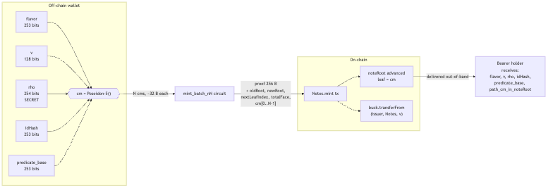
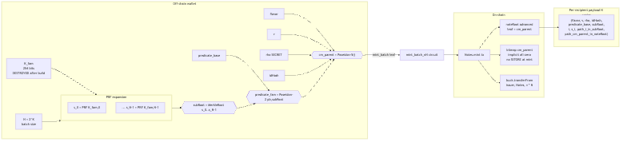
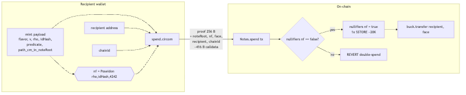
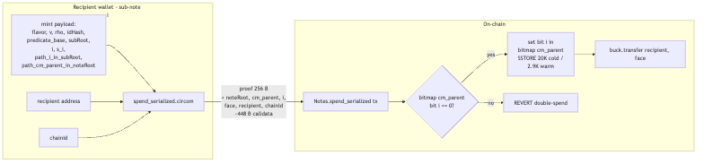
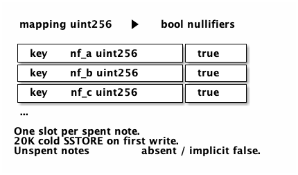
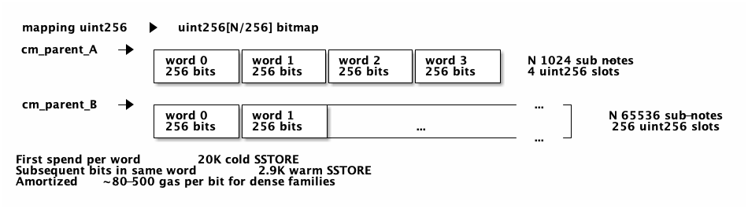

# Copyright (c) 2026 Perry Kundert.  All rights reserved.
#
# This document is NOT covered by the source-code licences in
# LICENSING.md.  The code is free software; the design writing is not
# (yet) placed under an open licence -- see LICENSING.md, "Design
# documents".  "Alberta Buck" is a mark: see TRADEMARKS.md.
#
# SPDX-License-Identifier: LicenseRef-AllRightsReserved
#+title: Alberta Buck Notes - Single vs. Serialized B1 Sub-Notes
#+author: Perry Kundert
#+date: 2026-04-23
#+category: Alberta Buck
#+series[]: Alberta-Buck

#+EXPORT_FILE_NAME: ./images/alberta-buck-notes-serialized
#+STARTUP: org-startup-with-inline-images inlineimages
#+STARTUP: org-latex-tables-centered nil
#+OPTIONS: ^:nil # Disable sub/superscripting with bare _; _{...} still works
#+OPTIONS: toc:nil

#+LATEX_HEADER: \usepackage[margin=1.0in]{geometry}

#+ATTR_LATEX: :width 10cm
[[https://perry.kundert.ca/images/dominion-logo.png]]

#+BEGIN_ABSTRACT
The Phase 7-bis batch-mint pivot (see =alberta-buck-notes-rollup-mint.org=)
pushes per-leaf Merkle insertion into the SNARK and recovers ~N-fold mint
amortization at the /batch/ level.  This memo describes a second, orthogonal
amortization that operates /within a single mint leaf/: a B1 bearer-note
family whose parent commitment in =noteRoot= anchors a cryptographically
committed sub-tree of N sub-notes, each independently spendable against a
shared per-parent nullifier bitmap.

The central construction: /1 Note = 1 unique bit in a shared nullifier
bitmap/, with N bitmap bits anchored by a single =cm_parent= leaf.  Recipient
payloads differ only in a 256-bit hidden serial =s_i= and its sub-tree path;
the serial position =i= (the bit index) is hidden from outside observers and
from sibling recipients but recoverable inside the spend circuit via a
witness-and-verify discipline, never by inversion.

Status-quo single-note mints remain the only appropriate construction for
identified (A1/A2) flows; serialization is B1-only because each spend reveals
the family parent =cm_parent= and thereby links co-spent siblings.  For
bearer notes that linkage carries no privacy cost: bearer-to-bearer transfer
is already a public act.

This memo lays out, side-by-side, the construction, data flow, per-field
security analysis, storage layout, cost model, and attack surface of both
encodings.  Where the mint-batch pivot amortized the cost of publishing N
commitments into =noteRoot=, serialization amortizes the cost of producing
N bearer notes from /one/ commitment.  Together the two drop marginal
per-note mint cost by 2-3 orders of magnitude vs. the shipped per-leaf
design, at the cost of the linkability disclosure described in /Privacy
Model/.
#+END_ABSTRACT

#+LATEX: \clearpage
#+TOC: headlines 3

#+LATEX: \clearpage
* Scope and Summary
** Applicability

| Note flavor             | Single-note | Serialized | Reason                                               |
|-------------------------+-------------+------------+------------------------------------------------------|
| A1 (public identified)  | yes         | NO         | family linkage at spend exposes issuer->payee graph  |
| A2 (private identified) | yes         | NO         | same as A1; same-M account detection becomes trivial |
| B1 (bearer)             | yes         | YES        | bearer transfer is already public; linkage is free   |

Serialization is strictly opt-in on a per-mint basis: the same issuer may
mint some families as serialized B1s and others as single B1s or A1/A2s
within the same batch (the batch-mint circuit is unchanged -- see
/Mint-Circuit Reuse/).

** Headline differences

| Axis                       | Single Note                | Serialized B1 (N sub-notes)         |
|----------------------------+----------------------------+-------------------------------------|
| Leaves per recipient       | 1                          | 1 (shared with N-1 siblings)        |
| Marginal mint gas / bearer | ~31K (asymptotic)          | ~31K/N                              |
| Spend gas                  | ~360K                      | ~400-450K (+sub-tree Merkle walk)   |
| Nullifier storage          | 20K SSTORE per spend       | amortized ~80 gas / bit in bitmap   |
| On-chain family linkage    | none (cm hidden at spend)  | =cm_parent= public on each spend    |
| Brute-force margin         | 2^128 (birthday, Poseidon) | 2^128 (same, plus sub-tree binding) |
| Mint circuit changes       | (baseline)                 | NONE (see /Mint-Circuit Reuse/)     |
| Spend circuit changes      | (baseline)                 | +log_2(N) Merkle-walk levels        |

The rest of this document justifies each row.

* Construction

** Single Note (status quo)

Each commitment is an independent Poseidon-5 opening of five fields:

: cm = Poseidon-5(flavor, v, rho, idHash, predicate)

At mint, =cm= is inserted at a fresh leaf of =noteRoot= (via the mint-batch
SNARK, which may insert up to N such =cm= in one tx).  At spend, the holder
reveals:

: nf = Poseidon(rho, idHash, 4242)

as a public input; the contract records =nullifiers[nf] = true= and
transfers =v= BUCK to the recipient.  =rho= is a ~254-bit issuer-chosen
random; =nf= is therefore a uniform element of the scalar field conditional
on =rho= being fresh, which makes it both double-spend-unique and
unlinkable across an observer's view of two unrelated notes.

** Serialized B1 sub-notes

For a family of N sub-notes (N = 2^K, K small -- typical K in {4, 8, 10, 16}
for N in {16, 256, 1024, 65536}), the issuer:

1. Draws a fresh per-family secret seed =K_fam=.
2. Generates =s_i = PRF(K_fam, i)= for i in 0..N-1.  Each =s_i= is a ~254-bit
   field element, pseudorandom.  =PRF= is domain-separated Poseidon or
   equivalent; =K_fam= is destroyed after step 4 and does not appear again
   anywhere on-chain or in any recipient payload.
3. Computes =subRoot= = depth-K Poseidon-2 Merkle root of =[s_0, ..., s_{N-1}]=.
4. Computes =predicate_fam = Poseidon-2(predicate_base, subRoot)=, where
   =predicate_base= is whatever policy field a single-note B1 would use.

   The parent commitment is then the /ordinary/ Poseidon-5:

   : cm_parent = Poseidon-5(flavor, v, rho, idHash, predicate_fam)

   -- and the mint-batch circuit hashes =cm_parent= identically to any other
   B1 leaf.  See /Mint-Circuit Reuse/ below.

5. For each recipient of sub-note i, the issuer delivers (off-chain, via any
   bearer-note-appropriate channel):

   : (flavor, v, rho, idHash, predicate_base, subRoot,
   :  i, s_i, path_i_in_subRoot, path_cm_parent_in_noteRoot)

   Note that =K_fam= is NOT in the payload; it has served its purpose and is
   destroyed.  =predicate_base= and =subRoot= together let the recipient
   reconstruct =predicate_fam=, which in turn lets them reconstruct
   =cm_parent= and prove its membership in =noteRoot=.

*** How PRF-of-index becomes witness-and-verify

The spend circuit does /not/ invert =s_i -> i=.  That would require breaking
the PRF, and would also let anyone else do it -- which defeats the scheme
(an attacker with one recipient's payload could enumerate every sibling's
serial).

Instead, the recipient at spend time witnesses =(i, s_i, path_i_in_subRoot)=
privately, and the circuit verifies the binding

: MerkleOpen(subRoot, position = i, leaf = s_i, path = path_i_in_subRoot) = true.

=i= is emitted as a public signal; the contract uses =(cm_parent, i)= to flip
the corresponding bit in =bitmap[cm_parent]=.  The attacker cannot fabricate
a fresh =(i', s_{i'}, path_{i'})= because =subRoot= is committed via
=cm_parent= in =noteRoot=: producing an alternate triple requires either
breaking Poseidon preimage resistance (2^128 work, birthday) or inverting
the on-chain =noteRoot= binding (same).

*** Mint-circuit reuse

Because =cm_parent= is an ordinary Poseidon-5 output, the mint-batch circuit
(=circuits/mint_batch.circom=) treats serialized and single B1 leaves
identically.  Only the /wallet's/ pre-mint preparation differs: a single B1
computes =predicate = predicate_base=, while a serialized family computes
=predicate = Poseidon-2(predicate_base, subRoot)= after building the
sub-tree.  No new pinned-N variants, no new trusted setup, no new verifier
bytecode.

The cost of serialization to the mint path is therefore zero on-chain and
O(N) hashes off-chain -- a single-threaded laptop builds =subRoot= for
N=1024 in <100ms.

*** Spend-circuit divergence

The spend circuit /does/ change: it must

1. Open =cm_parent= from =(flavor, v, rho, idHash, predicate_base, subRoot)=.
2. Open =predicate_fam = Poseidon-2(predicate_base, subRoot)=.
3. Prove =cm_parent= in =noteRoot= (unchanged vs. single-note).
4. Prove =s_i= in =subRoot= at position =i= (NEW: depth-K Merkle walk).
5. Emit =(cm_parent, i)= as public signals instead of =nf=.

This is ~1.5-2x the constraint count of single-note spend at N=1024 (where
K=10; the sub-tree walk adds 10 Poseidon-2 levels).  We deploy it as a
separate per-flavor verifier; the spend adapter dispatches on a flag or on
the calldata shape.

* Data Flow: Mint

The mint path is nearly identical between the two variants; the only
difference is in how the wallet computes =predicate= before handing =cm= to
the mint-batch prover.

** Single-note mint

#+BEGIN_SRC mermaid :file ./images/mint-single.png
flowchart LR
  subgraph off[Off-chain wallet]
    flavor[flavor 253 bits]
    v[v 128 bits]
    rho[rho 254 bits SECRET]
    idHash[idHash 253 bits]
    predicate[predicate_base 253 bits]
    cm{{"cm = Poseidon-5()"}}
    flavor --> cm
    v --> cm
    rho --> cm
    idHash --> cm
    predicate --> cm
  end

  cm -->|"N cms, ~32 B each"| batch[mint_batch_nN circuit]
  batch -->|"proof 256 B + oldRoot, newRoot, nextLeafIndex, totalFace, cm[0..N-1]"| mint[Notes.mint tx]

  subgraph on[On-chain]
    mint --> note[noteRoot advanced leaf = cm]
    mint --> buckxfer["buck.transferFrom (issuer, Notes, v)"]
  end

  note -->|delivered out-of-band| holder[Bearer holder receives: flavor, v, rho, idHash, predicate_base, path_cm_in_noteRoot]
#+END_SRC

#+RESULTS:

** Serialized-note mint (N sub-notes in one leaf)

#+BEGIN_SRC mermaid :file ./images/mint-serialized.png
flowchart LR
  subgraph off[Off-chain wallet]
    Kfam[K_fam 254 bits DESTROYED after build]
    N["N = 2^K batch size"]
    subgraph prf[PRF expansion]
      s0[s_0 = PRF K_fam,0]
      sN[... s_N-1 = PRF K_fam,N-1]
    end
    Kfam --> prf
    N --> prf
    subroot{{"subRoot = MerkleRoot s_0..s_N-1"}}
    prf --> subroot
    pb[predicate_base]
    pf{{"predicate_fam = Poseidon-2 pb,subRoot"}}
    pb --> pf
    subroot --> pf

    flavor[flavor]
    v[v]
    rho[rho SECRET]
    idHash[idHash]
    cm{{"cm_parent = Poseidon-5()"}}
    flavor --> cm
    v --> cm
    rho --> cm
    idHash --> cm
    pf --> cm
  end

  cm -->|mint_batch leaf| batch[mint_batch_nN circuit]
  batch --> mint[Notes.mint tx]

  subgraph on[On-chain]
    mint --> note[noteRoot advanced leaf = cm_parent]
    mint --> bitmap0[bitmap cm_parent implicit all-zero no SSTORE at mint]
    mint --> buckxfer["buck.transferFrom issuer, Notes, v * N"]
  end

  subgraph recipients[Per-recipient payload N copies]
    note --> pkg["(flavor, v, rho, idHash, predicate_base, subRoot, i, s_i, path_i_in_subRoot, path_cm_parent_in_noteRoot)"]
  end
#+END_SRC

#+RESULTS:

** Mint-phase field origin + privacy (side-by-side)

| Field              | Single      | Serialized | Source                    | Visibility at mint                    | Spend visibility               |
|--------------------+-------------+------------+---------------------------+---------------------------------------+--------------------------------|
| =flavor=           | present     | present    | issuer                    | in-circuit only                       | private                        |
| =v=                | present     | present    | issuer                    | =totalFace= sum                       | public (=face=)                |
| =rho=              | present     | present    | issuer random             | in-circuit only                       | private                        |
| =idHash=           | present     | present    | issuer                    | in-circuit only                       | private (B1) / A-bound (A1,A2) |
| =predicate_base=   | =predicate= | present    | issuer                    | in-circuit only                       | private                        |
| =K_fam=            | absent      | present    | issuer random             | NEVER exposed                         | NEVER exposed, destroyed       |
| =s_i=              | absent      | present    | =PRF(K_fam, i)=           | in-circuit only                       | private (bound via =subRoot=)  |
| =subRoot=          | absent      | present    | Merkle(=s_0..s_{N-1}=)    | in-circuit only (via =predicate_fam=) | private                        |
| =predicate_fam=    | absent      | present    | =Poseidon-2(pb, subRoot)= | in-circuit only                       | private                        |
| =cm= / =cm_parent= | present     | present    | Poseidon-5 of above       | public leaf in =noteRoot=             | public on spend (serialized)   |

* Data Flow: Spend

Here the two encodings diverge visibly.

** Single-note spend

#+BEGIN_SRC mermaid :file ./images/spend-single.png
flowchart LR
  subgraph wallet[Recipient wallet]
    pkt[mint payload flavor, v, rho, idHash, predicate, path_cm_in_noteRoot]
    rcp[recipient address]
    ch[chainId]
    nf{{"nf = Poseidon rho,idHash,4242"}}
    pkt --> nf
    pkt --> spc[spend.circom]
    rcp --> spc
    ch --> spc
    nf --> spc
  end

  spc -->|"proof 256 B + noteRoot, nf, face, recipient, chainId ~416 B calldata"| tx[Notes.spend tx]

  subgraph chain[On-chain]
    tx --> guard{"nullifiers nf == false?"}
    guard -->|yes| burn[nullifiers nf = true 1x SSTORE ~20K]
    guard -->|no| revert[REVERT double-spend]
    burn --> pay["buck.transfer recipient, face"]
  end
#+END_SRC

#+RESULTS:

** Serialized-note spend

#+BEGIN_SRC mermaid :file ./images/spend-serialized.png
flowchart LR
  subgraph wallet[Recipient wallet - sub-note i]
    pkt["mint payload: flavor, v, rho, idHash, predicate_base, subRoot, i, s_i, path_i_in_subRoot, path_cm_parent_in_noteRoot"]
    rcp[recipient address]
    ch[chainId]
    pkt --> spc[spend_serialized.circom]
    rcp --> spc
    ch --> spc
  end

  spc -->|"proof 256 B + noteRoot, cm_parent, i, face, recipient, chainId ~448 B calldata"| tx[Notes.spend_serialized tx]

  subgraph chain[On-chain]
    tx --> guard{"bitmap cm_parent bit i == 0?"}
    guard -->|yes| burn[set bit i in bitmap cm_parent SSTORE 20K cold / 2.9K warm]
    guard -->|no| revert[REVERT double-spend]
    burn --> pay["buck.transfer recipient, face"]
  end
#+END_SRC

#+RESULTS:

** Spend-phase field origin + privacy (side-by-side)

| Field                 | Single  | Serialized | Origin                       | Who sees on-chain | Attack if forged                 | Attack if observed               |
|-----------------------+---------+------------+------------------------------+-------------------+----------------------------------+----------------------------------|
| =noteRoot=            | public  | public     | contract state               | everyone          | stale-state revert               | none (public state)              |
| =nf=                  | public  | absent     | in-circuit from =rho,idHash= | everyone          | double-spend (reverts)           | unlinkable (pseudorandom)        |
| =cm_parent=           | absent  | public     | recipient witness            | everyone          | SNARK rejects                    | FAMILY LINKAGE                   |
| =i=                   | absent  | public     | recipient witness            | everyone          | SNARK rejects (binding to =s_i=) | reveals position in family       |
| =face=                | public  | public     | recipient witness            | everyone          | SNARK rejects                    | denom disclosure (B1 acceptable) |
| =recipient=           | public  | public     | recipient witness            | everyone          | front-run (SNARK binds)          | payee disclosure                 |
| =chainId=             | public  | public     | EIP-155                      | everyone          | cross-chain replay               | none                             |
| =rho=                 | private | private    | issuer                       | in-circuit only   | -- (secret)                      | never exposed                    |
| =idHash=              | private | private    | issuer                       | in-circuit only   | -- (secret)                      | never exposed                    |
| =s_i=                 | absent  | private    | =PRF(K_fam, i)=              | in-circuit only   | SNARK rejects                    | never exposed                    |
| =subRoot=             | absent  | private    | mint-time                    | in-circuit only   | -- (bound via =cm_parent=)       | never exposed                    |
| =path_cm_in_noteRoot= | private | private    | wallet                       | in-circuit only   | -- (bound via Merkle)            | never exposed                    |
| =path_i_in_subRoot=   | absent  | private    | mint payload                 | in-circuit only   | -- (bound via =subRoot=)         | never exposed                    |

** Calldata payload comparison

| Item                           | Single | Serialized |
|--------------------------------+--------+------------|
| Groth16 proof                  | 256 B  | 256 B      |
| =noteRoot=                     | 32 B   | 32 B       |
| =nf=                           | 32 B   | --         |
| =cm_parent=                    | --     | 32 B       |
| =i=                            | --     | 32 B       |
| =face=                         | 32 B   | 32 B       |
| =recipient=                    | 32 B   | 32 B       |
| =chainId=                      | 32 B   | 32 B       |
| /Total spend calldata/         | ~416 B | ~448 B     |
| + calldata-IC (if hash-pinned) | +~8 KB | +~10 KB    |

The 32 B delta (=i= as an extra public input) costs 512 gas at 16 gas/byte;
trivial.

* Storage Layout

** Single-note nullifier set

#+BEGIN_SRC ditaa :file ./images/storage-single.png
  mapping uint256 => bool nullifiers

  +-----------------------+--------+
  | key  nf_a uint256     | true   |
  +-----------------------+--------+
  | key  nf_b uint256     | true   |
  +-----------------------+--------+
  | key  nf_c uint256     | true   |
  +-----------------------+--------+
  ...

  One slot per spent note.
  20K cold SSTORE on first write.
  Unspent notes: absent / implicit false.
#+END_SRC

#+RESULTS:

** Serialized-note per-parent bitmap

#+BEGIN_SRC ditaa :file ./images/storage-serialized.png
  mapping uint256 => uint256[N/256] bitmap

  cm_parent_A  ->  +----------+----------+----------+----------+
                   | word 0   | word 1   | word 2   | word 3   |   N=1024 sub-notes
                   | 256 bits | 256 bits | 256 bits | 256 bits |   4 uint256 slots
                   +----------+----------+----------+----------+

  cm_parent_B  ->  +----------+----------+----------+----------+-- ... -+
                   | word 0   | word 1   |                              |   N=65536 sub-notes
                   | 256 bits | 256 bits |          ...                 |   256 uint256 slots
                   +----------+----------+----------+----------+-- ... -+

  First spend per word: 20K cold SSTORE
  Subsequent bits in same word: 2.9K warm SSTORE
  Amortized: ~80-500 gas per bit for dense families
#+END_SRC

#+RESULTS:

** Storage cost per note

| Family size        | Words | Worst-case per-note storage | Amortized per-note storage (all spent) |
|--------------------+-------+-----------------------------+----------------------------------------|
| Single (N=1)       |     1 | 20K (cold)                  | 20K                                    |
| Serialized N=16    |     1 | 20K first + 14*2.9K + final | ~3.8K                                  |
| Serialized N=256   |     1 | 20K + 255*2.9K              | ~2.98K                                 |
| Serialized N=1024  |     4 | 4*20K + 1020*2.9K           | ~2.96K                                 |
| Serialized N=65536 |   256 | 256*20K + 65280*2.9K        | ~2.96K                                 |

Serialized storage is asymptotically ~2.96K per sub-note (SLOAD + SSTORE
warm), vs 20K for single -- a ~7x reduction for fully-spent families.
Partially-spent families (common case) save somewhat less, since each
newly-touched word pays the cold penalty.

* Per-field Security Analysis (consolidated)

Reading the tables together so the whole attack surface is on one screen:

| Field                               | Phase      | Role                         | Forgery defense                            | Observation defense                 |
|-------------------------------------+------------+------------------------------+--------------------------------------------+-------------------------------------|
| =flavor, v, rho, idHash, predicate= | mint       | commitment opening           | Poseidon preimage (2^128 work)             | in-circuit, never on-chain          |
| =K_fam=                             | mint only  | PRF seed for =s_i=           | n/a (destroyed post-build)                 | never exposed                       |
| =s_i=                               | mint+spend | sub-note serial              | PRF + subRoot binding (2^128)              | private witness at spend            |
| =subRoot=                           | mint       | commits =s_0..s_{N-1}=       | Poseidon-5 cm binding                      | private witness at spend            |
| =cm / cm_parent=                    | mint+spend | =noteRoot= leaf              | =noteRoot= Merkle bind                     | PUBLIC (linkability for serialized) |
| =i=                                 | spend      | bit index in family          | =subRoot= Merkle bind                      | PUBLIC (position-in-family reveal)  |
| =nf=                                | spend      | single-note double-spend key | Poseidon of =rho,idHash= (collision 2^128) | unlinkable (pseudorandom)           |
| =bitmap[cm_parent]=                 | contract   | serialized double-spend set  | SSTORE guarded by bit-0 check              | public (spend-state mirror)         |
| =path_cm_in_noteRoot=               | spend      | anchor to on-chain state     | =noteRoot= bind                            | private witness                     |
| =path_i_in_subRoot=                 | spend      | anchor to family             | =subRoot= bind                             | private witness                     |
| =face / recipient / chainId=        | spend      | binding to tx                | SNARK public inputs                        | public (intentional)                |

* Attack Analysis

** Forging a fresh sub-note from a victim's payload

Attacker holds recipient i's full payload and wants to produce a valid spend
for =j != i= without ever having received =s_j=.  They would need either:

1. A second preimage =s_j' != s_j= of =subRoot= at position =j= that the
   circuit accepts.  This is a Poseidon preimage attack against a committed
   tree: 2^128 work by birthday (Poseidon-2 is 254-bit output, standard
   security bound).
2. Inverting =s_j = PRF(K_fam, j)= without =K_fam= -- infeasible for any
   PRF worth the name.  Even if PRF were keyless, the attacker would still
   need to open =subRoot= at position =j=, which they don't control.

The attack cost is therefore bounded below by the Poseidon preimage bound
(2^128), identical to what protects a single-note =cm= from forgery.
Serialization adds zero attack surface at the "forge a note I don't own"
level.

** Family linkage disclosure

Two serialized spends sharing the same =cm_parent= are observably related:
an on-chain observer sees =cm_parent= as a public input to both spend txs
and can bin-sort spends by family.  Consequences:

- For B1 bearer notes: neutral.  Bearer transfer doesn't carry identity;
  observing that two bearers happen to hold siblings of the same mint leaf
  discloses nothing beyond "both obtained notes of the same denom in the
  same family".  The issuer is already publicly identified at mint
  (=transferFrom= has msg.sender), and the denom =face= is a public input
  anyway.  The family boundary is not a new leak.
- For A1/A2 notes: unacceptable.  Linking spends under =cm_parent= binds
  unrelated payees to one mint, defeating the A2 privacy property.

This is exactly the scope boundary in /Applicability/: serialized encoding
is B1-only because B1 is the only flavor that doesn't care about family
linkage.

** Double-spend

Single-note: =nullifiers[nf]= is an SSTORE-set gate; the second spend of a
given note finds the slot already true and reverts.  Pre-image freshness of
=nf= under =rho,idHash= is the cryptographic guard.

Serialized: =bitmap[cm_parent][i/256]= bit =(i % 256)= is the SSTORE-set
gate; the second spend with the same =(cm_parent, i)= finds the bit already
set and reverts.  The =(cm_parent, i)= tuple uniquely identifies the sub-
note; forging a different =(cm_parent, i')= that maps to the same bit
requires breaking =subRoot= binding (see /Forging/ above).

Both models close under double-spend by the same mechanism (on-chain
set-once guard on a SNARK-validated coordinate); the single-note model
uses a 256-bit coordinate, the serialized model a 256+log2(N)-bit
coordinate.

** Bit-flip "nullifier squat"

Could Mallory flip a bit in =bitmap[cm_parent]= for a sub-note she does NOT
own, pre-emptively blocking the real recipient's spend?  No: the only code
path that writes the bitmap is =Notes.spend_serialized=, which itself
requires a Groth16 proof binding =(cm_parent, i)= to a valid =s_i= and
recipient.  Mallory cannot produce such a proof for a sub-note she doesn't
hold (see /Forging/), and spending the sub-note she holds transfers the
funds to /her/ recipient address -- which is equivalent to legitimately
receiving a B1 and spending it, not an attack.

The only residual "attack" is an out-of-band: Mallory may refuse to forward
(or delay) a payload to its intended recipient.  That's a trust issue
between issuer and payee, unchanged from any single-note B1 courier model.

** Partial-batch recipient abandonment

If the issuer mints N=1024 sub-notes intending to distribute all of them,
but only distributes 800, the remaining 224 sit unspendable in the bitmap
forever (their =s_i= are known only to the issuer, who presumably destroyed
=K_fam=).  On-chain footprint: zero (unspent bits cost nothing).  Issuer
impact: paid =v * N= BUCK at mint but only delivered to 800 recipients;
the 224 undelivered "slots" represent a permanent burn of =v * 224= BUCK.

This is the same economic self-punishment as minting a single note one never
intends to spend -- no new failure mode.

** Brute-force over the payload space

Attacker has /no/ valid recipient payload, but wants to guess one.  Two
paths:

1. Guess =(cm_parent, i, s_i, paths)= such that the SNARK accepts and the
   bit is unset.  The SNARK rejects everything except valid openings; to
   produce a valid opening attacker must find a Poseidon preimage of some
   =cm_parent= already in =noteRoot= -- i.e., break the commitment scheme
   (2^128 birthday).
2. Guess =(i, s_i, paths)= compatible with a specific =cm_parent= they
   observed from a prior spend.  The =subRoot= inside =cm_parent= pins
   exactly N valid =(i, s_i)= pairs; attacker must find a second (i, s')
   that opens at the same position -- Poseidon-2 second preimage, 2^128.

Both paths land at the same security level the single-note scheme enjoys
(Poseidon 128-bit security).  Serialization does not weaken brute-force
resistance.

* Cost Comparison

** Per-bearer-note mint cost

Numbers from =test/MintVerifier.t.sol=, affine model
=mint_tx_gas(N_batch) = 125K + 31K * N_batch= from
=alberta-buck-notes-rollup-mint.org=.  "N_fam" below is the serialization
depth within one family (parent); "N_batch" is the number of parents per
mint tx.  Taking N_batch=16 as the representative batch:

| Scheme                             | Notes delivered per tx | Gas per tx | Per-note gas |
|------------------------------------+------------------------+------------+--------------|
| Shipped per-leaf insertion         |                      2 | ~1.9M      | ~950K        |
| Single-note (pivot, N_batch=16)    |                     16 | 624K       | 39K          |
| Serialized N_fam=16, N_batch=16    |                    256 | 624K       | 2.4K         |
| Serialized N_fam=256, N_batch=16   |                   4096 | 624K       | 152          |
| Serialized N_fam=1024, N_batch=16  |                  16384 | 624K       | 38           |
| Serialized N_fam=65536, N_batch=16 |                1048576 | 624K       | 0.6          |

Serialization is a pure off-chain prover cost (N_fam Poseidon-2 hashes to
build =subRoot=); on-chain cost is unchanged from single-note mint at the
same =N_batch=.  Per-note mint cost drops with the batch-mint pivot by
~25x, and then with serialization by another =N_fam=x.

** Per-bearer-note spend cost

| Scheme                 | Proof verify | Merkle walks in-circuit | Storage write       | Est. tx gas |
|------------------------+--------------+-------------------------+---------------------+-------------|
| Single-note            | ~200K        | 1 x TREE_DEPTH=20       | 1 SSTORE (20K cold) | ~360K       |
| Serialized N_fam=16    | ~220K        | 1 x 20 + 1 x 4          | 1 SSTORE (20K cold) | ~390K       |
| Serialized N_fam=256   | ~225K        | 1 x 20 + 1 x 8          | 1 SSTORE (20K/2.9K) | ~400K       |
| Serialized N_fam=1024  | ~230K        | 1 x 20 + 1 x 10         | 1 SSTORE (20K/2.9K) | ~410K       |
| Serialized N_fam=65536 | ~250K        | 1 x 20 + 1 x 16         | 1 SSTORE (20K/2.9K) | ~440K       |

Spend cost grows logarithmically in =N_fam= (one extra Merkle level =
~4K gas in Groth16 verify overhead + ~600 gas in proof-gen scaling).  Even
for N_fam=65536, spend tx is ~440K, a ~20% increase over single-note.

** Verifier bytecode

The spend-serialized verifier is a distinct circuit from single-note
spend.  Measured = TODO -- the circuit is unimplemented as of 2026-04-23;
current work is in =scripts/snark/serialized_notes_poc.py= (Python driver
for the construction, N up to 4096 validated).  Projected constraint count:
~25K for N_fam=1024 (single-note spend baseline + 10-level Poseidon-2
sub-tree walk); the resulting Solidity verifier should fit well under the
24 KB EIP-170 ceiling.

** Storage cost (amortized)

Per the /Storage Layout/ section: serialized amortizes to ~2.96K per sub-
note (one SLOAD + one warm SSTORE), vs 20K for single.  The gain compounds
for issuers minting many bearer families -- a 1024-note B1 family costs
~3M gas to fully spend vs ~20M for 1024 single-note B1s, even before
factoring the per-note mint savings.

* Privacy Model

** What an on-chain observer sees

| Event                | Single-note spend             | Serialized spend                      |
|----------------------+-------------------------------+---------------------------------------|
| Calldata =noteRoot=  | public (pins to recent block) | same                                  |
| Calldata =nf=        | pseudorandom, unlinkable      | ABSENT                                |
| Calldata =cm_parent= | ABSENT                        | public -- family boundary revealed    |
| Calldata =i=         | ABSENT                        | public -- position-in-family revealed |
| Calldata =face=      | public                        | same (denom disclosed in both)        |
| Calldata =recipient= | public                        | same (payee disclosed in both)        |
| Event =Spent=        | face, recipient               | face, recipient, cm_parent, i         |
| Storage write        | one new =nullifiers[nf]= slot | one bit in =bitmap[cm_parent]=        |

Serialized spends link one additional way: any two spends sharing
=cm_parent= came from the same mint.  Unique to that encoding; the main
reason A-flavored notes must not use it.

** What a recipient learns about siblings

A serialized-note recipient knows:
- They hold position =i= in a family of size =N=.
- =N= is plaintext in the payload (it's log2 of the =path_i_in_subRoot=
  length).
- =s_i= is theirs; they know /none/ of the other =s_j= (PRF-protected).
- Once any sibling spends, =cm_parent= becomes publicly linked to some
  spent bit; by observing other spends under the same =cm_parent= the
  recipient can count which positions have gone through, but cannot tell
  /who/ held them (unless =recipient= address correlations leak
  externally).

A single-note recipient learns nothing about any other note in the same
mint beyond what =face= and =noteRoot= already reveal publicly.

** Why A1/A2 can't use serialization

A1 (public identified): recipient at spend binds =idHash= to a registered
identity.  If two A1 sub-notes of the same family are spent by different
payees, the linkage between their identities is on-chain.  This leaks the
issuer's entire "payees of this batch" graph and defeats the partial-
fungibility property A1 is meant to provide.

A2 (private identified): same leak, one layer removed via ElGamal.  If
same-M detection is performed across siblings, the encrypted identifiers
cluster under the shared family, which an adversary can use to correlate.

B1 (bearer): no identity attached at all.  The only disclosure is denom
and family membership, neither of which is a secret in a bearer model.

* Migration Path

** Phase A: build the spend-serialized circuit

1. =circuits/spend_serialized.circom= -- extend =circuits/spend.circom=
   with the =(subRoot, i, s_i, path_i_in_subRoot)= sub-block.
2. Trusted setup under =scripts/snark/setup.sh= (fits under pot17-pot19
   per constraint count, re-using existing ptau).
3. =src/SpendSerializedGroth16Verifier.sol= + per-flavor adapter
   (=src/SpendVerifierAdapter.sol= already supports multi-verifier routing;
   just add a "serialized" registration).

** Phase B: contract support

1. =Notes.sol= adds =spendSerialized(proof, oldRoot, cm_parent, i, face,
   recipient)= alongside existing =spend(proof, ..., nf, ...)=.
2. New storage =mapping(uint256 => mapping(uint256 => uint256)) bitmap=
   (parent => word => 256 bits).
3. Keep =nullifiers= mapping unchanged for single-note and A1/A2 flows.

** Phase C: wallet support

1. Mint path: add "serialize with N" option that builds =K_fam=,
   =subRoot=, =predicate_fam=.
2. Payload schema v2: extend the bearer-note blob format to include =(i,
   s_i, path_i_in_subRoot, subRoot)= when the note is serialized.
3. Spend path: detect payload variant from schema version, route to the
   appropriate verifier.

** Phase D: measure + promote

1. Measure spend-serialized gas at N_fam in {16, 256, 1024, 65536}.
2. Confirm verifier bytecode size; confirm no EIP-170 breach.
3. Document family-linkage disclosure prominently in wallet UX.
4. Consider whether the issuer-side cost of destroying =K_fam= securely
   (HSM attestation?) warrants a protocol-level requirement.

* Open Questions

1. */PRF choice for/ =s_i=*.  Plain domain-separated Poseidon
   =PRF(K_fam, i) = Poseidon-2(K_fam, i)= is the obvious choice.  Poseidon
   keyed-mode security is well-studied for 128-bit output; do we want a
   second hash (e.g., BLAKE3) as independent fallback in the wallet, or
   accept the Poseidon-only monoculture?
2. */Destroy-=K_fam=- discipline/*.  The construction depends on the
   issuer not retaining =K_fam= past mint-time.  If the issuer keeps
   =K_fam= they can impersonate any recipient (produce =(i, s_i, path)=
   on demand).  Enforceable only by wallet UX / HSM attestation.
3. */Per-family vs. global bitmap/.  We chose per-parent =mapping(cm => uint256[])=
   for locality; an alternative is a single global sparse bitmap keyed by
   =H(cm_parent, i)=.  Global bitmap drops the =cm_parent= indirection (1
   SLOAD instead of 2) at the cost of spreading writes across the full
   storage space (all SSTOREs cold).  Break-even at ~8 sub-notes per
   family -- not attractive for small N_fam.
4. */Batched-spend per family/*.  Can a single recipient spend multiple
   sub-notes of one family in one tx?  Useful for /aggregation/ by a
   pooling payee.  Straightforward circuit extension: M parallel
   =(i_j, s_{i_j}, path_{i_j})= openings under one =cm_parent= binding,
   emitting M bits to flip.  Storage: M warm SSTOREs into the same
   =bitmap[cm_parent]= words -- very cheap.
5. */Hiding/ =N_fam=.  Currently =N_fam= is recoverable from the
   =path_i_in_subRoot= length at spend time (10 levels -> N=1024).  Can
   we pad all serialized spends to a fixed max depth (say K=16 -> N_max=
   65536) and always emit 16-level paths?  Prover cost +6 hashes per
   spend; anonymity gain is that an observer cannot distinguish N=16
   families from N=65536 families.  Probably worth it if serialization
   sees significant deployment.
6. */POC-to-production port/*.  =scripts/snark/serialized_notes_poc.py=
   implements the full construction in ~250 lines of Python including a
   forgery-attempt test driver.  Porting to =circuits/spend_serialized.circom=
   is the remaining implementation work.

* Cross-References

- /Phase 7-bis batch-mint design/: =alberta-buck-notes-rollup-mint.org=
  (cost model, pinned-N policy, EIP-170 wall, calldata-IC).  Serialization
  reuses the mint circuit from that document unchanged.
- /Formal proofs/: =alberta-buck-proofs.org=, Theorem 7 (mint soundness),
  Theorem 8 (spend soundness), Theorem 9 (double-spend resistance).  A
  Theorem 12 for serialized spend is queued.
- /POC driver/: =scripts/snark/serialized_notes_poc.py= implements
  issuer-mint + recipient-verify + spend-predicate + forgery tests at
  N_fam in {256, 1024, 4096}.  All tests pass; brute-force margin
  ~2^128.
