# Copyright (c) 2026 Perry Kundert. All rights reserved.
# This document is NOT covered by the source-code licences in LICENSING.md.
# Design writing: all rights reserved. "Alberta Buck" is a mark; see TRADEMARKS.md.
# SPDX-License-Identifier: LicenseRef-AllRightsReserved
#+TITLE: The Alberta Buck --- Privacy
#+SUBTITLE: Paying Carol: private commerce, honest records, and nothing for Mallory
#+AUTHOR: Perry Kundert
#+DATE: 2026-09-24
#+CATEGORY: Alberta Buck
#+DRAFT: false
#+BUCKY: true
#+DESCRIPTION: A walk, runnable end to end, from a citizen's identity credential through direct payments and B1, A1 and A2 Notes: what each party provides, what each proof establishes, what an outside observer can learn, and what remains available as evidence.
#+EXPORT_FILE_NAME: ./images/alberta-buck-privacy
#+STARTUP: inlineimages
#+OPTIONS: toc:nil num:nil ^:nil
#+PROPERTY: header-args :eval never-export
#+PROPERTY: header-args:python :session privacy :exports both :results output :eval never-export
#+LATEX_CLASS: article
#+LATEX_CLASS_OPTIONS: [11pt]
#+LATEX_HEADER: \usepackage[margin=0.8in]{geometry}
#+LATEX_HEADER: \usepackage{microtype}
#+LATEX_HEADER: \usepackage{needspace}
#+LATEX_HEADER: \setlength{\parindent}{0pt}
#+LATEX_HEADER: \setlength{\parskip}{0.45em}
#+HTML_HEAD: 

#+ATTR_LATEX: :width 10cm
[[https://perry.kundert.ca/images/dominion-logo.png]]

#+BEGIN_ABSTRACT
Buy a coffee with a card and at least four businesses learn about it: the coffee shop, its payment
processor, the card network and your bank. Each keeps the record, and several build products to
sell from what they learn. Show your licence at a bar, a rental counter or a dispensary and a scanner may keep a
copy. In September 2026 a criminal service offered searchable scans of more than 153 million
American and Canadian driver's licences, about 1.1 million of them Canadian, taken from one such
scanning company's systems over more than a year: photos, licence numbers, and a timestamp for
every scan.[fn:idscan]

Meanwhile, those who launder money for a living buy their privacy with shell companies, nominees
and couriers. The honest citizen is the one left standing in the light.

This paper shows another arrangement. Alberta certifies who you are once. After that you can
prove you are a certified person without showing who, show a counterparty exactly who you are
without showing everyone, and keep a receipt a court can rely on. Commerce between free citizens
stays between them; the record exists for the people entitled to it.

We follow one payment. Bob owes Carol 100 BUCK. Mallory, who has no special access, watches
everything public. We will build the payment one layer at a time, and every step below is
running code: each fragment executes against a live local Ethereum chain, and its output is
printed beneath it.[fn:status] ([[https://perry.kundert.ca/images/alberta-buck-privacy.pdf][PDF]], [[https://perry.kundert.ca/images/alberta-buck-privacy.txt][Text]])
#+END_ABSTRACT

#+LATEX: \clearpage
* The cast, and how to read this

- *Bob* and *Carol* are private citizens of Alberta. Bob pays; Carol is paid.
- *Mallory* sits in the middle of every picture. She sees whatever the blockchain shows anyone:
  every transaction, every account, every event. She holds nobody's keys.
- *Alberta's issuer* certifies identities. *Aspen Mutual Credit Union* is Bob's credit union and,
  like any bank, a public institution. Every name here is invented for the demonstration.

Each step has three parts. A short account of what happens. A code fragment showing the data
gathered in that step, where each value comes from, and what it produces. And a picture: Bob on
the left, Carol on the right, Mallory in the middle, with the service doing the work below. A
/plus/ adds material, a /lock/ marks sealed contents, an /opening arrow/ exposes contents to their
intended reader, and a /check/ marks a completed check. An arrow crossing Mallory's column gives her
a view of the traffic, not a key.

Payloads are drawn as cards. Every field carries a badge saying who can read it:

| Badge   | Meaning                                                  |
|---------+----------------------------------------------------------|
| PUBLIC  | anyone can read it, Mallory included                     |
| PRIVATE | known to the named parties only; never published         |
| SEALED  | encrypted: only the named reader can open it             |
| SECRET  | never leaves its holder, not even inside a proof         |
| PROVEN  | established by a proof without being shown               |

When the code prints a transaction as Mallory sees it, an account shows only as its address.
The =[reader: ...]= annotation after it is for you, not for her. Public identities, such as the
credit union, show their names because Mallory can look those up herself.

The demonstration starts a private chain with the real contracts: the identity registry, the
BUCK token and the Notes pool. The zero-knowledge proofs that take a laptop 15 to 20 seconds each
were generated in advance from exactly the inputs used below; everything else happens here.

#+LATEX: {\scriptsize
#+BEGIN_SRC python
import os, random
from alberta_buck.wallet import backend, cards
from alberta_buck.wallet.bn254 import G1, add, eq, mul, neg, rand_scalar
from alberta_buck.wallet.identity import canonical_identity_data, identity_scalar
from alberta_buck.wallet.issuer import Issuer
from alberta_buck.sim.anvil import Anvil
from alberta_buck.sim.cast import ASPEN, BOB, CAROL
from alberta_buck.sim.privacy_world import PrivacyChain, PrivacyWorld

assert backend() == "kernel", "must run the production kernel: evaluate in the repo venv"
_seed = random.Random(0x9A1B0B)                 # one deterministic transcript
rng   = lambda: _seed.getrandbits(256)

world = PrivacyWorld.load()                     # the cast's wallets and the pre-made proofs
A, P  = world.accounts, world.people            # accounts and people, by name
U     = world.unit                              # BUCK carries 6 decimals
anvil = Anvil(chain_id=1, auto_impersonate=True, timestamp=1790000000).start()
alberta = Issuer.setup("alberta-identity", 0xA1BE27A0000000000000000000000000000000A1, rng=rng)
chain = PrivacyChain(anvil, world, alberta, rng=rng, block_time=12)

os.makedirs("images/privacy/cards", exist_ok=True)
card = lambda c, name: c.png(f"images/privacy/cards/{name}.png")
point = lambda fields: mul(G1, identity_scalar(canonical_identity_data(fields)))
print(f"chain {anvil.w3.eth.chain_id}: registry {chain.reg.address[:10]}.., "
      f"BUCK {chain.buck.address[:10]}.., Notes {chain.notes.address[:10]}..")
#+END_SRC

#+RESULTS:
: chain 1: registry 0x5FbDB231.., BUCK 0x5FC8d326.., Notes 0x9A9f2CCf..

#+LATEX: }

* First, a credential

** I1. Carol proves who she is, once

Carol visits Alberta's issuer with her documents, as she would for a licence. The issuer checks
them and writes a short /core record/: her name at first certification, date of birth, and a
person number the registry never reuses. Bob does the same on another day.

The record is hashed into a single number, and from it a point on an elliptic curve: Carol's
/identity point/, *M*. It is a fingerprint. Given the record anyone can check it; given only *M*
nobody can recover the record. Mallory might notice an appointment, but the conversation is
private.

#+LATEX: {\scriptsize
#+BEGIN_SRC python
record = canonical_identity_data(CAROL)         # the core record, fixed at first certification
m = identity_scalar(record)                     # m = keccak(tag || record) mod the group order
print(record)
print(f"m = {hex(m)[:18]}..  and M = m*G: Carol's identity point, a fingerprint of the record")
card(cards.identity_record(CAROL, "Carol"), "record")
#+END_SRC

#+RESULTS:
: {"date_of_birth":"1994-10-27","epoch":42,"family_name":"Nakamura","given_name":"Carol","id_number":"AB-P-8812-5507","id_type":"Alberta Identity","issued_at":"2026-04-09T10:05:00Z","issuer_id":"alberta-identity","jurisdiction":"Alberta, Canada"}
: m = 0x78540a5aa5db6031..  and M = m*G: Carol's identity point, a fingerprint of the record

#+LATEX: }

#+ATTR_LATEX: :width \linewidth :float nil
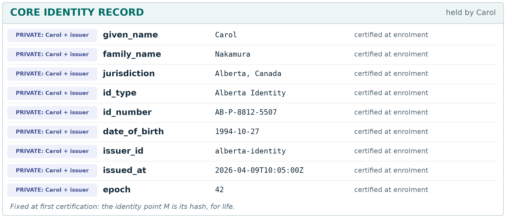

#+ATTR_LATEX: :width \linewidth :float nil
#+ATTR_HTML: :alt I1. Separate protected enrollments provide identity evidence to Alberta's issuer.
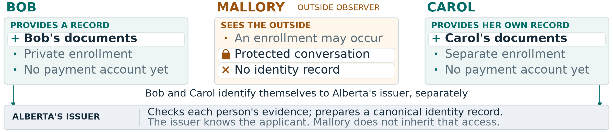

** I2. The issuer signs, and Carol keeps the signature

The issuer signs Carol's number with its private key and hands her the record and the signature.
Her wallet checks the signature against the issuer's published key. The raw signature never
leaves her wallet: whenever she uses it, she shows a freshly masked version that proves the same
thing and matches nothing she has shown before.

#+LATEX: {\scriptsize
#+BEGIN_SRC python
creds = {who: alberta.issue(fields, applicant_addr=0, rng=rng)        # no account exists yet
         for who, fields in (("bob", BOB), ("carol", CAROL), ("aspen", ASPEN))}
cred = creds["carol"]
print(f"the issuer signed Carol's m:          {cred.m == m}")
print(f"her wallet verifies the signature:    {alberta.verify_credential(cred)}")
card(cards.credential(cred, "Carol"), "credential")
#+END_SRC

#+RESULTS:
: the issuer signed Carol's m:          True
: her wallet verifies the signature:    True

#+LATEX: }

#+ATTR_LATEX: :width \linewidth :float nil
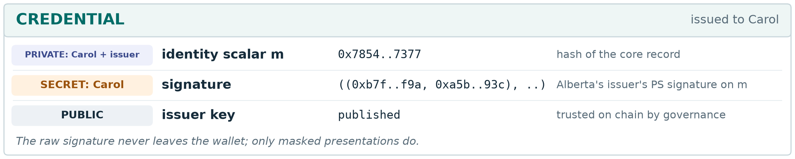

#+ATTR_LATEX: :width \linewidth :float nil
#+ATTR_HTML: :alt I2. Each citizen privately receives and verifies a signed identity credential.
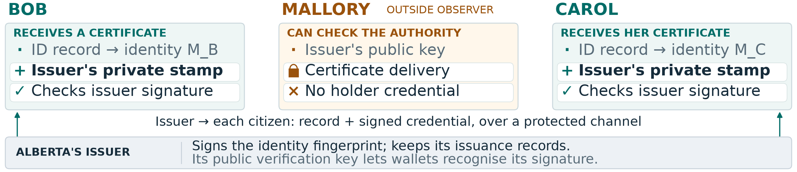

** Details that change

Carol will move house, change her phone number, perhaps her name. None of that may change *M*,
or every account and payment tied to it would lose its footing. So the core record holds only
what never changes, and the current details go in a separate /particulars/ certificate that the
registry signs over *M*. Each detail is sealed on its own, so Carol can show a bar her photo and
her age band, and nothing else. That is what an ID scan should have been.

When she moves, the registry issues version 2. *M* is untouched, and so is everything bound to
it.[fn:particulars]

#+LATEX: {\scriptsize
#+BEGIN_SRC python
from alberta_buck.registry.certificate import registry_keygen
from alberta_buck.registry.particulars import disclose, issue_particulars, verify_disclosure

registry = registry_keygen(rng)                 # the registry's signing key
now = {"legal_name": "Carol Nakamura", "address": "1204 10 Ave SW, Calgary AB",
       "phone": "+1 403 555 0142", "photo": "sha256:5b1c0e9f", "age_band": "25-34"}
details = issue_particulars(registry, "alberta-identity", P["carol"].M, 1, "2026-04-09", now, rng)
at_the_door = disclose(details, "photo", "age_band")
print("the bar sees:", verify_disclosure(at_the_door, registry.pk, P["carol"].M))
moved = issue_particulars(registry, "alberta-identity", P["carol"].M, 2, "2026-09-01",
                          dict(now, address="77 Main St, Canmore AB"), rng)
print("after the move, the lender sees:", verify_disclosure(disclose(moved, "address"),
                                                             registry.pk, P["carol"].M))
print("and M is unchanged:", moved.certificate.M == details.certificate.M)
card(cards.particulars(details, "Carol", disclosed=("photo", "age_band")), "particulars")
#+END_SRC

#+RESULTS:
: the bar sees: {'photo': 'sha256:5b1c0e9f', 'age_band': '25-34'}
: after the move, the lender sees: {'address': '77 Main St, Canmore AB'}
: and M is unchanged: True

#+LATEX: }

#+ATTR_LATEX: :width \linewidth :float nil
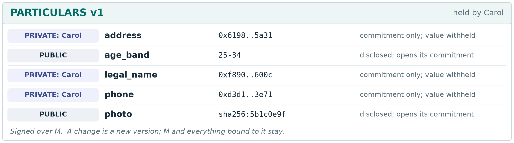

** I3. Carol's wallet makes her keys

Carol's wallet starts from a secret seed only she holds. From it the wallet derives a /receiving
key/, the mailbox that addressed payments will be sealed to. The receiving key is not derived from
her identity: a photocopy of your identification should not open your mail.

The registry records that Carol's identity owns that mailbox, and two other facts about her, each
as a sealed entry under its own random salt. It publishes only one number summarising them all,
the /identity root/. The code rebuilds that root from nothing but Bob's and Carol's own wallet
secrets.

#+LATEX: {\scriptsize
#+BEGIN_SRC python
from alberta_buck.wallet.recvkey import receiving_key
from alberta_buck.wallet.salt import derive_salt
from alberta_buck.registry.merkle_service import rooted_registry
from alberta_buck.registry.tree import identity_leaf_salted, mailbox_leaf, receiving_leaf

bob, carol = P["bob"], P["carol"]
k, pk_recv = receiving_key(carol.seed)          # from her seed, never from her identity
salts = {purpose: derive_salt(carol.seed, world.kyc, n)
         for n, purpose in enumerate(("receiving", "mailbox", "naming"))}
print(f"receiving key and salts come from Carol's seed: {k == carol.k and salts == carol.salts}")

tree = rooted_registry("registry:kyc")          # the registry's private subtree
for leaf in (receiving_leaf(bob.m, bob.k, bob.salts["receiving"]),
             identity_leaf_salted(bob.M, bob.salts["naming"]),
             receiving_leaf(carol.m, k, salts["receiving"]),      # identity <-> receiving secret
             mailbox_leaf(carol.M, pk_recv, salts["mailbox"]),    # identity <-> public mailbox
             identity_leaf_salted(carol.M, salts["naming"])):     # identity, to be named by
    tree.insert_leaf(leaf)
print(f"identity root {hex(tree.root())[:18]}..  (the proofs were made against it: "
      f"{tree.root() == world.identity_root})")
#+END_SRC

#+RESULTS:
: receiving key and salts come from Carol's seed: True
: identity root 0x2243cb2b517b536a..  (the proofs were made against it: True)

#+LATEX: }

#+ATTR_LATEX: :width \linewidth :float nil
#+ATTR_HTML: :alt I3. Wallet seeds derive private receiving keys locally; certification records hide the associations.
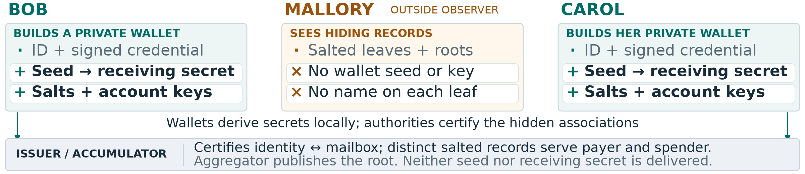

** I4. The wallet packages a fresh account

To use BUCK, Carol opens an account: an ordinary Ethereum address with its own signing key. Her
wallet adds a second key pair, the account's /identity key/, and seals her identity point under
it. Then it builds the registration package: the sealed identity, a freshly masked credential,
and a proof that the sealed point is one Alberta certified and that Carol holds the key.

Nothing in the package says "Carol". It says "a certified person", and proves it.

#+LATEX: {\scriptsize
#+BEGIN_SRC python
pkg = chain.registration_package(A["carol"], cred, rng)
print(f"account             {pkg.account.address}")
print(f"sealed identity E   decrypts to Carol's M with the account key: "
      f"{eq(add(pkg.E.C, neg(mul(pkg.E.R, A['carol'].sk))), carol.M)}")
card(cards.registration(pkg, "Carol"), "registration")
#+END_SRC

#+RESULTS:
: account             0xf269DcD36ce4672f09f804e7b808F32029644F43
: sealed identity E   decrypts to Carol's M with the account key: True

#+LATEX: }

#+ATTR_LATEX: :width \linewidth :float nil
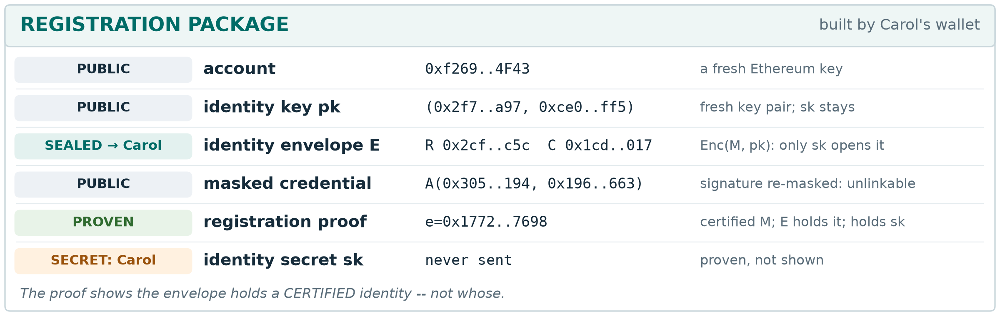

#+ATTR_LATEX: :width \linewidth :float nil
#+ATTR_HTML: :alt I4. Each registration package adds a hidden credential presentation, identity ciphertext and proof.
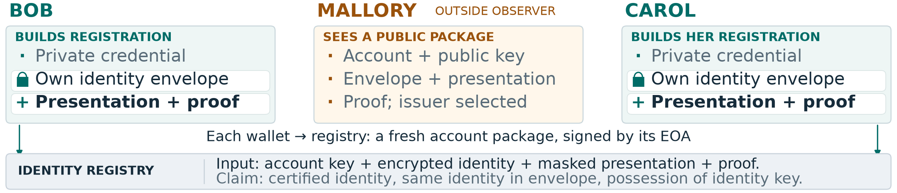

** I5. The registry checks the proof, without opening anything

The registry contract verifies the proof: an Alberta credential, the identity sealed in this
account, and the key held by whoever sent the transaction, all bound to this account on this
chain. It stores the account's identity key and sealed identity. Carol opens a second account,
for savings, from the same credential. Bob opens his.

Mallory sees three registrations. She cannot tell that two of them are the same person, and even
if she later learned Carol's record she could not test these accounts against it.

#+LATEX: {\scriptsize
#+BEGIN_SRC python
reg = chain.register(pkg)
chain.register(chain.registration_package(A["carolSavings"], cred, rng))
chain.register(chain.registration_package(A["bob"], creds["bob"], rng))
print(chain.observe(reg).render())
chain.bind_public(A["aspen"])                   # the credit union: a public identity
chain.post_identity_root(tree.root())           # the aggregator publishes the identity root
print(f"\nCarol's two accounts share nothing on chain:\n"
      f"  everyday {A['carol'].address}  key {cards.short_point(A['carol'].pk)}\n"
      f"  savings  {A['carolSavings'].address}  key {cards.short_point(A['carolSavings'].pk)}")
#+END_SRC

#+RESULTS:
#+begin_example
IdentityRegistry.register  from 0xf269..4F43   [reader: Carol's everyday account]
  tx 0x990c..6660  block 29  gas 463,430
  issuer             0xa1Be..00a1 Alberta's issuer (public)
  pk                 curve point (0x2f746f..f13a97, 0xce0ad0..94fff5)
  E                  ciphertext
  pres               masked credential
  proof              registration proof
  emits Registered
    account          0xf269..4F43   [reader: Carol's everyday account]
    issuer           0xa1Be..00a1 Alberta's issuer (public)

Carol's two accounts share nothing on chain:
  everyday 0xf269DcD36ce4672f09f804e7b808F32029644F43  key (0x2f7..a97, 0xce0..ff5)
  savings  0x11c38344EF77494C5e5eAa11eC72fE9dD5e0947F  key (0x296..0e9, 0x1f0..40c)
#+end_example

#+LATEX: }

#+ATTR_LATEX: :width \linewidth :float nil
#+ATTR_HTML: :alt I5. Valid registration becomes a stored account record; fresh presentations support separate accounts.
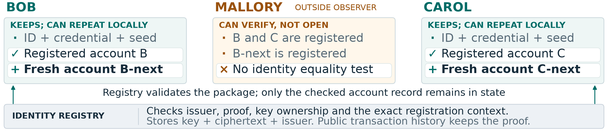

* Paying Carol directly

The simplest payment is a transfer from Bob's account to Carol's. The chain will show it: two
addresses, an amount, a time. What it will not show is who owns them. BUCK adds one rule: before
money moves between two private accounts, each party must have given the other a sealed copy of
its identity. Nobody gets paid by a stranger they cannot name.

First, Bob's money. Under BUCK a person's credit lives in an account of its own, and how that
works is another paper. Bob moves 500 BUCK of spending money from his credit account to his
everyday account, the one he pays from. That transfer is public too: anyone who can tie his
credit account to him can tie this one. He could have moved it privately with the A2 cheque at
the end of this paper.

#+LATEX: {\scriptsize
#+BEGIN_SRC python
credit = world.new_account("bob", "bobCredit", rng)        # a second account, same Bob
chain.observer.label(credit.address, "Bob's credit account")
chain.register(chain.registration_package(credit, creds["bob"], rng))
chain.fund(credit, 1_000 * U)                               # credit: outside this paper
chain.fund(A["aspen"], 5_000 * U)                           # the credit union's own funds
for a, b in ((credit, A["bob"]), (A["bob"], credit)):
    chain.approve(chain.envelope(a, b.address, b.pk, rng))  # sealed identities: next step
chain.transfer(credit, A["bob"].address, 500 * U)
print(f"Bob's everyday account holds {chain.balance(A['bob'].address) / U:,.2f} BUCK")
#+END_SRC

#+RESULTS:
: Bob's everyday account holds 500.00 BUCK

#+LATEX: }

** E1. Bob seals his identity for Carol

Bob's wallet reads Carol's public identity key from the registry and seals his own identity point
under it. It adds a proof that the sealed point is the same one his account registered, and asks
BUCK to record it with an allowance of zero: this says who Bob is, and gives Carol no right to
spend his money.

#+LATEX: {\scriptsize
#+BEGIN_SRC python
to_carol = chain.envelope(A["bob"], A["carol"].address, A["carol"].pk, rng)
card(cards.envelope(to_carol, "Bob", "Carol"), "envelope")
#+END_SRC

#+RESULTS:

#+LATEX: }

#+ATTR_LATEX: :width \linewidth :float nil
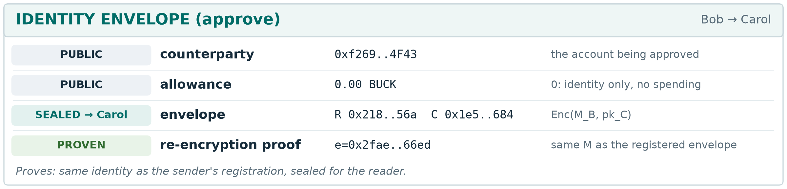

#+ATTR_LATEX: :width \linewidth :float nil
#+ATTR_HTML: :alt E1. Bob builds an identity envelope and proof for Carol, with no delegated spending allowance.
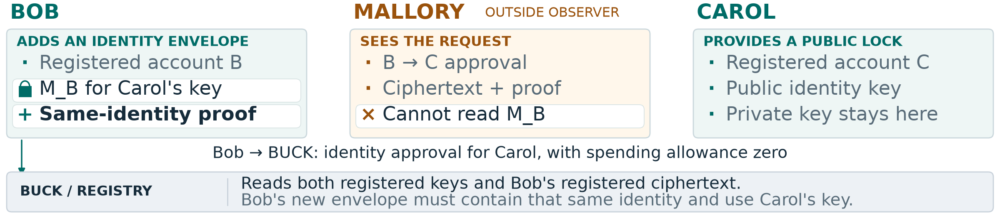

** E2. The contract checks it and keeps a fingerprint

The contract checks the proof against Bob's existing registration, not against anything the
transaction could substitute, and records a fingerprint of the sealed envelope. Mallory can copy
the envelope from the transaction. She cannot open it, and she cannot swap in someone else's
identity and keep the proof valid.

#+LATEX: {\scriptsize
#+BEGIN_SRC python
print(chain.observe(chain.approve(to_carol, 0)).render())
#+END_SRC

#+RESULTS:
#+begin_example
Buck.approve  from 0x01f9..564d   [reader: Bob's everyday account]
  tx 0x6d60..76f3  block 49  gas 176,547
  spender            0xf269..4F43   [reader: Carol's everyday account]
  amount             0.000000 BUCK
  E_bob              ciphertext
  pi_CP              re-encryption proof
  emits ApproveReceipt
    owner            0x01f9..564d   [reader: Bob's everyday account]
    spender          0xf269..4F43   [reader: Carol's everyday account]
    receiptHash      0xfd16..3973
  emits CarryingFrozen
    target           0xf269..4F43   [reader: Carol's everyday account]
  emits Approval
    owner            0x01f9..564d   [reader: Bob's everyday account]
    spender          0xf269..4F43   [reader: Carol's everyday account]
    value            0.000000 BUCK
#+end_example

#+LATEX: }

#+ATTR_LATEX: :width \linewidth :float nil
#+ATTR_HTML: :alt E2. Verified re-encryption becomes a receipt fragment; Carol retrieves the proven ciphertext.
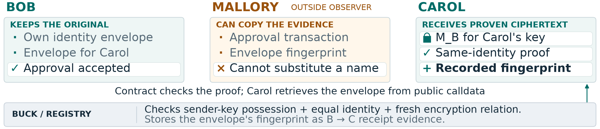

** E3. Carol opens it and checks the name

Carol's account key opens the envelope, and out comes Bob's identity point. Bob sends his core
record over a private channel. Carol hashes the record and compares: the proof says /this is the
identity behind Bob's account/, and the record says /whose identity it is/. Both must agree. A
record for anyone else, even one letter different, does not match.

#+LATEX: {\scriptsize
#+BEGIN_SRC python
from alberta_buck.wallet.elgamal import elgamal_decrypt
opened = elgamal_decrypt(to_carol.E, A["carol"].sk)
print(f"sealed point is Bob's record:    {eq(opened, point(BOB))}")
print(f"...and not 'Robert Tremblay':    {eq(opened, point(dict(BOB, given_name='Robert')))}")
#+END_SRC

#+RESULTS:
: sealed point is Bob's record:    True
: ...and not 'Robert Tremblay':    False

#+LATEX: }

#+ATTR_LATEX: :width \linewidth :float nil
#+ATTR_HTML: :alt E3. Carol decrypts Bob's identity point and checks the separately delivered identity record against it.
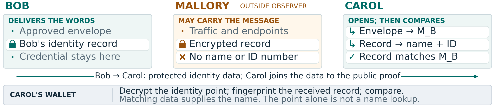

** E4. Carol returns the favour

Carol seals her identity for Bob the same way, and sends him her record. Now each has checked the
other. No money has moved: recognising someone is not paying them.

#+LATEX: {\scriptsize
#+BEGIN_SRC python
to_bob = chain.envelope(A["carol"], A["bob"].address, A["bob"].pk, rng)
chain.approve(to_bob, 0)
print(f"Bob opens Carol's envelope to her record: "
      f"{eq(elgamal_decrypt(to_bob.E, A['bob'].sk), point(CAROL))}")
#+END_SRC

#+RESULTS:
: Bob opens Carol's envelope to her record: True

#+LATEX: }

#+ATTR_LATEX: :width \linewidth :float nil
#+ATTR_HTML: :alt E4. Carol adds the reverse identity envelope; Bob validates it, completing bilateral evidence.
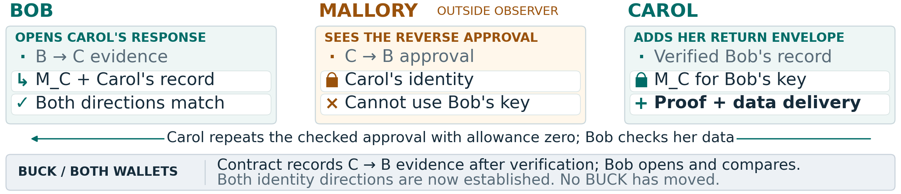

** E5. Bob pays; both keep a receipt

Bob's account sends 100 BUCK to Carol's. The contract finds both envelopes in place and moves the
money. Mallory sees two addresses, 100 BUCK and a time; if she ever learns who owns either
address, she learns this payment too. What she never gets is either name from the chain.

Carol's wallet prints a receipt naming both parties. Its proofs let anyone holding the receipt
check it without trusting Carol, which is what makes it evidence rather than a claim.

#+LATEX: {\scriptsize
#+BEGIN_SRC python
from alberta_buck.wallet.render import TextDriver, render_receipt
pay = chain.transfer(A["bob"], A["carol"].address, 100 * U)
print(chain.observe(pay).render())
print()
print(TextDriver(48).render(render_receipt(chain.eoa_receipt(to_carol, A["carol"], pay, 100 * U))))
#+END_SRC

#+RESULTS:
#+begin_example
Buck.transfer  from 0x01f9..564d   [reader: Bob's everyday account]
  tx 0x7503..f0a6  block 51  gas 88,363
  to                 0xf269..4F43   [reader: Carol's everyday account]
  amount             100.000000 BUCK
  emits Transfer
    from             0x01f9..564d   [reader: Bob's everyday account]
    to               0xf269..4F43   [reader: Carol's everyday account]
    value            100.000000 BUCK
  emits BuckTransferReceipt
    from             0x01f9..564d   [reader: Bob's everyday account]
    to               0xf269..4F43   [reader: Carol's everyday account]
    amount           100.000000 BUCK
    fromCipherHash   0xd056..cafb
    toCipherHash     0xfd16..3973

                 ALBERTA  BUCK                  
         P A Y M E N T   R E C E I P T          
------------------------------------------------
  Receipt  trh7zgwvavvu
------------------------------------------------
FROM (payer) (PRIVATE IDENTITY)
 Bob Tremblay
Alberta Identity - Alberta, Canada
 acct 0x01f9fec6bb2f227da0fe180651c1616e0f03564d
 idpt 0x110f449d8e6d..6a6925e3ced6
------------------------------------------------
TO (payee - you) (PRIVATE IDENTITY)
 Carol Nakamura
Alberta Identity - Alberta, Canada
 acct 0xf269dcd36ce4672f09f804e7b808f32029644f43
 idpt 0x1eb063312673..8a97e1de516b
------------------------------------------------
TRANSACTION
 Type    EOA xfer (Identity-bound, private payer)
 Amount            100.000000  BUCK
 When        2026-09-21 14:17  UTC
 Chain                      1
 Block                     51
 Log                        0
 Tx      0x75037ada8da8..b09997daf0a6
------------------------------------------------
VERIFICATION
 status @ issue: VALID
 receipt  trh7zgwvavvu
------------------------------------------------
        a record, not a bearer instrument       
        github.com/pjkundert/alberta-buck
#+end_example

#+LATEX: }

#+ATTR_LATEX: :width \linewidth :float nil
#+ATTR_HTML: :alt E5. Bob's signed transfer executes after bilateral identity checks; addresses and amount remain public.
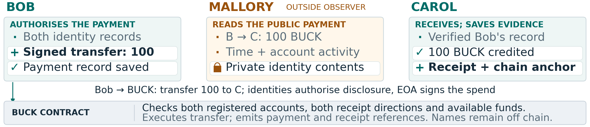

* Notes: breaking the visible link

A direct transfer publishes an edge from Bob's account to Carol's. /Notes/ remove it. Money goes
into a shared pool as a sealed note, and comes out later to whoever can prove the right to it.
The pool sees many notes go in and many come out, and nothing on the chain says which is which.

Notes come in three kinds, and we will pay Carol with each: a /bearer/ note from a public issuer
(B1), a note /addressed/ to Carol from a public issuer (A1), and a note addressed to Carol from a
/private/ issuer (A2). They are alternatives, not stages.

** N1. Introductions to the pool

The pool is a contract with a public identity and an operator. Money into and out of it follows
the ordinary rule, so private accounts give the pool their sealed identities first, just as Bob
and Carol did for each other. The operator can open those envelopes: it knows who uses the pool.
It cannot see which note is whose.[fn:pool]

#+LATEX: {\scriptsize
#+BEGIN_SRC python
for acct in (A["carol"], A["carolSavings"]):
    to_pool = chain.envelope(acct, chain.notes.address, chain.pool_pk, rng)
    chain.approve(to_pool, 0)
print(f"the operator's key opens Carol's envelope: "
      f"{eq(elgamal_decrypt(to_pool.E, chain.pool_sk), carol.M)}")
#+END_SRC

#+RESULTS:
: the operator's key opens Carol's envelope: True

#+LATEX: }

#+ATTR_LATEX: :width \linewidth :float nil
#+ATTR_HTML: :alt N1. Private users supply identity envelopes to the pool; its operator can decrypt these direct relationships.
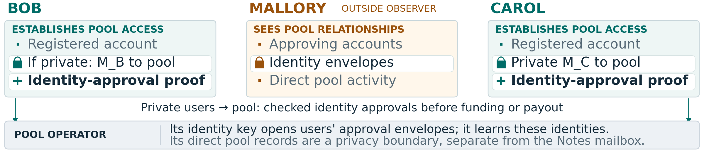

* B1: cash from the credit union

A B1 note is digital cash with a known maker, like a banknote or a cashier's cheque. Its issuer
is a public institution, here Aspen Mutual, and anyone holding the note's secret can cash it.
Bob never appears on the chain at all.

** B1.1. Bob buys a note

Bob pays Aspen Mutual 100 BUCK from his account, sealing his identity for the credit union first.
It knows him anyway: he is a member. Aspen Mutual adds his note to a batch of four it is issuing
for different members. The note is a value and a random secret, locked into a /commitment/: a
fingerprint that can be published without revealing either.

#+LATEX: {\scriptsize
#+BEGIN_SRC python
chain.approve(chain.envelope(A["bob"], A["aspen"].address, A["aspen"].pk, rng))
print(chain.observe(chain.transfer(A["bob"], A["aspen"].address, 100 * U)).render())
b1 = world.notes["b1"]
print("\nAspen Mutual's batch; only Aspen Mutual and each holder know the values:")
for i, (o, cm) in enumerate(zip(b1.batch, b1.cms)):
    mine = "  <- Bob's" if i == b1.raw["index"] else ""
    print(f"  note {i}  {o.v / U:>7.2f} BUCK  commitment {hex(cm)[:14]}..{mine}")
card(cards.bearer_note(b1.opening, b1.cm, "Aspen Mutual Credit Union", "Bob"), "bearer-note")
#+END_SRC

#+RESULTS:
#+begin_example
Buck.transfer  from 0x01f9..564d   [reader: Bob's everyday account]
  tx 0x5573..3074  block 55  gas 107,749
  to                 0x74c4..CBD7 Aspen Mutual Credit Union (public)
  amount             100.000000 BUCK
  emits Transfer
    from             0x01f9..564d   [reader: Bob's everyday account]
    to               0x74c4..CBD7 Aspen Mutual Credit Union (public)
    value            100.000000 BUCK
  emits BuckTransferReceipt
    from             0x01f9..564d   [reader: Bob's everyday account]
    to               0x74c4..CBD7 Aspen Mutual Credit Union (public)
    amount           100.000000 BUCK
    fromCipherHash   0xa3b8..7eef
    toCipherHash     0x4bdd..672e

Aspen Mutual's batch; only Aspen Mutual and each holder know the values:
  note 0    20.00 BUCK  commitment 0x2f490a892e5a..
  note 1   250.00 BUCK  commitment 0x18d95ff603b5..
  note 2   100.00 BUCK  commitment 0x12f17f131e50..  <- Bob's
  note 3    60.00 BUCK  commitment 0x1d362b2fc8b4..
#+end_example

#+LATEX: }

#+ATTR_LATEX: :width \linewidth :float nil
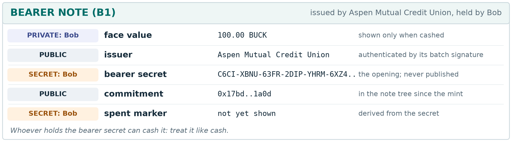

#+ATTR_LATEX: :width \linewidth :float nil
#+ATTR_HTML: :alt B1.1. Aspen Mutual builds a batch of bearer notes; Bob's holds 100 BUCK and a secret.
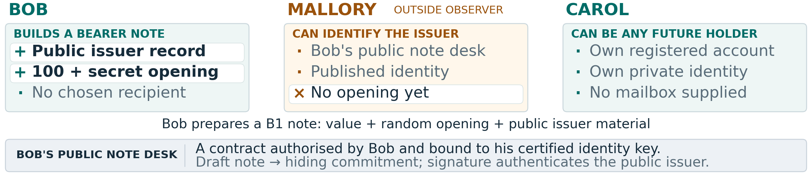

** B1.2. The credit union mints the batch

Aspen Mutual submits the four commitments, its signature over the batch, and a proof that the
commitments are well formed and add up to what it is paying in. The contract checks all three
and moves the money into the pool in the same step: either the notes exist and are funded, or
nothing happened.

Mallory sees Aspen Mutual issue four notes worth 430 BUCK in total. She does not see the four
values, who asked for them, or any secret.

#+LATEX: {\scriptsize
#+BEGIN_SRC python
chain.allow(A["aspen"], chain.notes.address, 10**15)
b1_mint = chain.mint_note(b1)
print(chain.observe(b1_mint).render())
print(f"\nthe batch proof was made in advance in {b1.timings['mint_prove_s']:.1f}s")
#+END_SRC

#+RESULTS:
#+begin_example
Notes.mint  from 0x74c4..CBD7 Aspen Mutual Credit Union (public)
  tx 0x07d0..11f1  block 57  gas 645,959
  proof              256 bytes (Groth16 proof)
  oldRoot            0xe0d753..b6cd7f
  newRoot            0x1c024f..66f7bb
  nextLeafIndex_     0
  totalFace          430.000000 BUCK
  cms                [0x2f490a..5d4330, 0x18d95f..2013f1, 0x12f17f..330ef7, 0x1d362b..f90710]
  issuerMode         [1, 1, 1, 1]
  issuerSig          issuer signature
  emits Transfer
    from             0x74c4..CBD7 Aspen Mutual Credit Union (public)
    to               0x9A9f..63AE Notes pool (public)
    value            430.000000 BUCK
  emits BuckTransferReceipt
    from             0x74c4..CBD7 Aspen Mutual Credit Union (public)
    to               0x9A9f..63AE Notes pool (public)
    amount           430.000000 BUCK
    fromCipherHash   0x9e6f..4aaf
    toCipherHash     0x9de4..f456
  emits Minted
    issuer           0x74c4..CBD7 Aspen Mutual Credit Union (public)
    newRoot          0x1c024f..66f7bb
    totalFace        430.000000 BUCK
    startIndex       0
    count            4
  emits IssuerBound
    issuer           0x74c4..CBD7 Aspen Mutual Credit Union (public)
    newRoot          0x1c024f..66f7bb

the batch proof was made in advance in 2.0s
#+end_example

#+LATEX: }

#+ATTR_LATEX: :width \linewidth :float nil
#+ATTR_HTML: :alt B1.2. Proof verification and escrow funding atomically create the committed notes.
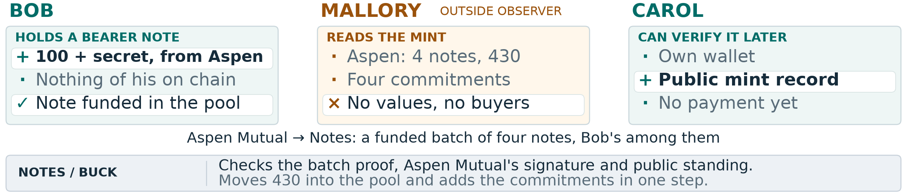

** B1.3. Bob hands Carol the note

Bob gives Carol the note: printed as a code, sent in a message, it does not matter. Her wallet
rebuilds the commitment from the secret, finds it in Aspen Mutual's batch, confirms the chain
records Aspen Mutual as its issuer, and checks it has not been cashed.

This is cash, with cash's weakness: anyone who copies the secret can race Carol to cash it. So B1
suits handing over in person and cashing promptly. The addressed notes below close that gap.

#+LATEX: {\scriptsize
#+BEGIN_SRC python
from alberta_buck.wallet.notes import note_commitment, nullifier
note = b1.opening                               # what Bob handed over
cm = note_commitment(note)
print(f"bearer code  {cards.bearer_code(note.rho)}")
print(f"rebuilds a commitment Aspen Mutual minted:  {cm in b1.cms}")
print(f"the chain names its issuer as Aspen Mutual: "
      f"{chain.notes.functions.publicIssuerOfCommitment(cm).call() == A['aspen'].address}")
print(f"not yet cashed:                             "
      f"{not chain.notes.functions.nullifiers(nullifier(note.rho, note.id_hash)).call()}")
#+END_SRC

#+RESULTS:
: bearer code  ESGA-NODE-2YUM-IEOE-Q3P5-JBSZ-KQ6V-JUBX-P2FA-YL4X-TYU7-TZX6-QWQQ
: rebuilds a commitment Aspen Mutual minted:  True
: the chain names its issuer as Aspen Mutual: True
: not yet cashed:                             True

#+LATEX: }

#+ATTR_LATEX: :width \linewidth :float nil
#+ATTR_HTML: :alt B1.3. Carol reconstructs the funded note; copying its bearer secret permits a redemption race.
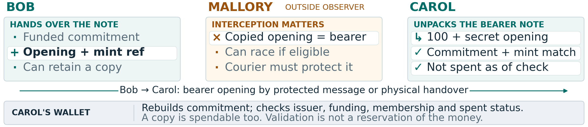

** B1.4. Carol seals her identity for the issuer

To cash a note, Carol's wallet derives its /spent marker/ from the secret, which lets the chain
refuse a second cashing without learning which note it was. It proves she holds a note in the
tree. And, because B1 notes come from a public institution, it seals her identity for Aspen
Mutual and proves the sealed identity is the certified one behind her account.

That last part is the rule of law in miniature: the note carried no name, but whoever cashes it
is named to the institution that issued it, and to nobody else.

#+LATEX: {\scriptsize
#+BEGIN_SRC python
from alberta_buck.wallet.b1_binding import b1_bind_prove
draws = world.replay("b1", "depositorBinding")  # the draws the pre-made proofs were built on
blind = rand_scalar(draws)
binding, sealed_for_aspen = b1_bind_prove(carol.m, A["carol"].sk, A["carol"].E, A["aspen"].pk,
                                          account=A["carol"].addr, chainid=1, b=blind, rng=draws)
F = cards.Field
card(cards.Card("B1 DEPOSIT: WHAT CAROL PROVES", "proved by Carol's wallet", note="Two proofs "
                "share one hidden identity, so neither can be about someone else.").add(
    F("spent marker", cards.short_int(b1.nullifier), "public", "", "refuses a second cashing"),
    F("value, payout", f"100.00 BUCK -> {cards.short_addr(A['carol'].address)}", "public"),
    F("note", cards.short_int(b1.cm), "public", "", "B1 shows its commitment: public maker"),
    F("identity, sealed", cards.short_ct(sealed_for_aspen), "sealed", "Aspen Mutual",
      "Carol's M for the issuer"),
    F("note secret, path", "used, not shown", "proven", "", "she holds a funded note"),
    F("certified identity", "used, not shown", "proven", "", "sealed M is her account's"),
    F("account key", "used, not shown", "secret", "Carol", "never leaves her wallet")),
     "b1-deposit")
#+END_SRC

#+RESULTS:

#+LATEX: }

#+ATTR_LATEX: :width \linewidth :float nil
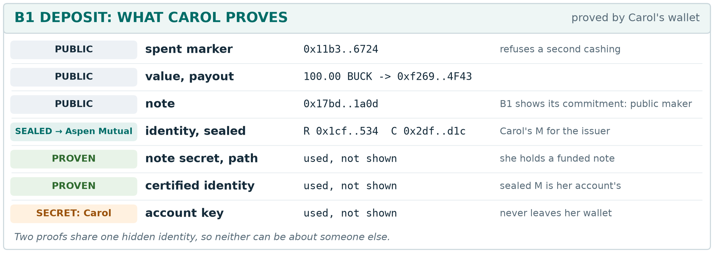

#+ATTR_LATEX: :width \linewidth :float nil
#+ATTR_HTML: :alt B1.4. Carol adds an identity envelope for the issuer, an account binding and a matching private membership proof.
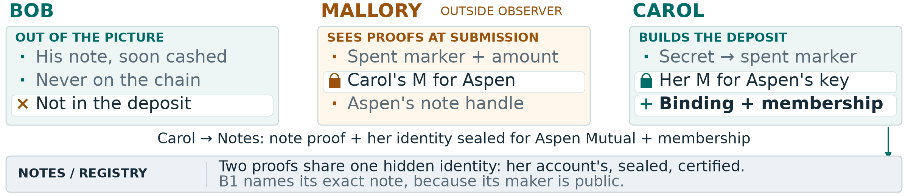

** B1.5. The pool checks everything and pays

The contract checks the note proof, that the spent marker is new, that Aspen Mutual really issued
this note, the identity binding, and that Carol's identity is currently certified. Then it
records the marker and pays her 100 BUCK. A second attempt fails.

A B1 cashing names the exact note it redeems, because a public maker's notes are meant to be
traceable to their maker. Mallory can see that one of Aspen Mutual's notes was cashed into this
account. Bob is nowhere in it.[fn:b1-link] Only coincidence connects him: an earlier 100 BUCK
payment from his account to the credit union, and a 100 BUCK note cashed later. Among a credit
union's thousands of members that says little; in a demonstration with one, it says a lot.
Standard amounts blur it further, as the last section explains.

#+LATEX: {\scriptsize
#+BEGIN_SRC python
b1_spend = chain.spend_note(b1)
print(chain.observe(b1_spend).render())
#+END_SRC

#+RESULTS:
#+begin_example
Notes.spendCoupledB1  from 0xf269..4F43   [reader: Carol's everyday account]
  tx 0x21d4..a17d  block 58  gas 763,103
  proof              256 bytes (Groth16 proof)
  root               0x1c024f..66f7bb
  identityRoot       0x2243cb..b184cb
  nullifier          0x288b62..956480
  face               100.000000 BUCK
  recipient          0xf269..4F43   [reader: Carol's everyday account]
  issuanceCommitment 0x12f17f..330ef7
  issuer             0x74c4..CBD7 Aspen Mutual Credit Union (public)
  eDepForIss         ciphertext
  b1Proof            depositor binding proof
  membershipProof    256 bytes (Groth16 proof)
  emits Transfer
    from             0x9A9f..63AE Notes pool (public)
    to               0xf269..4F43   [reader: Carol's everyday account]
    value            100.000000 BUCK
  emits BuckTransferReceipt
    from             0x9A9f..63AE Notes pool (public)
    to               0xf269..4F43   [reader: Carol's everyday account]
    amount           100.000000 BUCK
    fromCipherHash   0xef94..ed27
    toCipherHash     0xc1ab..7dec
  emits SpentCoupledB1
    nullifier        0x288b62..956480
    recipient        0xf269..4F43   [reader: Carol's everyday account]
    issuer           0x74c4..CBD7 Aspen Mutual Credit Union (public)
    face             100.000000 BUCK
    eDepForIss       ciphertext
#+end_example

#+LATEX: }

#+ATTR_LATEX: :width \linewidth :float nil
#+ATTR_HTML: :alt B1.5. B1 redemption pays Carol and publicly links the spend to Aspen Mutual's note.
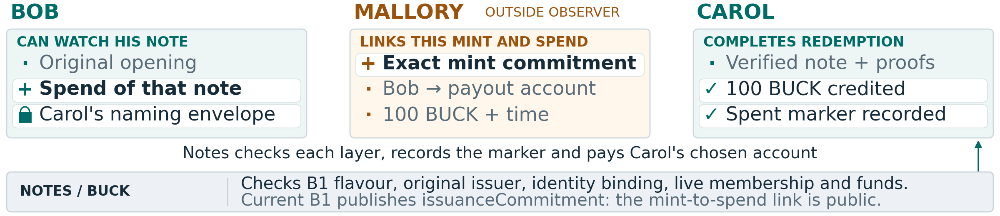

** B1.6. The credit union knows who cashed its note

Aspen Mutual reads the event and opens the sealed identity with its key: Carol. Like a bank that
honours a cheque, it now knows who issued the note (itself, for Bob) and who cashed it. That is
the whole of what anyone learns, and it is held by a regulated institution that must answer to
the law for it. Aspen Mutual can print a receipt naming the depositor.

#+LATEX: {\scriptsize
#+BEGIN_SRC python
print(f"Aspen Mutual's key opens it to Carol's M: "
      f"{eq(elgamal_decrypt(sealed_for_aspen, A['aspen'].sk), point(CAROL))}\n")
slip = chain.note_receipt("b1", "issuer", b1_mint, b1_spend)
print(TextDriver(48).render(render_receipt(slip)))
#+END_SRC

#+RESULTS:
#+begin_example
Aspen Mutual's key opens it to Carol's M: True

                 ALBERTA  BUCK                  
         P A Y M E N T   R E C E I P T          
------------------------------------------------
  Receipt  qtwexs6zf2rn
------------------------------------------------
FROM (payer - you) (PUBLIC IDENTITY)
 Aspen Mutual Credit Union
Credit Union Charter - Alberta, Canada
 acct 0x74c471375761d78bb737cea3c96488631cf9cbd7
 idpt 0x0f4f2ffd03cc..5066116aaa27
------------------------------------------------
TO (payee) (PRIVATE IDENTITY)
 Carol Nakamura
Alberta Identity - Alberta, Canada
 acct 0xf269dcd36ce4672f09f804e7b808f32029644f43
 idpt 0x1eb063312673..8a97e1de516b
------------------------------------------------
TRANSACTION
 Type    Note spend — B1 bearer, public issuer
 Amount            100.000000  BUCK
 When        2026-09-21 14:19  UTC
 Chain                      1
 Block                     58
 Log                        2
 Tx      0x21d4f0d10cab..2620f911a17d
 Mint    0x07d028b289a1..34b593f611f1
------------------------------------------------
VERIFICATION
 status @ issue: VALID
 receipt  qtwexs6zf2rn
------------------------------------------------
        a record, not a bearer instrument       
        github.com/pjkundert/alberta-buck
#+end_example

#+LATEX: }

#+ATTR_LATEX: :width \linewidth :float nil
#+ATTR_HTML: :alt B1.6. Aspen Mutual decrypts the depositor's identity; intermediate holders are not recorded.
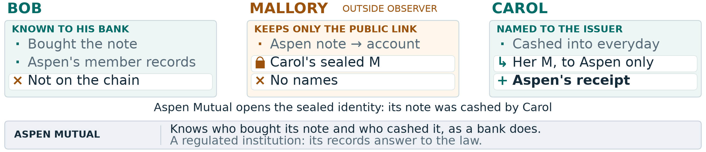

* A1: a draft payable to Carol

An A1 note is a bank draft made out to one person: still issued by a public institution, but
sealed to Carol's mailbox. A copied note is useless to anyone else. Carol can deposit it into
any of her accounts without telling anyone which in advance, and the cashing names no note.

** A1.1. Carol gives Bob her mailbox

Carol gives Bob her public receiving key and the registry's evidence that it belongs to her
certified identity. Bob, or his credit union, checks that evidence against the published identity
root. A public key is a lock Carol lends out; the key that opens it never leaves her wallet.

#+LATEX: {\scriptsize
#+BEGIN_SRC python
from alberta_buck.wallet.recvkey import verify_receiving_binding
mailbox = world.mailbox_binding()               # Carol's key, a salt, and a path to the root
print(f"this mailbox is certified as Carol's: "
      f"{verify_receiving_binding(point(CAROL), mailbox, world.identity_root)}")
#+END_SRC

#+RESULTS:
: this mailbox is certified as Carol's: True

#+LATEX: }

#+ATTR_LATEX: :width \linewidth :float nil
#+ATTR_HTML: :alt A1.1. Carol supplies an identity and certified public mailbox key; Bob verifies the association.
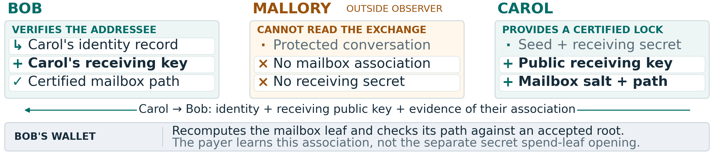

** A1.2. The credit union seals the draft

Aspen Mutual encrypts the value to Carol's mailbox and builds the note around it. Everything
Carol will need later, the note's secret and the randomness, travels in a /delivery package/,
each field masked so that only her receiving secret can unmask it. A courier, or Mallory, can
carry the package and learn nothing from it.

#+LATEX: {\scriptsize
#+BEGIN_SRC python
from alberta_buck.wallet.unilateral_a1 import mint_unilateral_a1
from alberta_buck.wallet.delivery import deliver_a1, open_a1
a1 = world.notes["a1"]
draft = mint_unilateral_a1(carol.M, carol.pk_recv, v=100 * U, rho=a1.opening.rho,
                           m_issuer=P["aspen"].m, rng=world.replay("a1", "mint"))
package = deliver_a1(draft, carol.pk_recv)
print(f"the draft the proofs were made over: {draft.cm == a1.cm}")
card(cards.delivery(package, "a1", "Carol", "Aspen Mutual"), "a1-delivery")
#+END_SRC

#+RESULTS:
: the draft the proofs were made over: True

#+LATEX: }

#+ATTR_LATEX: :width \linewidth :float nil
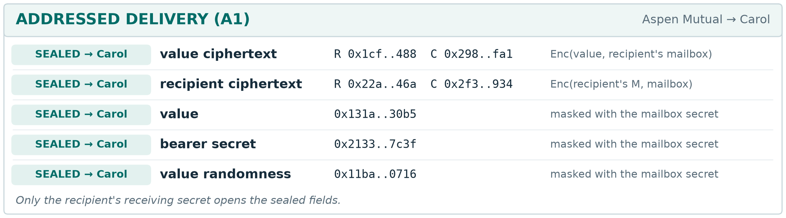

#+ATTR_LATEX: :width \linewidth :float nil
#+ATTR_HTML: :alt A1.2. The issuer adds mailbox encryption and wraps the secret fields of Carol's addressed note.
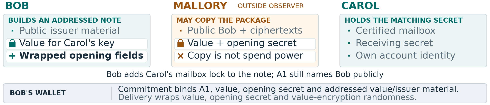

** A1.3. Bob pays; the credit union mints

Bob pays Aspen Mutual for the draft, and it mints a batch of four drafts for four payees. Mallory
sees 335 BUCK go into the pool from Aspen Mutual. The package goes to Carol; if Mallory
intercepts it, she holds sealed numbers.

#+LATEX: {\scriptsize
#+BEGIN_SRC python
chain.transfer(A["bob"], A["aspen"].address, 100 * U)
a1_mint = chain.mint_note(a1)
print(chain.observe(a1_mint).render())
#+END_SRC

#+RESULTS:
#+begin_example
Notes.mint  from 0x74c4..CBD7 Aspen Mutual Credit Union (public)
  tx 0x13bc..b516  block 60  gas 593,703
  proof              256 bytes (Groth16 proof)
  oldRoot            0x1c024f..66f7bb
  newRoot            0x38972d..6a0653
  nextLeafIndex_     4
  totalFace          335.000000 BUCK
  cms                [0x1390ff..71ab25, 0x291607..cd7717, 0x258535..cf2bc2, 0x1662cc..d128fe]
  issuerMode         [1, 1, 1, 1]
  issuerSig          issuer signature
  emits Transfer
    from             0x74c4..CBD7 Aspen Mutual Credit Union (public)
    to               0x9A9f..63AE Notes pool (public)
    value            335.000000 BUCK
  emits BuckTransferReceipt
    from             0x74c4..CBD7 Aspen Mutual Credit Union (public)
    to               0x9A9f..63AE Notes pool (public)
    amount           335.000000 BUCK
    fromCipherHash   0x9e6f..4aaf
    toCipherHash     0x9de4..f456
  emits Minted
    issuer           0x74c4..CBD7 Aspen Mutual Credit Union (public)
    newRoot          0x38972d..6a0653
    totalFace        335.000000 BUCK
    startIndex       4
    count            4
  emits IssuerBound
    issuer           0x74c4..CBD7 Aspen Mutual Credit Union (public)
    newRoot          0x38972d..6a0653
#+end_example

#+LATEX: }

#+ATTR_LATEX: :width \linewidth :float nil
#+ATTR_HTML: :alt A1.3. A funded mint anchors the addressed delivery; intercepted secret fields remain wrapped.
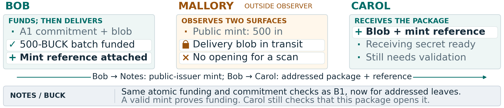

** A1.4. Carol unpacks it

Carol's receiving secret unmasks the fields. Her wallet checks the value really is 100, that the
unpacked note rebuilds a commitment in Aspen Mutual's batch, and that it is unspent. Any other
key opens nothing.

#+LATEX: {\scriptsize
#+BEGIN_SRC python
from alberta_buck.wallet.delivery import DeliveryRefused
got = open_a1(package, carol.k, P["aspen"].m)
print(f"value {got.opening.v / U:.2f} BUCK; commitment in Aspen Mutual's batch: {got.cm in a1.cms}")
try:
    open_a1(package, rand_scalar(rng), P["aspen"].m)
except DeliveryRefused as refused:
    print(f"with any other key: refused ({refused})")
#+END_SRC

#+RESULTS:
: value 100.00 BUCK; commitment in Aspen Mutual's batch: True
: with any other key: refused (the unwrapped r_note is not eNote's randomness)

#+LATEX: }

#+ATTR_LATEX: :width \linewidth :float nil
#+ATTR_HTML: :alt A1.4. Carol unwraps the delivery and checks the value, randomness, issuer and funded commitment.
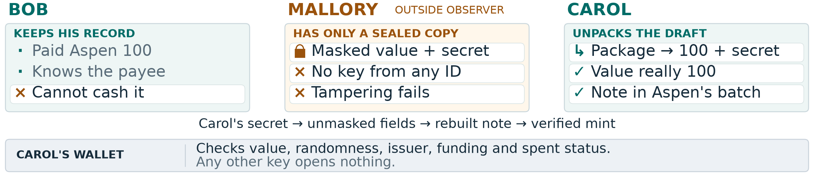

** A1.5. One proof that the pieces are all hers

Carol proves two things at once: she can read this note, and she is the certified person it is
addressed to. Proved separately, a thief could satisfy the first with a stolen package and the
second with his own identity. So they are /folded/ into one proof over one set of secrets: her
receiving secret opens the note, her account holds the certified identity, and the registry's
sealed entry ties that identity to that receiving secret.

The proof takes a laptop about 15 seconds. It shows the chain what the chain needs, and nothing
else.[fn:addressed]

#+LATEX: {\scriptsize
#+BEGIN_SRC python
fresh = cards.short_ct(a1.e_enc)                # her identity, re-sealed for this spend
card(cards.Card("A1 DEPOSIT: THE FOLDED PROOF", "proved by Carol's wallet",
                note=f"Proved in advance in {a1.timings['deposit_gate_prove_s']:.1f}s; "
                     "the chain verifies it in one step.").add(
    F("spent marker", cards.short_int(a1.nullifier), "public", "", "refuses a second cashing"),
    F("value, payout", f"100.00 BUCK -> {cards.short_addr(A['carol'].address)}", "public"),
    F("identity root", cards.short_int(world.identity_root), "public", "", "current certification"),
    F("fresh envelope", fresh, "sealed", "Carol", "her M, newly re-sealed"),
    F("which note", "not shown", "proven", "", "one of the pool's notes; no handle"),
    F("receiving secret", "used, not shown", "proven", "", "opens this note"),
    F("certified identity", "used, not shown", "proven", "", "her account's; tied to her key"),
    F("account key", "used, not shown", "secret", "Carol", "never leaves her wallet")), "a1-fold")
#+END_SRC

#+RESULTS:

#+LATEX: }

#+ATTR_LATEX: :width \linewidth :float nil
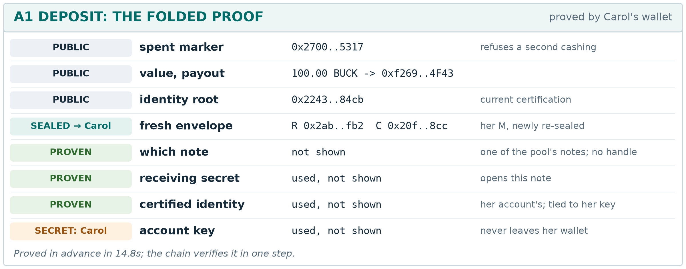

#+ATTR_LATEX: :width \linewidth :float nil
#+ATTR_HTML: :alt A1.5. One folded identity proof joins the note's receiving secret, certified identity and submitting account.
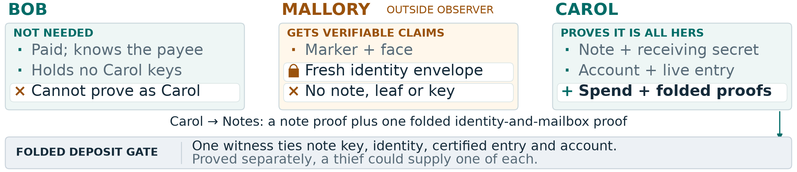

** A1.6. Cashed, with no handle on the note

The contract checks the proofs and pays Carol. Compare what Mallory sees with B1: no note, no
issuer, only that someone cashed 100 BUCK from the pool into this account. Aspen Mutual issued
four drafts, and the chain does not say which this was. Bob and Carol can still recognise their
own note; privacy from strangers is not amnesia for the parties.

#+LATEX: {\scriptsize
#+BEGIN_SRC python
a1_spend = chain.spend_note(a1)
print(chain.observe(a1_spend).render())
#+END_SRC

#+RESULTS:
#+begin_example
Notes.spendCoupledA1  from 0xf269..4F43   [reader: Carol's everyday account]
  tx 0x86d7..8321  block 61  gas 874,877
  proof              256 bytes (Groth16 proof)
  root               0x38972d..6a0653
  identityRoot       0x2243cb..b184cb
  nullifier          0xb96a4f..c9cd6c
  face               100.000000 BUCK
  recipient          0xf269..4F43   [reader: Carol's everyday account]
  eRec               ciphertext
  foldProof          256 bytes (Groth16 proof)
  emits Transfer
    from             0x9A9f..63AE Notes pool (public)
    to               0xf269..4F43   [reader: Carol's everyday account]
    value            100.000000 BUCK
  emits BuckTransferReceipt
    from             0x9A9f..63AE Notes pool (public)
    to               0xf269..4F43   [reader: Carol's everyday account]
    amount           100.000000 BUCK
    fromCipherHash   0xef94..ed27
    toCipherHash     0xc1ab..7dec
  emits SpentCoupledA1
    nullifier        0xb96a4f..c9cd6c
    recipient        0xf269..4F43   [reader: Carol's everyday account]
    face             100.000000 BUCK
#+end_example

#+LATEX: }

#+ATTR_LATEX: :width \linewidth :float nil
#+ATTR_HTML: :alt A1.6. A1 pays Carol without B1's public note handle; participants can still recognise their own note.
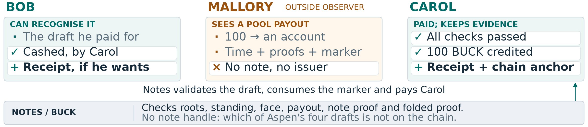

* A2: Bob's own private cheque

Now Bob writes the note himself, from his own account, with no institution in between. His
identity travels inside the note, sealed to Carol's mailbox. Only Carol will learn who wrote it.

** A2.1. Bob seals his identity inside the note

Bob encrypts the value and his own identity point to Carol's mailbox. He adds a proof that the
sealed identity is the one his account registered, and a /key tie/, marked *T*, that will force
Carol's later proof to use the mailbox Bob actually addressed. Without it, a dishonest issuer
could make a note that names someone other than himself.

#+LATEX: {\scriptsize
#+BEGIN_SRC python
from alberta_buck.wallet.unilateral_a2 import mint_unilateral_a2
from alberta_buck.wallet.delivery import deliver_a2, open_a2
a2 = world.notes["a2"]
cheque = mint_unilateral_a2(A["bob"].sk, A["bob"].E, carol.pk_recv, v=100 * U,
                            rho=a2.opening.rho, issuer=A["bob"].addr, chainid=1,
                            salt_iss=bob.salts["naming"], rng=world.replay("a2", "mint"))
print(f"the cheque the proofs were made over: {cheque.cm == a2.cm}")
print(f"Bob's identity, sealed for Carol:     {cards.short_ct(cheque.eIss)}")
print(f"key tie T:                            {cards.short_point(cheque.binding.T)}")
#+END_SRC

#+RESULTS:
: the cheque the proofs were made over: True
: Bob's identity, sealed for Carol:     R 0x661..bd2  C 0x137..ace
: key tie T:                            (0x289..871, 0xc69..3db)

#+LATEX: }

#+ATTR_LATEX: :width \linewidth :float nil
#+ATTR_HTML: :alt A2.1. Bob adds an encrypted issuer identity, its registered-account binding and the committed key tie T.
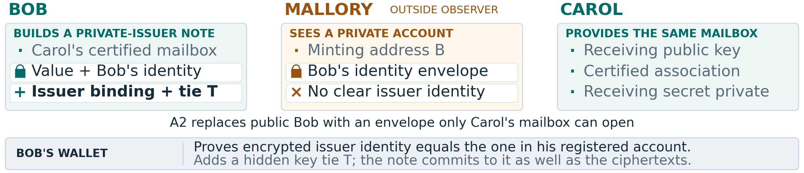

** A2.2. The package carries its own tools, sealed

Carol will need more than the ciphertexts: the note's secret, the randomness Bob used, the blind
that opens *T*, and the salt of Bob's registry entry that lets her prove he is certified. Each is
masked for her alone. Sending any of them in the clear would reveal Bob by another route.

#+LATEX: {\scriptsize
#+BEGIN_SRC python
package2 = deliver_a2(cheque, carol.pk_recv)
card(cards.delivery(package2, "a2", "Carol", "Bob"), "a2-delivery")
#+END_SRC

#+RESULTS:

#+LATEX: }

#+ATTR_LATEX: :width \linewidth :float nil
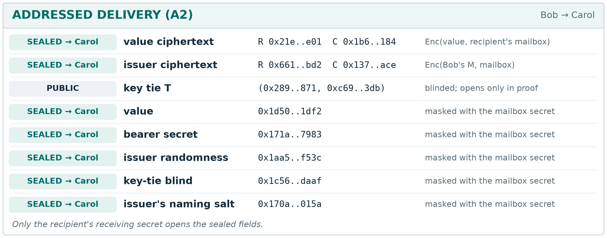

#+ATTR_LATEX: :width \linewidth :float nil
#+ATTR_HTML: :alt A2.2. The delivery wraps every disclosure-sensitive field, including the naming salt and T's blind.
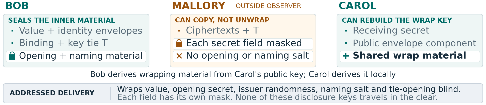

** A2.3. Bob mints

Bob's account introduces itself to the pool, allows it 100 BUCK, and mints. The contract checks
the note proof and Bob's binding and moves his money into the pool. Mallory sees an account mint
one 100 BUCK note with a sealed issuer. If she already knows the account is Bob's, she knows Bob
wrote a note; she does not learn to whom.

#+LATEX: {\scriptsize
#+BEGIN_SRC python
chain.approve(chain.envelope(A["bob"], chain.notes.address, chain.pool_pk, rng), 100 * U)
a2_mint = chain.mint_note(a2)
print(chain.observe(a2_mint).render())
#+END_SRC

#+RESULTS:
#+begin_example
Notes.mint  from 0x01f9..564d   [reader: Bob's everyday account]
  tx 0x8836..6955  block 63  gas 567,449
  proof              256 bytes (Groth16 proof)
  oldRoot            0x38972d..6a0653
  newRoot            0x26db54..8e68b0
  nextLeafIndex_     8
  totalFace          100.000000 BUCK
  cms                [0x1e9640..c0241c]
  issuerMode         [2]
  a2Bindings         1 x issuer binding
  emits Transfer
    from             0x01f9..564d   [reader: Bob's everyday account]
    to               0x9A9f..63AE Notes pool (public)
    value            100.000000 BUCK
  emits BuckTransferReceipt
    from             0x01f9..564d   [reader: Bob's everyday account]
    to               0x9A9f..63AE Notes pool (public)
    amount           100.000000 BUCK
    fromCipherHash   0xa3b8..7eef
    toCipherHash     0xf47c..115d
  emits Minted
    issuer           0x01f9..564d   [reader: Bob's everyday account]
    newRoot          0x26db54..8e68b0
    totalFace        100.000000 BUCK
    startIndex       8
    count            1
  emits IssuerReencBound
    issuer           0x01f9..564d   [reader: Bob's everyday account]
    newRoot          0x26db54..8e68b0
    count            1
#+end_example

#+LATEX: }

#+ATTR_LATEX: :width \linewidth :float nil
#+ATTR_HTML: :alt A2.3. The mint authenticates private issuer bindings and funds the note while the address and total remain visible.
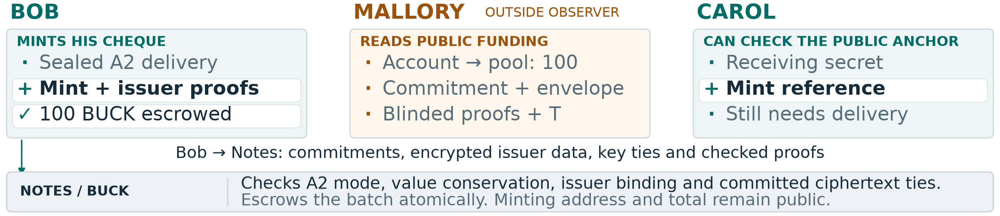

** A2.4. Carol opens it and learns who wrote it

Carol unmasks the package with her receiving secret, decrypts the issuer's identity, and checks it
against Bob's record. She checks the key tie against her own mailbox, and finds Bob's certified
registry entry using the salt he shipped. That salt lets her prove Bob is certified; it gives her
nothing that opens his mail.

#+LATEX: {\scriptsize
#+BEGIN_SRC python
from alberta_buck.wallet.nums import H_PEDERSEN
got2 = open_a2(package2, carol.k)
tie = add(add(got2.eIss.C, neg(got2.T)), mul(H_PEDERSEN, got2.gamma))
print(f"value {got2.opening.v / U:.2f} BUCK, written by Bob: {eq(got2.M_I, point(BOB))}")
print(f"the key tie opens to the same identity:   {eq(tie, got2.M_I)}")
print(f"Bob's naming entry is in the registry:    "
      f"{tree.contains(identity_leaf_salted(got2.M_I, got2.salt_iss))}")
#+END_SRC

#+RESULTS:
: value 100.00 BUCK, written by Bob: True
: the key tie opens to the same identity:   True
: Bob's naming entry is in the registry:    True

#+LATEX: }

#+ATTR_LATEX: :width \linewidth :float nil
#+ATTR_HTML: :alt A2.4. Carol opens the delivery and verifies the value, issuer record, key tie and certified naming association.
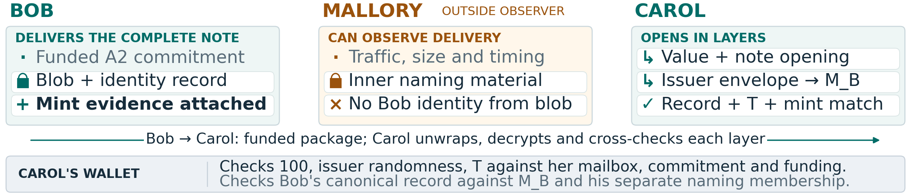

** A2.5. The folded proof grows two checks

Carol's proof is A1's, plus two things: the identity she decrypted belongs to a certified person,
and the key tie opens with her own mailbox. The first stops a cheque signed by an invented
person; the second, a cheque that names a real person who did not write it. "Someone certified"
and "the person who wrote this" are different claims, and the proof makes both.

#+LATEX: {\scriptsize
#+BEGIN_SRC python
card(cards.Card("A2 DEPOSIT: THE FOLDED PROOF", "proved by Carol's wallet",
                note=f"Proved in advance in {a2.timings['deposit_gate_prove_s']:.1f}s.").add(
    F("spent marker", cards.short_int(a2.nullifier), "public", "", "refuses a second cashing"),
    F("value, payout", f"100.00 BUCK -> {cards.short_addr(A['carolSavings'].address)}", "public",
      "", "into her savings account"),
    F("fresh issuer envelope", "re-sealed", "sealed", "Carol", "Bob's M, newly re-sealed"),
    F("which note", "not shown", "proven", "", "one of the pool's notes; no handle"),
    F("her identity and key", "used, not shown", "proven", "", "as in A1"),
    F("issuer certified", "used, not shown", "proven", "", "Bob's naming entry"),
    F("key tie T", "used, not shown", "proven", "", "opens with her mailbox")), "a2-fold")
#+END_SRC

#+RESULTS:

#+LATEX: }

#+ATTR_LATEX: :width \linewidth :float nil
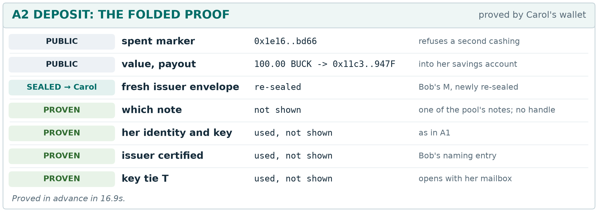

#+ATTR_LATEX: :width \linewidth :float nil
#+ATTR_HTML: :alt A2.5. The folded proof adds issuer membership and a key tie preventing a different certified identity from being named.
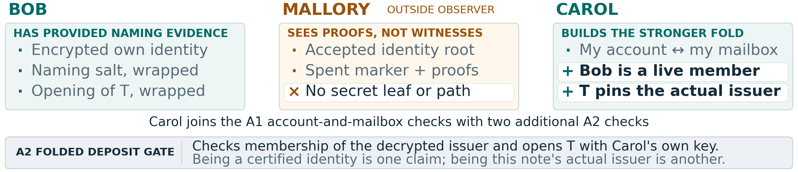

** A2.6. Cashed into her savings

Carol cashes the cheque into her savings account, a different account from the one Bob paid
before. The spend carries a fresh re-sealing of Bob's identity, never the one from the mint, so
nothing in it matches the mint. Mallory sees 100 BUCK leave the pool for an account she has never
seen pay or be paid by Bob.

#+LATEX: {\scriptsize
#+BEGIN_SRC python
a2_spend = chain.spend_note(a2)
print(chain.observe(a2_spend).render())
print(f"\nCarol's accounts: everyday {chain.balance(A['carol'].address) / U:,.2f} BUCK, "
      f"savings {chain.balance(A['carolSavings'].address) / U:,.2f} BUCK")
#+END_SRC

#+RESULTS:
#+begin_example
Notes.spendCoupledA2  from 0x11c3..947F   [reader: Carol's savings account]
  tx 0xba82..fda4  block 64  gas 886,060
  proof              256 bytes (Groth16 proof)
  root               0x26db54..8e68b0
  identityRoot       0x2243cb..b184cb
  nullifier          0x2debcd..9984b0
  face               100.000000 BUCK
  recipient          0x11c3..947F   [reader: Carol's savings account]
  eIss               ciphertext
  foldProof          256 bytes (Groth16 proof)
  emits Transfer
    from             0x9A9f..63AE Notes pool (public)
    to               0x11c3..947F   [reader: Carol's savings account]
    value            100.000000 BUCK
  emits BuckTransferReceipt
    from             0x9A9f..63AE Notes pool (public)
    to               0x11c3..947F   [reader: Carol's savings account]
    amount           100.000000 BUCK
    fromCipherHash   0xa914..a7af
    toCipherHash     0x9b1e..6a82
  emits SpentCoupledA2
    nullifier        0x2debcd..9984b0
    recipient        0x11c3..947F   [reader: Carol's savings account]
    face             100.000000 BUCK

Carol's accounts: everyday 300.00 BUCK, savings 100.00 BUCK
#+end_example

#+LATEX: }

#+ATTR_LATEX: :width \linewidth :float nil
#+ATTR_HTML: :alt A2.6. A fresh re-encryption avoids repeating mint ciphertext; proof validation consumes the marker and pays Carol.
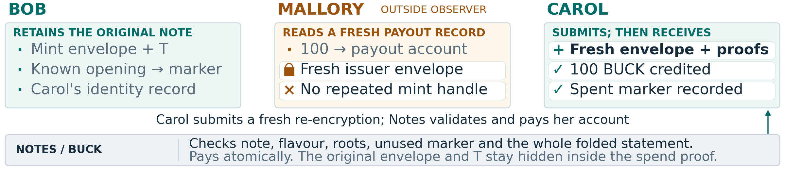

** A2.7. Two receipts, one payment

Each keeps a receipt naming both. Carol's rests on what only she can prove, that her receiving
secret opens the note; Bob's on what only he knows, the randomness he sealed it with. Neither
receipt contains a key that opens anything else.[fn:receipt]

#+LATEX: {\scriptsize
#+BEGIN_SRC python
def side_by_side(a, b, gap=4):
    la, lb = a.rstrip().split("\n"), b.rstrip().split("\n")
    w, n = max(map(len, la)), max(len(la), len(lb))
    la += [""] * (n - len(la)); lb += [""] * (n - len(lb))
    return "\n".join(f"{x:<{w}}{' ' * gap}{y}".rstrip() for x, y in zip(la, lb))

carol_copy = chain.note_receipt("a2", "recipient", a2_mint, a2_spend)
bob_copy = chain.note_receipt("a2", "issuer", a2_mint, a2_spend)
render = lambda core: TextDriver(48).render(render_receipt(core))
print(side_by_side(render(carol_copy), render(bob_copy)))
#+END_SRC

#+RESULTS:
#+begin_example
                 ALBERTA  BUCK                                         ALBERTA  BUCK
         P A Y M E N T   R E C E I P T                         P A Y M E N T   R E C E I P T
------------------------------------------------      ------------------------------------------------
  Receipt  okrxtssonrka                                 Receipt  i6nr27ezzu7v
------------------------------------------------      ------------------------------------------------
FROM (payer) (PRIVATE IDENTITY)                       FROM (payer - you) (PRIVATE IDENTITY)
 Bob Tremblay                                          Bob Tremblay
Alberta Identity - Alberta, Canada                    Alberta Identity - Alberta, Canada
 acct 0x01f9fec6bb2f227da0fe180651c1616e0f03564d       acct 0x01f9fec6bb2f227da0fe180651c1616e0f03564d
 idpt 0x110f449d8e6d..6a6925e3ced6                     idpt 0x110f449d8e6d..6a6925e3ced6
------------------------------------------------      ------------------------------------------------
TO (payee - you) (PRIVATE IDENTITY)                   TO (payee) (PRIVATE IDENTITY)
 Carol Nakamura                                        Carol Nakamura
Alberta Identity - Alberta, Canada                    Alberta Identity - Alberta, Canada
 acct 0x11c38344ef77494c5e5eaa11ec72fe9dd5e0947f       acct 0x11c38344ef77494c5e5eaa11ec72fe9dd5e0947f
 idpt 0x1eb063312673..8a97e1de516b                     idpt 0x1eb063312673..8a97e1de516b
------------------------------------------------      ------------------------------------------------
TRANSACTION                                           TRANSACTION
 Type    Note spend — A2 addressed, private issuer     Type    Note spend — A2 addressed, private issuer
 Amount            100.000000  BUCK                    Amount            100.000000  BUCK
 When        2026-09-21 14:20  UTC                     When        2026-09-21 14:20  UTC
 Chain                      1                          Chain                      1
 Block                     64                          Block                     64
 Log                        2                          Log                        2
 Tx      0xba82b328f4bc..40aba205fda4                  Tx      0xba82b328f4bc..40aba205fda4
 Mint    0x8836c2c14b87..a1e2ff976955                  Mint    0x8836c2c14b87..a1e2ff976955
------------------------------------------------      ------------------------------------------------
VERIFICATION                                          VERIFICATION
 status @ issue: VALID                                 status @ issue: VALID
 receipt  okrxtssonrka                                 receipt  i6nr27ezzu7v
------------------------------------------------      ------------------------------------------------
        a record, not a bearer instrument                     a record, not a bearer instrument
        github.com/pjkundert/alberta-buck                     github.com/pjkundert/alberta-buck
#+end_example

#+LATEX: }

#+ATTR_LATEX: :width \linewidth :float nil
#+ATTR_HTML: :alt A2.7. Payer and recipient retain complementary evidence for a named receipt without exporting private keys.
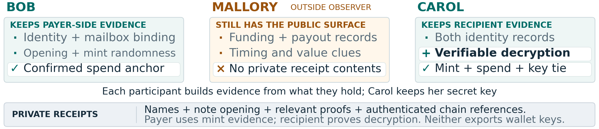

* Evidence for those entitled to it

** R1. Carol discloses one receipt

Suppose the payment is disputed. Carol hands a reviewer, a court or an auditor, the one receipt
that matters. She does not hand over her seed, her keys or her other accounts, and the receipt
contains none of them. The reviewer checks it offline first: the names match the identity points,
and every proof inside it holds.

#+LATEX: {\scriptsize
#+BEGIN_SRC python
from alberta_buck.wallet.envelope import deserialize_core, receipt_id, serialize_core
from alberta_buck.wallet.verify_receipt import verify_receipt
evidence = serialize_core(carol_copy)           # the bytes printed on the slip
checked = verify_receipt(deserialize_core(evidence))
print(f"receipt {receipt_id(evidence)}: {checked.reason}, "
      f"{checked.value / U:.2f} BUCK, {len(evidence):,} bytes")
#+END_SRC

#+RESULTS:
: receipt okrxtssonrka: VALID, 100.00 BUCK, 11,587 bytes

#+LATEX: }

#+ATTR_LATEX: :width \linewidth :float nil
#+ATTR_HTML: :alt R1. Carol discloses a selected receipt to an authorised reviewer while retaining her wallet secrets.
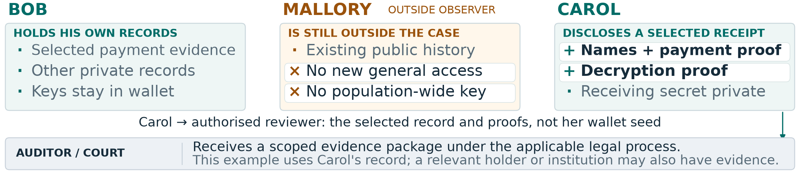

** R2. The chain confirms it happened

Then the reviewer asks the chain: did this transaction occur, at this block, with this event,
from these registered accounts? A convincing slip is not a payment; the chain's record is. What
the evidence cannot settle, intent, a stolen key, a false certification, is for people to judge.
Good cryptography gives them better facts, and leaves citizens room for ordinary private life.

#+LATEX: {\scriptsize
#+BEGIN_SRC python
tx = anvil.w3.eth.get_transaction_receipt(carol_copy.txn.txhash)
print(f"spend mined in block {tx['blockNumber']} (receipt says {carol_copy.txn.block}); "
      f"event #{carol_copy.txn.logindex} present: "
      f"{carol_copy.txn.logindex in [log['logIndex'] for log in tx['logs']]}")
registered = chain.reg.functions.pkOf(A["carolSavings"].address).call()
print(f"payee account registered with the receipt's key: "
      f"{registered[0] == int(carol_copy.payee.pk['x'], 16)}")
#+END_SRC

#+RESULTS:
: spend mined in block 64 (receipt says 64); event #2 present: True
: payee account registered with the receipt's key: True

#+LATEX: }

#+ATTR_LATEX: :width \linewidth :float nil
#+ATTR_HTML: :alt R2. A reviewer validates identities and proofs against actual chain events; legal conclusions require context.
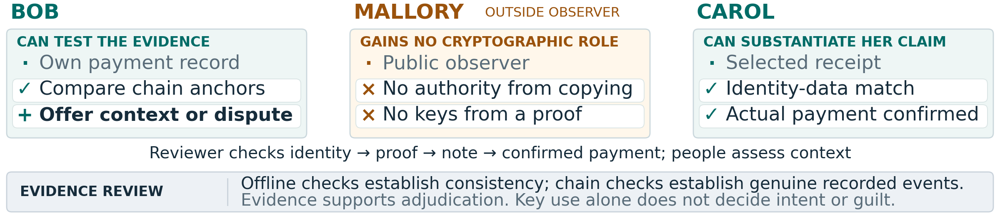

* What Mallory can join

The gain is choice over who learns what, not an invisible ledger. This table is Mallory's view
from the chain alone, as the transactions above printed it.

#+ATTR_LATEX: :font \small :align p{0.12\linewidth}p{0.27\linewidth}p{0.24\linewidth}p{0.25\linewidth}
| Payment | What the chain connects                                  | Names on the chain                  | Who can recognise the payment   |
|---------+----------------------------------------------------------+-------------------------------------+---------------------------------|
| Direct  | Bob's account to Carol's; amount; time                   | none (both envelopes sealed)        | Bob, Carol                      |
| B1      | an Aspen Mutual note to Carol's account                  | Aspen Mutual (public)               | Bob, Carol, Aspen Mutual        |
| A1      | Aspen Mutual into the pool; the pool to Carol's account  | Aspen Mutual (public)               | Bob, Carol, Aspen Mutual        |
| A2      | Bob's account into the pool; the pool to Carol's savings | none                                | Bob, Carol                      |

A few boundaries keep the claim honest:

- *Counterparties know their own dealings.* Bob can recognise his note when it is cashed; Carol
  knows who paid her. That is what makes receipts possible.
- *Institutions see their customers.* Aspen Mutual knows Bob bought a note and Carol cashed one;
  the pool's operator knows who uses the pool. They answer to regulators for that knowledge.
- *Standing is current.* Removing someone from the registry stops new proofs of their standing;
  Notes accept an identity root up to seven days old.
- *Behaviour leaks.* An unusual amount, a quiet pool, cashing the moment a note is minted, or
  paying gas from a linked account can suggest a connection the cryptography does not make.
- *Habits help.* Standard amounts, like banknote denominations, make one note look like many.
  An addressed note is safe to hold, so cashing it days later separates the cashing from the
  minting. A bearer note is safer cashed promptly, so its cover is a busy issuer and a common
  denomination. These are the habits of any privacy pool, mixers included. The difference is who
  can use this one: every depositor is a certified person, named to the counterparty and, for a
  bearer note, to its issuer.
- *Keys matter.* Lose the seed and you lose the receiving key; leak it and old deliveries sealed
  to it can be read. A weakness in the underlying cryptography, or a compromised wallet, is
  outside these promises.

Let strangers verify that the rules were followed, let citizens know and prove their own
dealings, and let public institutions examine evidence through accountable process. Buying a
bicycle should not require publishing the rest of your life.

#+LATEX: {\scriptsize
#+BEGIN_SRC python
anvil.stop()
print("chain stopped; every receipt above still verifies offline.")
#+END_SRC

#+RESULTS:
: chain stopped; every receipt above still verifies offline.

#+LATEX: }

* Sources and reading notes

This account follows the current v2 design and its prototype, checked against the code it runs.
It is not a description of an operating Alberta government service.

[fn:idscan] B. Krebs, "FBI Probes Service Selling 153M+ Drivers Licenses," Krebs on Security,
September 2026 ([[https://krebsonsecurity.com/2026/09/fbi-probes-service-selling-153m-drivers-licenses/][link]]);
"ID verification giant IDScan confirms data breach," TechCrunch, 10 September 2026
([[https://techcrunch.com/2026/09/10/id-verification-giant-idscan-confirms-data-breach-with-more-than-150-million-drivers-licenses-stolen/][link]]).

[fn:status] The credential construction awaits independent review, and the zero-knowledge proof
setups used here are development setups that a deployment replaces with public ceremonies. The
demonstration's world is built by =make nix-snark-privacy-fixtures=
([[file:scripts/snark/gen_privacy_world.py][gen_privacy_world.py]]); this paper renders with
=make nix-venv-doc-privacy=. See [[file:alberta-buck-proofs.org][Proofs]] and
[[file:doc/review/notes-receiving-key.org][the receiving-key architecture]].

[fn:particulars] [[file:alberta_buck/registry/particulars.py][particulars.py]];
[[file:doc/review/accumulator-spec.org][accumulator specification]], section 8.4. Categorical
facts such as an age band can also be proven as registry memberships, which reveal the category
without any certificate.

[fn:pool] [[file:alberta-buck-notes.org::*The Pool is a Regular Account][Notes: the pool account]].
The operator's ability to open pool approvals is separate from Carol's receiving secret.

[fn:b1-link] [[file:src/Notes.sol][Notes.sol]], =spendCoupledB1=, checks
=publicIssuerOfCommitment[issuanceCommitment]=: B1 redemption deliberately names its note, and
only B1 does. A1 and A2 spends carry no note handle.

[fn:addressed] [[file:alberta-buck-notes-flow.org::*The Identity-M Spend Path (A1, A2, B1)][Notes Flow: current spend paths]],
[[file:alberta_buck/wallet/delivery.py][delivery.py]],
[[file:circuits/deposit_fold_a1.circom][A1 folded gate]] and
[[file:circuits/deposit_fold_a2.circom][A2 folded gate]].

[fn:receipt] [[file:alberta-buck-receipt.org][Receipts]] specifies the receipt format and its two
verification tiers. A receipt names both parties and should be kept as deliberately as any other
private financial record.

** Illustration sources

The step diagrams are generated from [[file:doc/privacy/figures.json][the figure descriptions]] by
[[file:scripts/render_privacy_figures.py][render_privacy_figures.py]]; the payload cards by
[[file:alberta_buck/wallet/cards.py][cards.py]] as the paper runs. Each picture has an alternative
description, and the surrounding step explains its contents.
