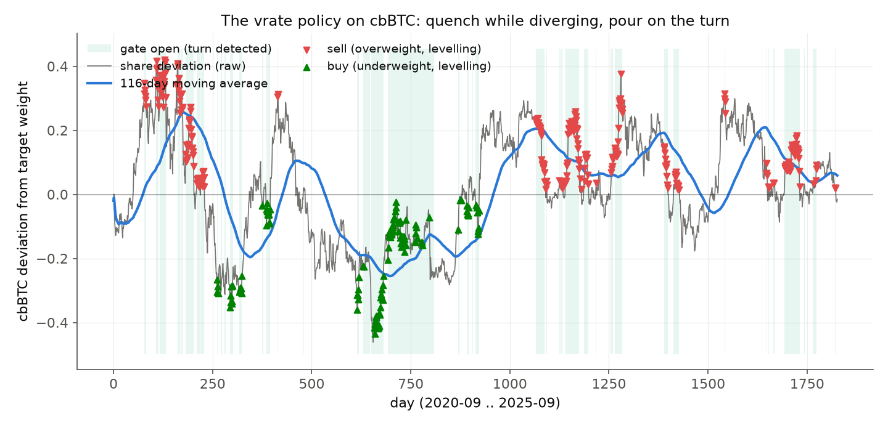
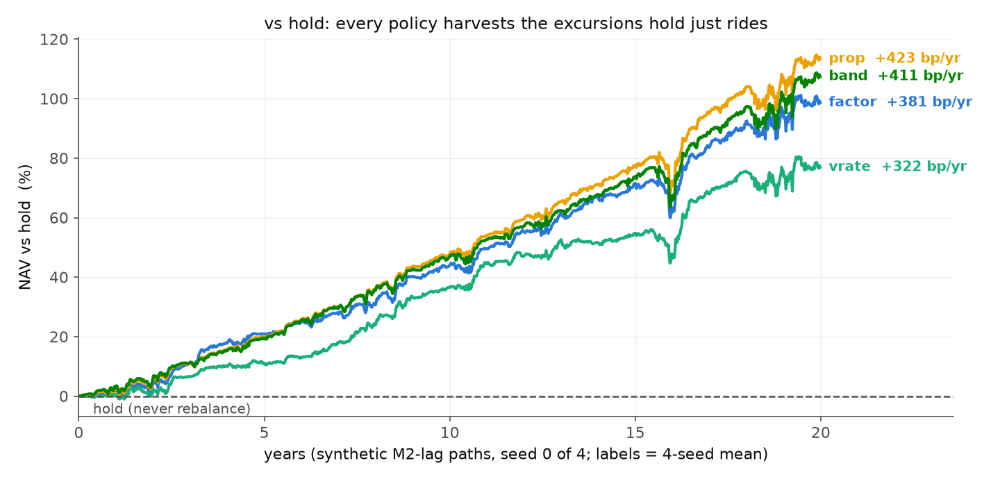
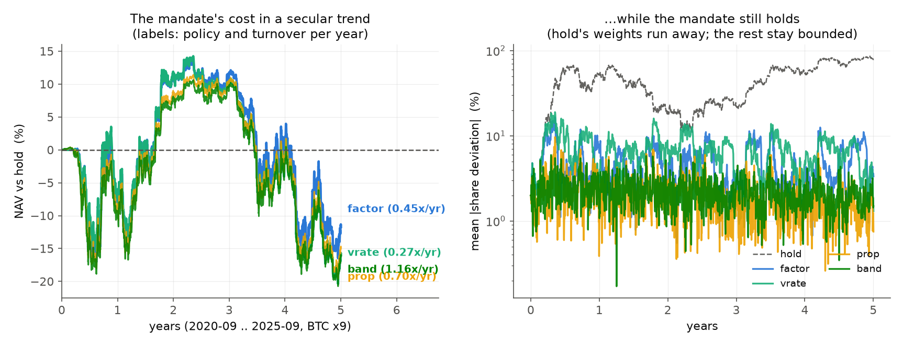
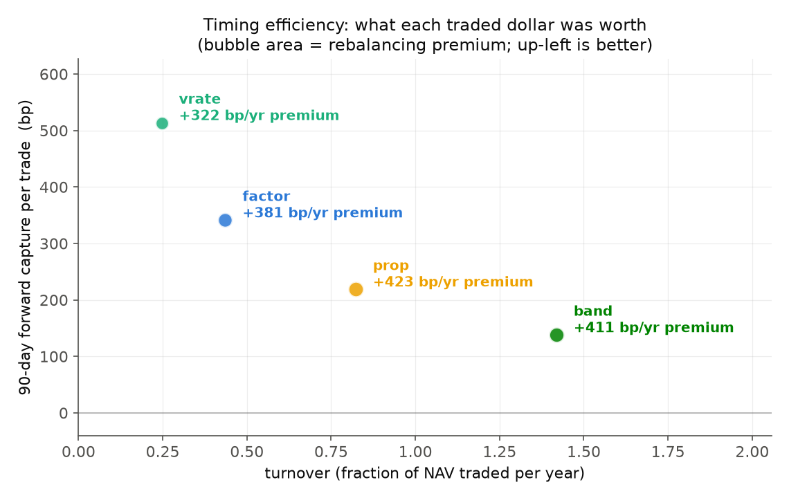

#+title: The Alberta Buck - Rebalancing the BuckBasket (v1.0)
#+SUBTITLE: Waiting for the Turn: an Amortized On-Chain Rebalance Director
#+author: Perry Kundert
#+date: 2026-07-08
#+category: Alberta Buck
#+series[]: Alberta-Buck
#+series_order: 24
#+weight: 25
#+draft: false
#+bucky: true
#+description: Commodities trail the money supply with measurable lags, so a basket's weights take long, slow excursions and return.  A rebalancer that reacts to instantaneous deviation fights every excursion and bleeds; one that waits for the excursion to level off commits its flow at maximum mispricing.  This article derives that policy from measured M2 lags, proves it in simulation, and encodes it as a Solidity state machine whose work is amortized across whoever shows up -- deposits, redemptions, or bare keeper pokes -- so more granular triggering means less gas per agent.

#+EXPORT_FILE_NAME: ./images/alberta-buck-rebalance
#+STARTUP: org-startup-with-inline-images inlineimages
#+STARTUP: org-latex-tables-centered nil
#+OPTIONS: ^:nil toc:nil

#+LATEX_HEADER: \usepackage[margin=1.0in]{geometry}

#+ATTR_LATEX: :width 10cm
[[https://perry.kundert.ca/images/dominion-logo.png]]

#+BEGIN_ABSTRACT
The BuckBasket (see /The BuckBasket/) keeps itself roughly balanced for free:
redemptions draw from overweight pools, deposits and treasury sweeps fill
underweight ones, and the world's arbitrageurs do the rest.  What that leaves
on the table is /timing/.  Basket constituents do not wander at random -- they
trail the M2 money supply with measurable, commodity-specific lags, so a
constituent's share of basket value takes long, slow excursions away from its
target weight and then comes home as the laggards catch up.

This article does three things.  First, it measures those lags and turns them
into a rebalancing policy: scale each constituent's rebalancing effort by how
far it is from proportion, /times/ how hard its delayed moving average is
turning back toward proportion -- quench while the excursion is still running,
pour when it levels off.  Second, it verifies the policy in simulation: the
gated policies capture 75-90% of the continuous-rebalancing premium at a
quarter to a half of the turnover, with by far the best per-trade timing.
Third -- the heart of the matter -- it encodes the policy as an EVM state
machine, =BasketRebalanceDirector=, whose signal maintenance is /amortized
across activations/: every deposit, redemption, or bare keeper trigger carries
a small, bounded slice of the work, closed-form catch-up makes a poke after a
quiet week cost the same as a poke after a busy hour, and the whole machine
advises the basket through two O(1) reads: where deposits should go, and which
pool best satisfies a redemption.
#+END_ABSTRACT

* The premise: money moves first, commodities follow

When the money supply expands, the new purchasing power does not reach all
prices at once -- the Cantillon insight.  Monetary assets reprice in weeks;
industrial commodities in months; wages and food over a year or more.  For the
BUCK basket this is measurable.  Correlating each constituent's year-over-year
growth against M2SL (post-1995 window, lags swept 0..36 months; see
=alberta_buck/sim/quotes/fetch_feedstock.py= and
=rebalance_policy.py --fit-lags=):

| constituent | peak lag (months) | peak correlation | tier             |
|-------------+-------------------+------------------+------------------|
| cbBTC       | 0                 | 0.08 (weak)      | monetary (fast)  |
| PAXG        | censored @36      | 0.10 (weak)      | monetary (prior) |
| CNST        | 9-10              | 0.48-0.52        | industrial (mid) |
| NRGC        | 13                | 0.33-0.39        | industrial (mid) |
| LABR        | 15-16             | 0.32-0.38        | sticky (slow)    |
| FOOD        | 23                | 0.21-0.26        | sticky (slow)    |

The ordering is exactly the intuition: monetary, then energy and construction,
then labour and food.  (Gold's fit is weak -- it trades on real rates and
crisis as much as on M2 -- so it takes a fast "monetary asset" prior rather
than a fitted lag.)

The consequence for the basket: when M2 surges, the fast constituents
overshoot their target share of basket value and stay overweight /until the
laggards catch up/ -- an excursion with a timescale set by the lag spread,
roughly a year.  These excursions are the basket's harvest.  A rebalancer that
reacts to instantaneous deviation starts selling the riser immediately and
keeps selling all the way up -- paying fees and bleeding against the trend.
One that waits for the excursion to /level off/ makes fewer, larger trades at
maximum mispricing.

* The policy: quench while diverging, pour on the turn

Per constituent \(i\), at a fixed sampling cadence (one epoch ~ one day):

\begin{align*}
  \delta_i &= w_i / w^*_i - 1
    && \text{-- raw share deviation, right now};\\
  m_i &= \mathrm{EMA}_{X_i}(\delta_i)
    && \text{-- the delayed view (\(X_i\)-day window)};\\
  v_i &= \Delta m_i
    && \text{-- its velocity: receding / level / gaining};\\
  \dot{d}_i &= \mathrm{EMA}_{7\mathrm{d}}(\Delta\delta_i)
    && \text{-- the observed closure rate}.
\end{align*}

The rules, each of which was a /measured failure/ in the Python model before
it was a rule (=alberta_buck/sim/rebalance_policy.py=, =make nix-sim-policy=):

1. *Direction and magnitude come from the raw deviation; the MA contributes
   only timing.*  A lagging average that still reads "overweight" after the
   raw share has reverted through target must not trade.  Require
   ~sign(m) == sign(delta)~.
2. *The velocity of the MA classifies the regime.*  Still receding (deviation
   growing): do nothing -- don't fight a move that is still developing.
   Level (turning): start, but not too fast.  Gaining (closing): complete the
   remaining rebalancing.
3. *Size by rate-matching.*  Trade at \(\rho\) times the closure rate the
   1-week EMA actually observes -- "the rate at which we'd lose half the
   distance to balance" -- floored by a "half the gap in one window" prior
   (which alone applies while level):
   \[ \mathrm{effort}_i \;=\; \min\bigl(\rho\,\hat{c}_i\,w^*_i,\ \mathrm{cap}\bigr),
      \qquad
      \hat{c}_i \;=\; \max\Bigl(-\mathrm{sign}(\delta_i)\,\dot{d}_i,\
                                \tfrac{\ln 2}{2X_i}\,\lvert\delta_i\rvert\Bigr). \]
   This is self-calibrating (no hand gain) and self-limiting: our own flow
   feeds the observed rate, so raising \(\rho\) saturates instead of
   overshooting.  Effort peaks just after the turn -- closure accelerating
   while deviation is still near maximum -- and tapers as the gap closes.
4. *A leash bounds the quench.*  A secular trend that never levels off (BTC,
   2020-25) would otherwise run the deviation away unboundedly.  Past
   |delta| > 30% the policy trades at cap regardless of the gate, with
   hysteresis release at 25%.  The factor times trades /within/ the leash;
   the leash enforces the mandate.
5. *Proceeds recycle, but never wash.*  Sell-side flow re-enters the
   underweight pools (this is =sweepTreasury= / =investFromBucks=), but never
   a constituent the policy itself sold in the same round -- a stale-signal
   sell paired with a raw-underweight rebuy just donates the AMM fee.

The mechanism, live on the 2020-25 history:

#+CAPTION: The gated policy on cbBTC's share of the basket, 2020-25.  While the excursion is still building (the raw deviation pulling away from its moving average) nothing trades; sells (red) cluster where overweight excursions level off and turn, buys (green) where underweight ones do.  Shaded bands mark the gate open.
#+ATTR_LATEX: :width \textwidth
#+ATTR_HTML: :width 100%

Measured over 20-year synthetic paths with the fitted lags (cost 30bp/leg,
cap 50bp NAV/day), against never rebalancing ("hold") and continuous
proportional rebalancing ("prop", what spot-based routing approximates):

| policy         | premium vs hold | turnover   | mean dev at trade | capture90 |
|----------------+-----------------+------------+-------------------+-----------|
| prop           | +423 bp/yr      | 0.82 NAV/yr | 5.3%              | +219 bp   |
| band (5%)      | +411 bp/yr      | 1.42 NAV/yr | 4.4%              | +138 bp   |
| factor (accel) | +381 bp/yr      | 0.44 NAV/yr | 8.8%              | +341 bp   |
| vrate (rho=3)  | +322 bp/yr      | 0.25 NAV/yr | 12.6%             | +514 bp   |

Each alternative loses to the gated policies on its own terms:

*vs hold* -- doing nothing forfeits the entire rebalancing premium /and/
abandons the mandate (weights drift wherever prices take them).  Every active
policy compounds steadily ahead of hold in the reverting regime:

#+CAPTION: Twenty synthetic years, NAV relative to buy-and-hold (hold = the dashed zero line; line labels give the multi-seed mean premium).  The premium is real and persistent -- the only question is what it costs to collect.
#+ATTR_LATEX: :width \textwidth
#+ATTR_HTML: :width 100%

*vs prop (continuous proportional -- what spot-based routing approximates)* --
prop collects the largest gross premium but pays for it everywhere: the most
turnover (0.82x NAV/yr), the shallowest trades (5.3% mean deviation), and the
worst behaviour in a secular trend, where it sells a riser continuously all
the way up.  The 2020-25 replay (BTC x9, reversion never arrives) is the
stress case -- the gated policies lose 90-130bp/yr /less/ against the trend
on a half to a third of prop's turnover, while still holding the basket's
weights bounded:

#+CAPTION: The mandate's cost under a secular trend (2020-25, BTC x9).  Left: NAV against buy-and-hold -- every constant-mix policy must sell the riser, but the gated policies (factor, vrate) bleed the least, on the least turnover.  Right: buy-and-hold's mean absolute deviation runs off toward 80% -- it has stopped being the declared basket -- while every active policy keeps weights bounded.
#+ATTR_LATEX: :width \textwidth
#+ATTR_HTML: :width 100%

*vs band (the 5% threshold rebalancer)* -- band waits, but for the /wrong
signal/: a fixed deviation level rather than the excursion's turn.  It
re-engages the moment the band is crossed -- early in a developing excursion
-- so it trades shallow (4.4% mean deviation), churns the most of any policy
(1.42x NAV/yr, band-edge oscillation), and shows the worst per-trade timing.
The gated policies wait for the turn itself and are strictly better on every
per-trade measure:

#+CAPTION: Timing efficiency on the synthetic paths: 90-day forward capture per traded dollar vs turnover (bubble area = premium vs hold).  Band is dominated -- more churn and worse timing than either gated policy; vrate captures +514bp per traded dollar at 0.25x NAV/yr of turnover.
#+ATTR_LATEX: :width 0.8\textwidth
#+ATTR_HTML: :width 85%

In sum: the gated policies collect ~75-90% of prop's premium at 30-55% of its
turnover, trading at roughly twice the mispricing depth, with the least
trend-bleed; full tables in =BASKET-REBALANCE.md=.

* Encoding it on-chain: work that amortizes across whoever shows up

The policy needs a clock -- moving averages advance with time -- but the EVM
has no scheduler and nobody pays to run one.  The established answer is the
pattern behind Compound's =accrueInterest=, MakerDAO's per-collateral =drip=,
and Uniswap's oracle observations:

#+begin_quote
*Lazy time-indexed accrual.*  State is advanced on first touch, as a
closed-form function of elapsed time -- never per block.
#+end_quote

Three refinements make it fit a /multi-pool signal aggregator/:

** Closed-form EMA catch-up

Under sample-and-hold (the deviation observed now stands in for the quiet
gap), \(n\) missed epochs of EMA recursion collapse exactly, with
\(q = 1-\beta\) (and \(q_7\) the one-week EMA's decay):

\begin{align*}
  m' &= \delta + (m - \delta)\,q^n
    && \text{-- the average};\\
  v' &= q^n\,v \;-\; (1-q)^2\,n\,q^{\,n-1}\,(m - \delta)
    && \text{-- its velocity};\\
  \dot{d}' &= q_7^{\,n-1}\bigl((\delta - \delta_{\mathrm{prev}})(1-q_7)
              + q_7\,\dot{d}\bigr)
    && \text{-- the closure rate};
\end{align*}

each computable in \(O(\log n)\) by binary exponentiation.  One poke after a quiet
month costs the same as one poke after a busy hour, /and lands the signals in
the same place/ n diligent pokes would.  This is not approximately true; it
is an invariant the test suite fuzzes (256 random gap/imbalance combinations)
and enforces to fixed-point rounding.  (The velocity closed form matters: a
naive "average dm over the gap" EMA update classifies the regime differently
than the diligent recursion -- a real bug the regime test matrix caught.)

** The round-robin work wheel

N constituents, a persistent cursor, and =poke(maxWork)=: each call advances
at most =maxWork= stale constituents from the cursor on.  Every basket
activation -- deposit, redeem, treasury sweep, or a bare keeper trigger --
carries a small budget (1-2).  The gas story, measured (6-token mocks,
via-IR, solc 0.8.28):

| operation                            | gas     |
|--------------------------------------+---------|
| poke one constituent, 1-epoch gap    | ~36,500 |
| poke one constituent, 50-epoch gap   | ~19,900 |
| poke when everything is fresh        | ~3,100  |

Catch-up is /flat in gap size/ (the 50-epoch poke is cheaper than the 1-epoch
one purely from storage warmth), and the fresh-epoch guard is near-free.  So:
*the more granular the triggering, the less work each agent performs* -- and
if nobody shows up for a week, whoever arrives next pays one closed-form
update, not a week of them.  Work is conserved; granularity trades per-call
gas against signal staleness, never total cost.

** Cached observations with running sums

A constituent's deviation needs /everyone's/ pool values (its share of the
total).  Reading \(N\) pools per poke would defeat the sharding, so each poke
reads only /its own/ pool -- one =balanceOf= (the BUCK reserve \(bv_i\); for
full-range positions pool value \(= 2\,bv_i\)) and one =slot0= (spot, for the
price-scaled target share \(s_i = a_i\,P_{0,i}^2/\mathrm{spot}_i\), the same
fixed-quantity-index target the pro-rata redemption uses) -- and folds the
result into cached running sums by difference:

\[ B \mathrel{{+}{=}} bv_i^{\mathrm{new}} - bv_i^{\mathrm{cached}}, \qquad
   S \mathrel{{+}{=}} s_i^{\mathrm{new}} - s_i^{\mathrm{cached}}, \qquad
   \delta_i = \frac{bv_i / B}{\,s_i / S\,} - 1 . \]

Deviations are computed against slightly-stale sums -- which a moving-average
policy is insensitive to by construction.  Decision data aggregates the same
way: each poke stores its constituent's signed advisory effort, and the two
decision reads -- =depositHint()= (strongest buy-side effort) and
=redeemHint()= (strongest sell-side) -- are trivial scans over N cached
int32s.

** The trust model: hints, not authority

The director holds no funds and executes nothing.  Its outputs are
/advisory/: the basket's venue re-verifies everything material (the
spot-vs-TWAP manipulation guard, liquidity bounds, the conversion-loss
budget) on every trade it actually performs.  A stale, wrong, or even
adversarial hint can re-order flows -- route a deposit to the second-best
pool -- but cannot break solvency or extract value beyond what the venue's
own guards already bound.  That is what makes it safe for the signal state
to be lazily maintained by unauthenticated public pokes.

* The contract: BasketRebalanceDirector

=src/basket/BasketRebalanceDirector.sol= (~2.5 slots of hot state per
constituent, packed):

#+begin_src solidity
struct Signal {
    int128  m;         // EMA_X of deviation (1e18)
    int128  vEma;      // EMA_X of per-epoch d(m)
    int128  ddotEma;   // 1-week EMA of per-epoch d(delta)
    int128  prevDelta;
    uint128 bv;        // cached pool BUCK reserve
    uint128 s;         // cached price-scaled target share
    int32   effortBp;  // signed advisory effort (bp of NAV per epoch)
    uint32  lastEpoch;
    uint32  firstEpoch;
    bool    leashed;
}
#+end_src

The API surface:

- =syncConstituents()= -- permissionless; pulls constituent metadata from the
  basket's public getters (re-callable: =addBasketToken= renormalizes).
- =poke(maxWork)= / =pokeAll()= -- the work wheel.  Skips fresh constituents
  for ~2 warm SLOADs; advances stale ones with the closed forms above and the
  vrate effort rule (regime gate, rate-matched size, leash, warmup).
- =depositHint()= / =redeemHint()= / =effortOf(i)= / =effortsAll()= -- the
  O(1)/O(N)-cached advisory reads.  A =type(uint256).max= hint means "no
  signal; use the default most-underweight routing".
- =setParams(...)= -- governance: epoch length, window, \rho, deadband,
  regime band, leash bounds, per-epoch cap.

How =BuckBasketProRata= consumes it (the integration increments, in order of
invasiveness):

1. *Increment 0 -- flow routing, zero new trades.*  =_depositBuck= and
   =sweepTreasury= pass =director.depositHint()= as the =poolHint= to
   =investFromBucks= (falling back to most-underweight on the sentinel), and
   the single-token redeem path consults =redeemHint()=.  Every such
   activation also calls =director.poke(1)= -- the bounded slice that keeps
   the signals alive.  The basket's ordinary deposit/redeem/sweep traffic
   then performs well-timed rebalancing /for free/.
2. *Increment 1 -- keeper rebalance steps.*  A permissionless pair,
   =rebalanceSource(i)= (withdraw + convert from the strongest sell-side
   pool, bounded by =effortBp=) and =rebalanceSink()= (invest the pending
   BUCK into the deposit hint), each one small transaction -- the
   =sweepTreasury= pattern, directed by the signals.
3. *Weighted draws.*  =_allocateSellHigh= can tilt its per-pool draw weights
   by =effortsAll()= rather than spot overweight alone.

* Verification

Three layers, all runnable from the Makefile:

(The model figures above regenerate via =make nix-sim-policy= then
=make nix-sim-plot-article=.)

- *Unit + fuzz (Forge)* -- =make nix-test-director=.  Ten tests: the
  amortization invariant (diligent-vs-lazy twins, plus the 256-run fuzz over
  random gaps and imbalances), regime transitions on a scripted excursion
  (receding quenched, level starts, gaining saturates, sign-agreement blocks
  the stale-MA wrong-way trade), leash engagement and hysteresis, both hints,
  wheel budgets and cursor rotation, and the gas measurements quoted above.
- *Parallel regime matrix* -- =make nix-test-director-regimes=.  The same
  suite re-run across a window x rho grid (defaults: {6, 8, 16} epochs x
  {1.5, 3, 6}), one forge process per regime, in parallel.  This matrix is
  what exposed the velocity catch-up approximation: windows of 6 classified
  a post-gap regime differently between the lazy and diligent paths until
  the closed form replaced the average-velocity shortcut.
- *Anvil end-to-end* -- =make nix-sim-director=.  The rebalancing scenario
  (~400 agents: arbs, LPs, direct-mint depositors, a whale) plus a
  =DirectorKeeperAgent= that pokes the deployed director with a 2-constituent
  budget each tick and executes its advice as 2-hop Universal Router swaps
  (sell-hint -> BUCK -> buy-hint), sized by the advised bp of basket NAV.
  The output vector records =directorPokes= / =directorTrades= per day
  alongside the existing basket telemetry.

* Limitations and next increments

- The lazy catch-up is exact under sample-and-hold; a real gap has a price
  path.  More pokes give higher fidelity at the same amortized price -- and
  the basket's own activity supplies them precisely when flows (and thus
  fidelity needs) are high.
- The director reads whole-pool BUCK reserves; the venue nets out treasury
  liquidity.  The small bias is irrelevant to hint /ordering/.
- Windows are governance parameters, seeded from the M2-lag analysis; the
  model says the premium is flat across 30-180d, so mis-tuning is forgiving.
- The basket-side consumption (increment 0 wiring in =BuckBasketProRata=,
  the =rebalanceSource/Sink= pair) is the next contract pass; the director
  itself, its tests, and the sim keeper are complete.
- Keeper bounty economics (a few bp of each productive step, paid from
  treasury) are needed on a public network and are not yet modeled.
